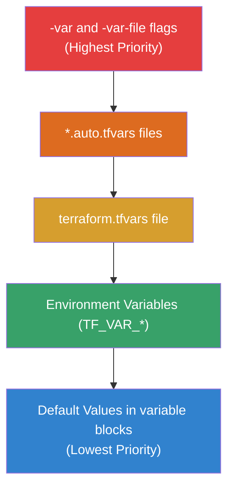

Variables allow you to parameterize your configurations, while Outputs let you extract information about your infrastructure.

## Input Variables
```hcl
variable "instance_type" {
  description = "Size of EC2"
  type        = string
  default     = "t3.micro"
}
```
## Output Values
```hcl
output "public_ip" {
  value = aws_instance.web.public_ip
}
```
## Variable Validation
You can enforce rules on your variables to prevent invalid configurations.
```hcl
variable "env" {
  validation {
    condition     = contains(["dev", "prod"], var.env)
    error_message = "Environment must be dev or prod."
  }
}
```

## Variable Precedence Order

When the same variable is defined in multiple places, Terraform uses this precedence (highest to lowest):



---
## 🏗️ Real-Life Scenario: The Secret Leak
**Problem**: A developer outputs a database password in the CLI, and it's visible in the logs.
**Solution**: Use the `sensitive = true` flag in your variables and outputs.
```hcl
variable "db_pass" {
  sensitive = true
}
output "db_pass" {
  value     = var.db_pass
  sensitive = true
}
```
Terraform will mask the value with `<sensitive>` in the console output.

---

## ❓ Interview Questions

1. **List three ways to pass variables to Terraform.**
   - *Answer*: 1. `-var` CLI flag. 2. `terraform.tfvars` file. 3. Environment variables (prefixed with `TF_VAR_`).

2. **What is the priority of variable sources?**
   - *Answer*: CLI flags (highest) > `*.auto.tfvars` > `terraform.tfvars` > Environment variables > Default values (lowest).

3. **What variable types does Terraform support?**
   - *Answer*: Primitive types (`string`, `number`, `bool`) and complex types (`list`, `map`, `set`, `object`, `tuple`).

4. **How does the `sensitive` flag affect variables and outputs?**
   - *Answer*: It masks the value in CLI output and logs, replacing it with `<sensitive>`. However, the value is still stored in plain text in the state file.

5. **Can you reference an output from a module?**
   - *Answer*: Yes, using the syntax `module.module_name.output_name`.

6. **What is the purpose of variable validation?**
   - *Answer*: To enforce business rules and constraints on input values before Terraform executes, preventing invalid configurations and providing clear error messages.

7. **Can outputs be used as inputs to other modules?**
   - *Answer*: Yes, this is a common pattern for module composition where one module's output becomes another module's input.

8. **What happens if you don't provide a value for a variable with no default?**
   - *Answer*: Terraform will prompt you interactively for the value, or error in non-interactive mode (like CI/CD pipelines).

---

## 🧠 Comprehensive Quiz (27 Questions)

**1. Which flag masks output values in console?**
- A) `hidden = true`
- B) `sensitive = true`
- C) `secret = true`
- D) `masked = true`


<details>
<summary>Show Answer</summary>

**Answer: B**

</details>

**2. How do you define a default value for a variable?**
- A) `value = "default"`
- B) `default = "value"`
- C) `initial = "value"`
- D) `fallback = "value"`


<details>
<summary>Show Answer</summary>

**Answer: B**

</details>

**3. Can an output value be used by other resources in the same configuration?**
- A) No, outputs are only for external use
- B) Yes, you can reference them
- C) Only in modules
- D) Only with data sources


<details>
<summary>Show Answer</summary>

**Answer: B**

</details>

**4. What is the file extension for variable value files?**
- A) `.tf`
- B) `.tfvars`
- C) `.var`
- D) `.env`


<details>
<summary>Show Answer</summary>

**Answer: B**

</details>

**5. Which environment variable prefix does Terraform use for variables?**
- A) `TERRAFORM_`
- B) `VAR_`
- C) `TF_VAR_`
- D) `T_VAR_`


<details>
<summary>Show Answer</summary>

**Answer: C**

</details>

**6. Which variable type would you use for a list of strings?**
- A) `type = string[]`
- B) `type = list(string)`
- C) `type = array(string)`
- D) `type = strings`


<details>
<summary>Show Answer</summary>

**Answer: B**

</details>

**7. How do you mark a variable as required (no default)?**
- A) `required = true`
- B) Omit the `default` attribute
- C) `mandatory = true`
- D) `optional = false`


<details>
<summary>Show Answer</summary>

**Answer: B**

</details>

**8. What is the syntax for accessing a variable in your code?**
- A) `${variable_name}`
- B) `var.variable_name`
- C) `variable.variable_name`
- D) `@variable_name`


<details>
<summary>Show Answer</summary>

**Answer: B**

</details>

**9. Which has HIGHEST precedence for variable values?**
- A) `terraform.tfvars`
- B) Environment variables
- C) `-var` CLI flag
- D) Default value


<details>
<summary>Show Answer</summary>

**Answer: C**

</details>

**10. Can you use expressions in variable default values?**
- A) No, must be literal values
- B) Yes, any valid expression
- C) Only simple calculations
- D) Only with Terraform 1.0+


<details>
<summary>Show Answer</summary>

**Answer: B**

</details>

**11. What attribute provides documentation for a variable?**
- A) `comment`
- B) `description`
- C) `docs`
- D) `help`


<details>
<summary>Show Answer</summary>

**Answer: B**

</details>

**12. How do you validate a variable value?**
- A) Use `validate` block
- B) Use `validation` block with condition
- C) Use `check` block
- D) Use `assert` statement


<details>
<summary>Show Answer</summary>

**Answer: B**

</details>

**13. Can you change a variable's value during apply?**
- A) Yes, variables are mutable
- B) No, variable values are immutable once set
- C) Only with `-var` flag
- D) Only in interactive mode


<details>
<summary>Show Answer</summary>

**Answer: B**

</details>

**14. What type would you use for a key-value pair structure?**
- A) `object`
- B) `dict`
- C) `map`
- D) Both A and C


<details>
<summary>Show Answer</summary>

**Answer: D**

</details>

**15. Where can you define variables?**
- A) Only in `variables.tf`
- B) In any `.tf` file
- C) Only in `main.tf`
- D) Only in root module


<details>
<summary>Show Answer</summary>

**Answer: B**

</details>

**16. How do you pass a complex object as a variable?**
- A) Not possible
- B) Define with `type = object({...})` and pass as map
- C) Only through JSON files
- D) Use string and parse it


<details>
<summary>Show Answer</summary>

**Answer: B**

</details>

**17. What files are automatically loaded for variable values?**
- A) `variables.tf`
- B) `terraform.tfvars` and `*.auto.tfvars`
- C) All `.tfvars` files
- D) Only files specified with `-var-file`


<details>
<summary>Show Answer</summary>

**Answer: B**

</details>

**18. Can output values be sensitive?**
- A) No, outputs are always visible
- B) Yes, using `sensitive = true`
- C) Only in modules
- D) Only for strings


<details>
<summary>Show Answer</summary>

**Answer: B**

</details>

**19. What is the difference between `list` and `set` types?**
- A) No difference
- B) Sets don't allow duplicates, lists do
- C) Lists are faster
- D) Sets are ordered, lists are not


<details>
<summary>Show Answer</summary>

**Answer: B**

</details>

**20. How do you provide a `.tfvars` file that's not auto-loaded?**
- A) Put it in `.terraform/` directory
- B) Use `-var-file` flag
- C) Rename to `.auto.tfvars`
- D) Not possible


<details>
<summary>Show Answer</summary>

**Answer: B**

</details>

**21. Can you reference one variable in another variable's default?**
- A) Yes, always
- B) No, variables can't reference each other
- C) Only with locals
- D) Only in Terraform 1.0+


<details>
<summary>Show Answer</summary>

**Answer: B**

</details>

**22. What is the primitive type for true/false values?**
- A) `boolean`
- B) `bool`
- C) `binary`
- D) `bit`


<details>
<summary>Show Answer</summary>

**Answer: B**

</details>

**23. How do you make an output available to the parent module?**
- A) Use `export = true`
- B) Use `public = true`
- C) Just define an output block
- D) Use `parent = true`


<details>
<summary>Show Answer</summary>

**Answer: C**

</details>

**24. What happens if validation condition returns false?**
- A) Warning is shown
- B) Terraform displays the error_message and fails
- C) Uses default value instead
- D) Prompts user for new value


<details>
<summary>Show Answer</summary>

**Answer: B**

</details>

**25. Can you use functions in variable validation conditions?**
- A) No, only basic comparisons
- B) Yes, most Terraform functions work
- C) Only mathematical functions
- D) Only string functions


<details>
<summary>Show Answer</summary>

**Answer: B**

</details>

**26. Where are variable values stored?**
- A) In state file
- B) In memory only
- C) In `.terraform` directory
- D) Not stored, evaluated each time


<details>
<summary>Show Answer</summary>

**Answer: D**

</details>

**27. What is `nullable` in a variable block?**
- A) Makes variable optional
- B) Determines if `null` is a valid value
- C) Encrypts the variable
- D) Allows empty strings


<details>
<summary>Show Answer</summary>

**Answer: B**

</details>
