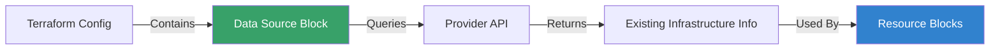

Data sources allow Terraform to use information defined outside of Terraform, or defined by another separate Terraform configuration.

## Basic Syntax
```hcl
data "aws_ami" "latest" {
  most_recent = true
  owners      = ["amazon"]
  filter {
    name   = "name"
    values = ["amzn2-ami-hvm-*"]
  }
}

resource "aws_instance" "app" {
  ami = data.aws_ami.latest.id
  ...
}
```

## Common Use Cases
- Querying the list of available Availability Zones.
- Fetching the ID of an existing VPC.
- Retrieving the latest OS image (AMI).
- Reading secrets from AWS Secrets Manager.

## Data Source Workflow



---
## 🏗️ Real-Life Scenario: Scaling to a New Region
**Problem**: You have a hardcoded AMI ID in your code. When you try to deploy to a different region, the AMI doesn't exist, and the deployment fails.
**Solution**: Use an `aws_ami` **Data Source**. This will dynamically search for the correct AMI ID in whatever region you are targeting, making your code portable.

---
## ❓ Interview Questions

1. **What is the main difference between a Data Source and a Resource?**
   - *Answer*: A Resource creates/manages infrastructure (Write); a Data Source fetches information from existing infrastructure (Read).

2. **Can you use data from one Terraform project in another?**
   - *Answer*: Yes, using the `terraform_remote_state` data source.

3. **When would you use a data source instead of hardcoding a value?**
   - *Answer*: When the value might change across environments (regions, accounts), when you need to query dynamic information (latest AMI), or when referencing resources managed outside your Terraform configuration.

4. **What happens if a data source query returns multiple results?**
   - *Answer*: It depends on the provider. Some data sources require filters to ensure a single result, others might support most_recent or similar attributes. If ambiguous, Terraform will error.

5. **Can you depend on a data source in a resource?**
   - *Answer*: Yes, Terraform automatically creates an implicit dependency when you reference a data source attribute in a resource.

---

## 🧠 Comprehensive Quiz (22 Questions)

**1. Does a data source block create infrastructure?**
- A) Yes, it creates and manages resources
- B) No, it only reads existing data
- C) Only in certain providers
- D) Yes, but only temporarily
<details>
<summary>Show Answer</summary>

**Answer: B**

</details>

**2. What keyword starts a data block?**
- A) `resource`
- B) `datasource`
- C) `data`
- D) `query`
<details>
<summary>Show Answer</summary>

**Answer: C**

</details>

**3. If a data source fails to find a match, what happens?**
- A) Uses default values
- B) Terraform warns but continues
- C) Terraform errors during plan/apply
- D) Creates the resource


<details>
<summary>Show Answer</summary>

**Answer: C**

</details>

**4. True/False: Data sources are read-only.**
- A) False - they can modify infrastructure
- B) True - they only read information


<details>
<summary>Show Answer</summary>

**Answer: B**

</details>

**5. How do you filter results in a data source?**
- A) Using the `where` block
- B) Using the `filter` block
- C) Using the `query` attribute
- D) Using SQL statements


<details>
<summary>Show Answer</summary>

**Answer: B**

</details>

**6. What is the syntax to reference a data source?**
- A) `datasource.type.name.attribute`
- B) `data.type.name.attribute`
- C) `source.type.name.attribute`
- D) `query.type.name.attribute`


<details>
<summary>Show Answer</summary>

**Answer: B**

</details>

**7. Which data source can read state from another Terraform project?**
- A) `terraform_state`
- B) `terraform_remote_state`
- C) `remote_backend`
- D) `external_state`


<details>
<summary>Show Answer</summary>

**Answer: B**

</details>

**8. Can you use data sources in modules?**
- A) No, only in root modules
- B) Yes, data sources work in any module
- C) Only in child modules
- D) Only with special configuration


<details>
<summary>Show Answer</summary>

**Answer: B**

</details>

**9. What is a common use case for data sources?**
- A) Creating EC2 instances
- B) Fetching latest AMI ID
- C) Deleting S3 buckets
- D) Compiling code


<details>
<summary>Show Answer</summary>

**Answer: B**

</details>

**10. How do data sources affect the dependency graph?**
- A) They don't participate in dependencies
- B) Resources can depend on data sources
- C) Data sources always execute first
- D) They block all other operations


<details>
<summary>Show Answer</summary>

**Answer: B**

</details>

**11. Can a data source depend on a resource?**
- A) No, never
- B) Yes, if it references a resource attribute
- C) Only in Terraform 1.0+
- D) Only for AWS resources


<details>
<summary>Show Answer</summary>

**Answer: B**

</details>

**12. What happens during `terraform plan` with data sources?**
- A) Nothing, read during apply only
- B) Data sources are queried to fetch current values
- C) Data sources are created
- D) Data sources are destroyed


<details>
<summary>Show Answer</summary>

**Answer: B**

</details>

**13. Are data source values stored in the state file?**
- A) No, queried every time
- B) Yes, for caching and dependencies
- C) Only if marked as persistent
- D) Only in Terraform Cloud


<details>
<summary>Show Answer</summary>

**Answer: B**

</details>

**14. Can you use filters to narrow down data source results?**
- A) No, filtering not supported
- B) Yes, most data sources support filtering
- C) Only for AWS
- D) Only with regex


<details>
<summary>Show Answer</summary>

**Answer: B**

</details>

**15. What attribute typically selects the most recent result?**
- A) `latest = true`
- B) `most_recent = true`
- C) `newest = true`
- D) `current = true`


<details>
<summary>Show Answer</summary>

**Answer: B**

</details>

**16. Can data sources query resources in different AWS accounts?**
- A) Never
- B) Yes, with proper cross-account permissions
- C) Only within the same organization
- D) Only with Terraform Cloud


<details>
<summary>Show Answer</summary>

**Answer: B**

</details>

**17. What is the `terraform_remote_state` data source used for?**
- A) Creating remote backends
- B) Reading outputs from another Terraform state
- C) Migrating state files
- D) Locking state


<details>
<summary>Show Answer</summary>

**Answer: B**

</details>

**18. Can you use a data source before `terraform init`?**
- A) Yes, data sources don't need providers
- B) No, providers must be initialized first
- C) Only for local data sources
- D) Only in plan mode


<details>
<summary>Show Answer</summary>

**Answer: B**

</details>

**19. Which is NOT a valid use case for data sources?**
- A) Reading current account ID
- B) Creating a new VPC
- C) Querying available availability zones
- D) Getting current region


<details>
<summary>Show Answer</summary>

**Answer: B**

</details>

**20. How do you query the current AWS region?**
- A) `data "aws_region" "current" {}`
- B) `data "aws_region" "current" { name = "current" }`
- C) `data "aws_current_region" {}`
- D) `resource "aws_region" "current" {}`


<details>
<summary>Show Answer</summary>

**Answer: A**

</details>

**21. Can data sources have count or for_each?**
- A) No, not supported
- B) Yes, same as resources
- C) Only count
- D) Only for_each


<details>
<summary>Show Answer</summary>

**Answer: B**

</details>

**22. What happens if you reference a data source that hasn't been evaluated yet?**
- A) Terraform errors immediately
- B) Terraform handles the dependency automatically in the graph
- C) Returns null
- D) Uses cached value


<details>
<summary>Show Answer</summary>

**Answer: B**

</details>
