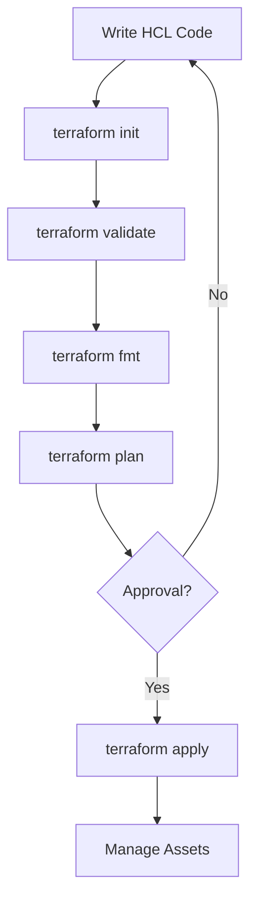

# Terraform Workflow

The standard workflow for any Terraform project consists of four main stages: Write, Init, Plan, and Apply.

## The Standard Workflow
1. **Write**: Define your infrastructure in HCL (`.tf` files).
2. **Init**: Prepare the working directory (`terraform init`).
3. **Plan**: Preview the changes (`terraform plan`).
4. **Apply**: Provision the infrastructure (`terraform apply`).

## Workflow Diagram


## Core Commands
- **fmt**: Rewrites config files to canonical format.
- **validate**: Checks for syntax errors and consistency.
- **destroy**: Tears down all managed infrastructure.

---

## 🏗️ Real-Life Scenario: The Fat Finger Apply
**Problem**: An administrator intended to update 1 resource but didn't run a plan. The apply destroyed a critical database instead.
**Solution**: Always redirect your plan to a file:
```bash
terraform plan -out=mypowerfulplan
terraform apply "mypowerfulplan"
```
This ensures that the *exact* changes you reviewed in the plan are the one being applied.

---

## ❓ Interview Questions
1. **What does `terraform init` do?**
   - *Answer*: It initializes the working directory, downloads provider plugins, and sets up the backend for state storage.
2. **What is the difference between `plan` and `apply`?**
   - *Answer*: `plan` is a dry-run that shows what will happen without making changes. `apply` actually executes the changes.

---

## 🧠 Quiz Snippet (5/20+)
1. **Which command downloads providers?** (`terraform init`)
2. **Which command checks for syntax errors?** (`terraform validate`)
3. **Which command deletes all resources?** (`terraform destroy`)
4. **Is approval required for `terraform apply` by default?** (Yes)
5. **Which command applies a saved plan file?** (`terraform apply <file>`)
