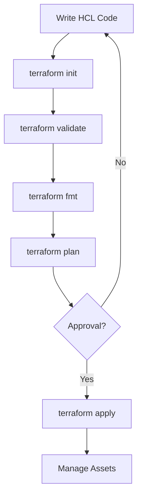
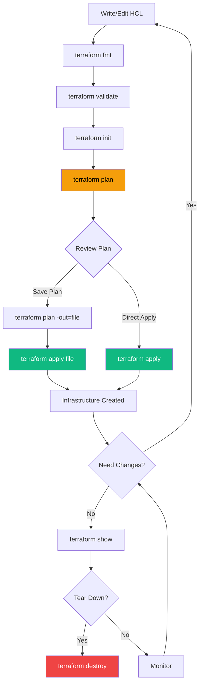

The standard workflow for any Terraform project consists of four main stages: Write, Init, Plan, and Apply.

## The Standard Workflow
1. **Write**: Define your infrastructure in HCL (`.tf` files).
2. **Init**: Prepare the working directory (`terraform init`).
3. **Plan**: Preview the changes (`terraform plan`).
4. **Apply**: Provision the infrastructure (`terraform apply`).

## Workflow Diagram


## Core Commands
- **fmt**: Rewrites config files to canonical format.
- **validate**: Checks for syntax errors and consistency.
- **destroy**: Tears down all managed infrastructure.
- **refresh**: Updates state with real-world infrastructure.
- **show**: Human-readable output of state or plan.
- **output**: Display output values.
- **graph**: Generate a visual dependency graph.

## Enhanced Workflow with State Management



---

## 🏗️ Real-Life Scenario: The Fat Finger Apply
**Problem**: An administrator intended to update 1 resource but didn't run a plan. The apply destroyed a critical database instead.
**Solution**: Always redirect your plan to a file:
```bash
terraform plan -out=mypowerfulplan
terraform apply "mypowerfulplan"
```
This ensures that the *exact* changes you reviewed in the plan are the one being applied.

---

## ❓ Interview Questions

1. **What does `terraform init` do?**
   - *Answer*: It initializes the working directory, downloads provider plugins, and sets up the backend for state storage.

2. **What is the difference between `plan` and `apply`?**
   - *Answer*: `plan` is a dry-run that shows what will happen without making changes. `apply` actually executes the changes.

3. **Why is it recommended to save the plan to a file?**
   - *Answer*: Saving the plan ensures that the exact changes reviewed during planning are the ones applied, preventing drift between plan and apply operations.

4. **What does `terraform refresh` do and when should you use it?**
   - *Answer*: It updates the state file to match the real-world infrastructure. Use it when you suspect drift or after manual changes. Note: It's often better to use `terraform plan -refresh-only` in modern Terraform.

5. **What is the purpose of `terraform fmt`?**
   - *Answer*: It automatically formats Terraform configuration files to a canonical style, ensuring consistency across the codebase and making code reviews easier.

6. **How does `terraform validate` differ from `terraform plan`?**
   - *Answer*: `validate` checks syntax and internal consistency of configuration without accessing remote services. `plan` requires provider authentication and checks against actual infrastructure.

7. **What happens if you run `terraform destroy` accidentally?**
   - *Answer*: Resources will be destroyed. Without state file backups or versioning, recovery is difficult. Always use version control for code and remote backends with versioning for state.

---

## 🧠 Comprehensive Quiz (28 Questions)

**1. Which command downloads providers?**
- A) `terraform get`
- B) `terraform download`
- C) `terraform init`
- D) `terraform install`
<details>
<summary>Show Answer</summary>

**Answer: C**

</details>

**2. Which command checks for syntax errors?**
- A) `terraform check`
- B) `terraform validate`
- C) `terraform test`
- D) `terraform lint`


<details>
<summary>Show Answer</summary>

**Answer: B**

</details>

**3. Which command deletes all resources?**
- A) `terraform delete`
- B) `terraform remove`
- C) `terraform destroy`
- D) `terraform clean`


<details>
<summary>Show Answer</summary>

**Answer: C**

</details>

**4. Is approval required for `terraform apply` by default?**
- A) No, auto-applies
- B) Yes, requires confirmation
- C) Only in production
- D) Only for destroy operations


<details>
<summary>Show Answer</summary>

**Answer: B**

</details>

**5. Which command applies a saved plan file?**
- A) `terraform execute <file>`
- B) `terraform run <file>`
- C) `terraform apply <file>`
- D) `terraform deploy <file>`


<details>
<summary>Show Answer</summary>

**Answer: C**

</details>

**6. What does `terraform fmt` do?**
- A) Formats disk
- B) Formats configuration files to standard style
- C) Creates file system
- D) Fixes errors


<details>
<summary>Show Answer</summary>

**Answer: B**

</details>

**7. How do you skip the approval prompt during apply?**
- A) `-yes`
- B) `-force`
- C) `-auto-approve`
- D) `-skip-confirm`


<details>
<summary>Show Answer</summary>

**Answer: C**

</details>

**8. Which command shows the current state?**
- A) `terraform state`
- B) `terraform show`
- C) `terraform display`
- D) `terraform view`


<details>
<summary>Show Answer</summary>

**Answer: B**

</details>

**9. What does `terraform output` do?**
- A) Exports configuration
- B) Displays output values from state
- C) Saves plan to file
- D) Prints logs


<details>
<summary>Show Answer</summary>

**Answer: B**

</details>

**10. How do you preview destroy operation?**
- A) `terraform destroy -dry-run`
- B) `terraform plan -destroy`
- C) `terraform destroy --preview`
- D) `terraform show destroy`


<details>
<summary>Show Answer</summary>

**Answer: B**

</details>

**11. Which command generates a dependency graph?**
- A) `terraform graph`
- B) `terraform diagram`
- C) `terraform visualize`
- D) `terraform map`


<details>
<summary>Show Answer</summary>

**Answer: A**

</details>

**12. What does `terraform refresh` update?**
- A) Provider plugins
- B) The state file to match real infrastructure
- C) Terraform version
- D) Configuration files


<details>
<summary>Show Answer</summary>

**Answer: B**

</details>

**13. Can you run `terraform plan` without `terraform init`?**
- A) Yes, always
- B) No, init must come first
- C) Only for local files
- D) Only with cached providers


<details>
<summary>Show Answer</summary>

**Answer: B**

</details>

**14. What flag saves a plan to a file?**
- A) `-save`
- B) `-export`
- C) `-out`
- D) `-file`


<details>
<summary>Show Answer</summary>

**Answer: C**

</details>

**15. Which command is purely local (doesn't contact providers)?**
- A) `terraform plan`
- B) `terraform apply`
- C) `terraform validate`
- D) `terraform refresh`


<details>
<summary>Show Answer</summary>

**Answer: C**

</details>

**16. What does `terraform init -upgrade` do?**
- A) Upgrades Terraform CLI
- B) Upgrades provider versions
- C) Upgrades state file format
- D) Upgrades all resources


<details>
<summary>Show Answer</summary>

**Answer: B**

</details>

**17. How do you target a specific resource during apply?**
- A) `-resource=name`
- B) `-target=resource.name`
- C) `-only=resource.name`
- D) `-select=resource.name`


<details>
<summary>Show Answer</summary>

**Answer: B**

</details>

**18. What happens during `terraform init` if you already ran it?**
- A) Error
- B) Updates if needed, otherwise does nothing
- C) Deletes and reinstalls everything
- D) Prompts for confirmation


<details>
<summary>Show Answer</summary>

**Answer: B**

</details>

**19. Which command would you run first in a new Terraform project?**
- A) `terraform apply`
- B) `terraform plan`
- C) `terraform init`
- D) `terraform validate`


<details>
<summary>Show Answer</summary>

**Answer: C**

</details>

**20. Can `terraform validate` detect logical errors in your infrastructure design?**
- A) Yes, it validates all logic
- B) No, only syntax and internal consistency
- C) Only with `-deep` flag
- D) Only in Terraform Cloud


<details>
<summary>Show Answer</summary>

**Answer: B**

</details>

**21. What does `terraform workspace list` show?**
- A) List of providers
- B) List of workspaces
- C) List of resources
- D) List of modules


<details>
<summary>Show Answer</summary>

**Answer: B**

</details>

**22. How do you format all `.tf` files in a directory recursively?**
- A) `terraform fmt`
- B) `terraform fmt -recursive`
- C) `terraform fmt -r`
- D) `terraform fmt --all`


<details>
<summary>Show Answer</summary>

**Answer: B**

</details>

**23. What is the recommended practice before running apply?**
- A) Always run destroy first
- B) Run plan and review changes
- C) Backup your computer
- D) Restart Terraform


<details>
<summary>Show Answer</summary>

**Answer: B**

</details>

**24. Can you pipe `terraform plan` output to `terraform apply`?**
- A) Yes, using shell pipes
- B) No, must save plan to file first
- C) Only on Linux
- D) Only in interactive mode


<details>
<summary>Show Answer</summary>

**Answer: B**

</details>

**25. What does the `-var` flag do?**
- A) Validates variables
- B) Sets variable values from command line
- C) Lists all variables
- D) Creates new variables


<details>
<summary>Show Answer</summary>

**Answer: B**

</details>

**26. Which command would you use to see the execution plan in a saved file?**
- A) `terraform show planfile`
- B) `terraform view planfile`
- C) `terraform read planfile`
- D) `terraform cat planfile`


<details>
<summary>Show Answer</summary>

**Answer: A**

</details>

**27. What does `terraform apply -refresh=false` do?**
- A) Skips downloading providers
- B) Skips refreshing state before applying
- C) Disables all checks
- D) Applies without plan


<details>
<summary>Show Answer</summary>

**Answer: B**

</details>

**28. Can you undo a `terraform apply` automatically?**
- A) Yes, using `terraform undo`
- B) Yes, using `terraform rollback`
- C) No, must manually restore or use version control
- D) Yes, if within 5 minutes


<details>
<summary>Show Answer</summary>

**Answer: C**

</details>
