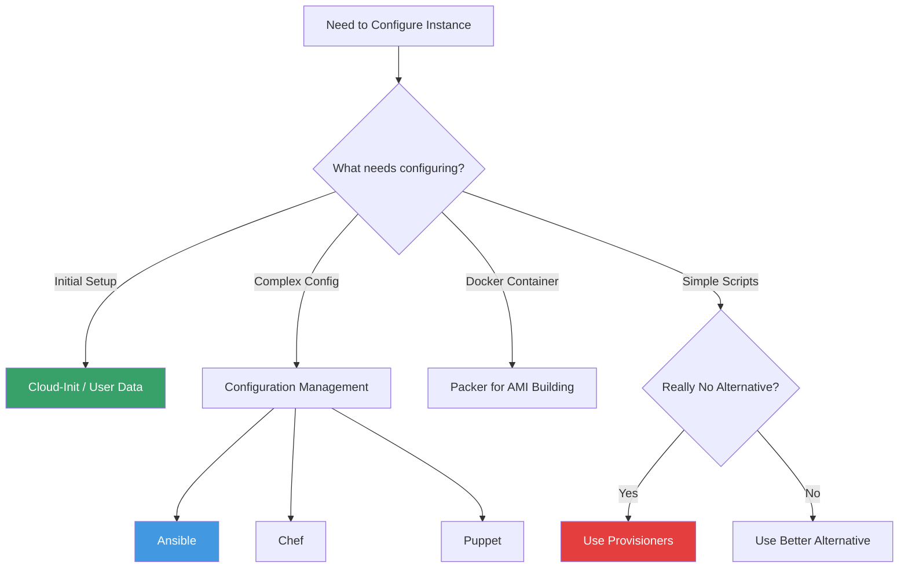
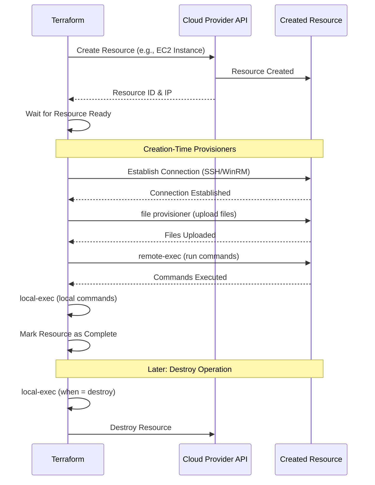

Provisioners are a last-resort mechanism for executing scripts or commands on local or remote machines as part of resource creation or destruction. This guide covers when to use provisioners, best practices, and safer alternatives.

---
## ⚠️ Important: Provisioners Are a Last Resort

**HashiCorp's Official Stance**: "Provisioners should only be used as a last resort. For most common situations, there are better alternatives."

### Why Avoid Provisioners?

1. **Break Terraform's Declarative Model**: Provisioners are imperative (procedural steps)
2. **Poor Error Handling**: Failed provisioners can leave resources in unknown states
3. **No Idempotence Guarantee**: Running twice might cause different results
4. **State Management Issues**: Provisioner results aren't tracked in state
5. **Testing Complexity**: Harder to test than declarative configuration

### Better Alternatives (Use These First!)



---

## Types of Provisioners

### 1. file Provisioner

Copies files or directories from local machine to remote resource.

#### Basic Syntax
```hcl
resource "aws_instance" "web" {
  ami           = "ami-12345"
  instance_type = "t3.micro"
  key_name      = "my-key"
  
  # Upload a configuration file
  provisioner "file" {
    source      = "configs/app.conf"
    destination = "/etc/myapp/app.conf"
    
    connection {
      type        = "ssh"
      user        = "ec2-user"
      private_key = file("~/.ssh/id_rsa")
      host        = self.public_ip
    }
  }
}
```
#### Uploading Multiple Files
```hcl
provisioner "file" {
  source      = "configs/"  # Trailing slash = contents only
  destination = "/etc/myapp/"
  
  connection {
    type        = "ssh"
    user        = "ubuntu"
    private_key = file(var.private_key_path)
    host        = self.public_ip
  }
}
```
---
### 2. remote-exec Provisioner
Executes commands on the remote resource via SSH or WinRM.
#### Running Shell Commands
```hcl
resource "aws_instance" "web" {
  ami           = "ami-12345"
  instance_type = "t3.micro"
  
  provisioner "remote-exec" {
    inline = [
      "sudo yum update -y",
      "sudo yum install -y httpd",
      "sudo systemctl start httpd",
      "sudo systemctl enable httpd",
      "echo '<h1>Hello from Terraform</h1>' | sudo tee /var/www/html/index.html"
    ]
    
    connection {
      type        = "ssh"
      user        = "ec2-user"
      private_key = file("~/.ssh/id_rsa")
      host        = self.public_ip
    }
  }
}
```
#### Running a Script File
```hcl
provisioner "remote-exec" {
  script = "scripts/install-web-server.sh"
  
  connection {
    type        = "ssh"
    user        = "ubuntu"
    private_key = file(var.private_key_path)
    host        = self.public_ip
  }
}
```
---
### 3. local-exec Provisioner
Executes commands on the **local machine** running Terraform (not the resource being created).
#### Use Cases
- Triggering CI/CD pipelines
- Sending notifications
- Running local scripts
- Updating external systems
```hcl
resource "aws_instance" "web" {
  ami           = "ami-12345"
  instance_type = "t3.micro"
  
  provisioner "local-exec" {
    command = "echo ${self.private_ip} >> private_ips.txt"
  }
  
  provisioner "local-exec" {
    command = "ansible-playbook -i '${self.public_ip},' playbook.yml"
    environment = {
      ANSIBLE_HOST_KEY_CHECKING = "False"
    }
  }
}
```
#### Windows Example
```hcl
provisioner "local-exec" {
  command = "powershell.exe -File scripts/notify.ps1 -InstanceId ${self.id}"
  interpreter = ["PowerShell", "-Command"]
}
```
---
### 4. Null Resource with Provisioners
When you need to run provisioners without associating them with a specific resource.
```hcl
resource "null_resource" "cluster_setup" {
  # Trigger re-run when cluster IDs change
  triggers = {
    cluster_instance_ids = join(",", aws_instance.cluster[*].id)
  }
  
  provisioner "local-exec" {
    command = "ansible-playbook -i inventory.ini configure-cluster.yml"
  }
  
  depends_on = [aws_instance.cluster]
}
```
---
## Connection Configuration

### SSH Connection
```hcl
connection {
  type        = "ssh"
  user        = "ubuntu"
  private_key = file("~/.ssh/id_rsa")
  host        = self.public_ip
  port        = 22
  timeout     = "5m"
  
  # Optional: Bastion host for private instances
  bastion_host        = "bastion.example.com"
  bastion_user        = "bastion-user"
  bastion_private_key = file("~/.ssh/bastion_key")
}
```
### WinRM Connection (Windows)
```hcl
connection {
  type     = "winrm"
  user     = "Administrator"
  password = var.admin_password
  host     = self.public_ip
  port     = 5985
  https    = false
  insecure = true
  timeout  = "10m"
}
```
### Connection via Bastion Host
```hcl
resource "aws_instance" "private_web" {
  ami                    = "ami-12345"
  instance_type          = "t3.micro"
  subnet_id              = aws_subnet.private.id
  
  provisioner "remote-exec" {
    inline = ["echo 'Connected via bastion!'"]
    
    connection {
      type                = "ssh"
      user                = "ubuntu"
      private_key         = file("~/.ssh/app_key")
      host                = self.private_ip
      
      # Bastion configuration
      bastion_host        = aws_instance.bastion.public_ip
      bastion_user        = "ec2-user"
      bastion_private_key = file("~/.ssh/bastion_key")
    }
  }
}
```

---

## Provisioner Lifecycle

### Creation-Time Provisioners (Default)

Run only when the resource is **first created**.

```hcl
resource "aws_instance" "web" {
  ami           = "ami-12345"
  instance_type = "t3.micro"
  
  provisioner "remote-exec" {
    inline = ["echo 'Instance created!'"]
  }
}
```

### Destroy-Time Provisioners

Run when the resource is **destroyed**.

```hcl
resource "aws_instance" "web" {
  ami           = "ami-12345"
  instance_type = "t3.micro"
  
  provisioner "local-exec" {
    when    = destroy
    command = "python scripts/cleanup.py ${self.id}"
  }
}
```

---

## Error Handling

### on_failure Behavior

```hcl
provisioner "remote-exec" {
  inline = [
    "sudo apt-get update",
    "sudo apt-get install -y nginx"
  ]
  
  on_failure = continue  # Options: continue, fail (default)
  
  connection {
    type        = "ssh"
    user        = "ubuntu"
    private_key = file("~/.ssh/id_rsa")
    host        = self.public_ip
  }
}
```

**Options**:
- `fail` (default): Terraform errors and stops
- `continue`: Terraform logs the error but continues

**⚠️ Warning**: Using `on_failure = continue` can leave resources in inconsistent states!

---

## Provisioner Execution Flow



---

## Real-Life Scenarios

### Scenario 1: The Failed Provisioner Nightmare

**Problem**: A team used `remote-exec` to install software. The script failed due to a typo, but the EC2 instance was already created and marked as "complete" in Terraform state.

**What Happened**:
1. Instance created successfully
2. Provisioner failed (script error)
3. Terraform marked resource as "tainted" but didn't destroy it
4. Team had to manually SSH in to fix or destroy instance manually

**The Better Way**:
```hcl
# Use user_data instead of provisioner
resource "aws_instance" "web" {
  ami           = "ami-12345"
  instance_type = "t3.micro"
  
  user_data = <<-EOF
    #!/bin/bash
    yum update -y
    yum install -y httpd
    systemctl start httpd
    EOF
  
  # user_data runs on boot, instance stays clean if it fails
}
```
---
### Scenario 2: The Unreachable Instance
**Problem**: Used `remote-exec` provisioner, but forgot to add security group rule for SSH (port 22). Provisioner timed out waiting 5 minutes, then failed.
**Root Cause**: Instance was created without SSH access.
**Fix**: Always ensure connectivity before using provisioners
```hcl
resource "aws_security_group" "web" {
  name = "web-sg"
  
  # Allow SSH for provisioner
  ingress {
    from_port   = 22
    to_port     = 22
    protocol    = "tcp"
    cidr_blocks = ["YOUR_IP/32"]  # Restrict to your IP!
  }
}

resource "aws_instance" "web" {
  ami                    = "ami-12345"
  instance_type          = "t3.micro"
  vpc_security_group_ids = [aws_security_group.web.id]
  
  provisioner "remote-exec" {
    inline = ["echo 'Connected!'"]
    
    connection {
      type        = "ssh"
      user        = "ec2-user"
      private_key = file("~/.ssh/id_rsa")
      host        = self.public_ip
      timeout     = "10m"  # Increase timeout
    }
  }
}
```
---

### Scenario 3: The Idempotency Problem
**Problem**: Team used `local-exec` to append instance IP to a file. Re-running Terraform added duplicate entries.
**Bad Code**:
```hcl
provisioner "local-exec" {
  command = "echo ${self.private_ip} >> inventory.txt"
}
# Running twice: inventory.txt has duplicate IPs!
```
**Better Approach**: Use external data source or templating
```hcl
# Use Terraform templates instead
resource "local_file" "inventory" {
  content = templatefile("inventory.tpl", {
    instances = aws_instance.web[*].private_ip
  })
  filename = "inventory.txt"
}
```
---
### Scenario 4: Provisioner Success Despite Application Failure
**Problem**: Provisioner successfully installed Nginx, but the application itself failed to start due to a missing dependency. Terraform marked the resource as successful.
**The Issue**: Provisioners only check if the **script succeeds**, not if the **application works**.
**The Solution**: Use health checks post-deployment
```hcl
resource "aws_instance" "web" {
  ami           = "ami-12345"
  instance_type = "t3.micro"
  
  user_data = file("install.sh")
  
  # No provisioner needed!
}

resource "null_resource" "health_check" {
  provisioner "local-exec" {
    command = <<-EOC
      for i in {1..30}; do
        if curl -f http://${aws_instance.web.public_ip}/health; then
          echo "Health check passed"
          exit 0
        fi
        echo "Waiting for application... ($i/30)"
        sleep 10
      done
      echo "Health check failed"
      exit 1
    EOC
  }
  
  depends_on = [aws_instance.web]
}
```
---
## Best Practices

### 1. Prefer Declarative Alternatives

| Instead of Provisioner            | Use This Alternative                     |
| --------------------------------- | ---------------------------------------- |
| `remote-exec` to install packages | Cloud-Init / User Data                   |
| `file` to upload configs          | User Data with templates                 |
| Complex configuration             | Configuration Management (Ansible, Chef) |
| AMI customization                 | Packer                                   |
| Script execution                  | Lambda functions, Step Functions         |
### 2. Use null_resource for Orchestration
```hcl
resource "null_resource" "wait_for_db" {
  provisioner "local-exec" {
    command = "bash scripts/wait-for-db.sh ${aws_db_instance.main.endpoint}"
  }
  
  depends_on = [aws_db_instance.main]
}

resource "aws_instance" "app" {
  # This won't start until DB is ready
  depends_on = [null_resource.wait_for_db]
}
```
### 3. Always Set Timeouts
```hcl
connection {
  type    = "ssh"
  timeout = "10m"  # Default is 5m, might not be enough
}
```
### 4. Use Triggers for null_resource
```hcl
resource "null_resource" "redeploy_app" {
  triggers = {
    app_version = var.app_version
    config_hash = md5(file("config.yml"))
  }
  
  provisioner "local-exec" {
    command = "ansible-playbook deploy.yml"
  }
}
```
### 5. Restrict SSH Access
```hcl
# BAD: Open to the world
ingress {
  from_port   = 22
  cidr_blocks = ["0.0.0.0/0"]
}

# GOOD: Restricted to your IP
ingress {
  from_port   = 22
  cidr_blocks = ["YOUR_IP/32"]
}

# BETTER: Use Systems Manager Session Manager (no SSH needed!)
```
---
## Interview Questions
1. **What is the primary reason HashiCorp recommends avoiding provisioners?**
   - *Answer*: Provisioners break Terraform's declarative model, lack proper error handling, and don't guarantee idempotence. They should be a last resort when no declarative alternative exists.

2. **What is the difference between creation-time and destroy-time provisioners?**
   - *Answer*: Creation-time provisioners run when a resource is created (default behavior). Destroy-time provisioners run when a resource is destroyed, specified with `when = destroy`.

3. **What happens if a provisioner fails?**
   - *Answer*: By default (`on_failure = fail`), Terraform marks the resource as "tainted" and errors. The resource exists in the cloud but is considered incomplete. With `on_failure = continue`, Terraform logs the error and continues.

1. **Why should you use user_data instead of remote-exec for initial instance configuration?**
   - *Answer*: User_data runs on instance boot, doesn't require SSH connectivity, is more reliable, doesn't leave instances in inconsistent states if it fails, and follows AWS/cloud-native patterns.

5. **What is a null_resource and when would you use it?**
   - *Answer*: A null_resource is a placeholder resource that does nothing on its own but can have provisioners attached. Use it when you need to run provisioners without associating them with a specific infrastructure resource.

6. **How do you handle provisioner idempotency?**
   - *Answer*: Provisioners aren't inherently idempotent. You must write idempotent scripts yourself (checking if operations are needed before running them) or use configuration management tools that handle idempotency.

7. **What is the purpose of connection blocks?**
   - *Answer*: Connection blocks define how Terraform connects to a remote resource to execute file or remote-exec provisioners, specifying protocol (SSH/WinRM), credentials, host, and optional bastion configuration.

8. **Can you reference other resources in a local-exec provisioner?**
   - *Answer*: Yes, you can reference attributes from the same resource using `self` or other resources using standard interpolation syntax.

9. **What are triggers in null_resource?**
   - *Answer*: Triggers are a map of values that, when changed, cause the null_resource to be destroyed and recreated, re-running its provisioners. Useful for re-executing operations based on variable or file changes.

10. **What is the better alternative to provisioners for managing EC2 instance configuration?**
    - *Answer*: Use Packer to build custom AMIs with all software pre-installed, or use AWS Systems Manager, Cloud-Init/user_data, or configuration management tools like Ansible (called separately from Terraform).

---

## Comprehensive Quiz (25 Questions)

**1. What type of provisioner copies files to a remote machine?**
- A) `remote-exec`
- B) `file`
- C) `local-exec`
- D) `copy`


<details>
<summary>Show Answer</summary>

**Answer: B**

</details>

**2. Which provisioner runs commands on your local machine?**
- A) `remote-exec`
- B) `file`
- C) `local-exec`
- D) `ssh-exec`


<details>
<summary>Show Answer</summary>

**Answer: C**

</details>

**3. What is the default behavior when a provisioner fails?**
- A) Continue silently
- B) Mark resource as tainted and error
- C) Retry automatically
- D) Rollback resource creation


<details>
<summary>Show Answer</summary>

**Answer: B**

</details>

**4. How do you specify a destroy-time provisioner?**
- A) `timing = destroy`
- B) `when = destroy`
- C) `on_destroy = true`
- D) `lifecycle = destroy`


<details>
<summary>Show Answer</summary>

**Answer: B**

</details>

**5. What protocol does remote-exec use for Linux instances?**
- A) HTTP
- B) WinRM
- C) SSH
- D) Telnet


<details>
<summary>Show Answer</summary>

**Answer: C**

</details>

**6. What is HashiCorp's recommendation regarding provisioners?**
- A) Use them extensively
- B) Use as a last resort
- C) Required for all resources
- D) Only use on Fridays


<details>
<summary>Show Answer</summary>

**Answer: B**

</details>

**7. What does on_failure = continue do?**
- A) Retries the provisioner
- B) Logs error but continues Terraform execution
- C) Skips the provisioner
- D) Sends an email


<details>
<summary>Show Answer</summary>

**Answer: B**

</details>

**8. How do you reference the resource being provisioned?**
- A) `this`
- B) `self`
- C) `resource`
- D) `current`


<details>
<summary>Show Answer</summary>

**Answer: B**

</details>

**9. What is a null_resource?**
- A) An empty EC2 instance
- B) A placeholder for running provisioners without a real resource
- C) A deleted resource
- D) A state file backup


<details>
<summary>Show Answer</summary>

**Answer: B**

</details>

**10. What is the better alternative to remote-exec for instance setup?**
- A) Manual SSH
- B) User Data / Cloud-Init
- C) FTP
- D) Email instructions


<details>
<summary>Show Answer</summary>

**Answer: B**

</details>

**11. How do you upload an entire directory with file provisioner?**
- A) Use wildcards
- B) Source path with trailing slash
- C) Compress and upload
- D) Not possible


<details>
<summary>Show Answer</summary>

**Answer: B**

</details>

**12. What is the default timeout for connections?**
- A) 1 minute
- B) 5 minutes
- C) 10 minutes
- D) No timeout


<details>
<summary>Show Answer</summary>

**Answer: B**

</details>

**13. Which protocol is used for Windows provisioners?**
- A) SSH
- B) RDP
- C) WinRM
- D) FTP


<details>
<summary>Show Answer</summary>

**Answer: C**

</details>

**14. What does triggers do in null_resource?**
- A) Starts the resource
- B) Forces recreation when values change
- C) Sets alarms
- D) Validates configuration


<details>
<summary>Show Answer</summary>

**Answer: B**

</details>

**15. Can provisioners access Terraform outputs?**
- A) Yes, using interpolation
- B) No, not possible
- C) Only with special configuration
- D) Only in Terraform Cloud


<details>
<summary>Show Answer</summary>

**Answer: A**

</details>

**16. What happens to a resource if its provisioner fails by default?**
- A) Resource is destroyed
- B) Resource is created but marked as tainted
- C) Nothing, continues normally
- D) State file is deleted


<details>
<summary>Show Answer</summary>

**Answer: B**

</details>

**17. How do you connect to a private instance via bastion?**
- A) Not possible
- B) Use bastion_host in connection block
- C) Manual SSH tunneling
- D) VPN only


<details>
<summary>Show Answer</summary>

**Answer: B**

</details>

**18. What is the risk of using provisioners?**
- A) Faster deployments
- B) Poor error handling and non-idempotent behavior
- C) Lower costs
- D) No risks


<details>
<summary>Show Answer</summary>

**Answer: B**

</details>

**19. Can you use environment variables with local-exec?**
- A) No
- B) Yes, with environment block
- C) Only on Linux
- D) Only with Python


<details>
<summary>Show Answer</summary>

**Answer: B**

</details>

**20. What keyword specifies inline commands for remote-exec?**
- A) `commands`
- B) `inline`
- C) `script`
- D) `execute`


<details>
<summary>Show Answer</summary>

**Answer: B**

</details>

**21. How do you run a script file with remote-exec?**
- A) `inline = ["script.sh"]`
- B) `script = "script.sh"`
- C) `file = "script.sh"`
- D) `run = "script.sh"`


<details>
<summary>Show Answer</summary>

**Answer: B**

</details>

**22. What is the purpose of connection blocks?**
- A) Connect to database
- B) Define how to connect to remote resource for provisioners
- C) Network configuration
- D) VPN setup


<details>
<summary>Show Answer</summary>

**Answer: B**

</details>

**23. Can provisioners be used with data sources?**
- A) Yes, always
- B) No, only resources
- C) Only with special flag
- D) Only in modules


<details>
<summary>Show Answer</summary>

**Answer: B**

</details>

**24. What is the better tool for building custom AMIs?**
- A) Provisioners
- B) Packer
- C) Photoshop
- D) Docker


<details>
<summary>Show Answer</summary>

**Answer: B**

</details>

**25. When do creation-time provisioners run?**
- A) During every apply
- B) Only when resource is first created
- C) During destroy
- D) Every hour


<details>
<summary>Show Answer</summary>

**Answer: B**

</details>

---

## Summary

### When to Use Provisioners

✅ **Use When**:
- No declarative alternative exists
- Quick prototyping/testing
- Orchestrating external systems (with local-exec)
- One-time setup that can't be done with user_data

❌ **Don't Use When**:
- Installing software (use user_data or Packer)
- Complex configuration (use Ansible/Chef/Puppet)
- When state management matters
- Testing is important

### Key Takeaways

1. **Provisioners are imperative** - They break Terraform's declarative model
2. **Error handling is poor** - Failed provisioners leave resources in unknown states
3. **Not idempotent by default** - You must ensure scripts can run multiple times
4. **Better alternatives exist** - User_data, Packer, Configuration Management tools
5. **Use null_resource for orchestration** - When you need provisioners without a resource
6. **Always handle failures gracefully** - Set appropriate timeouts and on_failure behavior
7. **Secure your connections** - Use bastion hosts, restrict SSH access

**Remember**: If you find yourself writing complex provisioner logic, there's probably a better, more declarative way to achieve the same goal!
