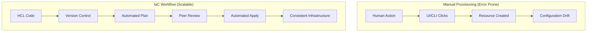

Infrastructure as Code is the management of infrastructure (networks, virtual machines, load balancers, and connection topology) in a descriptive model, using the same versioning as DevOps teams use for source code.

## Core IaC Principles

1.  **Idempotency**: Running the same code multiple times should result in the same state every time.
2.  **Immutability**: Instead of modifying existing infrastructure, tear it down and create new ones.
3.  **Declarative over Procedural**: Express *what* the result should be, not *how* to achieve it.
4.  **Version Control**: Software engineers treat infra code like application code.

## Benefits of IaC

- **Consistency**: Eliminate "it works on my machine" for infrastructure.
- **Speed**: Provision an entire environment in minutes.
- **Lower Cost**: Reduce manual labor and optimize resource usage.
- **Reduced Risk**: Automated testing and peer reviews.

## IaC vs Manual Workflow

---

## 🏗️ Real-Life Scenarios

### Scenario 1: The Snowflake Server
**Problem**: An engineer manually updated a production server's security group to allow a new port. Six months later, the server crashed and was rebuilt via a legacy script. The manual change was lost, causing a service outage.
**Solution**: By moving to IaC, all changes are versioned. If a server needs a new port, it's added to the Terraform code, reviewed, and applied. When the server is rebuilt, it inherits all the correct settings from the code.

### Scenario 2: The "Works on My Machine" Environment
**Problem**: A development team struggled with "environment disparity." A feature worked in Dev but failed in Production because the Prod Load Balancer had a different timeout setting that nobody remembered changing manually.
**Solution**: Use the **exact same code** to provision Dev, Staging, and Production. Variables are used for scaling (e.g., `t3.micro` in Dev vs `t3.large` in Prod), but the configuration logic is identical, eliminating hidden disparities.

### Scenario 3: The 2 AM Disaster Recovery
**Problem**: A regional cloud outage took down the entire infrastructure. The manual recovery plan was a 40-page PDF that would take 12 hours to execute.
**Solution**: With Terraform, the team simply pointed their code at a different region, updated the region variable, and ran `terraform apply`. The entire stack was restored in 15 minutes.

---

## ❓ Interview Questions

1.  **Explain the difference between Declarative and Procedural IaC.**
    - *Answer*: Declarative (Terraform) defines the end state, and the tool calculates the steps. Procedural (Ansible) defines the specific steps to be taken in order.
2.  **What is "Configuration Drift"?**
    - *Answer*: It's when the actual state of infrastructure deviates from the desired state defined in code, usually due to manual changes.
3.  **What is Idempotency in the context of IaC?**
    - *Answer*: Idempotency ensures that running the same operation multiple times results in the same outcome. If the infrastructure already matches the code, Terraform does nothing.
4.  **How does "Immutability" improve infrastructure reliability?**
    - *Answer*: Instead of patching or updating existing servers (which can fail or leave residue), immutable infrastructure replaces them entirely. This ensures a clean, predictable state every time.
5.  **What are the risks of manual infrastructure changes?**
    - *Answer*: Lack of audit trail, configuration drift, "snowflake" servers that are impossible to replicate, and difficulty in disaster recovery.
6.  **Can you use IaC for multi-cloud environments?**
    - *Answer*: Yes, tools like Terraform use "Providers" to interact with different APIs (AWS, Azure, GCP) using the same consistent HCL language.

---

## 🧠 Comprehensive Quiz (25 Questions)

**1. Which principle ensures a script produces the same result no matter how many times it's run?**
- A) Immutability
- B) Idempotency
- C) Versioning
- D) Scaling

Show Answer

**Answer: B** - Idempotency ensures the target state is reached regardless of the starting state.

**2. What is the primary characteristic of "Declarative" IaC?**
- A) You specify the exact steps to take
- B) You specify the desired end state
- C) You must write logic loops for every resource
- D) You must manually approve every API call

Show Answer

**Answer: B** - Declarative tools like Terraform focus on the "What" rather than the "How."

**3. What is "Configuration Drift"?**
- A) When code version is updated
- B) When resources move between regions
- C) When manual changes make live infra different from code
- D) When cloud provider prices change

Show Answer

**Answer: C** - Manual "hotfixes" are the leading cause of drift.

**4. True/False: Immutable infrastructure focuses on patching existing servers.**
- A) True
- B) False

Show Answer

**Answer: B** - Immutability favors replacing resources rather than modifying them.

**5. Which of these is a benefit of Version Control for IaC?**
- A) Faster internet speeds
- B) Ability to rollback to previous states
- C) Automatic cloud account creation
- D) Reduced cloud costs

Show Answer

**Answer: B** - Git history allows you to see who changed what and revert if needed.

**6. Why is IaC considered "Software Engineering for Infrastructure"?**
- A) Because it uses Java
- B) Because it applies SDLC practices (Review, Versioning, Testing) to infra
- C) Because it requires a PhD in Computer Science
- D) Because it only works on Windows

Show Answer

**Answer: B**

**7. "Snowflake Servers" are a result of:**
- A) Cold weather data centers
- B) Manual, non-reproducible configurations
- C) Using only Terraform
- D) High-availability clusters

Show Answer

**Answer: B** - Each snowflake is unique and impossible to recreate exactly.

**8. What happens if you run an idempotent script on a system that is already in the desired state?**
- A) It errors out
- B) It creates duplicate resources
- C) It makes no changes
- D) It deletes everything

Show Answer

**Answer: C**

**9. Which tool is most famous for Declarative IaC?**
- A) Ansible
- B) Bash Scripts
- C) Terraform
- D) Chef

Show Answer

**Answer: C**

**10. What does "Single Source of Truth" refer to in IaC?**
- A) The AWS Console
- B) The versioned configuration code
- C) The senior engineer's memory
- D) The billing dashboard

Show Answer

**Answer: B**

**11. Peer review of IaC code helps prevent:**
- A) Security misconfigurations
- B) High latency
- C) Tool installation errors
- D) Keyboard failures

Show Answer

**Answer: A**

**12. Disaster Recovery is faster with IaC because:**
- A) Code runs faster than humans
- B) Infrastructure can be recreated instantly from code template
- C) Cloud providers give discounts for IaC
- D) It prevents hardware failures

Show Answer

**Answer: B**

**13. In the "IaC Workflow," what follows "Automated Plan"?**
- A) Automated Apply
- B) Peer Review
- C) Deleting the code
- D) Manual resource creation

Show Answer

**Answer: B**

**14. Multi-environment consistency means:**
- A) Dev, Stage, and Prod are identical in size
- B) Dev, Stage, and Prod use the same configuration logic
- C) Only one environment is allowed at a time
- D) Users access all environments simultaneously

Show Answer

**Answer: B**

**15. What is "Infrastructure Disposal" in immutability?**
- A) Deleting old code
- B) Terminating old resources instead of updating them
- C) Recycling old servers
- D) Moving to a different cloud

Show Answer

**Answer: B**

**16. Which of these is NOT an IaC principle?**
- A) Idempotency
- B) Manual hotfixing
- C) Declarative code
- D) Versioning

Show Answer

**Answer: B**

**17. Auditability in IaC is achieved through:**
- A) CloudWatch logs
- B) Git commit history
- C) Monthly reports
- D) Password rotation

Show Answer

**Answer: B**

**18. "Day 0" operations typically refer to:**
- A) Ongoing maintenance
- B) Initial provisioning and architecture setup
- C) Decommissioning
- D) Billing review

Show Answer

**Answer: B**

**19. What is a "Snowflake" in technical terms?**
- A) A cloud region in a cold climate
- B) A server that has been uniquely modified by hand
- C) A temporary resource
- D) A high-performance instance

Show Answer

**Answer: B**

**20. Declarative code says:**
- A) "Do A, then B, then C"
- B) "I want 3 servers in US-East-1"
- C) "If server exists, skip; else create"
- D) "Update all packages"

Show Answer

**Answer: B**

**21. Why is mutability considered "Bad" for scaling?**
- A) It's too fast
- B) It's cheap
- C) It leads to inconsistent states across multiple nodes
- D) It only works for small files

Show Answer

**Answer: C**

**22. "Time to Market" is reduced by IaC through:**
- A) Faster typing
- B) Automation of repetitive provisioning tasks
- C) Using fewer servers
- D) Outsourcing work

Show Answer

**Answer: B**

**23. Which lifecycle stage follows "Peer Review"?**
- A) Coding
- B) Automated Apply
- C) Deleting Git repo
- D) Plan

Show Answer

**Answer: B**

**24. GitOps is a practice that uses:**
- A) Git as the source of truth for infrastructure
- B) Only Git for all company operations
- C) Manual commands stored in Git
- D) No automation whatsoever

Show Answer

**Answer: A**

**25. Does IaC replace the cloud provider's UI?**
- A) No, it's irrelevant
- B) Yes, it's the primary way to manage resources at scale
- C) Only for S3 buckets
- D) Manual UI is always faster

Show Answer

**Answer: B**

