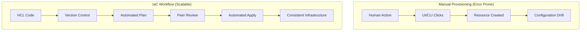

Infrastructure as Code is the management of infrastructure (networks, virtual machines, load balancers, and connection topology) in a descriptive model, using the same versioning as DevOps teams use for source code.

## Core IaC Principles

1.  **Idempotency**: Running the same code multiple times should result in the same state every time.
2.  **Immutability**: Instead of modifying existing infrastructure, tear it down and create new ones.
3.  **Declarative over Procedural**: Express *what* the result should be, not *how* to achieve it.
4.  **Version Control**: Software engineers treat infra code like application code.

## Benefits of IaC

- **Consistency**: Eliminate "it works on my machine" for infrastructure.
- **Speed**: Provision an entire environment in minutes.
- **Lower Cost**: Reduce manual labor and optimize resource usage.
- **Reduced Risk**: Automated testing and peer reviews.

## IaC vs Manual Workflow

---

## 🏗️ Real-Life Scenario: The Snowflake Server
**Problem**: An engineer manually updated a production server's security group to allow a new port. Six months later, the server crashed and was rebuilt via a legacy script. The manual change was lost, causing a service outage.
**Solution**: By moving to IaC, all changes are versioned. If a server needs a new port, it's added to the Terraform code, reviewed, and applied. When the server is rebuilt, it inherits all the correct settings from the code.

---

## ❓ Interview Questions
1.  **Explain the difference between Declarative and Procedural IaC.**
    *   *Answer*: Declarative (Terraform) defines the end state, and the tool calculates the steps. Procedural (Ansible) defines the specific steps to be taken in order.
2.  **What is "Configuration Drift"?**
    *   *Answer*: It's when the actual state of infrastructure deviates from the desired state defined in code, usually due to manual changes.

---
## 🧠 Quiz Snippet (5/20+)
1.  **Which principle ensures a script produces the same result no matter how many times it's run?** (Idempotency)
2.  **True/False: IaC should be kept in version control.** (True)
3.  **What is the "Source of Truth" in a Terraform project?** (The Configuration Files)
4.  **Why is mutability a risk?** (Leads to configuration drift and non-repeatable states)
5.  **Does Terraform support immutability?** (Yes, by replacing resources when changes are incompatible)
