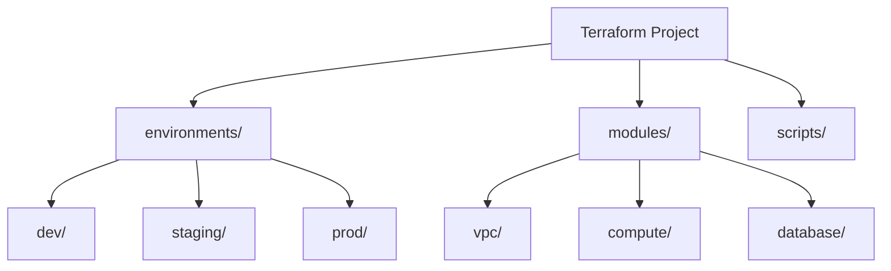

A well-organized Terraform project is crucial for scalability, maintainability, and team collaboration.

## Standard Directory Layout
```text
terraform-project/
├── environments/           # Environment-specific configurations
│   ├── dev/
│   ├── staging/
│   └── prod/
├── modules/                # Reusable resource clusters
│   ├── vpc/
│   ├── compute/
│   └── database/
├── global/                 # Global resources (IAM, S3 State Buckets)
├── shared/                 # Shared logic or local modules
├── scripts/                # Helper scripts (deploy, cleanup)
├── .gitignore
└── README.md
```

## Standard Layout Hierarchy



## 🗂️ File Breakdown & Examples
Here is a breakdown of the standard files you will find in almost every Terraform working directory.

### 1. `main.tf`: Core Resources
This file contains the primary resource definitions. It tells Terraform *what* to create (EC2 instances, S3 buckets, VPCs).
```hcl
# main.tf
resource "aws_instance" "app_server" {
  ami           = "ami-0c55b159cbfafe1f0"
  instance_type = var.instance_type   # Reference a variable

  tags = {
    Name = "MyDevServer"
  }
}

resource "aws_s3_bucket" "data_bucket" {
  bucket = "my-unique-data-bucket-123"
}
```
### 2. `variables.tf`: Input Parameters
This file defines the input variables that make your code reusable. Instead of hardcoding values (like "t2.micro"), you define them here so they can be overridden.
```hcl
# variables.tf
variable "region" {
  description = "AWS Region to deploy to"
  type        = string
  default     = "us-east-1"
}

variable "instance_type" {
  description = "EC2 instance size"
  type        = string
  default     = "t3.micro"
  validation {
    condition     = contains(["t3.micro", "t3.small"], var.instance_type)
    error_message = "Instance type must be t3.micro or t3.small."
  }
}
```
### 3. `outputs.tf`: Return Values
Outputs are like return values of a function. They expose information about the resources you created (IP addresses, specific IDs) to the CLI or to other modules.
```hcl
# outputs.tf
output "server_public_ip" {
  description = "Public IP of the web server"
  value       = aws_instance.app_server.public_ip
}

output "bucket_name" {
  description = "Name of the created S3 bucket"
  value       = aws_s3_bucket.data_bucket.id
}
```
### 4. `providers.tf`: Provider Configuration
This file configures the providers (plugins) that Terraform uses to interact with APIs (AWS, Azure, Google). It is where you specify the region and credentials (conceptually, though credentials should come from env vars).
```hcl
# providers.tf
provider "aws" {
  region  = var.region
  profile = "my-dev-profile" # Optional: Local AWS CLI profile
  
  default_tags {
    tags = {
      ManagedBy = "Terraform"
      Project   = "Demo"
    }
  }
}
```
### 5. `versions.tf`: Version Locking
This file ensures consistency. It locks the version of Terraform itself and the providers to avoid breaking changes when you run `terraform init`.
```hcl
# versions.tf
terraform {
  required_version = ">= 1.0.0"

  required_providers {
    aws = {
      source  = "hashicorp/aws"
      version = "~> 5.0"
    }
  }
}
```

---

## 🏗️ Real-Life Scenarios

### Scenario 1: The Monolithic Horror
**Problem**: An organization keeps all their infrastructure (Networking, DB, Compute) in a single `main.tf` file. Every time they change a firewall rule, Terraform refreshes 500+ resources, making it slow and risky.
**Solution**: Break the project into **Modules** and **Environments**. Use separate state files for Networking and Application layers. This limits the "Blast Radius"—if a mistake is made in the App layer, the Network layer remains untouched.

### Scenario 2: The Parallel Team Conflict
**Problem**: Two teams are working on the same project using a single directory. Team A updates the staging environment, but Team B's pending changes for production are accidentally included because they are in the same folder.
**Solution**: Use a **Directory-per-Environment** structure. This provides complete isolation, separate lock files, and independent state management, preventing cross-environment contamination.

### Scenario 3: The Untraceable Secret
**Problem**: A junior developer accidentally committed a `terraform.tfvars` file containing a database root password to the public Git repository.
**Solution**: Standardize the use of `.gitignore` to exclude `*.tfstate`, `*.tfvars`, and `.terraform/`. Move sensitive data to an external Secret Manager (like AWS Secrets Manager) and reference it via a data source.

---

## ❓ Interview Questions

1.  **What is the benefit of a multi-directory structure over workspaces for environment separation?**
    - *Answer*: Separate directories provide complete isolation, including different backends and providers. Workspaces share the same backend, which can be risky if a workspace name is mistyped (e.g., applying dev changes to prod state).
2.  **Where should you store reusable code modules?**
    - *Answer*: Reusable code should be stored in a dedicated `modules/` directory or a separate Git repository, allowing multiple environments or projects to consume the same logic.
3.  **Why is `versions.tf` important in a team environment?**
    - *Answer*: It pins the version of Terraform and the providers. This prevents "It works on my machine" issues where one team member uses a newer provider version with breaking changes.
4.  **What is the purpose of `outputs.tf`?**
    - *Answer*: It exposes specific resource attributes (like a Load Balancer DNS name or an IP) so they can be easily retrieved by the user or used as inputs for other modules.
5.  **Should you commit the `.terraform/` directory to Git?**
    - *Answer*: No. This directory contains downloaded provider binaries and modules, which are platform-specific and can be very large. It should always be listed in `.gitignore`.
6.  **Explain the "Standard Layout" of a Terraform file (main, variables, outputs).**
    - *Answer*: It's a convention where `main.tf` holds resources, `variables.tf` defines inputs, and `outputs.tf` defines return values. Terraform loads all `.tf` files in a directory, so this separation is purely for human readability.

---

## 🧠 Comprehensive Quiz (25 Questions)

**1. Which directory usually contains environment-specific values in a standard layout?**
- A) modules/
- B) scripts/
- C) environments/
- D) global/

<details>
<summary>Show Answer</summary>

**Answer: C** - The environments folder typicaly contains subfolders like dev, staging, and prod.

</details>

**2. True/False: Terraform loads all files ending in `.tf` within a directory.**
- A) True
- B) False

<details>
<summary>Show Answer</summary>

**Answer: A** - Terraform concatenates all .tf files in the current working directory.

</details>

**3. What is the main purpose of the `.gitignore` file in a Terraform project?**
- A) To speed up terraform plan
- B) To prevent state files and secrets from being committed to Git
- C) To hide code from other teams
- D) To ignore specific providers

<details>
<summary>Show Answer</summary>

**Answer: B** - State files often contain plain-text secrets and should never be in Git.

</details>

**4. How do you reference a module from a specific environment folder?**
- A) Using the `import` keyword
- B) Using the `source` attribute within a `module` block
- C) By copying the file into the environment folder
- D) Using global variables

<details>
<summary>Show Answer</summary>

**Answer: B** - The source attribute tells Terraform where the module code is located.

</details>

**5. Which file is responsible for locking provider and Terraform versions?**
- A) main.tf
- B) variables.tf
- C) versions.tf
- D) terraform.tfstate

<details>
<summary>Show Answer</summary>

**Answer: C** - The versions.tf file (or terraform block in main.tf) pins versions.

</details>

**6. What is the benefit of the "Standard File Breakdown" (main, vars, outputs)?**
- A) It's required by the Terraform compiler
- B) It improves human readability and organization
- C) It makes Terraform run 50% faster
- D) It reduces cloud cost

<details>
<summary>Show Answer</summary>

**Answer: B**

</details>

**7. Where are return values like IP addresses typically defined?**
- A) main.tf
- B) variables.tf
- C) outputs.tf
- D) providers.tf

<details>
<summary>Show Answer</summary>

**Answer: C**

</details>

**8. What does "Blast Radius" refer to in project structure?**
- A) The physical size of a data center
- B) The potential damage caused by an accidental resource deletion
- C) The range of a Load Balancer
- D) The number of lines in a file

<details>
<summary>Show Answer</summary>

**Answer: B** - Modularity helps reduce the blast radius.

</details>

**9. Why should global resources (like IAM) be in a separate directory?**
- A) Because they are expensive
- B) Because they are shared across all environments
- C) Because they don't use HCL
- D) Because they are deleted often

<details>
<summary>Show Answer</summary>

**Answer: B**

</details>

**10. What is the purpose of the `terraform.tfvars` file?**
- A) To define variable types
- B) To provide actual values for variables (e.g., environment-specific settings)
- C) To store the provider configuration
- D) To list output values

<details>
<summary>Show Answer</summary>

**Answer: B**

</details>

**11. Which block is used to configure a plugin like 'aws' or 'google'?**
- A) resource
- B) data
- C) provider
- D) module

<details>
<summary>Show Answer</summary>

**Answer: C**

</details>

**12. When using a directory-per-environment structure, each environment has its own:**
- A) Terraform binary
- B) Cloud account
- C) State file
- D) Programming language

<details>
<summary>Show Answer</summary>

**Answer: C** - Isolation is achieved through independent state files.

</details>

**13. The `modules/` directory should contain:**
- A) Reusable, generic infrastructure clusters
- B) Your production state file
- C) Private SSH keys
- D) Only README files

<details>
<summary>Show Answer</summary>

**Answer: A**

</details>

**14. What happens if you skip `versions.tf` in a multi-developer project?**
- A) Terraform won't run
- B) Developers might use inconsistent provider versions, causing state corruption
- C) Cloud provider will block your IP
- D) Costs will double

<details>
<summary>Show Answer</summary>

**Answer: B**

</details>

**15. Which file is generated after running `terraform init` to lock provider hashes?**
- A) main.tf
- B) .terraform.lock.hcl
- C) terraform.tfstate
- D) vars.tf

<details>
<summary>Show Answer</summary>

**Answer: B**

</details>

**16. Variables with `default` values in `variables.tf` can be overridden by:**
- A) Environment variables
- B) terraform.tfvars files
- C) -var flags in CLI
- D) All of the above

<details>
<summary>Show Answer</summary>

**Answer: D**

</details>

**17. Putting all resources in a single `main.tf` is called:**
- A) Microservices
- B) Monolithic structure
- C) Serverless
- D) High availability

<details>
<summary>Show Answer</summary>

**Answer: B**

</details>

**18. What is the main risk of a Monolithic structure?**
- A) Difficult to code
- B) Large blast radius and slow execution
- C) High memory usage
- D) Lack of support

<details>
<summary>Show Answer</summary>

**Answer: B**

</details>

**19. Why use `default_tags` in `providers.tf`?**
- A) To save money
- B) To ensure every resource created by the provider has consistent tags
- C) To hide resources
- D) To speed up provisioning

<details>
<summary>Show Answer</summary>

**Answer: B**

</details>

**20. Which directory contains binary plugins for a specific project?**
- A) .terraform/
- B) environments/
- C) global/
- D) scripts/

<details>
<summary>Show Answer</summary>

**Answer: A** - This directory is managed by terraform init.

</details>

**21. "Code Reuse" is primarily achieved through:**
- A) Copying and pasting
- B) Terraform Modules
- C) Using only one file
- D) Manual UI actions

<details>
<summary>Show Answer</summary>

**Answer: B**

</details>

**22. Which file describes *what* is actually in your cloud right now?**
- A) main.tf
- B) terraform.tfstate
- C) variables.tf
- D) .gitignore

<details>
<summary>Show Answer</summary>

**Answer: B**

</details>

**23. A standard `.gitignore` for Terraform should definitely include:**
- A) main.tf
- B) terraform.tfstate
- C) variables.tf
- D) outputs.tf

<details>
<summary>Show Answer</summary>

**Answer: B**

</details>

**24. The `source` attribute in a module block can point to:**
- A) A local file path
- B) A GitHub URL
- C) The Terraform Registry
- D) All of the above

<details>
<summary>Show Answer</summary>

**Answer: D**

</details>

**25. Splitting Networking into a separate folder from Applications is an example of:**
- A) Micro-management
- B) Decoupling infrastructure layers
- C) Increasing complexity for no reason
- D) Cloud migration

<details>
<summary>Show Answer</summary>

**Answer: B**

</details>
