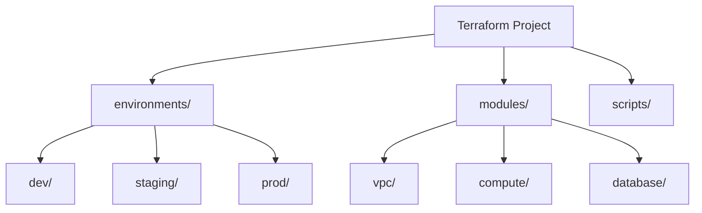

A well-organized Terraform project is crucial for scalability, maintainability, and team collaboration.

## Standard Directory Layout
```text
terraform-project/
├── environments/           # Environment-specific configurations
│   ├── dev/
│   ├── staging/
│   └── prod/
├── modules/                # Reusable resource clusters
│   ├── vpc/
│   ├── compute/
│   └── database/
├── global/                 # Global resources (IAM, S3 State Buckets)
├── shared/                 # Shared logic or local modules
├── scripts/                # Helper scripts (deploy, cleanup)
├── .gitignore
└── README.md
```

## Standard Layout Hierarchy



## 🗂️ File Breakdown & Examples
Here is a breakdown of the standard files you will find in almost every Terraform working directory.

### 1. `main.tf`: Core Resources
This file contains the primary resource definitions. It tells Terraform *what* to create (EC2 instances, S3 buckets, VPCs).
```hcl
# main.tf
resource "aws_instance" "app_server" {
  ami           = "ami-0c55b159cbfafe1f0"
  instance_type = var.instance_type   # Reference a variable

  tags = {
    Name = "MyDevServer"
  }
}

resource "aws_s3_bucket" "data_bucket" {
  bucket = "my-unique-data-bucket-123"
}
```
### 2. `variables.tf`: Input Parameters
This file defines the input variables that make your code reusable. Instead of hardcoding values (like "t2.micro"), you define them here so they can be overridden.
```hcl
# variables.tf
variable "region" {
  description = "AWS Region to deploy to"
  type        = string
  default     = "us-east-1"
}

variable "instance_type" {
  description = "EC2 instance size"
  type        = string
  default     = "t3.micro"
  validation {
    condition     = contains(["t3.micro", "t3.small"], var.instance_type)
    error_message = "Instance type must be t3.micro or t3.small."
  }
}
```
### 3. `outputs.tf`: Return Values
Outputs are like return values of a function. They expose information about the resources you created (IP addresses, specific IDs) to the CLI or to other modules.
```hcl
# outputs.tf
output "server_public_ip" {
  description = "Public IP of the web server"
  value       = aws_instance.app_server.public_ip
}

output "bucket_name" {
  description = "Name of the created S3 bucket"
  value       = aws_s3_bucket.data_bucket.id
}
```
### 4. `providers.tf`: Provider Configuration
This file configures the providers (plugins) that Terraform uses to interact with APIs (AWS, Azure, Google). It is where you specify the region and credentials (conceptually, though credentials should come from env vars).
```hcl
# providers.tf
provider "aws" {
  region  = var.region
  profile = "my-dev-profile" # Optional: Local AWS CLI profile
  
  default_tags {
    tags = {
      ManagedBy = "Terraform"
      Project   = "Demo"
    }
  }
}
```
### 5. `versions.tf`: Version Locking
This file ensures consistency. It locks the version of Terraform itself and the providers to avoid breaking changes when you run `terraform init`.
```hcl
# versions.tf
terraform {
  required_version = ">= 1.0.0"

  required_providers {
    aws = {
      source  = "hashicorp/aws"
      version = "~> 5.0"
    }
  }
}
```

---

## 🏗️ Real-Life Scenario: The Monolithic Horror
**Problem**: An organization keeps all their infrastructure (Networking, DB, Compute) in a single `main.tf` file. Every time they change a firewall rule, Terraform refreshes 500+ resources, making it slow and risky.
**Solution**: Break the project into **Modules** and **Environments**. Use separate state files for Networking and Application layers. This limits the "Blast Radius"—if a mistake is made in the App layer, the Network layer remains untouched.

---
## ❓ Interview Questions
1.  **What is the benefit of a multi-directory structure over workspaces?**
    *   *Answer*: Separate directories provide complete isolation, including different backends and providers. Workspaces share the same backend, which can be risky for production/dev separation.
2.  **Where should you store reusable code?**
    *   *Answer*: In the `modules/` directory, which can be referenced by multiple environments.

---
## 🧠 Quiz Snippet (5/20+)
1.  **Which directory usually contains environment-specific values?** (`environments/`)
2.  **True/False: All .tf files in a directory are loaded by Terraform.** (True)
3.  **What is the purpose of a `.gitignore` in Terraform?** (To prevent state and secrets from being committed)
4.  **How do you reference a module from an environment?** (Using the `source` attribute)
5.  **Which file is responsible for locking versions?** (`versions.tf`)
