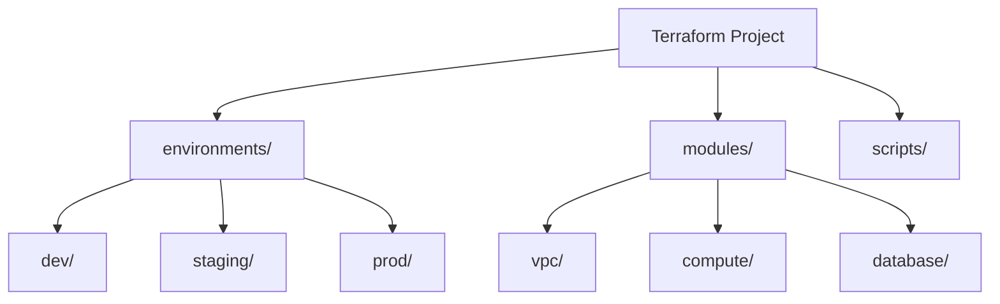

# Project Structure

A well-organized Terraform project is crucial for scalability, maintainability, and team collaboration.

## Standard Directory Layout

```text
terraform-project/
├── environments/           # Environment-specific configurations
│   ├── dev/
│   ├── staging/
│   └── prod/
├── modules/                # Reusable resource clusters
│   ├── vpc/
│   ├── compute/
│   └── database/
├── global/                 # Global resources (IAM, S3 State Buckets)
├── shared/                 # Shared logic or local modules
├── scripts/                # Helper scripts (deploy, cleanup)
├── .gitignore
└── README.md
```

## Mermaid Diagram: Standard Layout Hierarchy



## Key Files in Each Module/Environment
- **main.tf**: Core resource definitions.
- **variables.tf**: Input parameter declarations.
- **outputs.tf**: Information to be returned.
- **providers.tf**: API connection settings.
- **versions.tf**: Locking of provider and Terraform versions.

---

## 🏗️ Real-Life Scenario: The Monolithic Horror
**Problem**: An organization keeps all their infrastructure (Networking, DB, Compute) in a single `main.tf` file. Every time they change a firewall rule, Terraform refreshes 500+ resources, making it slow and risky.
**Solution**: Break the project into **Modules** and **Environments**. Use separate state files for Networking and Application layers. This limits the "Blast Radius"—if a mistake is made in the App layer, the Network layer remains untouched.

---

## ❓ Interview Questions
1.  **What is the benefit of a multi-directory structure over workspaces?**
    *   *Answer*: Separate directories provide complete isolation, including different backends and providers. Workspaces share the same backend, which can be risky for production/dev separation.
2.  **Where should you store reusable code?**
    *   *Answer*: In the `modules/` directory, which can be referenced by multiple environments.

---

## 🧠 Quiz Snippet (5/20+)
1.  **Which directory usually contains environment-specific values?** (`environments/`)
2.  **True/False: All .tf files in a directory are loaded by Terraform.** (True)
3.  **What is the purpose of a `.gitignore` in Terraform?** (To prevent state and secrets from being committed)
4.  **How do you reference a module from an environment?** (Using the `source` attribute)
5.  **Which file is responsible for locking versions?** (`versions.tf`)
