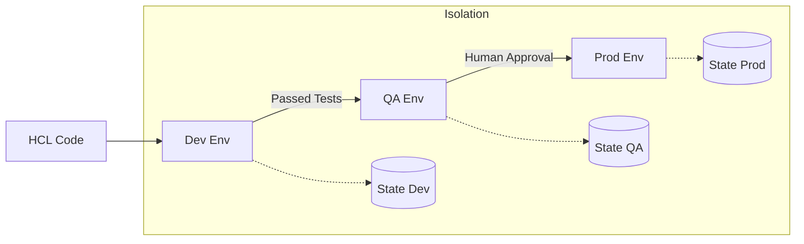

Managing multiple stages of deployment (Dev, QA, Prod) is a fundamental DevOps requirement.

## Environment Separation Strategies

### 1. Separate Directories (Recommended for Teams)
Each environment has its own folder and its own state file.
- **Pros**: Maximum isolation, easy permissions management via IAM.
- **Cons**: Duplication of some code (mitigated by modules).
### 2. Terraform Workspaces
Allows multiple states for the same configuration.
- **Pros**: Fast to switch, good for testing feature branches.
- **Cons**: High risk of accidental production changes; not recommended for permanent production environments.
### 3. Variable-Driven (Wrapper Scripts)
Using the same code but passing different `.tfvars` files.
## Multi-Environment Propagation

---
## 🏗️ Real-Life Scenarios

### Scenario 1: The Accidental Prod Destroy
**Problem**: An intern was working in a workspace-based setup. They thought they were in `dev` but were actually in `prod`. They ran `terraform destroy` to clear their test data.
**Solution**: Use **Separate Directories** for Production with a dedicated IAM role that requires MFA. This makes the switch from Dev to Prod an explicit, physical directory change.

### Scenario 2: The Parallel Project Isolation
**Problem**: A financial corporation needed to ensure that no developer could even *read* the production state file, while developers need full access to the development state.
**Solution**: Use separate **S3 buckets per environment** (e.g., `company-tfstate-dev` and `company-tfstate-prod`) with different IAM policies. This ensures that even if a developer switches to the production directory, they lack the credentials to access the backend.

### Scenario 3: The Feature Branch Sandbox
**Problem**: A team wanted to test a new "high-performance" configuration for their database before merging it. They didn't want to affect the shared `dev` environment used by other teams.
**Solution**: Use **Terraform Workspaces** for temporary feature testing. The developer creates a workspace named `db-perf-test`, deploys the sandbox, performs tests, and destroys the workspace when finished, all without touching the main `dev` state.

---

## ❓ Interview Questions

1.  **When should you prefer separate directories over Terraform workspaces?**
    - *Answer*: Separate directories are preferred for permanent, mission-critical environments (like Prod vs. Dev) where you want strict access control, different provider accounts, and different backend configurations.
2.  **What are the risks of using the default workspace?**
    - *Answer*: The `default` workspace cannot be deleted. If you use it for production, there's no easy way to isolate it from experimental changes. It's usually best to keep `default` empty and create named workspaces.
3.  **How do you handle environment-specific variables when using the same code?**
    - *Answer*: Use `.tfvars` files (e.g., `dev.tfvars`, `prod.tfvars`) and pass them during the plan phase: `terraform plan -var-file=prod.tfvars`.
4.  **Explain the concept of "Promotion" in the environment lifecycle.**
    - *Answer*: Promotion is the process of moving code changes from a Lower environment (Dev) to a Higher environment (Staging/Prod) after passing automated tests and manual approvals.
5.  **Should different environments share the same cloud account?**
    - *Answer*: Ideally, no. "Blast Radius" is best minimized by using separate AWS accounts (or Azure Subscriptions) for Dev and Prod, managed via a multi-account organization strategy.
6.  **How does Terraform keep state files separate for different workspaces?**
    - *Answer*: Terraform creates a `terraform.tfstate.d` directory locally (or uses different keys in a remote backend like S3) to store the independent state files for each workspace.

---

## 🧠 Comprehensive Quiz (25 Questions)

**1. Which command is used to create a new workspace?**
- A) terraform workspace select
- B) terraform workspace new
- C) terraform new
- D) terraform init -new

Show Answer

**Answer: B** - `terraform workspace new <name>` creates and switches to a new workspace.

**2. What is the name of the initial workspace created by Terraform?**
- A) master
- B) main
- C) default
- D) root

Show Answer

**Answer: C**

**3. True/False: Workspaces share the same backend, but have separate state keys.**
- A) True
- B) False

Show Answer

**Answer: A** - They use different paths within the same backend (e.g., S3 folder).

**4. Why are separate directories considered more secure for Production?**
- A) They are faster
- B) They allow for separate IAM policies and provider configurations
- C) They use less disk space
- D) They don't require terraform init

Show Answer

**Answer: B**

**5. What is the main benefit of "Environment Isolation"?**
- A) Lower cloud costs
- B) Reduced "Blast Radius" (an error in dev doesn't affect prod)
- C) Easier coding
- D) Automatic backups

Show Answer

**Answer: B**

**6. Which flag is used to pass a specific variable file to `terraform plan`?**
- A) -file
- B) -vars
- C) -var-file
- D) -input

Show Answer

**Answer: C**

**7. Where does Terraform store local state files for workspaces?**
- A) .terraform/
- B) terraform.tfstate.d/
- C) environments/
- D) bin/

Show Answer

**Answer: B**

**8. Which environment should typically have the strictest access controls?**
- A) Development
- B) SandBox
- C) Production
- D) QA

Show Answer

**Answer: C**

**9. What is the best way to reuse code across multiple environments?**
- A) Copy and paste
- B) Terraform Modules
- C) Using the same .tfstate file
- D) Manual edits

Show Answer

**Answer: B**

**10. "Environment drift" occurs when:**
- A) Developers change code
- B) Different environments (Dev/Prod) become inconsistently configured by hand
- C) Terraform is updated
- D) Cloud providers change their UI

Show Answer

**Answer: B**

**11. Which workspace command lists all existing workspaces?**
- A) terraform workspace list
- B) terraform workspace show
- C) terraform list
- D) terraform show workspaces

Show Answer

**Answer: A**

**12. When using separate directories, how do you handle common code?**
- A) You don't, you just repeat it
- B) Reference a shared module via the `source` attribute
- C) Use Git submodules only
- D) Use a wrapper script

Show Answer

**Answer: B**

**13. Which command shows the name of the *current* workspace?**
- A) terraform workspace current
- B) terraform workspace show
- C) terraform whoami
- D) terraform state show

Show Answer

**Answer: B**

**14. What is a "Promotion" in DevOps?**
- A) A salary increase
- B) Advancing code from Dev towards Production
- C) Deleting older backups
- D) Switching cloud providers

Show Answer

**Answer: B**

**15. Terraform Workspaces are best suited for:**
- A) Strict production isolation
- B) Temporary feature branch environments
- C) Multi-cloud management
- D) Storing secrets

Show Answer

**Answer: B**

**16. How can you ensure Prod and Dev have different instance sizes while using the same code?**
- A) Manually edit the code before each apply
- B) Use input variables and different .tfvars files
- C) Use different Terraform versions
- D) Hardcode the values

Show Answer

**Answer: B**

**17. What is the risk of sharing one AWS account for both Dev and Prod?**
- A) Complexity
- B) Resource limit exhaustion and lack of security isolation
- C) Higher costs
- D) Slow deployments

Show Answer

**Answer: B**

**18. Which lifecycle stage includes "Plan" in the multi-environment propagation diagram?**
- A) Only in Prod
- B) Only in Dev
- C) In every environment before Apply
- D) Never

Show Answer

**Answer: C**

**19. To delete a workspace, which command do you use?**
- A) terraform workspace delete
- B) terraform workspace rm
- C) terraform delete
- D) terraform rm

Show Answer

**Answer: A**

**20. Can you delete the 'default' workspace?**
- A) Yes
- B) No
- C) Only if it's empty
- D) Only in newer versions

Show Answer

**Answer: B**

**21. "Blue-Green Deployment" is easier with IaC because:**
- A) It uses fewer VPCs
- B) You can provision a duplicate environment (Green) exactly like the old (Blue)
- C) It's cheaper
- D) It's faster to type

Show Answer

**Answer: B**

**22. Which file in the root directory typically contains backend configuration?**
- A) main.tf (within the terraform {} block)
- B) variables.tf
- C) outputs.tf
- D) README.md

Show Answer

**Answer: A**

**23. Why use a "Staging" environment?**
- A) It's a place for developers to play
- B) To mirror Production as closely as possible for final testing
- C) To save money
- D) To host documentation

Show Answer

**Answer: B**

**24. The `terraform_remote_state` data source is used to:**
- A) Create new state
- B) Read output values from another environment's state file
- C) Delete remote state
- D) Encrypt state

Show Answer

**Answer: B**

**25. A "Sandbox" environment is designed for:**
- A) Customer traffic
- B) Safe experimentation without risk to shared dev/prod systems
- C) Long-term storage
- D) Only database backups

Show Answer

**Answer: B**

