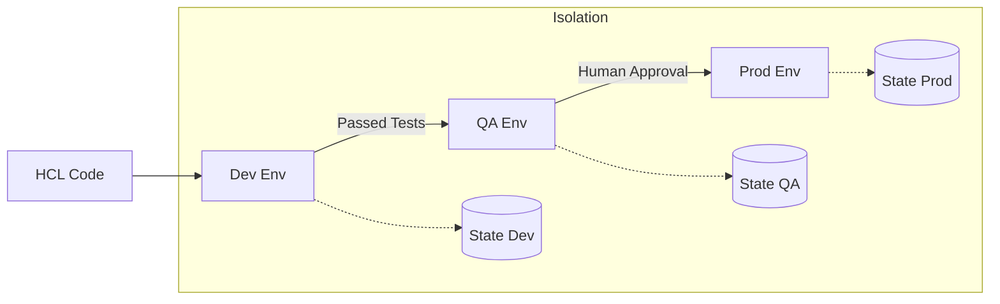

Managing multiple stages of deployment (Dev, QA, Prod) is a fundamental DevOps requirement.

## Environment Separation Strategies

### 1. Separate Directories (Recommended for Teams)
Each environment has its own folder and its own state file.
- **Pros**: Maximum isolation, easy permissions management via IAM.
- **Cons**: Duplication of some code (mitigated by modules).
### 2. Terraform Workspaces
Allows multiple states for the same configuration.
- **Pros**: Fast to switch, good for testing feature branches.
- **Cons**: High risk of accidental production changes; not recommended for permanent production environments.
### 3. Variable-Driven (Wrapper Scripts)
Using the same code but passing different `.tfvars` files.
## Multi-Environment Propagation

---
## 🏗️ Real-Life Scenario: The Accidental Prod Destroy
**Problem**: An intern was working in a workspace-based setup. They thought they were in `dev` but were actually in `prod`. They ran `terraform destroy` to clear their test data.
**Solution**: Use **Separate Directories** for Production with a dedicated IAM role that requires MFA. This makes the switch from Dev to Prod an explicit, physical directory change.

---
## ❓ Interview Questions
1.  **When would you use Terraform Workspaces?**
    *   *Answer*: When testing a common module on different temporary sets of inputs, or for environment-as-a-service feature branches.
2.  **How do you promote a change from Dev to Prod?**
    *   *Answer*: Review the change in Dev, merge the code to a staging branch, run a plan in Prod, and then apply after manual approval.

---
## 🧠 Quiz Snippet (5/20+)
1.  **Which command switches between workspaces?** (`terraform workspace select`)
2.  **What is the default workspace name?** (`default`)
3.  **True/False: Workspaces share the same .tfstate file.** (No, they share the same backend, but have separate state keys)
4.  **Should 'Prod' and 'Dev' share the same S3 bucket for state?** (Ideally no, for security isolation)
5.  **What is the main benefit of environment isolation?** (Reduced blast radius)
