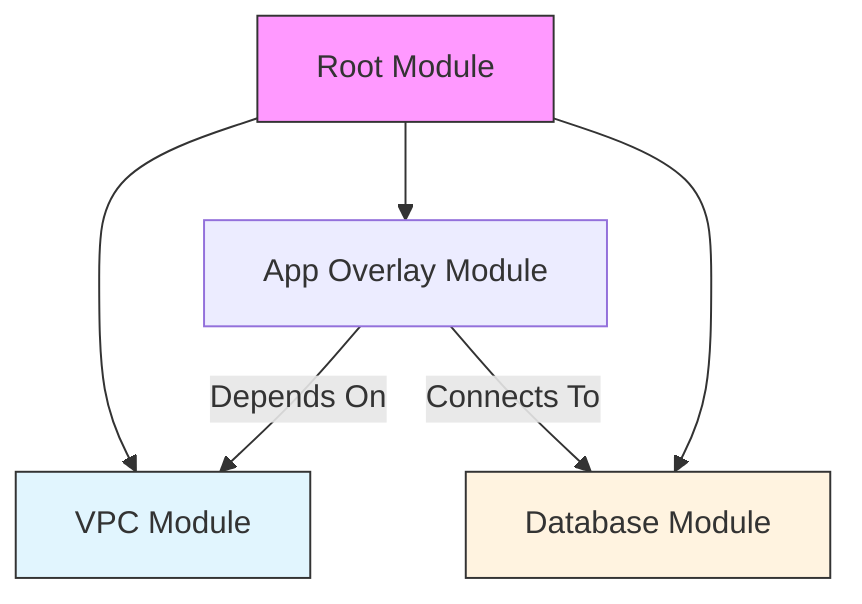
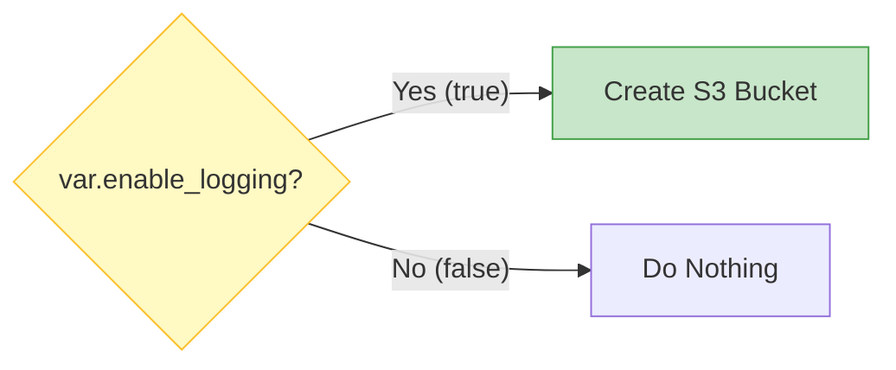
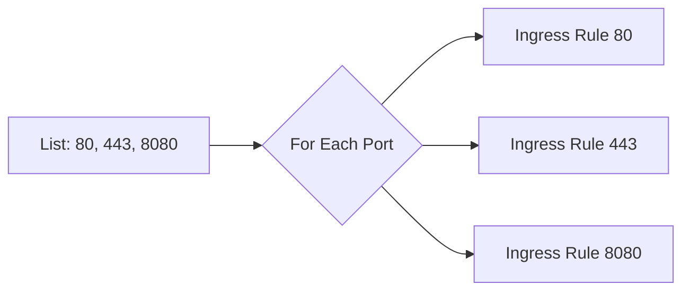

Efficiently managing complex infrastructure requires advanced HCL patterns level.

## Key Patterns

### 1. The DRY (Don't Repeat Yourself) Pattern
Duplication is the enemy of maintainability. In Terraform, we use **Locals** and **Modules** to keep code clean.

**Locals** allow you to simplify complex expressions or repeated values into a single readable name.
```hcl
locals {
  common_tags = {
    Project   = var.project_name
    Owner     = "DevOps Team"
    ManagedBy = "Terraform"
  }
  name_prefix = "${var.project}-${var.environment}"
}

resource "aws_s3_bucket" "app" {
  bucket = "${local.name_prefix}-app-data"
  tags   = local.common_tags
}
```
### 2. Composition (Modules)
Composition is about building smaller, focused building blocks (Modules) and assembling them into a larger system. This is preferred over "Inheritance" or massive monolithic files.



### 3. Feature Flags (Conditionals)
You often need to turn resources on or off based on the environment (e.g., enable debugging tools in Dev but not Prod). We use the `count` meta-argument for this.

**Pattern**: `count = condition ? 1 : 0`



```hcl
resource "aws_s3_bucket" "logs" {
  count  = var.enable_logging ? 1 : 0
  bucket = "my-app-logs"
}
```
### 4. The Loop Pattern (`for_each`)
To handle multiple similar resources (like users, subnets, or rules), use `for_each`. It is safer than `count` for lists because it uses keys instead of array indices.

**Dynamic Blocks** are a special form of looping used *inside* a resource block to generate nested sections.



```hcl
resource "aws_security_group" "web" {
  name = "web-sg"
  
  dynamic "ingress" {
    for_each = var.service_ports # list(number)
    content {
      from_port = ingress.value
      to_port   = ingress.value
      protocol  = "tcp"
      cidr_blocks = ["0.0.0.0/0"]
    }
  }
}
```

---
## 🏗️ Real-Life Scenario: The Port Explosion
**Problem**: A developer needs to open 50 different ports for a legacy application. Manually writing 50 `ingress` blocks makes the code 500 lines long and unreadable.
**Solution**: Use a **Dynamic Block**. Define the ports in a list variable and use a few lines of code to loop through them. This keeps the code clean and maintainable.

---
## ❓ Interview Questions
1.  **What is a Dynamic Block?**
    *   *Answer*: It allows you to produce nested configuration blocks (like `ingress` or `subnet`) dynamically based on a collection.
2.  **How do you handle conditional creation of resources?**
    *   *Answer*: By using a combination of a boolean variable and the `count` meta-argument (`count = var.enabled ? 1 : 0`).

---
## 🧠 Quiz Snippet (5/20+)
1.  **Which keyword allows looping over a list in a resource?** (`for_each` or `count`)
2.  **What is the result of `count = 0`?** (No resource is created)
3.  **True/False: You can use `count` and `for_each` in the same block.** (False)
4.  **What does `lookup(map, key, default)` do?** (Safely retrieves a value or returns a default)
5.  **Which block is used for reusable internal expressions?** (`locals`)
