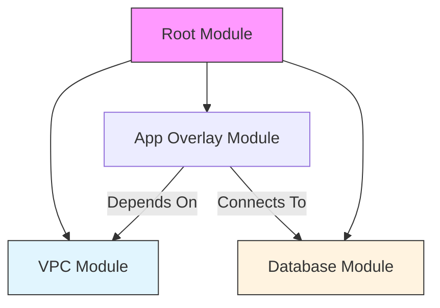
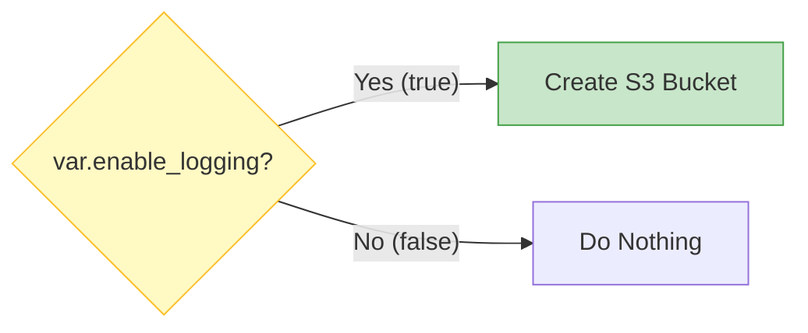
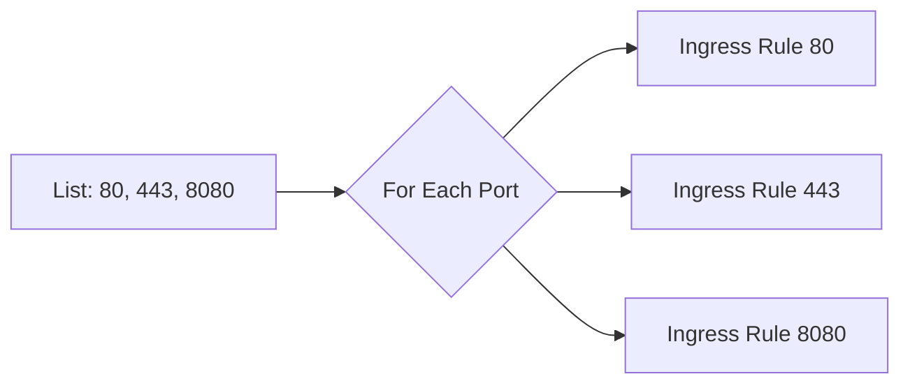

Efficiently managing complex infrastructure requires advanced HCL patterns level.

## Key Patterns

### 1. The DRY (Don't Repeat Yourself) Pattern
Duplication is the enemy of maintainability. In Terraform, we use **Locals** and **Modules** to keep code clean.

**Locals** allow you to simplify complex expressions or repeated values into a single readable name.
```hcl
locals {
  common_tags = {
    Project   = var.project_name
    Owner     = "DevOps Team"
    ManagedBy = "Terraform"
  }
  name_prefix = "${var.project}-${var.environment}"
}

resource "aws_s3_bucket" "app" {
  bucket = "${local.name_prefix}-app-data"
  tags   = local.common_tags
}
```
### 2. Composition (<font color="#ff0000">Modules</font>)
Composition is about building smaller, focused building blocks (Modules) and assembling them into a larger system. This is preferred over "Inheritance" or massive monolithic files.



### 3. Feature Flags (<font color="#ff0000">Conditionals</font>)
You often need to turn resources on or off based on the environment (e.g., enable debugging tools in Dev but not Prod). We use the `count` meta-argument for this.

**Pattern**: `count = condition ? 1 : 0`



```hcl
resource "aws_s3_bucket" "logs" {
  count  = var.enable_logging ? 1 : 0
  bucket = "my-app-logs"
}
```
### 4. The Loop Pattern (`for_each`)
To handle multiple similar resources (like users, subnets, or rules), use `for_each`. It is safer than `count` for lists because it uses keys instead of array indices.

**Dynamic Blocks** are a special form of looping used *inside* a resource block to generate nested sections.



```hcl
resource "aws_security_group" "web" {
  name = "web-sg"
  
  dynamic "ingress" {
    for_each = var.service_ports # list(number)
    content {
      from_port = ingress.value
      to_port   = ingress.value
      protocol  = "tcp"
      cidr_blocks = ["0.0.0.0/0"]
    }
  }
}
```

---
## 🏗️ Real-Life Scenarios

### Scenario 1: The Port Explosion
**Problem**: A developer needs to open 50 different ports for a legacy application. Manually writing 50 `ingress` blocks makes the code 500 lines long and unreadable.
**Solution**: Use a **Dynamic Block**. Define the ports in a list variable and use a few lines of code to loop through them. This keeps the code clean and maintainable.

### Scenario 2: The Multi-Region Resource Toggle
**Problem**: An application requires a Redis cache in the Primary region but only needs a small local SQLite database for the Secondary "failover" region to save costs.
**Solution**: Use a **Feature Flag** pattern. Use a boolean variable `enable_redis` and set `count = var.enable_redis ? 1 : 0`. This allows the same code to provision Redis in Prod and skip it in DR (Disaster Recovery) testing.

### Scenario 3: Consistent Tagging with Locals
**Problem**: A company was billed $50,000 for "unlabeled" resources because developers kept forgetting to add the "BillingID" tag to their S3 buckets and EC2 instances.
**Solution**: Use a **Locals DRY Pattern**. Define a `common_tags` local block that merges mandatory organization tags with project-specific tags. Reference `local.common_tags` in every resource, ensuring 100% compliance with zero code duplication.

---

## ❓ Interview Questions

1.  **What is a Dynamic Block in Terraform?**
    - *Answer*: A dynamic block allows you to produce multiple nested configuration blocks (like `ingress` in a security group or `setting` in an App Service) by iterating over a list or map.
2.  **How do you handle conditional creation of resources?**
    - *Answer*: By using the ternary operator with the `count` meta-argument: `count = var.create_resource ? 1 : 0`.
3.  **What is the difference between `count` and `for_each`?**
    - *Answer*: `count` uses numeric indices (0, 1, 2), which can cause massive resource destruction if an item is removed from the middle of a list. `for_each` uses map keys or set values, making it much safer for managing collections of resources.
4.  **When should you use `locals` instead of `variables`?**
    - *Answer*: Use `variables` for inputs that the *user* needs to provide. Use `locals` for internal logic, calculations, or constants that you don't want the user to change (e.g., combining two variables to create a naming prefix).
5.  **Explain the "DRY" principle in HCL.**
    - *Answer*: "Don't Repeat Yourself" means avoiding hardcoded values. Instead, use variables, locals, and modules to define logic once and reuse it across the project.
6.  **Can you use `for_each` on a list?**
    - *Answer*: Only if you convert the list to a `set` using the `toset()` function. `for_each` requires distinct keys to track resources accurately in the state file.

---

## 🧠 Comprehensive Quiz (25 Questions)

**1. Which keyword is typically used for "Feature Flags" to enable/disable resources?**
- A) loop
- B) count
- C) toggle
- D) switch

<details>
<summary>Show Answer</summary>

**Answer: B** - `count = var.enabled ? 1 : 0` is the standard pattern.

</details>

**2. What is the main risk of using `count` for a list of resources?**
- A) It's slow
- B) Removing an item from the middle causes shifts and resource replacement
- C) It doesn't support AWS
- D) It's deprecated

<details>
<summary>Show Answer</summary>

**Answer: B** - Because it relies on numeric indices, removing item 1 makes item 2 become item 1, triggering a replacement.

</details>

**3. True/False: You can use `count` and `for_each` in the same resource block.**
- A) True
- B) False

<details>
<summary>Show Answer</summary>

**Answer: B** - They are mutually exclusive.

</details>

**4. Which block is used to iterate and generate nested sections inside a resource?**
- A) loop
- B) dynamic
- C) generate
- D) nested

<details>
<summary>Show Answer</summary>

**Answer: B**

</details>

**5. What does the `toset()` function do in the context of `for_each`?**
- A) Deletes the list
- B) Converts a list of strings into a set of unique strings for iteration
- C) Sorts the list alphabetically
- D) Encrypts the data

<details>
<summary>Show Answer</summary>

**Answer: B**

</details>

**6. The "DRY" principle stands for:**
- A) Do Repeat Yourself
- B) Don't Repeat Yourself
- C) Deploy Resources Yearly
- D) Data Resources Yield

<details>
<summary>Show Answer</summary>

**Answer: B**

</details>

**7. Which block is best for combining multiple variables into a single reusable string?**
- A) variables
- B) outputs
- C) locals
- D) resources

<details>
<summary>Show Answer</summary>

**Answer: C**

</details>

**8. What does `lookup(var.my_map, "key", "default")` do?**
- A) Searches Google for the key
- B) Returns the value for "key" in the map, or "default" if the key doesn't exist
- C) Deletes the key from the map
- D) Only works for lists

<details>
<summary>Show Answer</summary>

**Answer: B**

</details>

**9. "Composition" in Terraform refers to:**
- A) Writing code in a specific style
- B) Assembling large systems from small, reusable modules
- C) Compiling the HCL code
- D) Decompressing state files

<details>
<summary>Show Answer</summary>

**Answer: B**

</details>

**10. What is the iterator variable name inside a `dynamic "ingress" {}` block by default?**
- A) each
- B) loop
- C) ingress
- D) value

<details>
<summary>Show Answer</summary>

**Answer: C** - It defaults to the name of the dynamic block.

</details>

**11. Which meta-argument is safer for managing a collection of independent resources?**
- A) count
- B) for_each
- C) depends_on
- D) lifecycle

<details>
<summary>Show Answer</summary>

**Answer: B**

</details>

**12. Locals are calculated:**
- A) Only once during runtime
- B) Every time they are referenced
- C) By the user in the CLI
- D) After the apply is finished

<details>
<summary>Show Answer</summary>

**Answer: B**

</details>

**13. The ternary operator syntax in HCL is:**
- A) if...else
- B) condition ? true_val : false_val
- C) check -> result
- D) selector(condition)

<details>
<summary>Show Answer</summary>

**Answer: B**

</details>

**14. Why use Dynamic Blocks for Security Group rules?**
- A) To increase security
- B) to avoid repeating identical port configuration blocks manually
- C) because AWS requires it
- D) to make the state file smaller

<details>
<summary>Show Answer</summary>

**Answer: B**

</details>

**15. What happens if the collection provided to `for_each` is empty?**
- A) Error
- B) Terraform creates one default resource
- C) Terraform creates zero resources
- D) It asks the user for input

<details>
<summary>Show Answer</summary>

**Answer: C**

</details>

**16. "Inheritance" is generally avoided in Terraform in favor of:**
- A) Copying files
- B) Module Composition
- C) Global variables
- D) Bash scripts

<details>
<summary>Show Answer</summary>

**Answer: B**

</details>

**17. Which function merges two or more maps together?**
- A) combine()
- B) merge()
- C) add()
- D) join()

<details>
<summary>Show Answer</summary>

**Answer: B**

</details>

**18. Using `locals` for tagging helps prevent:**
- A) High latency
- B) Missing or inconsistent tags across multiple resources
- C) Resource deletion
- D) SSH failures

<details>
<summary>Show Answer</summary>

**Answer: B**

</details>

**19. To access the key in a `for_each` loop, you use:**
- A) each.key
- B) each.value
- C) item.id
- D) self.key

<details>
<summary>Show Answer</summary>

**Answer: A**

</details>

**20. Dynamic blocks can be used within:**
- A) Only resource blocks
- B) only data blocks
- C) Most blocks that support nested configuration groups
- D) Only locals

<details>
<summary>Show Answer</summary>

**Answer: C**

</details>

**21. What is the purpose of `can()` or `try()` functions?**
- A) To run bash scripts
- B) To safely handle potential errors or missing attributes in complex logic
- C) To validate user passwords
- D) To repeat a task

<details>
<summary>Show Answer</summary>

**Answer: B**

</details>

**22. "Naming Conventions" are easily enforced using:**
- A) Manual checks only
- B) Locals that construct names from standard prefixes/suffixes
- C) Naming providers
- D) Random IDs only

<details>
<summary>Show Answer</summary>

**Answer: B**

</details>

**23. Splitting a huge `main.tf` into `compute.tf`, `network.tf`, and `storage.tf` is an example of:**
- A) Module creation
- B) File-based organization (HCL loads all anyway)
- C) Increasing cost
- D) Performance optimization

<details>
<summary>Show Answer</summary>

**Answer: B**

</details>

**24. The `element(list, index)` function is useful for:**
- A) Deleting an element
- B) Safely wrapping around a list if the index exceeds length
- C) Adding an element
- D) Filtering a list

<details>
<summary>Show Answer</summary>

**Answer: B**

</details>

**25. A "Wrapper Module" is often used to:**
- A) Hide code from developers
- B) Provide a simplified interface over a complex third-party module
- C) Slow down execution
- D) Backup state files

<details>
<summary>Show Answer</summary>

**Answer: B**

</details>
