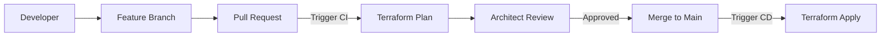

# Version Control Integration

Treating infrastructure as code means integrating it into your team's Git workflow.

## Git Essentials for Terraform

### 1. Branching Strategy
- **main**: Matches the Production environment.
- **staging**: Matches the QA/Staging environment.
- **develop**: Integration for developers.
- **feature/**: Short-lived branches for specific changes.

### 2. Peer Reviews
Always use **Pull Requests (PRs)**. A second set of eyes on a Terraform plan can prevent catastrophic outages.

## The `.gitignore` Standard
Never commit sensitive or local files:
```gitignore
.terraform/
*.tfstate
*.tfstate.*
crash.log
*.tfvars  # (Unless they contain non-sensitive defaults)
.env
```

## Mermaid Diagram: GitOps Flow



---

## 🏗️ Real-Life Scenario: The Secret Leaked to GitHub
**Problem**: A junior dev accidentally committed their AWS access keys in a `terraform.tfvars` file to a public repo.
**Solution**: Use **Pre-commit hooks** (like `detect-secrets` or `gitleaks`) to scan code before it leaves the developer's machine. Also, rotate keys immediately if a leak occurs.

---

## ❓ Interview Questions
1.  **Why should state files not be in Git?**
    *   *Answer*: State files often contain plaintext secrets (passwords, keys) and change every time an apply happens, creating massive merge conflicts.
2.  **What is a "Lock File"?**
    *   *Answer*: `.terraform.lock.hcl` ensures that every team member uses the exact same version of providers, preventing "it works on my machine" versioning issues.

---

## 🧠 Quiz Snippet (5/20+)
1.  **Should `.terraform/` be in Git?** (No)
2.  **What tool scans for secrets before push?** (Pre-commit hooks)
3.  **Which file locks provider versions?** (`.terraform.lock.hcl`)
4.  **True/False: You should merge to main without a plan.** (False)
5.  **What is a "Code Review" for infra called?** (PR/MR review)
