Treating infrastructure as code means integrating it into your team's Git workflow.

## Git Essentials for Terraform

### 1. Branching Strategy (GitFlow/Trunk-Based)
For Infrastructure as Code, a disciplined branching strategy is vital to avoid drift.
-   **Main/Master**: The "Source of Truth". Matches the current state of **Production**.
-   **Develop/Staging**: Matches the state of the **Staging** environment.
-   **Feature Branches (`feat/vpc-upgrade`)**: Where developers write code. Short-lived.


### 2. Peer Reviews
**Rule**: No one pushes directly to Main.
All changes must go through a **Pull Request (PR)**. The PR should automatically trigger a `terraform plan` so reviewers can see *exactly* what will change (e.g., "Plan: 3 to add, 1 to destroy").

---
## The `.gitignore` Standard

Terraform generates several files that should **never** be committed to version control.

### Why ignore?
1.  **Secrets**: State files (`.tfstate`) often contain plain-text passwords.
2.  **Local Config**: `.terraform/` contains downloaded plugins specific to your OS architecture.
3.  **Override Files**: `override.tf` is for local debugging only.

### Recommended `.gitignore`
```gitignore
# Local .terraform directories
**/.terraform/*

# .tfstate files
*.tfstate
*.tfstate.*

# Crash log files
crash.log
crash.*.log

# Exclude sensitive variables
*.tfvars
*.tfvars.json
# EXCEPTION: Allow example vars
!example.tfvars

# Ignore override files
override.tf
override.tf.json
*_override.tf
*_override.tf.json

# CLI configuration files
.terraformrc
terraform.rc
```

---

## 🛡️ Security & Quality Gates (Pre-commit Hooks)

Detect issues *before* you commit. Use the `pre-commit` framework to run checks locally.

### Key Hooks
-   `terraform_fmt`: Automatically formats your code (`terraform fmt`).
-   `terraform_validate`: Checks for syntax errors (`terraform validate`).
-   `detect-secrets`: Scans for AWS keys, passwords, and tokens.

### Example `.pre-commit-config.yaml`
```yaml
repos:
  - repo: https://github.com/antonbabenko/pre-commit-terraform
    rev: v1.86.0
    hooks:
      - id: terraform_fmt
      - id: terraform_validate
  - repo: https://github.com/Yelp/detect-secrets
    rev: v1.4.0
    hooks:
      - id: detect-secrets
```

---

## 🚀 CI/CD Pipeline (GitOps)

**GitOps** means your Git repository is the single source of truth. The pipeline automates the deployment.

### Field-Tested Workflow

1.  **PR Created**: Pipeline runs `terraform plan`. Output is posted as a comment on the PR.
2.  **Code Review**: Human reviews code and the Plan comment.
3.  **Merge**: Code merges to `main`.
4.  **Deployment**: Pipeline runs `terraform apply -auto-approve` against Production.

```mermaid
graph LR
    Dev[Developer] -->|Push| Feature[Feature Branch]
    Feature -->|Open PR| GitHub[GitHub/GitLab]
    GitHub -- Trigger CI --> Action[GitHub Actions]
    
    subgraph CI_Pipeline ["CI Pipeline"]
        Action --> Init[Terraform Init]
        Init --> Validate[Validate & Format]
        Validate --> Plan[Terraform Plan]
    end
    
    Plan -- "Post Comment" --> PR_Comment[PR Discussion]
    PR_Comment -->|Approved & Merged| Main[Main Branch]
    Main -- Trigger CD --> Apply[Terraform Apply]
    
    style CI_Pipeline fill:#e1f5fe,stroke:#01579b
    style Apply fill:#daceec,stroke:#4a148c
```



---

## 🏗️ Real-Life Scenario: The Secret Leaked to GitHub
**Problem**: A junior dev accidentally committed their AWS access keys in a `terraform.tfvars` file to a public repo.
**Solution**: Use **Pre-commit hooks** (like `detect-secrets` or `gitleaks`) to scan code before it leaves the developer's machine. Also, rotate keys immediately if a leak occurs.

---

## ❓ Interview Questions
1.  **Why should state files not be in Git?**
    *   *Answer*: State files often contain plaintext secrets (passwords, keys) and change every time an apply happens, creating massive merge conflicts.
2.  **What is a "Lock File"?**
    *   *Answer*: `.terraform.lock.hcl` ensures that every team member uses the exact same version of providers, preventing "it works on my machine" versioning issues.

---

## 🧠 Quiz Snippet (5/20+)
1.  **Should `.terraform/` be in Git?** (No)
2.  **What tool scans for secrets before push?** (Pre-commit hooks)
3.  **Which file locks provider versions?** (`.terraform.lock.hcl`)
4.  **True/False: You should merge to main without a plan.** (False)
5.  **What is a "Code Review" for infra called?** (PR/MR review)
