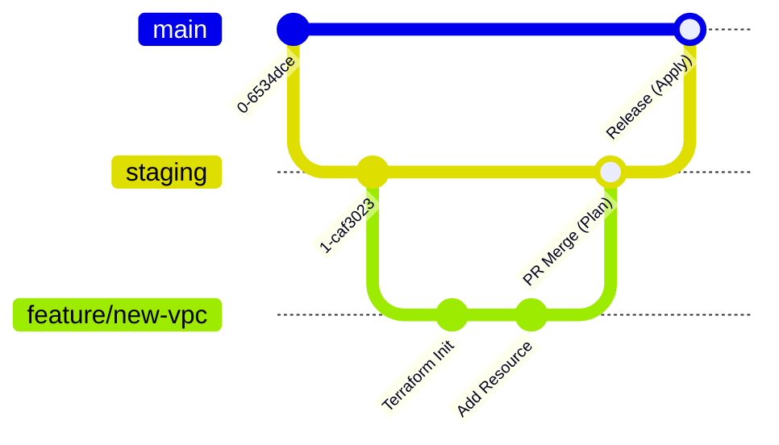

Treating infrastructure as code means integrating it into your team's Git workflow.

## Git Essentials for Terraform

### 1. Branching Strategy (GitFlow/Trunk-Based)
For Infrastructure as Code, a disciplined branching strategy is vital to avoid drift.
-   **Main/Master**: The "Source of Truth". Matches the current state of **Production**.
-   **Develop/Staging**: Matches the state of the **Staging** environment.
-   **Feature Branches (`feat/vpc-upgrade`)**: Where developers write code. Short-lived.



### 2. Peer Reviews
**Rule**: No one pushes directly to Main.
All changes must go through a **Pull Request (PR)**. The PR should automatically trigger a `terraform plan` so reviewers can see *exactly* what will change (e.g., "Plan: 3 to add, 1 to destroy").

---
## The `.gitignore` Standard
Terraform generates several files that should **never** be committed to version control.
### Why ignore?
1.  **Secrets**: State files (`.tfstate`) often contain plain-text passwords.
2.  **Local Config**: `.terraform/` contains downloaded plugins specific to your OS architecture.
3.  **Override Files**: `override.tf` is for local debugging only.
### Recommended `.gitignore`
```gitignore
# Local .terraform directories
**/.terraform/*

# .tfstate files
*.tfstate
*.tfstate.*

# Crash log files
crash.log
crash.*.log

# Exclude sensitive variables
*.tfvars
*.tfvars.json
# EXCEPTION: Allow example vars
!example.tfvars

# Ignore override files
override.tf
override.tf.json
*_override.tf
*_override.tf.json

# CLI configuration files
.terraformrc
terraform.rc
```

---
## 🛡️ Security & Quality Gates (Pre-commit Hooks)
Detect issues *before* you commit. Use the `pre-commit` framework to run checks locally.
### Key Hooks
-   `terraform_fmt`: Automatically formats your code (`terraform fmt`).
-   `terraform_validate`: Checks for syntax errors (`terraform validate`).
-   `detect-secrets`: Scans for AWS keys, passwords, and tokens.
### Example `.pre-commit-config.yaml`
```yaml
repos:
  - repo: https://github.com/ganil151/pre-commit-terraform
    rev: v1.86.0
    hooks:
      - id: terraform_fmt
      - id: terraform_validate
  - repo: https://github.com/Yelp/detect-secrets
    rev: v1.4.0
    hooks:
      - id: detect-secrets
```

---

## 🚀 CI/CD Pipeline (GitOps)
**GitOps** means your Git repository is the single source of truth. The pipeline automates the deployment.
### Field-Tested Workflow
1.  **PR Created**: Pipeline runs `terraform plan`. Output is posted as a comment on the PR.
2.  **Code Review**: Human reviews code and the Plan comment.
3.  **Merge**: Code merges to `main`.
4.  **Deployment**: Pipeline runs `terraform apply -auto-approve` against Production.

```mermaid
graph LR
    Dev[Developer] -->|Push| Feature[Feature Branch]
    Feature -->|Open PR| GitHub[GitHub/GitLab]
    GitHub -- Trigger CI --> Action[GitHub Actions]
    
    subgraph CI_Pipeline ["CI Pipeline"]
        Action --> Init[Terraform Init]
        Init --> Validate[Validate & Format]
        Validate --> Plan[Terraform Plan]
    end
    
    Plan -- "Post Comment" --> PR_Comment[PR Discussion]
    PR_Comment -->|Approved & Merged| Main[Main Branch]
    Main -- Trigger CD --> Apply[Terraform Apply]
    
    style CI_Pipeline fill:#e1f5fe,stroke:#01579b
    style Apply fill:#daceec,stroke:#4a148c
```



---

## 🏗️ Real-Life Scenarios

### Scenario 1: The Secret Leaked to GitHub
**Problem**: A junior dev accidentally committed their AWS access keys in a `terraform.tfvars` file to a public repo.
**Solution**: Use **Pre-commit hooks** (like `detect-secrets` or `gitleaks`) to scan code before it leaves the developer's machine. Also, rotate keys immediately if a leak occurs.

### Scenario 2: The Parallel State Conflict
**Problem**: Two developers were working on different features. Developer A pushed a change that destroyed a database. Developer B, unaware, tried to push a fix, but their local state was out of sync, causing a massive "Plan" failure and potential data loss.
**Solution**: Enforce a **GitOps workflow**. Never run `terraform apply` from a local machine. All applies must happen in a CI/CD pipeline using a remote backend with state locking (like S3/DynamoDB), ensuring only one person (the pipeline) can modify infrastructure at a time.

### Scenario 3: The Untracked Provider Change
**Problem**: A developer updated their local AWS CLI to a newer version which implicitly used a newer Terraform provider version. When they pushed code, other team members' `terraform init` failed because their environments were locked to an older version.
**Solution**: Always commit the **`.terraform.lock.hcl`** file to Git. This file ensures that the exact same provider versions are used by every person on the team and by the CI/CD pipeline, guaranteeing a consistent "It works on my machine" experience.

---

## ❓ Interview Questions

1.  **Why should state files not be in Git?**
    - *Answer*: State files often contain plaintext secrets (passwords, keys). They also change constantly, which leads to massive merge conflicts and sensitive data being stored in Git history.
2.  **What is a "Lock File" (`.terraform.lock.hcl`)?**
    - *Answer*: It records the exact version and checksum of the providers used. Committing it ensures that every team member and the CI/CD pipeline use the same provider versions, preventing breaking changes from unexpected updates.
3.  **Explain the GitOps workflow for Terraform.**
    - *Answer*: Developers work on feature branches, open a Pull Request (PR) which triggers an automated `terraform plan`. After review and merge to `main`, a CD pipeline automatically runs `terraform apply`. Git is the single source of truth.
4.  **What are Pre-commit Hooks in the context of IaC?**
    - *Answer*: They are local scripts that run before a `git commit` is finalized. They help catch formatting errors (`terraform fmt`), syntax errors (`terraform validate`), and leaked secrets (`detect-secrets`) early.
5.  **Should `terraform.tfvars` be committed to Git?**
    - *Answer*: Generally no. `.tfvars` files often contain sensitive or environment-specific values. Instead, commit a `terraform.tfvars.example` file with dummy values to show the required structure.
6.  **How do you review a Terraform Pull Request?**
    - *Answer*: You review the HCL code for best practices and security, but most importantly, you review the output of the `terraform plan` (attached as a comment) to understand exactly what resources will be created, modified, or destroyed.

---

## 🧠 Comprehensive Quiz (25 Questions)

**1. Which file contains downloaded provider plugins and should be ignored by Git?**
- A) .terraform/
- B) providers.tf
- C) main.tf
- D) .git/

<details>
<summary>Show Answer</summary>

**Answer: A** - This directory is local and platform-specific.

</details>

**2. True/False: The `.terraform.lock.hcl` file should be committed to Git.**
- A) True
- B) False

<details>
<summary>Show Answer</summary>

**Answer: A** - It ensures provider version consistency across the team.

</details>

**3. What is the main risk of committing `terraform.tfstate` to a public repository?**
- A) The file will get too big
- B) It contains plain-text secrets (passwords, keys, etc.)
- C) Git doesn't support .tfstate files
- D) It's slow to upload

<details>
<summary>Show Answer</summary>

**Answer: B**

</details>

**4. In a GitFlow workflow, which branch usually represents the "Production" state?**
- A) feature/
- B) develop/
- C) main (or master)
- D) hotfix/

<details>
<summary>Show Answer</summary>

**Answer: C**

</details>

**5. What does `terraform fmt` do?**
- A) Runs the plan
- B) Automatically rewrites HCL code to follow standard formatting and indentation
- C) Deletes unused variables
- D) Deploys resources

<details>
<summary>Show Answer</summary>

**Answer: B**

</details>

**6. Which tool helps detect secrets in your code *before* you commit them?**
- A) Terraform Plan
- B) Pre-commit hooks (e.g. detect-secrets)
- C) Git Push
- D) AWS Console

<details>
<summary>Show Answer</summary>

**Answer: B**

</details>

**7. "GitOps" means that the source of truth for infrastructure is:**
- A) The AWS Console
- B) The Git Repository
- C) The developer's local machine
- D) A PDF documentation

<details>
<summary>Show Answer</summary>

**Answer: B**

</details>

**8. Why is it important to see a `terraform plan` output in a Pull Request?**
- A) To check for spelling errors
- B) To understand the actual impact of code changes on live infrastructure
- C) To speed up the merge
- D) To reduce Git storage

<details>
<summary>Show Answer</summary>

**Answer: B**

</details>

**9. Which command checks for syntax errors but doesn't connect to the internet or cloud?**
- A) terraform apply
- B) terraform validate
- C) terraform plan
- D) terraform init

<details>
<summary>Show Answer</summary>

**Answer: B**

</details>

**10. A standard `.gitignore` for Terraform should include:**
- A) main.tf
- B) variables.tf
- C) *.tfstate
- D) providers.tf

<details>
<summary>Show Answer</summary>

**Answer: C**

</details>

**11. What is a "Short-lived branch" in Git?**
- A) A branch that exists for years
- B) A branch created for a specific feature/fix and deleted after merge
- C) A branch with only one file
- D) The main branch

<details>
<summary>Show Answer</summary>

**Answer: B**

</details>

**12. "Infrastructure drift" can be prevented in a team by:**
- A) Only allowing one person to use Terraform
- B) Using GitOps and forbidding manual changes in the cloud console
- C) Turning off the cloud console
- D) Deleting the state file often

<details>
<summary>Show Answer</summary>

**Answer: B**

</details>

**13. Which file is used for local debugging overrides and should be ignored by Git?**
- A) main.tf
- B) override.tf
- C) versions.tf
- D) outputs.tf

<details>
<summary>Show Answer</summary>

**Answer: B**

</details>

**14. Pull Request reviews for IaC should focus on:**
- A) Logic, security, and the Plan output
- B) Variable namings only
- C) Who wrote the code
- D) How fast the code runs

<details>
<summary>Show Answer</summary>

**Answer: A**

</details>

**15. What does the "auto-approve" flag do in a CD pipeline?**
- A) Asks the user for a password
- B) Skips the manual "yes" confirmation during apply
- C) Automatically corrects code errors
- D) Emails the manager

<details>
<summary>Show Answer</summary>

**Answer: B**

</details>

**16. "Trunk-Based Development" differs from GitFlow by:**
- A) Having more branches
- B) Using a single long-lived branch (main) with frequent small pushes
- C) Not using Git at all
- D) Only using local branches

<details>
<summary>Show Answer</summary>

**Answer: B**

</details>

**17. If a secret is leaked to Git history, you should:**
- A) Delete the commit and pretend it didn't happen
- B) Immediately rotate/revoke the secret and then purge Git history
- C) Just change the password later
- D) Do nothing if the repo is private

<details>
<summary>Show Answer</summary>

**Answer: B**

</details>

**18. The `.terraform.lock.hcl` file is generated by which command?**
- A) terraform plan
- B) terraform apply
- C) terraform init
- D) terraform fmt

<details>
<summary>Show Answer</summary>

**Answer: C**

</details>

**19. Which hook ensures your code indentation is always correct?**
- A) terraform_validate
- B) terraform_fmt
- C) detect-secrets
- D) pre-commit-terraform

<details>
<summary>Show Answer</summary>

**Answer: B**

</details>

**20. GitOps relies on which principle?**
- A) Manual deployments
- B) Declarative infrastructure stored in version control
- C) Frequent local applies
- D) No code reviews

<details>
<summary>Show Answer</summary>

**Answer: B**

</details>

**21. "Continuous Integration" (CI) for Terraform typically includes:**
- A) Creating resources
- B) Formatting, Validation, and Planning
- C) Billing review
- D) Deleting old modules

<details>
<summary>Show Answer</summary>

**Answer: B**

</details>

**22. "Continuous Deployment" (CD) for Terraform typically includes:**
- A) Writing code
- B) Running 'terraform apply' after a merge to main
- C) Reviewing logs
- D) Scaling servers manually

<details>
<summary>Show Answer</summary>

**Answer: B**

</details>

**23. Why use `!example.tfvars` in `.gitignore`?**
- A) To ignore example files
- B) To EXPLICITLY ALLOW example files while ignoring all other .tfvars
- C) To mark it as important
- D) To delete it

<details>
<summary>Show Answer</summary>

**Answer: B**

</details>

**24. What is the benefit of a `gitGraph` in documentation?**
- A) It makes the code faster
- B) It visualizes the branching and merging strategy for the team
- C) It stores Git history
- D) It replaces the Git UI

<details>
<summary>Show Answer</summary>

**Answer: B**

</details>

**25. A "Source of Truth" in GitOps means:**
- A) The senior dev is always right
- B) The state of the infrastructure is defined solely by the code in Git
- C) The cloud console is the leader
- D) Documentation is the lead

<details>
<summary>Show Answer</summary>

**Answer: B**

</details>
