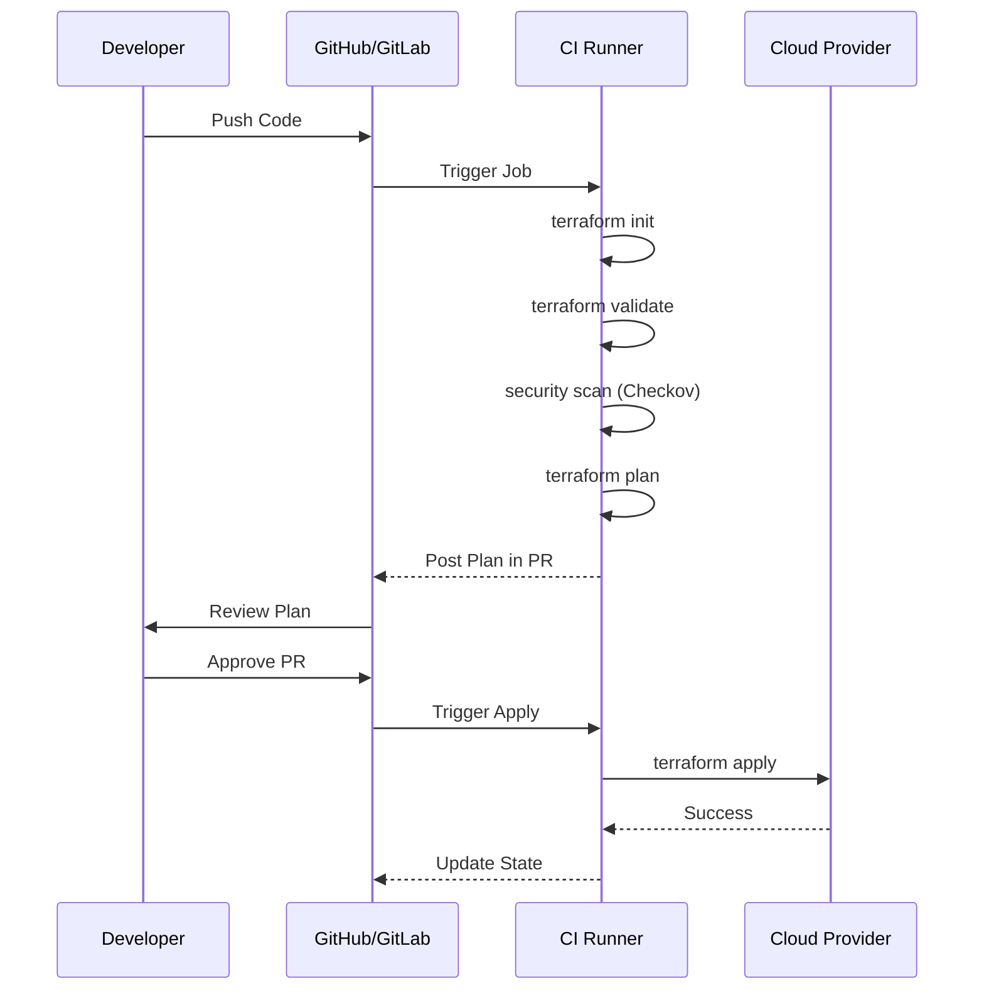
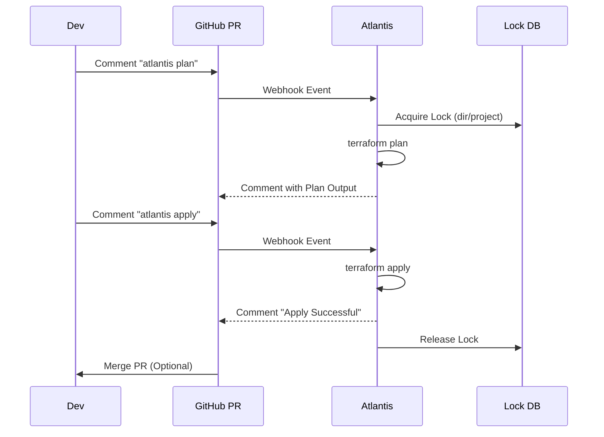

Automating the Terraform lifecycle ensures reliable, repeatable, and audited deployments.

## The Automated Workflow
To achieve "Continuous Deployment" for infrastructure, we typically use a 5-step pipeline:

1.  **Validate**: Ensures the code is syntactically correct.
    *   Command: `terraform validate`
2.  **Lint & Security Scan**: Checks for best practices and security holes.
    *   Command: `tflint`, `checkov -d .`
3.  **Cost Estimate**: Calculates how much the new resources will cost.
    *   Command: `infracost breakdown --path .`
4.  **Plan**: Generates the execution plan and saves it. Use `-out` to ensure the Apply phase uses *exactly* this plan.
    *   Command: `terraform plan -out=tfplan`
5.  **Apply**: Executes the saved plan (only on the `main` branch).
    *   Command: `terraform apply tfplan`

---
## 🚀 Example: GitHub Actions Workflow
Here is a standard pipeline that runs `plan` on Pull Requests and `apply` when merged to `main`.
```yaml
name: Terraform Pipeline

on:
  push:
    branches: [ "main" ]
  pull_request:

jobs:
  terraform:
    name: "Terraform"
    runs-on: ubuntu-latest
    env:
      AWS_ACCESS_KEY_ID: ${{ secrets.AWS_ACCESS_KEY_ID }}
      AWS_SECRET_ACCESS_KEY: ${{ secrets.AWS_SECRET_ACCESS_KEY }}

    steps:
      - name: Checkout Code
        uses: actions/checkout@v3

      - name: Setup Terraform
        uses: hashicorp/setup-terraform@v2
        with:
          terraform_version: 1.5.0

      - name: Terraform Init
        run: terraform init

      - name: Security Scan (Checkov)
        uses: bridgecrewio/checkov-action@master
        with:
          directory: .

      - name: Terraform Plan
        id: plan
        if: github.event_name == 'pull_request'
        run: terraform plan -no-color -out=tfplan
        continue-on-error: true

      - name: Terraform Apply
        if: github.ref == 'refs/heads/main' && github.event_name == 'push'
        run: terraform apply -auto-approve
```

## Mermaid Diagram: CI/CD Pipeline



---

## 🛠️ Tooling Ecosystem

### 1. Static Analysis & Security
**Checkov**: Scans for security misconfigurations.
```bash
checkov -d .
# Output:
# Failed checks:
# CKV_AWS_20: "S3 Bucket has an ACL defined which allows public access."
```

**TFLint**: Finds provider-specific errors that `terraform validate` misses (like invalid instance types).
```bash
tflint --init
tflint
# Output:
# Error: "t2.nanoo" is an invalid instance type (aws_instance_invalid_type)
```

### 2. Cost Estimation
**Infracost**: Generates a bill estimate from your plan file.
```bash
infracost breakdown --path .
# Output:
# OVERALL TOTAL: +$152.00
# ──────────────────────────────────
# aws_instance.web_app
# ├─ Instance usage (Linux/UNIX, t3.medium)    +$30.00
# └─ Storage (EBS, 100GB)                      +$10.00
```

### 3. Pull Request Automation (Atlantis)
**Atlantis** is a server that listens to webhooks from GitHub/GitLab. It runs Terraform commands inside your PRs.

**Workflow**:
1.  **Locking**: Atlantis locks the directory so no one else can modify it.
2.  **Plan**: Run `atlantis plan` in a comment to see the diff.
3.  **Apply**: Run `atlantis apply` in a comment to deploy.



---
## 🏗️ Real-Life Scenario: The Broken Main Branch
**Problem**: A change was merged to `main`, but it failed during `apply` because of an AWS quota limit. Now the production state is locked, and the pipeline is red.
**Solution**:
1.  **Immediate Fix**: Revert the Merge Commit in Git. The pipeline runs again and applies the *previous* state, fixing production.
2.  **Long-term Fix**: Update the pipeline to use the saved plan strategy (`-out=tfplan`). The Apply phase should strictly execute what was planned in the PR phase.

---

## ❓ Interview Questions
1.  **What is Atlantis?**
    *   *Answer*: An open-source tool that automates Terraform via Pull Requests. It runs plan/apply directly from Git comments (e.g., `atlantis plan`).
2.  **How do you handle sensitive variables in CI?**
    *   *Answer*: Store them as "Secret Variables" in the CI tool (GitHub Secrets, GitLab Variables) and pass them as environment variables (`TF_VAR_...`).

---

## 🧠 Quiz Snippet (5/20+)
1.  **Which CI stage checks HCL syntax?** (`validate`)
2.  **Should the 'Apply' stage be manual for production?** (Recommended Yes)
3.  **What is the benefit of 'Atlantis'?** (Visibility and audit trail in the PR)
4.  **What flag is needed for `terraform plan` in CI to save results?** (`-out=tfplan`)
5.  **True/False: CI runners need cloud credentials.** (True - via IAM Roles or Service Principals)
