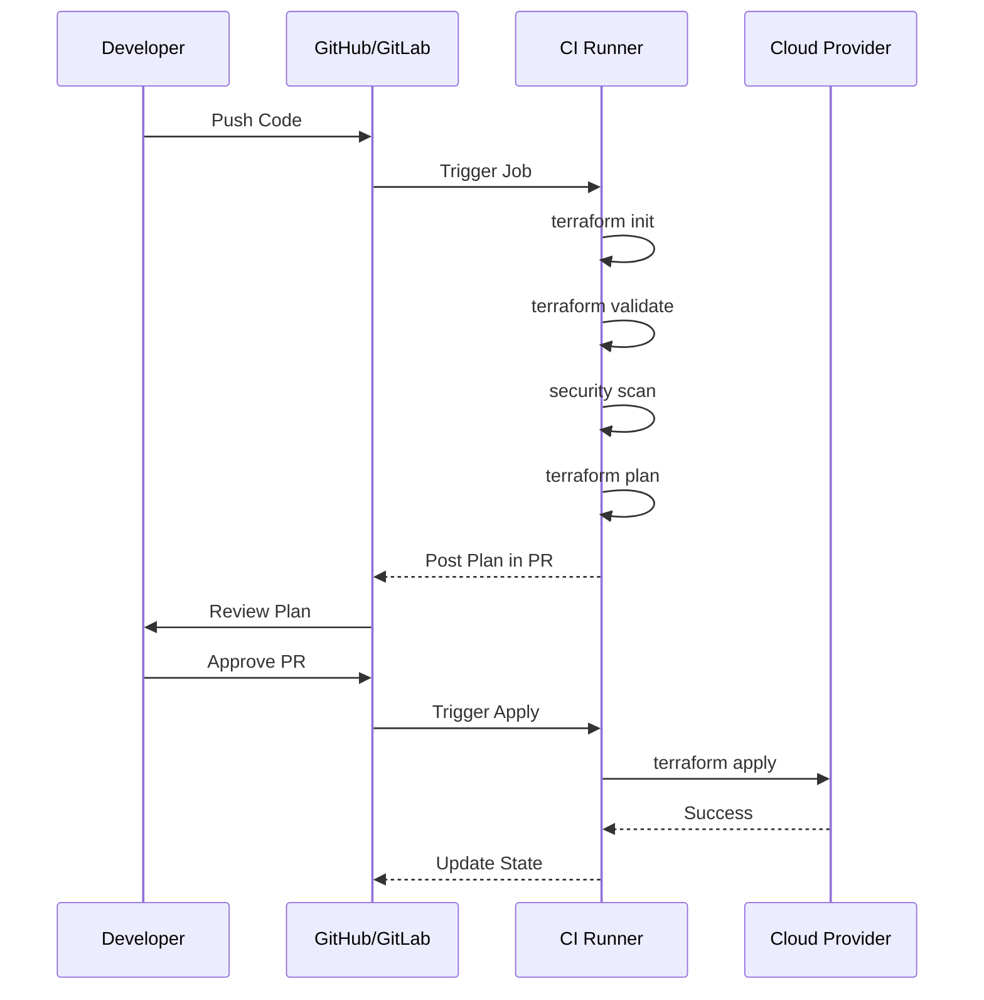

# CI/CD Pipeline Integration

Automating the Terraform lifecycle ensures reliable, repeatable, and audited deployments.

## The Automated Workflow

1.  **Validate**: Syntax and basic consistency checks.
2.  **Security Scan**: Check for misconfigurations (Checkov, tfsec).
3.  **Plan**: Generate a plan and comment it on the Pull Request.
4.  **Manual Approval**: Human-in-the-loop for production changes.
5.  **Apply**: Execute the plan only if tests pass and approval is granted.

## Mermaid Diagram: CI/CD Pipeline

## Popular Tools
- **GitHub Actions**: Native automation for GitHub.
- **GitLab CI**: Powerful integrated CI/CD.
- **Jenkins**: The classic automation server.
- **Atlantis**: Specifically designed for Terraform Pull Request workflows.

---

## 🏗️ Real-Life Scenario: The Broken Main Branch
**Problem**: A change was merged to `main`, but it failed during `apply` because of an AWS quota limit. Now the production state is locked.
**Solution**: Always run `terraform plan` in the CI pipeline for the destination environment *before* allowing the merge. The plan would have shown the failure early.

---

## ❓ Interview Questions
1.  **What is Atlantis?**
    *   *Answer*: An open-source tool that automates Terraform via Pull Requests. It runs plan/apply directly from Git comments (e.g., `atlantis plan`).
2.  **How do you handle sensitive variables in CI?**
    *   *Answer*: Store them as "Secret Variables" in the CI tool (GitHub Secrets, GitLab Variables) and pass them as environment variables (`TF_VAR_...`).

---

## 🧠 Quiz Snippet (5/20+)
1.  **Which CI stage checks HCL syntax?** (`validate`)
2.  **Should the 'Apply' stage be manual for production?** (Recommended Yes)
3.  **What is the benefit of 'Atlantis'?** (Visibility and audit trail in the PR)
4.  **What flag is needed for `terraform plan` in CI to save results?** (`-out=tfplan`)
5.  **True/False: CI runners need cloud credentials.** (True - via IAM Roles or Service Principals)
