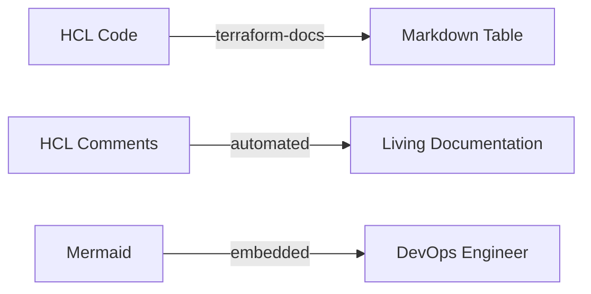

High-quality documentation is the foundation of a manageable infrastructure.

## Documentation Requirements

### 1. The `README.md` (Docs as Code)
Treat documentation like code. It lives in the repo, evolves with PRs, and is automated.
Every module must have a README describing:
-   **Purpose**: What problem does this solve?
-   **Usage**: Minimum viable example.
-   **Inputs/Outputs**: Generated automatically.

### 2. Variable Descriptions (The "Why")
Descriptions shouldn't just repeat the name. They should explain *constraints* and *expected formats*.

**Bad**:
```hcl
variable "vpc_cidr" { description = "VPC CIDR" }
```

**Good**:
```hcl
variable "vpc_cidr" {
  type        = string
  description = "The IPv4 CIDR block for the VPC. Must be a /16 or smaller (e.g., 10.0.0.0/16)."
  default     = "10.0.0.0/16"
}
```

### 3. Automated Documentation (`terraform-docs`)
Manual tables get stale. Use `terraform-docs` to read your HCL and generate the README.

**Configuration**: Create a `.terraform-docs.yml` in your root.
```yaml
formatter: "markdown table"

output:
  file: "README.md"
  mode: "inject"
  template: "<!-- BEGIN_TF_DOCS -->\n{{ .Content }}\n<!-- END_TF_DOCS -->"

sort:
  enabled: true
  by: required

content:
  - inputs
  - outputs
  - providers
  - requirements
```

**Usage**:
```bash
terraform-docs .
```

---
## 📂 Supporting Files
Beyond `README.md`, expansive projects benefit from:

1.  **`EXAMPLES.md`**: Dedicated file for copy-pasteable usage examples (Basic vs Advanced configurations).
2.  **`CONTRIBUTING.md`**: Guide for developers (how to run tests, formatting rules).
3.  **`CHANGELOG.md`**: Version history (if not using GitHub Releases).

## Documentation Lifecycle



---

## 🏗️ Real-Life Scenarios

### Scenario 1: The Tribal Knowledge Bottleneck
**Problem**: Only one engineer knows how to deploy the core networking stack. When they go on vacation, the project stalls because the variables are undocumented.
**Solution**: Use **terraform-docs** and mandatory variable descriptions. Now, any engineer can read the generated README and understand the inputs required.

### Scenario 2: The Stale Documentation Disaster
**Problem**: An engineer updated a module to add a new mandatory variable `kms_key_id`. They forgot to update the manual markdown table in the README. Several sub-teams broke their pipelines because they were following outdated documentation.
**Solution**: Automate documentation with a **pre-commit hook**. Integrate `terraform-docs` into the Git workflow so that the README is automatically updated *before* any code can be committed, ensuring the docs always reflect the current code.

### Scenario 3: The Architecture Mystery
**Problem**: A security audit team requested a diagram of the cloud perimeter. The DevOps team had no current diagrams; they had to manually explore the AWS console for 3 days to draw one in Visio.
**Solution**: Use **Mermaid.js** embedded directly in the `README.md`. Since Mermaid is text-based, the diagram lives alongside the code. When a developer adds a new Load Balancer, they update a few lines of Mermaid text, and the architecture diagram is instantly updated for the next reader.

---

## ❓ Interview Questions

1.  **What is "Documentation as Code"?**
    - *Answer*: It's the practice of treating documentation with the same rigor as source code. It lives in the same repository, follows the same review process (PRs), and use automation tools for generation.
2.  **Why is the `description` field in a variable important for automation?**
    - *Answer*: Tools like `terraform-docs` extract these descriptions to build automated tables. This ensures that users see help text directly in the README without looking at the source code.
3.  **How do you document complex variables (like objects) in Terraform?**
    - *Answer*: Provide a clear description and, ideally, a commented-out example in an `EXAMPLES.md` file. You should also define the `type` precisely to act as "self-documentation."
4.  **What are the benefits of using `terraform-docs` over manual README tables?**
    - *Answer*: It eliminates human error, prevents documentation from becoming stale/outdated, and saves time by automatically detecting all inputs, outputs, and requirements.
5.  **What is a "Self-Documenting" module?**
    - *Answer*: A module that uses clear naming conventions, explicit types, and descriptive variable names so that its purpose is obvious even without extensive external documentation.
6.  **How does Mermaid.js help in documentation?**
    - *Answer*: It allows you to create diagrams (flowcharts, sequence diagrams) using simple text syntax. This is better for Git because diagrams can be peer-reviewed and versioned just like code.

---

## 🧠 Comprehensive Quiz (25 Questions)

**1. Which tool is frequently used to generate README tables from HCL code?**
- A) terraform validate
- B) terraform-docs
- C) tflint
- D) infracost

<details>
<summary>Show Answer</summary>

**Answer: B** - `terraform-docs` is the industry standard for auto-generating TF documentation.

</details>

**2. True/False: Comments in HCL code are ignored by the Terraform engine.**
- A) True
- B) False

<details>
<summary>Show Answer</summary>

**Answer: A** - Comments are for human readers only.

</details>

**3. Where should Terraform documentation primarily live according to "Docs as Code"?**
- A) In a separate Wiki
- B) In the same Git repository as the code
- C) In a PDF file
- D) In the cloud console

<details>
<summary>Show Answer</summary>

**Answer: B**

</details>

**4. What is the purpose of the `description` attribute in a variable?**
- A) It's required for the code to run
- B) It provides help text for users and automated documentation tools
- C) It sets the variable's value
- D) It encrypts the variable

<details>
<summary>Show Answer</summary>

**Answer: B**

</details>

**5. Which file format is standard for Terraform READMEs?**
- A) HTML
- B) Markdown (.md)
- C) XML
- D) Plain Text (.txt)

<details>
<summary>Show Answer</summary>

**Answer: B**

</details>

**6. What does `terraform-docs` do with HCL comments?**
- A) Deletes them
- B) Can extract them to build descriptive documentation
- C) Ignores them completely
- D) Compiles them into a binary

<details>
<summary>Show Answer</summary>

**Answer: B**

</details>

**7. "Stale Documentation" refers to:**
- A) Old paper docs
- B) Documentation that no longer matches the current state of the code
- C) Encrypted documentation
- D) Missing documentation

<details>
<summary>Show Answer</summary>

**Answer: B**

</details>

**8. Which language is used to create text-based diagrams in Markdown?**
- A) Java
- B) Mermaid.js
- C) SQL
- D) Python

<details>
<summary>Show Answer</summary>

**Answer: B**

</details>

**9. The `README.md` file should ideally contain:**
- A) Only the code
- B) Purpose, Usage examples, and Input/Output tables
- C) Private keys
- D) Personal notes

<details>
<summary>Show Answer</summary>

**Answer: B**

</details>

**10. What is a "Living Document"?**
- A) A document that talks
- B) Documentation that is automatically updated as the project changes
- C) A legal contract
- D) A document with many images

<details>
<summary>Show Answer</summary>

**Answer: B**

</details>

**11. Which block in `variables.tf` identifies what a variable is for?**
- A) value
- B) description
- C) type
- D) default

<details>
<summary>Show Answer</summary>

**Answer: B**

</details>

**12. Why put diagrams in the `README.md`?**
- A) To make it look pretty
- B) To provide a high-level visual understanding of the infrastructure architecture
- C) To hide the code
- D) To reduce file size

<details>
<summary>Show Answer</summary>

**Answer: B**

</details>

**13. What is the benefit of automating documentation in a PR pipeline?**
- A) It forces developers to write more code
- B) It ensures documentation is never forgotten during a change
- C) It reduces cloud cost
- D) It's faster to download

<details>
<summary>Show Answer</summary>

**Answer: B**

</details>

**14. A `CONTRIBUTING.md` file describes:**
- A) How to pay for the cloud
- B) Guidelines for how others should submit changes to your project
- C) The list of resources
- D) The billing history

<details>
<summary>Show Answer</summary>

**Answer: B**

</details>

**15. "Self-documenting code" values:**
- A) Long, complex variable names
- B) Clear, intuitive names and types that make comments less necessary
- C) No documentation at all
- D) Using only numbers for names

<details>
<summary>Show Answer</summary>

**Answer: B**

</details>

**16. Which tool can enforce that all variables have a description?**
- A) terraform fmt
- B) TFLint
- C) Google Search
- D) Excel

<details>
<summary>Show Answer</summary>

**Answer: B** - TFLint has rules to enforce descriptions.

</details>

**17. What is `terraform-docs .` used for?**
- A) To apply changes
- B) To scan the current directory and generate documentation
- C) To delete files
- D) To backup the state

<details>
<summary>Show Answer</summary>

**Answer: B**

</details>

**18. Why use `EXAMPLES.md`?**
- A) To list all resources
- B) To provide copy-pasteable blocks for common usage patterns
- C) To store secrets
- D) To host images

<details>
<summary>Show Answer</summary>

**Answer: B**

</details>

**19. What is the purpose of a `CHANGELOG.md`?**
- A) To store passwords
- B) To track changes between different versions of the infrastructure
- C) To list all developers
- D) To show cloud status

<details>
<summary>Show Answer</summary>

**Answer: B**

</details>

**20. Metadata in a module (like version and author) is best kept in:**
- A) The cloud console
- B) HCL comments or a dedicated README section
- C) Local text files
- D) Memory

<details>
<summary>Show Answer</summary>

**Answer: B**

</details>

**21. "Documentation Drift" happens when:**
- A) The cloud console changes
- B) Someone edits the code but fails to update the manual documentation
- C) Terraform is reinstalled
- D) The region changes

<details>
<summary>Show Answer</summary>

**Answer: B**

</details>

**22. Mermaid diagrams are better than Visio files in Git because:**
- A) Visio is slow
- B) Mermaid is text-based and can be diffed and versioned easily
- C) Mermaid is free
- D) Visio is only for Windows

<details>
<summary>Show Answer</summary>

**Answer: B**

</details>

**23. Which attribute provides return value details in `outputs.tf`?**
- A) name
- B) description
- C) type
- D) value

<details>
<summary>Show Answer</summary>

**Answer: B**

</details>

**24. "Docs as Code" encourages which tool for reviews?**
- A) Phone calls
- B) Pull Request (PR) reviews
- C) Email
- D) Meetings

<details>
<summary>Show Answer</summary>

**Answer: B**

</details>

**25. A good variable description should include:**
- A) Only the type
- B) The purpose, format, and any constraints/limits
- C) The developer's name
- D) Nothing

<details>
<summary>Show Answer</summary>

**Answer: B**

</details>
