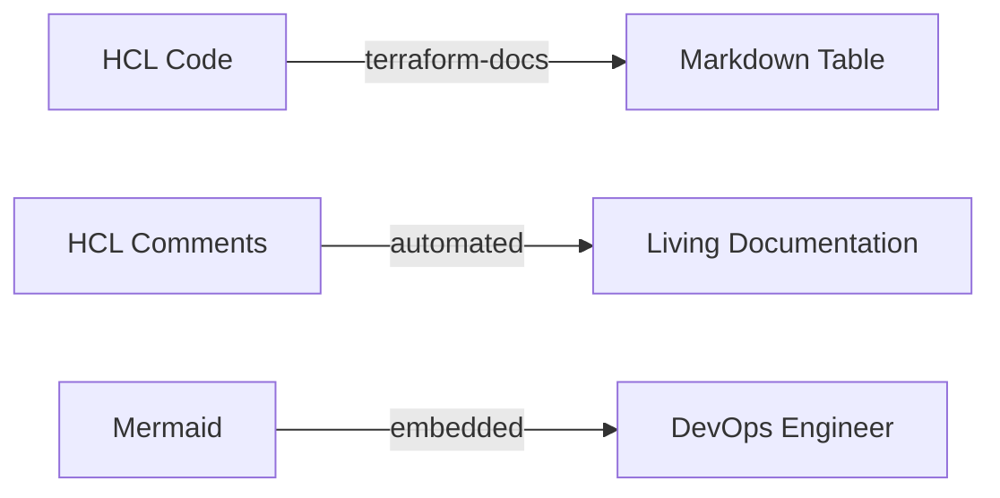

High-quality documentation is the foundation of a manageable infrastructure.

## Documentation Requirements

### 1. The `README.md` (Docs as Code)
Treat documentation like code. It lives in the repo, evolves with PRs, and is automated.
Every module must have a README describing:
-   **Purpose**: What problem does this solve?
-   **Usage**: Minimum viable example.
-   **Inputs/Outputs**: Generated automatically.

### 2. Variable Descriptions (The "Why")
Descriptions shouldn't just repeat the name. They should explain *constraints* and *expected formats*.

**Bad**:
```hcl
variable "vpc_cidr" { description = "VPC CIDR" }
```

**Good**:
```hcl
variable "vpc_cidr" {
  type        = string
  description = "The IPv4 CIDR block for the VPC. Must be a /16 or smaller (e.g., 10.0.0.0/16)."
  default     = "10.0.0.0/16"
}
```

### 3. Automated Documentation (`terraform-docs`)
Manual tables get stale. Use `terraform-docs` to read your HCL and generate the README.

**Configuration**: Create a `.terraform-docs.yml` in your root.
```yaml
formatter: "markdown table"

output:
  file: "README.md"
  mode: "inject"
  template: "<!-- BEGIN_TF_DOCS -->\n{{ .Content }}\n<!-- END_TF_DOCS -->"

sort:
  enabled: true
  by: required

content:
  - inputs
  - outputs
  - providers
  - requirements
```

**Usage**:
```bash
terraform-docs .
```

---
## 📂 Supporting Files
Beyond `README.md`, expansive projects benefit from:

1.  **`EXAMPLES.md`**: Dedicated file for copy-pasteable usage examples (Basic vs Advanced configurations).
2.  **`CONTRIBUTING.md`**: Guide for developers (how to run tests, formatting rules).
3.  **`CHANGELOG.md`**: Version history (if not using GitHub Releases).

## Documentation Lifecycle



---

## 🏗️ Real-Life Scenario: The Tribal Knowledge Bottleneck
**Problem**: Only one engineer knows how to deploy the core networking stack. When they go on vacation, the project stalls because the variables are undocumented.
**Solution**: Use **terraform-docs** and mandatory variable descriptions. Now, any engineer can read the generated README and understand the inputs required.

---

## ❓ Interview Questions
1.  **Why is the `description` field in a variable important?**
    *   *Answer*: It serves as the primary documentation for anyone using the module and is used by tools like `terraform-docs` to build user guides.
2.  **How do you document complex object variables?**
    *   *Answer*: Provide a clear example in the description or a separate `EXAMPLES.md` file showing the expected schema.

---

## 🧠 Quiz Snippet (5/20+)
1.  **Which tool generates MD tables from HCL?** (`terraform-docs`)
2.  **True/False: Comments in HCL are ignored by Terraform.** (True)
3.  **Should documentation be kept separate from code?** (No, "Doc as Code" says it belongs in the repo)
4.  **What attribute provides help text for a variable?** (`description`)
5.  **Which file is the entry point for documentation?** (`README.md`)
