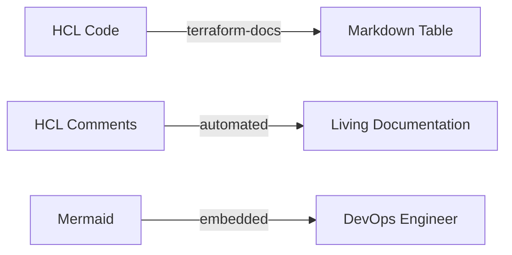

# Documentation Standards

High-quality documentation is the foundation of a manageable infrastructure.

## Documentation Requirements

### 1. The `README.md`
Every module/project must have a README describing:
- **Purpose**: What does this code do?
- **Usage**: How do I run it?
- **Inputs**: What variables are needed?
- **Outputs**: What data is returned?
- **Dependencies**: What other modules/resources are required?

### 2. Variable Descriptions
Never leave a variable without a description.
```hcl
variable "region" {
  type        = string
  description = "The AWS Region to deploy to (e.g. us-east-1)"
}
```

### 3. Automated Documentation
Use **terraform-docs** to automatically generate tables for inputs and outputs.
```bash
terraform-docs markdown table . > README.md
```

## Mermaid Diagram: Documentation Lifecycle



---

## 🏗️ Real-Life Scenario: The Tribal Knowledge Bottleneck
**Problem**: Only one engineer knows how to deploy the core networking stack. When they go on vacation, the project stalls because the variables are undocumented.
**Solution**: Use **terraform-docs** and mandatory variable descriptions. Now, any engineer can read the generated README and understand the inputs required.

---

## ❓ Interview Questions
1.  **Why is the `description` field in a variable important?**
    *   *Answer*: It serves as the primary documentation for anyone using the module and is used by tools like `terraform-docs` to build user guides.
2.  **How do you document complex object variables?**
    *   *Answer*: Provide a clear example in the description or a separate `EXAMPLES.md` file showing the expected schema.

---

## 🧠 Quiz Snippet (5/20+)
1.  **Which tool generates MD tables from HCL?** (`terraform-docs`)
2.  **True/False: Comments in HCL are ignored by Terraform.** (True)
3.  **Should documentation be kept separate from code?** (No, "Doc as Code" says it belongs in the repo)
4.  **What attribute provides help text for a variable?** (`description`)
5.  **Which file is the entry point for documentation?** (`README.md`)
