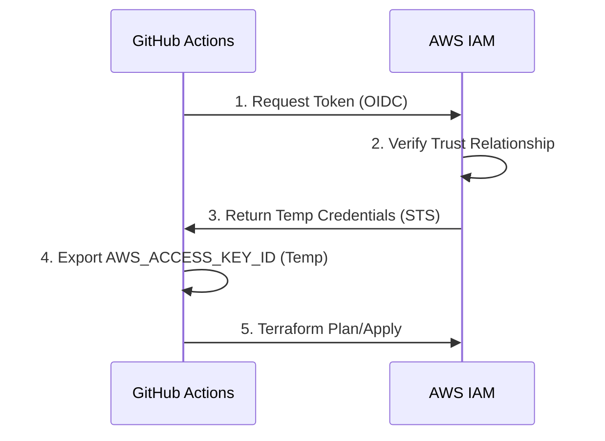

Security in Terraform is about protecting your state, your credentials, and your cloud resources.

## Core Security Pillars

## Core Security Pillars

### 1. State Security (The Crown Jewels)
The `.tfstate` file contains secrets in plaintext (database passwords, private keys). You must treat it like a password database.

**Best Practice Configuration (AWS S3 + DynamoDB):**
```hcl
terraform {
  backend "s3" {
    bucket         = "my-org-tfstate-secure"
    key            = "prod/app.tfstate"
    region         = "us-east-1"
    
    # 1. Encryption at Rest
    encrypt        = true
    
    # 2. Locking (Prevent race conditions)
    dynamodb_table = "terraform-locks"
  }
}
```
*   **Access Control**: The S3 bucket policy should deny all access except to the specific IAM Roles used by your CI/CD runners.
*   **Versioning**: Enable S3 Versioning to recover from accidental state corruptions.
### 2. Credential Management (OIDC vs Keys)
**Anti-Pattern**: Hardcoding AWS keys in `provider` blocks or storing long-lived `AWS_ACCESS_KEY_ID` in GitLab/GitHub variables.
**Best Practice**: OpenID Connect (OIDC). Your CI provider authenticates with AWS directly to assume a role.



### 3. Handling Secrets
Never commit secrets to Git. Instead, inject them or fetch them.

**Method A: Sensitive Variables**
Mark variables as sensitive to prevent them from showing up in CLI output.
```hcl
variable "db_password" {
  type      = string
  sensitive = true # Masks output in "terraform apply"
}

output "db_connect_string" {
  value     = "mysql://${aws_db_instance.main.endpoint}"
  sensitive = true # Required because it depends on a sensitive variable
}
```

**Method B: Data Sources (Runtime Fetching)**
Fetch the secret from AWS Secrets Manager *during* the apply.
```hcl
data "aws_secretsmanager_secret_version" "creds" {
  secret_id = "prod/db/password"
}

resource "aws_db_instance" "main" {
  password = jsondecode(data.aws_secretsmanager_secret_version.creds.secret_string)["password"]
}
```
### 4. Least Privilege
Your CI runner should not have `AdministratorAccess`. It should only have permissions to manage the specific resources in your stack.

**Example IAM Policy Snippet**:
```json
{
    "Version": "2012-10-17",
    "Statement": [
        {
            "Effect": "Allow",
            "Action": [
                "s3:CreateBucket",
                "s3:PutBucketVersioning"
            ],
            "Resource": "arn:aws:s3:::my-app-*"
        }
    ]
}
```

---

## 🏗️ Real-Life Scenario: The Exposed Database
**Problem**: An engineer created a database and forgot to set the `publicly_accessible` flag to false.
**Solution**: Use a security scanner like **tfsec** in the CI pipeline. It will automatically detect the "High" severity risk and block the deployment until the flag is fixed.

---

## ❓ Interview Questions
1.  **How do you securely handle secrets in Terraform?**
    *   *Answer*: Use a secret manager (AWS Secrets Manager, Vault), pass them as environment variables, and use the `sensitive = true` flag.
2.  **Why is OIDC better than IAM user keys for CI/CD?**
    *   *Answer*: OIDC provides temporary, short-lived credentials and doesn't require storing long-lived "secret keys" in the CI tool.

---

## 🧠 Quiz Snippet (5/20+)
1.  **Is the state file encrypted by Terraform by default?** (No, depends on the backend)
2.  **Which attribute masks output in the console?** (`sensitive = true`)
3.  **Should you use 'AdministratorAccess' for Terraform?** (No, use Least Privilege)
4.  **How do you prevent state locking issues?** (Use a backend that supports locking, like DynamoDB)
5.  **Which tool scans HCL for security risks?** (`tfsec` or `checkov`)
