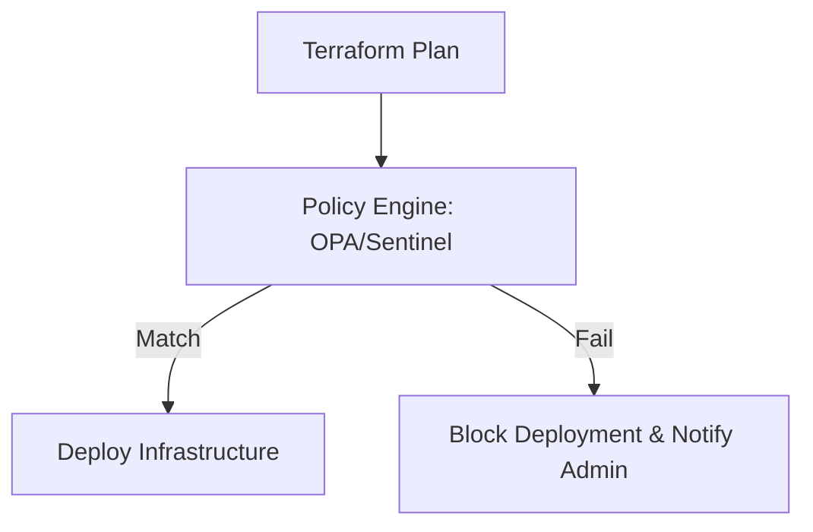

Governance ensures that your infrastructure follows company policies and regulatory requirements.

## Policy as Code (PaC)
Instead of manual audits, use code to enforce rules. This ensures that every deployment meets your compliance standards *before* it happens.
### 1. Open Policy Agent (OPA)
OPA uses the **Rego** language to query the Terraform JSON plan. It is open-source and widely adopted.

**Example: Mandatory Tagging Strategy**
Prevent deployment if `Owner` or `CostCenter` tags are missing.
```rego
package terraform

import input.resource_changes as changes

# Deny if tags are missing on supported resources
deny[msg] {
    r := changes[_]
    is_taggable_resource(r.type)
    
    # Check if 'tags' attribute is present and contains required keys
    tags := r.change.after.tags
    not has_key(tags, "Owner")
    not has_key(tags, "CostCenter")
    
    msg := sprintf("Resource '%v' is missing mandatory tags: Owner, CostCenter", [r.address])
}

is_taggable_resource(type) {
    type == "aws_instance"
    # Add other resources here
}
```
### 2. HashiCorp Sentinel (Enterprise)
Sentinel is policy-as-code embedded directly into Terraform Cloud/Enterprise. It allows for "Soft Mandates" (warning but allow) and "Hard Mandates" (block).

**Example: Restricting EC2 Instance Types**
```sentinel
import "tfplan"

# Get all EC2 instances from the plan
instances = tfplan.resources.aws_instance

# Allowed types
allowed_types = ["t2.micro", "t3.micro", "t3.small"]

# Rule: All instances must use an allowed type
main = rule {
    all instances as _, r {
        r.applied.instance_type in allowed_types
    }
}
```
## Governance Actions

### 1. Drift Detection
In a perfect world, no one touches the AWS Console ("ClickOps"). In reality, valid emergencies happen.
*   **Run a Daily Plan**: Schedule a `terraform plan -detailed-exitcode`.
*   **Exit Code 2**: Means there is a diff (Drift). Alert the team to investigate.
### 2. Common Policy Rules
*   **Cost**: "No instances larger than 4xlarge."
*   **Security**: "No Security Groups allowing 0.0.0.0/0 on port 22."
*   **Encryption**: "All EBS volumes must be encrypted."
*   **NAMING**: "All S3 buckets must start with `company-env-*`."

## Governance Workflow



---

## 🏗️ Real-Life Scenario: The Regional Outlier
**Problem**: A developer accidentally provisions resources in `us-east-1` instead of the company's standard `us-west-2`, causing latency and networking complexity.
**Solution**: Implement an **OPA policy** that checks the `provider` and `region` attributes. The CI pipeline will automatically fail any deployment targeting an unauthorized region.

---

## ❓ Interview Questions
1.  **What is Policy as Code?**
    *   *Answer*: It is the practice of managing and enforcing policies (budget, security, compliance) using machine-readable files.
2.  **What's the difference between a Linter and Policy as Code?**
    *   *Answer*: A Linter (TFLint) checks for *errors* and *best practices*. Policy as Code (OPA) checks for *business rule compliance*.

---
## 🧠 Quiz Snippet (5/20+)
1.  **What is HashiCorp's enterprise policy engine?** (Sentinel)
2.  **Which language is used for OPA?** (Rego)
3.  **True/False: Policy as Code replaces security scanning.** (No, they complement each other)
4.  **Can you enforce budget limits with PaC?** (Yes)
5.  **Does PaC happen before or after the 'Apply'?** (Before - during the 'Plan' stage)
