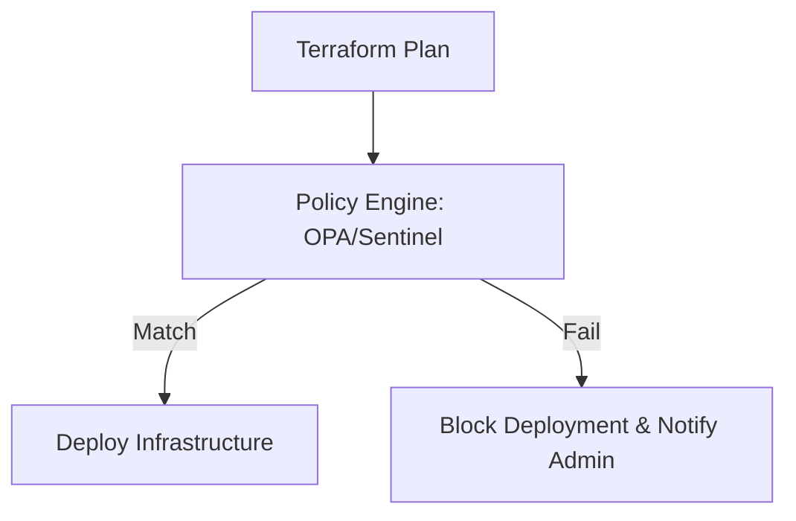

# Compliance and Governance

Governance ensures that your infrastructure follows company policies and regulatory requirements.

## Policy as Code (PaC)

Instead of manual audits, use code to enforce rules.
- **HashiCorp Sentinel**: Enterprise policy engine for Terraform.
- **OPA (Open Policy Agent)**: General-purpose policy engine using Rego language.

## Common Policies
- **Cost**: "No instance larger than t3.medium in Dev."
- **Security**: "Every S3 bucket must have encryption enabled."
- **Tagging**: "Every resource must have an 'Owner' and 'Project' tag."
- **Governance**: "Only specific AWS regions are allowed."

## Mermaid Diagram: Governance Workflow

---

## 🏗️ Real-Life Scenario: The Regional Outlier
**Problem**: A developer accidentally provisions resources in `us-east-1` instead of the company's standard `us-west-2`, causing latency and networking complexity.
**Solution**: Implement an **OPA policy** that checks the `provider` and `region` attributes. The CI pipeline will automatically fail any deployment targeting an unauthorized region.

---

## ❓ Interview Questions
1.  **What is Policy as Code?**
    *   *Answer*: It is the practice of managing and enforcing policies (budget, security, compliance) using machine-readable files.
2.  **What's the difference between a Linter and Policy as Code?**
    *   *Answer*: A Linter (TFLint) checks for *errors* and *best practices*. Policy as Code (OPA) checks for *business rule compliance*.

---

## 🧠 Quiz Snippet (5/20+)
1.  **What is HashiCorp's enterprise policy engine?** (Sentinel)
2.  **Which language is used for OPA?** (Rego)
3.  **True/False: Policy as Code replaces security scanning.** (No, they complement each other)
4.  **Can you enforce budget limits with PaC?** (Yes)
5.  **Does PaC happen before or after the 'Apply'?** (Before - during the 'Plan' stage)
