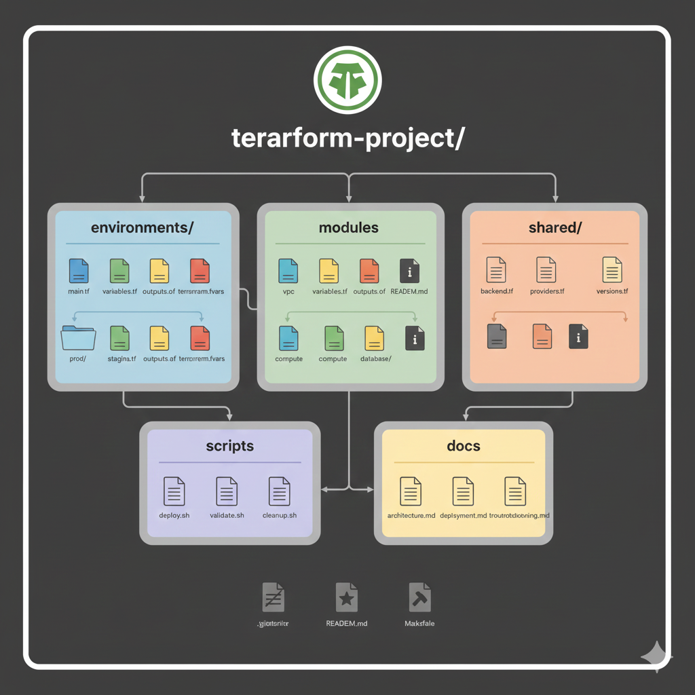
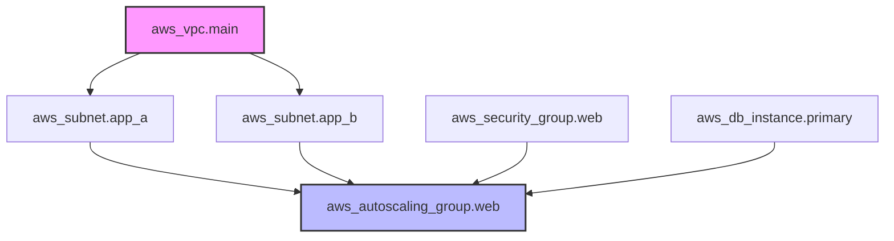

# Terraform Infrastructure as Code Guide

## Table of Contents
1. [IaC Principles](#iac-principles)
2. [Project Structure](#project-structure)
3. [Environment Management](#environment-management)
4. [Configuration Patterns](#configuration-patterns)
5. [Version Control Integration](#version-control-integration)
6. [CI/CD Pipeline Integration](#cicd-pipeline-integration)
7. [Testing Strategies](#testing-strategies)
8. [Documentation Standards](#documentation-standards)
9. [Security Practices](#security-practices)
10. [Compliance and Governance](#compliance-and-governance)

## IaC Principles

### Core IaC Benefits
```yaml
Infrastructure as Code Benefits:
  Version Control:
    - Track infrastructure changes
    - Rollback capabilities
    - Branching strategies
    - Code reviews
  
  Consistency:
    - Repeatable deployments
    - Standardized environments
    - Reduced configuration drift
    - Automated provisioning
  
  Collaboration:
    - Team-based development
    - Shared infrastructure definitions
    - Knowledge sharing
    - Documentation as code
  
  Automation:
    - Continuous deployment
    - Automated testing
    - Self-service provisioning
    - Disaster recovery
```

### IaC Best Practices
```hcl
# 1. Use consistent naming conventions
resource "aws_instance" "web_server" {
  ami           = var.ami_id
  instance_type = var.instance_type
  
  tags = {
    Name        = "${var.project_name}-web-${var.environment}"
    Environment = var.environment
    Project     = var.project_name
    ManagedBy   = "Terraform"
  }
}

# 2. Implement proper resource tagging
locals {
  common_tags = {
    Environment = var.environment
    Project     = var.project_name
    Owner       = var.owner
    ManagedBy   = "Terraform"
    CreatedAt   = timestamp()
  }
}

# 3. Use data sources for existing resources
data "aws_vpc" "existing" {
  count = var.create_vpc ? 0 : 1
  
  filter {
    name   = "tag:Name"
    values = [var.vpc_name]
  }
}

# 4. Implement conditional resource creation
resource "aws_vpc" "main" {
  count = var.create_vpc ? 1 : 0
  
  cidr_block           = var.vpc_cidr
  enable_dns_hostnames = true
  enable_dns_support   = true
  
  tags = merge(local.common_tags, {
    Name = "${var.project_name}-vpc"
  })
}
```

## Project Structure

### Standard Directory Layout


```
terraform-project/
├── environments/
│   ├── dev/
│   │   ├── main.tf
│   │   ├── variables.tf
│   │   ├── outputs.tf
│   │   └── terraform.tfvars
│   ├── staging/
│   │   ├── main.tf
│   │   ├── variables.tf
│   │   ├── outputs.tf
│   │   └── terraform.tfvars
│   └── prod/
│       ├── main.tf
│       ├── variables.tf
│       ├── outputs.tf
│       └── terraform.tfvars
├── modules/
│   ├── vpc/
│   │   ├── main.tf
│   │   ├── variables.tf
│   │   ├── outputs.tf
│   │   └── README.md
│   ├── compute/
│   │   ├── main.tf
│   │   ├── variables.tf
│   │   ├── outputs.tf
│   │   └── README.md
│   └── database/
│       ├── main.tf
│       ├── variables.tf
│       ├── outputs.tf
│       └── README.md
├── shared/
│   ├── backend.tf
│   ├── providers.tf
│   └── versions.tf
├── scripts/
│   ├── deploy.sh
│   ├── validate.sh
│   └── cleanup.sh
├── docs/
│   ├── architecture.md
│   ├── deployment.md
│   └── troubleshooting.md
├── .gitignore
├── README.md
└── Makefile
```


### Environment-Specific Configuration
```hcl
# environments/dev/main.tf
terraform {
  backend "s3" {
    bucket = "terraform-state-dev"
    key    = "infrastructure/terraform.tfstate"
    region = "us-west-2"
  }
}

module "vpc" {
  source = "../../modules/vpc"
  
  environment = "dev"
  vpc_cidr    = "10.0.0.0/16"
  
  public_subnet_cidrs  = ["10.0.1.0/24", "10.0.2.0/24"]
  private_subnet_cidrs = ["10.0.10.0/24", "10.0.20.0/24"]
  
  tags = local.common_tags
}

module "compute" {
  source = "../../modules/compute"
  
  environment = "dev"
  vpc_id      = module.vpc.vpc_id
  subnet_ids  = module.vpc.private_subnet_ids
  
  instance_type = "t3.micro"
  min_size      = 1
  max_size      = 3
  desired_size  = 1
  
  tags = local.common_tags
}

# environments/dev/variables.tf
variable "aws_region" {
  description = "AWS region"
  type        = string
  default     = "us-west-2"
}

variable "environment" {
  description = "Environment name"
  type        = string
  default     = "dev"
}

# environments/dev/terraform.tfvars
aws_region  = "us-west-2"
environment = "dev"

# Development-specific overrides
instance_type = "t3.micro"
enable_monitoring = false
backup_retention = 1
```

### Shared Configuration
```hcl
# shared/versions.tf
terraform {
  required_version = ">= 1.0"
  
  required_providers {
    aws = {
      source  = "hashicorp/aws"
      version = "~> 5.0"
    }
    random = {
      source  = "hashicorp/random"
      version = "~> 3.1"
    }
  }
}

# shared/providers.tf
provider "aws" {
  region = var.aws_region
  
  default_tags {
    tags = {
      Environment = var.environment
      ManagedBy   = "Terraform"
      Project     = var.project_name
    }
  }
}

# shared/backend.tf
terraform {
  backend "s3" {
    # Backend configuration is environment-specific
    # Set via backend config files or CLI
  }
}
```

## Environment Management

### Environment Separation Strategies
```hcl
# Strategy 1: Separate directories
# environments/dev/
# environments/staging/
# environments/prod/

# Strategy 2: Workspace-based
terraform {
  backend "s3" {
    bucket = "terraform-state"
    key    = "infrastructure/terraform.tfstate"
    region = "us-west-2"
  }
}

# Use workspaces
# terraform workspace new dev
# terraform workspace new staging
# terraform workspace new prod

locals {
  environment = terraform.workspace
  
  config = {
    dev = {
      instance_type = "t3.micro"
      min_size      = 1
      max_size      = 2
    }
    staging = {
      instance_type = "t3.small"
      min_size      = 2
      max_size      = 4
    }
    prod = {
      instance_type = "t3.medium"
      min_size      = 3
      max_size      = 10
    }
  }
}

# Strategy 3: Variable-driven
variable "environment_config" {
  description = "Environment-specific configuration"
  type = map(object({
    instance_type = string
    min_size      = number
    max_size      = number
    multi_az      = bool
  }))
  
  default = {
    dev = {
      instance_type = "t3.micro"
      min_size      = 1
      max_size      = 2
      multi_az      = false
    }
    prod = {
      instance_type = "t3.large"
      min_size      = 3
      max_size      = 10
      multi_az      = true
    }
  }
}
```

### Environment Promotion Pipeline
```yaml
# .github/workflows/terraform.yml
name: Terraform Infrastructure Pipeline

on:
  push:
    branches: [main, develop]
  pull_request:
    branches: [main]

jobs:
  validate:
    runs-on: ubuntu-latest
    steps:
      - uses: actions/checkout@v3
      - uses: hashicorp/setup-terraform@v2
      
      - name: Terraform Format Check
        run: terraform fmt -check -recursive
      
      - name: Terraform Validate
        run: |
          cd environments/dev
          terraform init -backend=false
          terraform validate

  plan-dev:
    needs: validate
    if: github.ref == 'refs/heads/develop'
    runs-on: ubuntu-latest
    steps:
      - uses: actions/checkout@v3
      - uses: hashicorp/setup-terraform@v2
      
      - name: Configure AWS Credentials
        uses: aws-actions/configure-aws-credentials@v2
        with:
          aws-access-key-id: ${{ secrets.AWS_ACCESS_KEY_ID }}
          aws-secret-access-key: ${{ secrets.AWS_SECRET_ACCESS_KEY }}
          aws-region: us-west-2
      
      - name: Terraform Plan Dev
        run: |
          cd environments/dev
          terraform init
          terraform plan -out=tfplan
      
      - name: Upload Plan
        uses: actions/upload-artifact@v3
        with:
          name: dev-tfplan
          path: environments/dev/tfplan

  deploy-dev:
    needs: plan-dev
    if: github.ref == 'refs/heads/develop'
    runs-on: ubuntu-latest
    environment: dev
    steps:
      - uses: actions/checkout@v3
      - uses: hashicorp/setup-terraform@v2
      
      - name: Download Plan
        uses: actions/download-artifact@v3
        with:
          name: dev-tfplan
          path: environments/dev/
      
      - name: Terraform Apply Dev
        run: |
          cd environments/dev
          terraform init
          terraform apply tfplan

  plan-prod:
    needs: validate
    if: github.ref == 'refs/heads/main'
    runs-on: ubuntu-latest
    steps:
      - uses: actions/checkout@v3
      - uses: hashicorp/setup-terraform@v2
      
      - name: Terraform Plan Prod
        run: |
          cd environments/prod
          terraform init
          terraform plan -out=tfplan
```

## Configuration Patterns

### DRY (Don't Repeat Yourself) Patterns
```hcl
# locals.tf - Centralized calculations
locals {
  # Common naming convention
  name_prefix = "${var.project_name}-${var.environment}"
  
  # Common tags
  common_tags = {
    Environment = var.environment
    Project     = var.project_name
    Owner       = var.owner
    ManagedBy   = "Terraform"
    CreatedAt   = formatdate("YYYY-MM-DD", timestamp())
  }
  
  # Availability zones
  azs = slice(data.aws_availability_zones.available.names, 0, var.az_count)
  
  # Subnet calculations
  public_subnet_cidrs = [
    for i in range(var.az_count) :
    cidrsubnet(var.vpc_cidr, 8, i + 1)
  ]
  
  private_subnet_cidrs = [
    for i in range(var.az_count) :
    cidrsubnet(var.vpc_cidr, 8, i + 10)
  ]
}

# Resource creation with loops
resource "aws_subnet" "public" {
  count = var.az_count
  
  vpc_id                  = aws_vpc.main.id
  cidr_block              = local.public_subnet_cidrs[count.index]
  availability_zone       = local.azs[count.index]
  map_public_ip_on_launch = true
  
  tags = merge(local.common_tags, {
    Name = "${local.name_prefix}-public-${count.index + 1}"
    Type = "public"
  })
}
```

### Configuration Composition
```hcl
# Composition using modules
module "networking" {
  source = "./modules/networking"
  
  project_name = var.project_name
  environment  = var.environment
  vpc_cidr     = var.vpc_cidr
  az_count     = var.az_count
  
  tags = local.common_tags
}

module "security" {
  source = "./modules/security"
  
  project_name = var.project_name
  environment  = var.environment
  vpc_id       = module.networking.vpc_id
  
  allowed_cidr_blocks = var.allowed_cidr_blocks
  
  tags = local.common_tags
}

module "compute" {
  source = "./modules/compute"
  
  project_name = var.project_name
  environment  = var.environment
  
  vpc_id     = module.networking.vpc_id
  subnet_ids = module.networking.private_subnet_ids
  
  security_group_ids = [module.security.web_sg_id]
  
  instance_config = var.instance_config
  
  tags = local.common_tags
}

module "database" {
  source = "./modules/database"
  
  project_name = var.project_name
  environment  = var.environment
  
  vpc_id     = module.networking.vpc_id
  subnet_ids = module.networking.database_subnet_ids
  
  security_group_ids = [module.security.database_sg_id]
  
  database_config = var.database_config
  
  tags = local.common_tags
}
```

### Conditional Resource Creation
```hcl
# Feature flags for optional resources
variable "features" {
  description = "Feature flags"
  type = object({
    enable_monitoring     = bool
    enable_backup        = bool
    enable_load_balancer = bool
    enable_auto_scaling  = bool
  })
  
  default = {
    enable_monitoring     = true
    enable_backup        = true
    enable_load_balancer = false
    enable_auto_scaling  = false
  }
}

# Conditional resources
resource "aws_cloudwatch_dashboard" "main" {
  count = var.features.enable_monitoring ? 1 : 0
  
  dashboard_name = "${local.name_prefix}-dashboard"
  
  dashboard_body = jsonencode({
    widgets = [
      {
        type   = "metric"
        properties = {
          metrics = [
            ["AWS/EC2", "CPUUtilization", "InstanceId", aws_instance.web[0].id]
          ]
          period = 300
          stat   = "Average"
          region = var.aws_region
          title  = "EC2 CPU Utilization"
        }
      }
    ]
  })
}

resource "aws_lb" "main" {
  count = var.features.enable_load_balancer ? 1 : 0
  
  name               = "${local.name_prefix}-alb"
  internal           = false
  load_balancer_type = "application"
  security_groups    = [aws_security_group.alb[0].id]
  subnets            = aws_subnet.public[*].id
  
  tags = merge(local.common_tags, {
    Name = "${local.name_prefix}-alb"
  })
}
```

## Version Control Integration

### Git Workflow for Terraform
```bash
# Feature branch workflow
git checkout -b feature/add-monitoring
# Make changes to Terraform configuration
git add .
git commit -m "Add CloudWatch monitoring resources"
git push origin feature/add-monitoring

# Create pull request
# Run terraform plan in CI/CD
# Review and merge

# Gitflow workflow
git flow init
git flow feature start add-database
# Make changes
git flow feature finish add-database
git flow release start v1.2.0
git flow release finish v1.2.0
```

### .gitignore for Terraform
```gitignore
# .gitignore
# Local .terraform directories
**/.terraform/*

# .tfstate files
*.tfstate
*.tfstate.*

# Crash log files
crash.log
crash.*.log

# Exclude all .tfvars files, which are likely to contain sensitive data
*.tfvars
*.tfvars.json

# Ignore override files
override.tf
override.tf.json
*_override.tf
*_override.tf.json

# Include override files you do wish to add to version control using negated pattern
# !example_override.tf

# Include tfplan files to ignore the plan output of command: terraform plan -out=tfplan
*tfplan*

# Ignore CLI configuration files
.terraformrc
terraform.rc

# Ignore Mac .DS_Store files
.DS_Store

# Ignore editor files
*.swp
*.swo
*~

# Ignore environment-specific files
.env
.env.local
.env.*.local
```

### Pre-commit Hooks
```yaml
# .pre-commit-config.yaml
repos:
  - repo: https://github.com/antonbabenko/pre-commit-terraform
    rev: v1.83.5
    hooks:
      - id: terraform_fmt
      - id: terraform_validate
      - id: terraform_docs
        args:
          - --hook-config=--path-to-file=README.md
          - --hook-config=--add-to-existing-file=true
          - --hook-config=--create-file-if-not-exist=true
      - id: terraform_tflint
        args:
          - --args=--only=terraform_deprecated_interpolation
          - --args=--only=terraform_deprecated_index
          - --args=--only=terraform_unused_declarations
          - --args=--only=terraform_comment_syntax
          - --args=--only=terraform_documented_outputs
          - --args=--only=terraform_documented_variables
          - --args=--only=terraform_typed_variables
          - --args=--only=terraform_module_pinned_source
          - --args=--only=terraform_naming_convention
          - --args=--only=terraform_required_version
          - --args=--only=terraform_required_providers
          - --args=--only=terraform_standard_module_structure
          - --args=--only=terraform_workspace_remote
      - id: terraform_tfsec
        args:
          - --args=--minimum-severity=MEDIUM
  
  - repo: https://github.com/pre-commit/pre-commit-hooks
    rev: v4.4.0
    hooks:
      - id: trailing-whitespace
      - id: end-of-file-fixer
      - id: check-yaml
      - id: check-added-large-files
      - id: check-merge-conflict
```

## CI/CD Pipeline Integration

### GitLab CI/CD Pipeline
```yaml
# .gitlab-ci.yml
stages:
  - validate
  - plan
  - apply
  - destroy

variables:
  TF_ROOT: ${CI_PROJECT_DIR}
  TF_ADDRESS: ${CI_API_V4_URL}/projects/${CI_PROJECT_ID}/terraform/state/${CI_COMMIT_REF_NAME}

cache:
  key: "${TF_ROOT}"
  paths:
    - ${TF_ROOT}/.terraform

before_script:
  - cd ${TF_ROOT}
  - terraform --version
  - terraform init

validate:
  stage: validate
  script:
    - terraform validate
    - terraform fmt -check
  rules:
    - if: $CI_PIPELINE_SOURCE == "merge_request_event"
    - if: $CI_COMMIT_BRANCH == $CI_DEFAULT_BRANCH

plan:
  stage: plan
  script:
    - terraform plan -out="planfile"
  artifacts:
    name: plan
    paths:
      - ${TF_ROOT}/planfile
    reports:
      terraform: ${TF_ROOT}/planfile.json
  rules:
    - if: $CI_PIPELINE_SOURCE == "merge_request_event"
    - if: $CI_COMMIT_BRANCH == $CI_DEFAULT_BRANCH

apply:
  stage: apply
  script:
    - terraform apply -input=false "planfile"
  dependencies:
    - plan
  rules:
    - if: $CI_COMMIT_BRANCH == $CI_DEFAULT_BRANCH
      when: manual
  only:
    - main

destroy:
  stage: destroy
  script:
    - terraform destroy -auto-approve
  rules:
    - if: $CI_COMMIT_BRANCH == $CI_DEFAULT_BRANCH
      when: manual
  only:
    - main
```

### Jenkins Pipeline
```groovy
// Jenkinsfile
pipeline {
    agent any
    
    parameters {
        choice(
            name: 'ACTION',
            choices: ['plan', 'apply', 'destroy'],
            description: 'Terraform action to perform'
        )
        choice(
            name: 'ENVIRONMENT',
            choices: ['dev', 'staging', 'prod'],
            description: 'Environment to deploy to'
        )
    }
    
    environment {
        AWS_DEFAULT_REGION = 'us-west-2'
        TF_VAR_environment = "${params.ENVIRONMENT}"
    }
    
    stages {
        stage('Checkout') {
            steps {
                checkout scm
            }
        }
        
        stage('Setup') {
            steps {
                script {
                    sh '''
                        cd environments/${ENVIRONMENT}
                        terraform init
                    '''
                }
            }
        }
        
        stage('Validate') {
            steps {
                script {
                    sh '''
                        cd environments/${ENVIRONMENT}
                        terraform validate
                        terraform fmt -check
                    '''
                }
            }
        }
        
        stage('Plan') {
            when {
                anyOf {
                    expression { params.ACTION == 'plan' }
                    expression { params.ACTION == 'apply' }
                }
            }
            steps {
                script {
                    sh '''
                        cd environments/${ENVIRONMENT}
                        terraform plan -out=tfplan
                    '''
                }
            }
        }
        
        stage('Apply') {
            when {
                expression { params.ACTION == 'apply' }
            }
            steps {
                script {
                    input message: 'Apply Terraform changes?', ok: 'Apply'
                    sh '''
                        cd environments/${ENVIRONMENT}
                        terraform apply tfplan
                    '''
                }
            }
        }
        
        stage('Destroy') {
            when {
                expression { params.ACTION == 'destroy' }
            }
            steps {
                script {
                    input message: 'Destroy infrastructure?', ok: 'Destroy'
                    sh '''
                        cd environments/${ENVIRONMENT}
                        terraform destroy -auto-approve
                    '''
                }
            }
        }
    }
    
    post {
        always {
            cleanWs()
        }
    }
}
```

## Testing Strategies

### Unit Testing with Terratest
```go
// test/terraform_test.go
package test

import (
    "testing"
    
    "github.com/gruntwork-io/terratest/modules/terraform"
    "github.com/stretchr/testify/assert"
)

func TestTerraformVPC(t *testing.T) {
    t.Parallel()
    
    terraformOptions := terraform.WithDefaultRetryableErrors(t, &terraform.Options{
        TerraformDir: "../modules/vpc",
        Vars: map[string]interface{}{
            "vpc_cidr":    "10.0.0.0/16",
            "environment": "test",
        },
    })
    
    defer terraform.Destroy(t, terraformOptions)
    
    terraform.InitAndApply(t, terraformOptions)
    
    vpcId := terraform.Output(t, terraformOptions, "vpc_id")
    assert.NotEmpty(t, vpcId)
    
    publicSubnetIds := terraform.OutputList(t, terraformOptions, "public_subnet_ids")
    assert.Len(t, publicSubnetIds, 2)
}

func TestTerraformEC2Instance(t *testing.T) {
    t.Parallel()
    
    terraformOptions := terraform.WithDefaultRetryableErrors(t, &terraform.Options{
        TerraformDir: "../modules/compute",
        Vars: map[string]interface{}{
            "instance_type": "t3.micro",
            "environment":   "test",
        },
    })
    
    defer terraform.Destroy(t, terraformOptions)
    
    terraform.InitAndApply(t, terraformOptions)
    
    instanceId := terraform.Output(t, terraformOptions, "instance_id")
    assert.NotEmpty(t, instanceId)
}
```

### Integration Testing
```bash
#!/bin/bash
# scripts/integration-test.sh

set -e

ENVIRONMENT="test"
TEST_DIR="test"

echo "Running integration tests for environment: $ENVIRONMENT"

# Setup test environment
cd environments/$ENVIRONMENT
terraform init
terraform apply -auto-approve

# Run tests
cd ../../$TEST_DIR
go test -v -timeout 30m

# Cleanup
cd ../environments/$ENVIRONMENT
terraform destroy -auto-approve

echo "Integration tests completed successfully"
```

### Policy Testing with OPA
```rego
# policies/security.rego
package terraform.security

import rego.v1

# Deny if S3 bucket is not encrypted
deny contains msg if {
    resource := input.resource_changes[_]
    resource.type == "aws_s3_bucket"
    not resource.change.after.server_side_encryption_configuration
    msg := sprintf("S3 bucket '%s' must have encryption enabled", [resource.address])
}

# Deny if EC2 instance allows SSH from anywhere
deny contains msg if {
    resource := input.resource_changes[_]
    resource.type == "aws_security_group"
    rule := resource.change.after.ingress[_]
    rule.from_port == 22
    rule.cidr_blocks[_] == "0.0.0.0/0"
    msg := sprintf("Security group '%s' allows SSH from anywhere", [resource.address])
}

# Require specific tags
required_tags := ["Environment", "Project", "Owner"]

deny contains msg if {
    resource := input.resource_changes[_]
    resource.type in ["aws_instance", "aws_s3_bucket", "aws_rds_instance"]
    tag := required_tags[_]
    not resource.change.after.tags[tag]
    msg := sprintf("Resource '%s' missing required tag: %s", [resource.address, tag])
}
```

## 🏗️ Resource Dependency Graph

Terraform builds a Directed Acyclic Graph (DAG) to determine the order of resource creation. Understanding this graph is essential for managing complex infrastructure.



---

## ❓ Interview Preparation

### Top 5 HCL & IaC Interview Questions
1. **Explain the difference between `count` and `for_each`.** (`count` is best for simple loops of identical resources; `for_each` is better for creating resources from a map or set of strings where items might be deleted over time).
2. **What are `locals` and when should you use them?** (Locals are like internal variables used to simplify complex expressions or avoid repeating calculations within a specific module).
3. **What is a "Splat Expression" `[*]`?** (It allows you to capture a list of attributes from all instances in a `count` or `for_each` loop, e.g., `aws_instance.web[*].id`).
4. **How does Terraform handle resource deletion during an `apply`?** (If a resource is removed from HCL or its configuration changes in a way that requires replacement, Terraform schedules it for destruction before or after creating the new one).
5. **What is the purpose of `terraform validate`?** (It checks your code for internal consistency and syntax errors without connecting to the cloud provider).

---

## 📝 Practice Quiz

1. **How do you reference the current index in a `count` loop?**
   - [ ] `${index}`
   - [ ] `self.index`
   - [x] `count.index`
   - [ ] `i`

2. **Which meta-argument is used to ensure a new resource is created *before* the old one is deleted during an update?**
   - [ ] `depends_on`
   - [ ] `prevent_destroy`
   - [x] `lifecycle { create_before_destroy = true }`
   - [ ] `ignore_changes`

3. **What is the correct syntax for a conditional expression in HCL?**
   - [ ] `if (true) then A else B`
   - [x] `condition ? value_if_true : value_if_false`
   - [ ] `case when condition then A else B end`
   - [ ] `condition -> value_if_true || value_if_false`

---

## 🏢 Real-Life Scenario: The Dynamic Multi-Region Setup

**Requirement**: You need to deploy a web application across 3 different regions (us-east-1, eu-west-1, ap-southeast-1). Each region has a different number of availability zones.

**Solution**:
1. **Define a Map**: Create a variable `regions` that maps region names to their specific configs (AZ counts, instance types).
2. **Use Providers with Aliases**: Define 3 provider blocks for `aws`, each with a different `alias`.
3. **Loop with `for_each`**: Call your compute module using `for_each = var.regions`.
4. **Dynamic Lookups**: Use the `data.aws_availability_zones` data source within the module to dynamically fetch the correct number of AZs for whichever region is currently being processed.

---

This Infrastructure as Code guide provides comprehensive patterns and practices for managing Terraform projects at scale with proper testing, CI/CD integration, and governance.