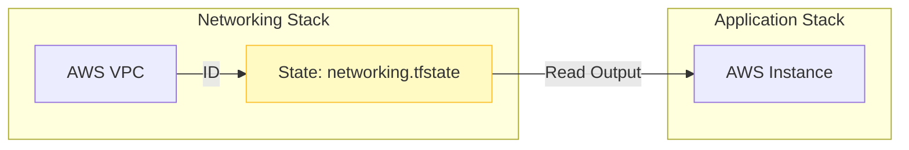

Deciding where to store your state file is a critical architectural decision.
## Local State
By default, Terraform stores state in a file called `terraform.tfstate` in the same directory as your code.
- **Pros**: Easy setup, no dependencies, fast for solo development.
- **Cons**: No team collaboration, no locking (risk of corruption), state lost if the laptop is stolen/wiped.
## Remote State
Remote state is stored in a shared service like AWS S3, Azure Blob, or HashiCorp Cloud.
- **Pros**: Shared source of truth, state locking, automatic backups, and high security.
- **Cons**: Requires initial setup of a "Backend."
## Comparison Table

| Feature | Local State | Remote State |
| :--- | :--- | :--- |
| Collaboration | Manual only (Risky) | Native / Real-time |
| Locking | None | Supported (e.g. via DynamoDB) |
| Security | Depends on OS | Encryption at rest/transit |
| Backups | Manual | Automatic versioning |

## Backend Configurations
Backends define *where* the state is stored.

**1. S3 Standard (AWS)**
Most common for enterprise. Requires an S3 bucket and a DynamoDB table.
```hcl
terraform {
  backend "s3" {
    bucket         = "company-tf-state"
    key            = "networking/vpc.tfstate"
    region         = "us-east-1"
    dynamodb_table = "terraform-locks"
    encrypt        = true
  }
}
```
**2. Terraform Cloud (HCP)**
Managed service by HashiCorp. Easiest for teams.
```hcl
terraform {
  cloud {
    organization = "my-org"
    workspaces {
      name = "networking-prod"
    }
  }
}
```
**3. Local (Default)**
Good for learning, bad for teams.
```hcl
terraform {
  backend "local" {
    path = "terraform.tfstate"
  }
}
```

---

## 🔗 Cross-Stack References (`terraform_remote_state`)
You can read outputs from *another* Terraform project's state file. This allows you to split large projects into smaller, coupled stacks (e.g., VPC stack vs. App stack).

**Networking Stack (`networking/outputs.tf`)**:
```hcl
output "vpc_id" {
  value = aws_vpc.main.id
}
```
**App Stack (`app/main.tf`)**:
```hcl
data "terraform_remote_state" "network" {
  backend = "s3"
  config = {
    bucket = "company-tf-state"
    key    = "networking/vpc.tfstate"
    region = "us-east-1"
  }
}

resource "aws_instance" "web" {
  # Read the VPC ID from the other state file
  subnet_id = data.terraform_remote_state.network.outputs.vpc_id
}
```



---

## 🚚 Migrating State
Moving from Local to Remote (or S3 to TFC) is easy.
1.  **Configure**: Add the `backend` block to your `main.tf`.
2.  **Init**: Run `terraform init`.
3.  **Confirm**: Terraform detects the change and asks: *"Do you want to copy existing state to the new backend?"*
4.  **Yes**: Type `yes`. Terraform uploads your local `terraform.tfstate` to S3 and deletes the local copy.

	To move back (or to another backend), just change the config and run `terraform init -migrate-state`.
---
## ❓ Interview Questions
1.  **Why is remote state preferred for production environments?**
    *   *Answer*: It enables team collaboration, provides a locking mechanism to prevent concurrent runs, and ensures state is encrypted and backed up.
2.  **Can you work with local and remote state at the same time?**
    *   *Answer*: No, a project uses exactly one backend at a time.

---

## 🧠 Quiz Snippet (5/20+)
1.  **What is the risk of two people running Terraform on local state?** (State corruption or resource duplication)
2.  **True/False: Remote state supports encryption.** (True)
3.  **Does local state support locking?** (No)
4.  **Where is local state stored by default?** (Working directory)
5.  **What is the core problem solved by Remote State?** (Team collaboration and Source of Truth consistency)
