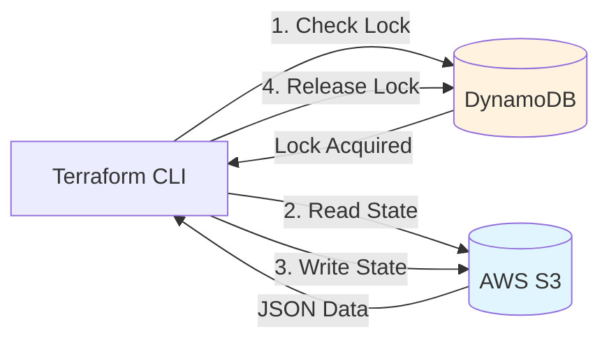

# Remote State Backends

A backend defines where Terraform stores its state file and how it performs operations.

## The Architecture (S3 + DynamoDB)

For AWS, state storage and locking are handled by two different services.



## Popular Backends

### 1. AWS S3 (Standard)
```hcl
terraform {
  backend "s3" {
    bucket         = "tf-state-prod"
    key            = "network/terraform.tfstate"
    region         = "us-east-1"
    dynamodb_table = "terraform-lock"
    encrypt        = true
  }
}
```

### 2. Terraform Cloud (Managed)
No need to configure separate locking; it's built-in.
```hcl
terraform {
  cloud {
    organization = "my-org"
    workspaces { name = "my-app" }
  }
}
```

### 3. Azure RM & GCS
*   **Azure**: Stores state in Blob Storage.
*   **GCS**: Stores state in Google Cloud Storage.

---

## 🔧 Advanced: Partial Configuration

**Problem**: You cannot use variables in the `backend` block (e.g., `bucket = var.bucket_name` is invalid).
**Solution**: Use **Partial Configuration**. Leave the dynamic fields empty in your HCL, and provide them at `init` time.

**code.tf**:
```hcl
terraform {
  backend "s3" {
    # Bucket and Region are missing!
    key = "prod/app.tfstate"
  }
}
```

**Command**:
```bash
terraform init \
  -backend-config="bucket=my-corp-state" \
  -backend-config="region=us-east-1"
```
*Useful for using the same code across multiple environments with different state buckets.*

---

## 🔒 State Locking Support

Not all backends support locking.

| Backend | Storage | Locking Mechanism |
| :--- | :--- | :--- |
| **Local** | Local Disk | System API (limited) |
| **S3** | S3 Object | **DynamoDB Table** (Must create manually) |
| **AzureRM** | Blob Container | **Lease Blob** (Native) |
| **GCS** | GCS Bucket | **Native** |
| **Terraform Cloud**| Postgres (Hidden)| **Native** |

---

## 🏗️ Real-Life Scenario: The Multi-Backend Disaster
**Problem**: A company uses AWS for compute but Azure for data. They try to store the state file for an AWS resource in an Azure backend.
**Outcome**: This works! Terraform backends are independent of the resources being managed. However, it's a best practice to keep state in the same cloud provider to reduce cross-cloud dependencies.

---

## ❓ Interview Questions
1.  **What happens if the backend is unreachable?**
    *   *Answer*: Terraform will fail to initialize or perform any plan/apply operations as it cannot read the current source of truth.
2.  **What is the `terraform init -reconfigure` command used for?**
    *   *Answer*: It is used to initialize a backend while ignoring any existing backend configuration in the `.terraform` directory (useful for changing backends manually).

---

## 🧠 Quiz Snippet (5/20+)
1.  **Which AWS service provides locking for the S3 backend?** (DynamoDB)
2.  **Can you use variables inside a `backend` block?** (No, backends are initialized before variables are loaded)
3.  **What command initializes the backend?** (`terraform init`)
4.  **True/False: GCS supports locking natively.** (True)
5.  **Which backend is managed by HashiCorp?** (Terraform Cloud / Enterprise)
