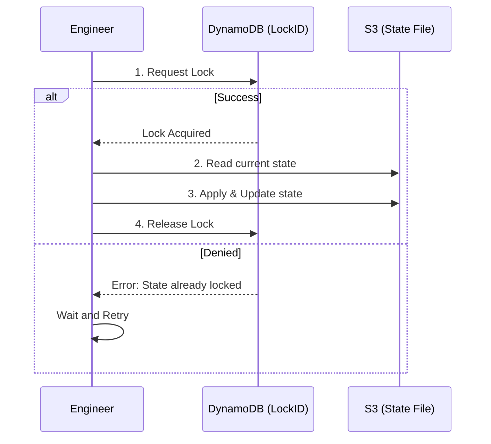

# State Locking

State locking prevents concurrent operations on the same state file, protecting it from corruption and race conditions.

## Why Lock?
If two people run `terraform apply` at the same time, they might both try to write to the state file simultaneously. This can lead to a corrupted JSON file, meaning your infrastructure is no longer manageable.

## How it works (AWS Example)
1. **Request**: Terraform attempts to write a "Lock" item to a DynamoDB table.
2. **Check**: If the item exists (current lock), the operation is blocked.
3. **Execute**: If the lock is acquired, the plan/apply proceeds.
4. **Release**: Once done, Terraform deletes the Lock item.

## Mermaid Diagram: Locking Sequence



## The "Stale Lock" Problem
Sometimes a Terraform process crashes (e.g. internet drops) before it can release the lock.
**Solution**: Manually unlock it.
```bash
terraform force-unlock <LOCK_ID>
```

---

## 🏗️ Real-Life Scenario: The CI/CD Race Condition
**Problem**: A Jenkins pipeline triggers two identical jobs for the same environment at the same time. Job A starts building, and Job B tries to start 5 seconds later.
**Outcome**: Job B fails with a "State Locked" error. This is a *good* thing! It prevents Job B from accidentally deleting resources that Job A just created.

---

## ❓ Interview Questions
1.  **What is the behavior of Terraform when it cannot acquire a lock?**
    *   *Answer*: It will output an error message showing the Lock ID and who holds the lock, and then exit without performing any changes.
2.  **When should you use `force-unlock`?**
    *   *Answer*: Only when you are 100% sure that no other Terraform process is actually running (e.g., after a CLI crash or a failed CI job).

---

## 🧠 Quiz Snippet (5/20+)
1.  **Does HTTP backend support locking?** (Yes, if the server supports it)
2.  **Which command releases a stale lock?** (`terraform force-unlock`)
3.  **True/False: Locking is optional but highly recommended.** (True)
4.  **How do you disable locking?** (`-lock=false` flag - DANGEROUS)
5.  **Where can you find the Lock ID?** (In the error message or the DynamoDB table)
