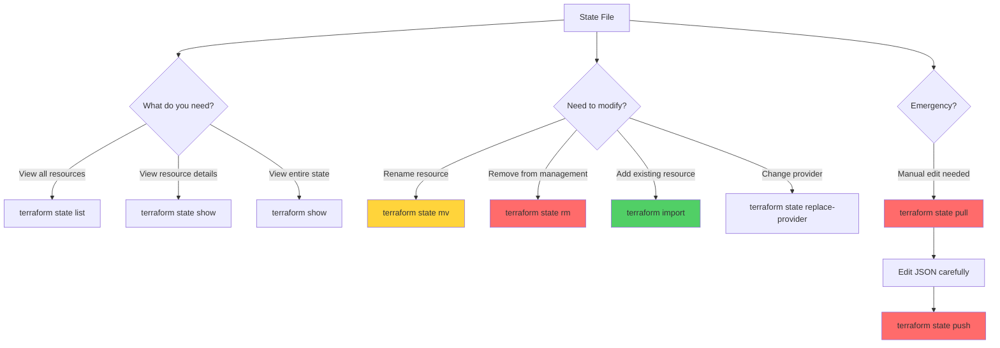
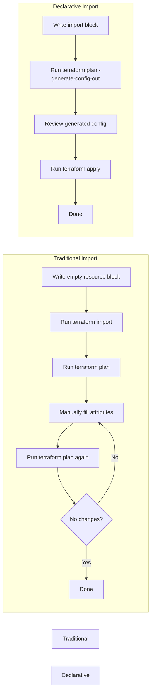
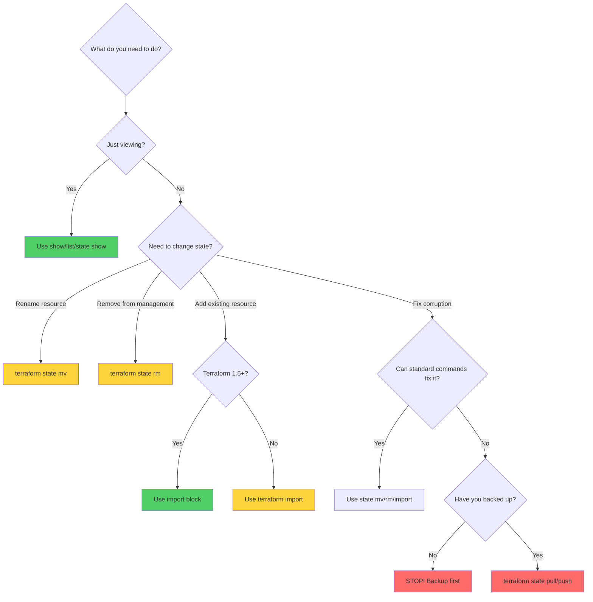

## Terraform State Operations
Mastering the CLI commands used to inspect and manipulate your state file is essential for effective infrastructure management.

## 🗺️ State Operations Workflow



---

## 📋 Essential Commands

### 1. `terraform show`
Displays a human-readable version of the current state or plan.

**Usage**:
```bash
# Show current state
terraform show

# Show a specific plan file
terraform show tfplan.binary
```

**Output Example**:
```
# aws_instance.web:
resource "aws_instance" "web" {
    ami           = "ami-0c55b159cbfafe1f0"
    instance_type = "t2.micro"
    tags          = {
        "Name" = "WebServer"
    }
}
```

**Use Cases**:
- Quick overview of managed infrastructure
- Debugging resource attributes
- Reviewing planned changes before apply

---

### 2. `terraform state list`
Lists all resources currently managed by the state.

**Usage**:
```bash
# List all resources
terraform state list

# Filter by resource type
terraform state list | grep aws_instance

# Filter by module
terraform state list module.vpc
```

**Output Example**:
```
aws_instance.web
aws_security_group.web_sg
aws_vpc.main
module.database.aws_db_instance.primary
```

**Use Cases**:
- Inventory of managed resources
- Finding resource addresses for other commands
- Auditing what Terraform manages

---

### 3. `terraform state show`
Shows the detailed attributes of a specific resource in the state.

**Usage**:
```bash
# Show specific resource
terraform state show aws_instance.web

# Show resource in a module
terraform state show 'module.vpc.aws_subnet.public[0]'
```

**Output Example**:
```
# aws_instance.web:
resource "aws_instance" "web" {
    ami                          = "ami-0c55b159cbfafe1f0"
    arn                          = "arn:aws:ec2:us-east-1:123456789012:instance/i-0abcd1234efgh5678"
    instance_type                = "t2.micro"
    private_ip                   = "10.0.1.45"
    public_ip                    = "54.123.45.67"
    subnet_id                    = "subnet-abc123"
    vpc_security_group_ids       = ["sg-xyz789"]
}
```

**Use Cases**:
- Debugging resource configuration
- Finding resource IDs for import operations
- Verifying attribute values

---

### 4. `terraform state rm`
Removes a resource from the state file. **CRITICAL**: This does NOT delete the resource from the cloud; it just stops Terraform from managing it.

**Usage**:
```bash
# Remove single resource
terraform state rm aws_instance.old_server

# Remove all instances of a resource with count
terraform state rm 'aws_instance.web[0]'

# Remove entire module
terraform state rm module.old_module
```

**When to Use**:
- Transferring resource management to another Terraform workspace
- Removing resources you want to manage manually
- Cleaning up after splitting Terraform configurations

**⚠️ Warning**: The resource continues to exist in the cloud. Use `terraform destroy` if you want to delete it.

---

### 5. `terraform state mv`
Renames or moves a resource in the state (useful after refactoring code).

**Usage**:
```bash
# Rename a resource
terraform state mv aws_instance.old_name aws_instance.new_name

# Move resource into a module
terraform state mv aws_instance.web module.compute.aws_instance.web

# Move resource out of a module
terraform state mv module.compute.aws_instance.web aws_instance.web

# Rename with count/for_each
terraform state mv 'aws_instance.web[0]' 'aws_instance.web["primary"]'
```

**Use Cases**:
- Refactoring code without destroying resources
- Reorganizing modules
- Converting from count to for_each

---

### 6. `terraform import`
Brings existing cloud resources into Terraform management.

**Usage**:
```bash
# Import AWS VPC
terraform import aws_vpc.main vpc-12345678

# Import with module
terraform import module.network.aws_subnet.public subnet-abc123

# Import resource with count
terraform import 'aws_instance.web[0]' i-0abcd1234efgh5678
```

**Steps for Import**:
1. Write the resource block in your `.tf` file (without attributes)
2. Run `terraform import` with the resource address and cloud ID
3. Run `terraform plan` to see what attributes need to be added
4. Update your `.tf` file to match the actual resource
5. Run `terraform plan` again to verify no changes

**Example**:
```hcl
# 1. Write empty resource block
resource "aws_instance" "imported_server" {
  # Attributes will be filled after import
}
```

```bash
# 2. Import the resource
terraform import aws_instance.imported_server i-0abcd1234efgh5678

# 3. Check what needs to be added
terraform plan
```

---

### 7. `terraform state replace-provider`
Used when you need to change the provider source (e.g., from `hashicorp/aws` to a fork or standardizing module providers).

**Usage**:
```bash
# Replace provider source
terraform state replace-provider hashicorp/aws my-fork/aws

# Replace with registry path
terraform state replace-provider registry.terraform.io/hashicorp/aws registry.example.com/custom/aws
```

**When to Use**:
- Migrating to a forked provider
- Moving to a private registry
- Standardizing provider sources across teams

---

### 8. `terraform state pull` / `push` (Manual Editing)
**⚠️ DANGER ZONE**: Directly editing the state file.

**Usage**:
```bash
# 1. Download state
terraform state pull > state.json

# 2. Edit state.json (carefully!)
# Use a text editor to make changes

# 3. Upload modified state
terraform state push state.json
```

**When to Use** (ONLY in emergencies):
- Fixing corrupted state that standard commands can't fix
- Bulk operations that would be tedious with individual commands
- Recovering from state file issues

**⚠️ Critical Warnings**:
- Always backup the state before editing
- Understand the state file structure
- Validate JSON syntax before pushing
- Test in a non-production environment first

---

## 🚀 Modern: Declarative Import (Terraform 1.5+)

The traditional CLI `terraform import` command is tedious and error-prone. The new `import` block allows you to define imports **declaratively in your HCL code**.

### Traditional Import vs Declarative Import



### Declarative Import Example

**1. Write the Import Block**:
```hcl
# main.tf
import {
  to = aws_vpc.main
  id = "vpc-0a1b2c3d"
}

import {
  to = aws_subnet.public
  id = "subnet-xyz123"
}
```

**2. Generate Configuration**:
```bash
terraform plan -generate-config-out=generated_resources.tf
```

This creates `generated_resources.tf` with the full resource configuration:
```hcl
resource "aws_vpc" "main" {
  cidr_block           = "10.0.0.0/16"
  enable_dns_hostnames = true
  enable_dns_support   = true
  tags = {
    Name = "main-vpc"
  }
}

resource "aws_subnet" "public" {
  vpc_id                  = "vpc-0a1b2c3d"
  cidr_block              = "10.0.1.0/24"
  availability_zone       = "us-east-1a"
  map_public_ip_on_launch = true
}
```

**3. Review and Apply**:
```bash
# Review the generated configuration
cat generated_resources.tf

# Apply to import into state
terraform apply
```

**Benefits**:
- ✅ Automatic configuration generation
- ✅ Repeatable and version-controlled
- ✅ Less error-prone
- ✅ Easier to review in pull requests

---

## 🎯 Command Comparison Table

| Command | Modifies State | Modifies Cloud | Danger Level | Common Use Case |
|---------|---------------|----------------|--------------|-----------------|
| `terraform show` | ❌ No | ❌ No | 🟢 Safe | View state contents |
| `terraform state list` | ❌ No | ❌ No | 🟢 Safe | List managed resources |
| `terraform state show` | ❌ No | ❌ No | 🟢 Safe | View resource details |
| `terraform state mv` | ✅ Yes | ❌ No | 🟡 Medium | Refactor code |
| `terraform state rm` | ✅ Yes | ❌ No | 🟡 Medium | Stop managing resource |
| `terraform import` | ✅ Yes | ❌ No | 🟡 Medium | Adopt existing resource |
| `terraform state replace-provider` | ✅ Yes | ❌ No | 🟡 Medium | Change provider source |
| `terraform state pull/push` | ✅ Yes | ❌ No | 🔴 High | Emergency manual edits |

---

## 🛡️ Safety Decision Tree



---

## 🏗️ Real-Life Scenarios

### Scenario 1: The Refactor Without the Mess
**Problem**: An engineer renames a resource in the code from `web` to `app`. When they run a plan, Terraform wants to *destroy* the `web` server and *create* a new `app` server, causing downtime.

**Solution**:
```bash
# Before: resource "aws_instance" "web" { ... }
# After:  resource "aws_instance" "app" { ... }

terraform state mv aws_instance.web aws_instance.app
terraform plan  # Now shows no changes!
```

**Lesson**: Always use `terraform state mv` when renaming resources to avoid unnecessary recreation.

---

### Scenario 2: The Accidental Delete Recovery
**Problem**: A developer accidentally runs `terraform state rm` on a production database, removing it from state management. The database still exists, but Terraform no longer knows about it.

**Solution**:
```bash
# Find the database ID from AWS console or CLI
aws rds describe-db-instances --query 'DBInstances[0].DBInstanceIdentifier'

# Re-import the database
terraform import aws_db_instance.production db-prod-mysql-001

# Verify it's back in state
terraform state show aws_db_instance.production
```

**Lesson**: `terraform state rm` doesn't delete resources, but you need to re-import them to restore management.

---

### Scenario 3: The Multi-Region Migration
**Problem**: A company needs to split their monolithic Terraform configuration into separate regional configurations. Resources need to be moved from one state file to another.

**Solution**:
```bash
# In the original workspace
terraform state pull > original_state.json

# Remove resources that will move to new region
terraform state rm 'module.us_west.*'

# In the new regional workspace
# First, write the resource blocks in your .tf files
# Then import each resource
terraform import module.us_west.aws_vpc.main vpc-abc123
terraform import module.us_west.aws_subnet.public subnet-xyz789

# Or use declarative import (Terraform 1.5+)
# Write import blocks and use -generate-config-out
```

**Lesson**: State migration requires careful planning and coordination between workspaces.

---

### Scenario 4: The Provider Fork Migration
**Problem**: A company needs to migrate from the official AWS provider to an internal fork with custom patches.

**Solution**:
```bash
# Replace provider for all resources
terraform state replace-provider \
  registry.terraform.io/hashicorp/aws \
  registry.internal.company.com/custom/aws

# Update required_providers in terraform block
# terraform {
#   required_providers {
#     aws = {
#       source = "registry.internal.company.com/custom/aws"
#     }
#   }
# }

# Re-initialize
terraform init -upgrade
```

**Lesson**: Provider replacement is necessary when migrating to forks or private registries.

---

### Scenario 5: The Manual Resource Adoption
**Problem**: A team has 50 EC2 instances created manually that need to be brought under Terraform management.

**Solution Using Declarative Import** (Terraform 1.5+):
```hcl
# imports.tf
import {
  to = aws_instance.web[0]
  id = "i-0abcd1234"
}

import {
  to = aws_instance.web[1]
  id = "i-0abcd5678"
}

# ... repeat for all 50 instances

# Or use a script to generate import blocks
```

```bash
# Generate configuration for all imports
terraform plan -generate-config-out=imported_instances.tf

# Review and apply
terraform apply
```

**Lesson**: Declarative imports make bulk adoption much easier than traditional CLI imports.

---

### Scenario 6: The State Corruption Emergency
**Problem**: After a failed apply, the state file is corrupted with invalid JSON. Standard commands fail.

**Solution**:
```bash
# 1. Backup the corrupted state
terraform state pull > corrupted_state.json
cp corrupted_state.json corrupted_state.backup.json

# 2. If using remote backend, download previous version
aws s3api list-object-versions \
  --bucket terraform-state \
  --prefix prod/terraform.tfstate

aws s3api get-object \
  --bucket terraform-state \
  --key prod/terraform.tfstate \
  --version-id <PREVIOUS_VERSION_ID> \
  previous_state.json

# 3. Restore the previous version
terraform state push previous_state.json

# 4. Verify state is working
terraform plan
```

**Lesson**: Always enable versioning on remote state backends for easy recovery.

---

## ❓ Interview Questions

1. **What is the difference between `terraform state rm` and `terraform destroy`?**
   - **Answer**: `terraform state rm` only removes the resource from the state file; the actual cloud resource continues to exist and run. `terraform destroy` sends an API call to the cloud provider to actually delete the resource. Use `state rm` when you want to stop managing a resource with Terraform but keep it running.

2. **How do you manually edit a state file, and when should you do it?**
   - **Answer**: Use `terraform state pull > state.json` to download, edit the JSON carefully, then `terraform state push state.json` to upload. You should **ONLY** do this in emergencies when standard `terraform state` commands cannot fix the issue. Always backup the state first and validate JSON syntax before pushing.

3. **What happens if you rename a resource in your code without using `terraform state mv`?**
   - **Answer**: Terraform will see it as two separate operations: destroying the old resource and creating a new one. This can cause downtime and data loss. Always use `terraform state mv` to rename resources in the state to match your code changes.

4. **Explain the difference between traditional `terraform import` and declarative import blocks (Terraform 1.5+).**
   - **Answer**: Traditional import requires manually writing the resource block, running `terraform import`, then iteratively running `terraform plan` and updating attributes until there are no changes. Declarative import uses `import` blocks in HCL and can auto-generate the configuration with `-generate-config-out`, making it more repeatable, version-controlled, and less error-prone.

5. **When would you use `terraform state replace-provider`?**
   - **Answer**: When migrating to a forked provider, moving to a private registry, or standardizing provider sources across teams. For example, switching from `hashicorp/aws` to a company's internal fork `company.com/custom/aws`.

6. **What is the danger of using `terraform state rm` on a database resource?**
   - **Answer**: The database continues to exist in the cloud, but Terraform no longer manages it. If someone later creates a new database resource with the same name in the code, Terraform will try to create a new database, potentially causing conflicts. You also lose the ability to manage the database with Terraform unless you re-import it.

7. **How do you import a resource that uses `for_each` or `count`?**
   - **Answer**: You must specify the exact key or index in the import command. For count: `terraform import 'aws_instance.web[0]' i-abc123`. For for_each: `terraform import 'aws_instance.web["primary"]' i-abc123`. Note the quotes around the resource address to prevent shell interpretation.

8. **What should you check before running `terraform state push`?**
   - **Answer**: 
     - Backup the current state
     - Validate JSON syntax (use `jq` or a JSON validator)
     - Ensure the state version is compatible
     - Verify all resource IDs are correct
     - Test in a non-production environment first
     - Ensure no one else is currently running Terraform operations (check for locks)

9. **How can you move a resource from one module to another without destroying it?**
   - **Answer**: Use `terraform state mv` with the full module paths:
     ```bash
     terraform state mv module.old_module.aws_instance.web module.new_module.aws_instance.web
     ```
     Then update your code to reflect the new module structure.

10. **What is the purpose of `terraform show` vs `terraform state show`?**
    - **Answer**: `terraform show` displays the entire state or a plan file in human-readable format. `terraform state show` displays detailed attributes of a **specific resource** in the state. Use `state show` when you need to inspect one resource, and `show` when you want an overview of everything.

---

## 🧠 Quiz Questions (25 Total)

### Basic Commands (1-10)

1. **Which command lists all resources managed by Terraform?**
   - Answer: `terraform state list`

2. **Which command shows detailed attributes of a specific resource?**
   - Answer: `terraform state show`

3. **True/False: `terraform state rm` deletes cloud resources.**
   - Answer: False (it only removes from state, resource continues to exist)

4. **Which command brings an existing cloud resource into Terraform management?**
   - Answer: `terraform import`

5. **What happens after running `terraform state mv aws_instance.old aws_instance.new`?**
   - Answer: Terraform renames the resource in state to match the new name in code, preventing recreation

6. **Which command is used to change the provider source in the state?**
   - Answer: `terraform state replace-provider`

7. **True/False: `terraform show` and `terraform state show` do the same thing.**
   - Answer: False (`show` displays entire state, `state show` displays specific resource)

8. **What is the danger level of `terraform state pull/push`?**
   - Answer: High/Dangerous (manual state editing can corrupt state)

9. **Which command would you use to view the current state in human-readable format?**
   - Answer: `terraform show`

10. **True/False: You can use variables in `terraform import` commands.**
    - Answer: False (import requires literal resource IDs)

### Advanced Operations (11-20)

11. **What flag generates configuration from import blocks in Terraform 1.5+?**
    - Answer: `-generate-config-out=filename.tf`

12. **How do you import a resource with count index 2?**
    - Answer: `terraform import 'aws_instance.web[2]' i-abc123`

13. **What should you always do before running `terraform state push`?**
    - Answer: Backup the current state file

14. **True/False: `terraform state mv` modifies cloud resources.**
    - Answer: False (only modifies state file, not cloud resources)

15. **Which Terraform version introduced declarative import blocks?**
    - Answer: Terraform 1.5+

16. **What command downloads the state file as JSON?**
    - Answer: `terraform state pull`

17. **How do you move a resource from one module to another?**
    - Answer: `terraform state mv module.old.resource module.new.resource`

18. **True/False: After `terraform state rm`, you can re-import the same resource.**
    - Answer: True

19. **What happens if you run `terraform import` on a resource already in state?**
    - Answer: Error - the resource address already exists in state

20. **Which command is safest for viewing state contents?**
    - Answer: `terraform state list` or `terraform state show` (read-only operations)

### Scenario-Based (21-25)

21. **You renamed `aws_instance.web` to `aws_instance.app` in code. What command prevents resource recreation?**
    - Answer: `terraform state mv aws_instance.web aws_instance.app`

22. **Your state file is corrupted. What's the first thing you should do?**
    - Answer: Restore from backup or download previous version from remote backend

23. **You need to import 100 EC2 instances. What's the best approach in Terraform 1.5+?**
    - Answer: Use declarative import blocks with `-generate-config-out`

24. **A resource was accidentally removed from state. How do you restore Terraform management?**
    - Answer: Use `terraform import` to re-import the resource

25. **You're migrating to a forked AWS provider. What command updates all resources in state?**
    - Answer: `terraform state replace-provider hashicorp/aws custom/aws`

---

## 🎓 Best Practices

### ✅ DO:
- Always backup state before manual operations
- Use `terraform state mv` when refactoring code
- Test state operations in non-production first
- Use declarative imports (Terraform 1.5+) for new imports
- Enable versioning on remote state backends
- Document state operations in pull requests
- Use `-lock=true` (default) to prevent concurrent modifications

### ❌ DON'T:
- Never edit state files directly unless absolutely necessary
- Don't use `terraform state rm` thinking it deletes resources
- Don't skip `terraform plan` after state operations
- Don't perform state operations without team communication
- Don't forget to update your code after import operations
- Don't use `state push` without validating JSON syntax
- Don't perform state operations during active deployments

---

## 🔗 Related Topics
- [State Locking](../04-State-Locking/State%20Locking.md) - Preventing concurrent state modifications
- [State Security](../06-State-Security/State%20Security.md) - Protecting sensitive state data
- [State Migration & Versioning](../07-State-Migration-Versioning/State%20Migration%20&%20Versioning.md) - Moving between backends
