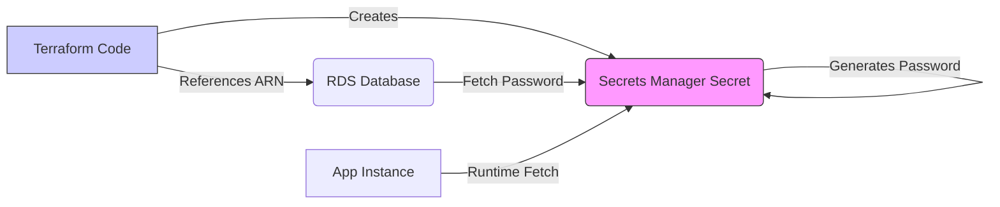
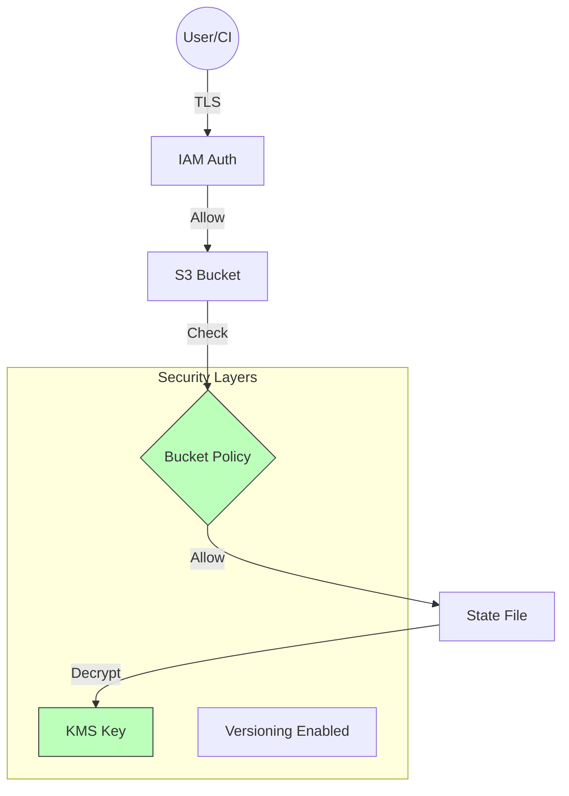

# State Security

The Terraform state file is arguably the most sensitive file in your entire infrastructure codebase. It acts as the source of truth for your resources but effectively stores a "plaintext" representation of your environment, often including secrets, keys, and metadata that attackers crave.

## 🛡️ The Threat Model: Why State is a Target
Before securing the state, we must understand the threats:
1.  **Secret Exfiltration**: Database passwords, private keys, and API tokens are often stored in the state, even if they aren't in the code.
2.  **Reconnaissance**: The state contains improved mapping of your network (IPs, Subnets) and resource IDs, aiding lateral movement.
3.  **Corruption/Sabotage**: Malicious modification of the state file can destroy infrastructure or drift it into a broken state.
4.  **Stale State**: Accessing outdated state files can lead to improper resource updates or deletions.

---

## 🔐 1. Encryption Strategies

### Encryption at Rest
Your backend *must* encrypt the state file where it is stored.
*   **Standard (SSE-S3)**: AWS handles the key. Good baseline protection.
*   **Advanced (SSE-KMS)**: You manage the Customer Master Key (CMK).
    *   *Pro*: You can audit who used the key to decrypt the state via CloudTrail.
    *   *Pro*: You can revoke access to the key instantly, rendering the state useless even if the file is stolen.

### Encryption in Transit
State data travels between your local machine/CI runner and the backend.
*   **Enforce TLS**: Ensure your S3 bucket policy denies any `s3:*` actions if `aws:SecureTransport` is `false`.
*   **TFC/TFE**: By default, Terraform Cloud communicates over TLS 1.2+.

---

## 🤫 2. Secret Management vs. State

The most common misconception: *"If I mark a variable as `sensitive = true`, it is encrypted in the state file."*
**FALSE.**
*   `sensitive = true` **only** suppresses the value in the CLI `plan` and `apply` output.
*   The value is stored in **PLAIN TEXT** in the `terraform.tfstate` JSON file.

### Recommended Pattern: "Reference, Don't Store"
Do not pass secrets into Terraform if you can avoid it. Instead:
1.  Create the secret infrastructure (e.g., RDS) using a placeholder or auto-generated password.
2.  Have the resource (e.g., AWS Secrets Manager) generate the password.
3.  Your app reads the password from Secrets Manager at runtime.
4.  Terraform only manages the *pointer* (ARN) to the secret, not the value itself.



---

## 🏰 3. Backend Hardening: Defense in Depth

Secure the "Vault" (your S3 bucket) with multiple layers.

### The S3 Defense Checklist
1.  **Private by Default**: Block all public access.
2.  **Versioning**: Enable S3 Versioning. If state is corrupted or deleted (accidentally or maliciously), you can roll back.
3.  **MFA Delete**: Require Multi-Factor Authentication to permanently delete object versions.
4.  **Bucket Policy**: Restrict access to specific IAM Roles (CI/CD Runner, Admin). Deny everyone else.
5.  **Logging**: Enable Server Access Logging to an audit bucket.

#### S3 Bucket Policy Example (Enforce TLS)
```json
{
  "Version": "2012-10-17",
  "Statement": [
    {
      "Sid": "DenyInsecureTransport",
      "Effect": "Deny",
      "Principal": "*",
      "Action": "s3:*",
      "Resource": [
        "arn:aws:s3:::my-tf-state-bucket",
        "arn:aws:s3:::my-tf-state-bucket/*"
      ],
      "Condition": {
        "Bool": {
          "aws:SecureTransport": "false"
        }
      }
    }
  ]
}
```

#### IAM Policy for CI/CD (Least Privilege)
```json
{
  "Version": "2012-10-17",
  "Statement": [
    {
      "Effect": "Allow",
      "Action": [
        "s3:GetObject",
        "s3:PutObject"
      ],
      "Resource": "arn:aws:s3:::my-tf-state-bucket/prod/*"
    },
    {
      "Effect": "Allow",
      "Action": [
        "dynamodb:PutItem",
        "dynamodb:GetItem",
        "dynamodb:DeleteItem"
      ],
      "Resource": "arn:aws:dynamodb:us-east-1:123456789012:table/terraform-locks"
    },
    {
      "Effect": "Allow",
      "Action": [
        "kms:Decrypt",
        "kms:Encrypt",
        "kms:GenerateDataKey"
      ],
      "Resource": "arn:aws:kms:us-east-1:123456789012:key/12345678-1234-1234-1234-123456789012"
    }
  ]
}
```

#### Backend Configuration with KMS
```hcl
terraform {
  backend "s3" {
    bucket         = "my-tf-state-bucket"
    key            = "prod/terraform.tfstate"
    region         = "us-east-1"
    dynamodb_table = "terraform-locks"
    encrypt        = true
    kms_key_id     = "arn:aws:kms:us-east-1:123456789012:key/12345678-1234-1234-1234-123456789012"
  }
}
```



---

## 📜 4. Policy as Code (Introduction)
Tools like **Sentinel** (HashiCorp) or **OPA** (Open Policy Agent) can enforce security *before* the state is even touched.

*   **Rule Example**: "Prevent `terraform apply` if the S3 backend bucket does not have encryption enabled."
*   **Rule Example**: "Ensure no resource of type `aws_iam_access_key` is created."

---

## 🏗️ Real-Life Scenarios

### Scenario 1: The "Git-Committed" State
*   **Problem**: A junior engineer runs Terraform locally and accidentally commits the `terraform.tfstate` file to a public GitHub repo.
*   **Impact**: Specifying `.gitignore` is crucial. The database root password was in the state.
*   **Fix**: Rotate all credentials immediately. Use remote state backends which prevent local file creation by default.

### Scenario 2: The "Disgruntled" Delete
*   **Problem**: An ex-employee still had write access to the S3 bucket and deleted the state file.
*   **Impact**: Terraform lost track of all resources. Re-importing 1000+ resources is a nightmare.
*   **Fix**: **S3 Versioning** allowed the team to restore the previous version of the state file in seconds.

---

## ❓ Interview Questions

1.  **If I use `sensitive = true`, is my variable encrypted in the state file?**
    *   **Answer**: No. It is only redacted from the CLI output. Ideally, use a remote backend with encryption at rest (S3+KMS) to protect the file itself.
2.  **How do you handle secrets (like DB passwords) in Terraform?**
    *   **Answer**: Avoid passing them as variables if possible. Use a secrets manager (AWS Secrets Manager, Vault) to generate and store them, or inject them at runtime. If unavoidable, ensure the state backend is heavily secured (KMS, IAM).
3.  **Why is S3 Versioning critical for state backends?**
    *   **Answer**: It acts as a backup. If the state file is corrupted during a failed apply or accidentally deleted, versioning allows you to rollback to the last known good state.
4.  **Explain "Encryption in Transit" for Terraform.**
    *   **Answer**: It ensures data moving between the Terraform client and the backend is encrypted (usually via TLS/HTTPS). This prevents Man-in-the-Middle attacks.
5.  **How can KMS help audit state access?**
    *   **Answer**: By using a Customer Managed Key (CMK), every decryption request is logged in CloudTrail. You can see exactly which user or role accessed the state content.

---

## 🧠 Quiz Snippet (5/20+)

1.  **Which AWS S3 feature protects against accidental state deletion?** (Versioning)
2.  **True/False: The `.terraform` folder should be committed to Git.** (False)
3.  **What is the "plaintext" risk in Terraform?** (Secrets are stored unencrypted in `tfstate` JSON)
4.  **What IAM condition enforces TLS for S3?** (`aws:SecureTransport = false` with Deny effect)
5.  **Which tool provides fine-grained Policy as Code for Terraform Enterprise?** (Sentinel)
