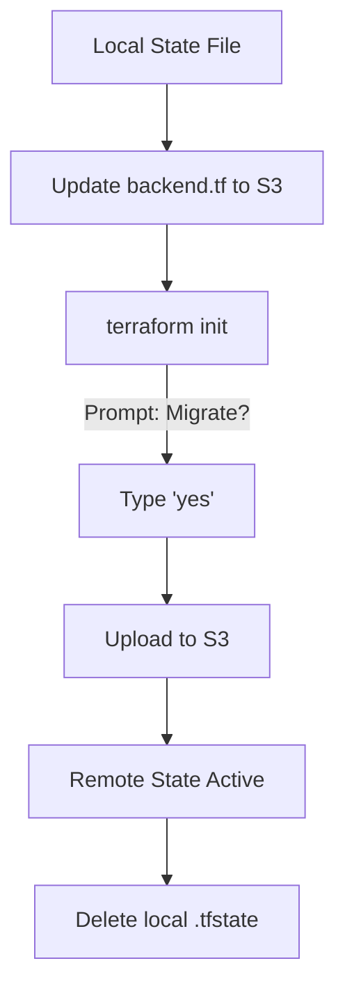

# State Migration & Versioning

Moving state between backends is a common task when upgrading infrastructure.

## How to Migrate
1. **Update Code**: Change the `backend` block in your HCL.
2. **Initialize**: Run `terraform init`.
3. **Approve**: Terraform identifies the change and asks: *"Do you want to copy existing state to the new backend?"* Type `yes`.

## State Versioning
Backends like S3 support **Bucket Versioning**.
- **Rollback**: If your state becomes corrupted, you can revert to a previous version in the S3 bucket.
- **Audit**: Every change to the state creates a new version, providing a complete history of the infrastructure.

## Mermaid Diagram: Migration Flow

---

## 🏗️ Real-Life Scenario: The Accidental Deletion Recovery
**Problem**: An administrator running a manual state command accidentally runs `terraform state rm` on the entire VPC.
**Solution**: Since S3 versioning was enabled, they navigated to the S3 console, found the previous version of `terraform.tfstate`, and restored it. Within 5 minutes, the state was back to normal.

---

## ❓ Interview Questions
1.  **What command is used to migrate state?**
    *   *Answer*: `terraform init`. It handles both initialization and migration prompts.
2.  **What happens to the old state file after migration?**
    *   *Answer*: Terraform leaves the old file on disk, but it is no longer used. It is a best practice to delete or archive it to avoid confusion.

---

## 🧠 Quiz Snippet (5/20+)
1.  **Which S3 feature allows recovering from a corrupted state?** (Versioning)
2.  **What command initializes a new backend?** (`terraform init`)
3.  **True/False: Moving state requires destroying resources.** (False)
4.  **Should you migrate state in the middle of a plan?** (No, finalize plans first)
5.  **What happens if you type 'no' during a migration prompt?** (Terraform initializes an empty state in the new backend)
