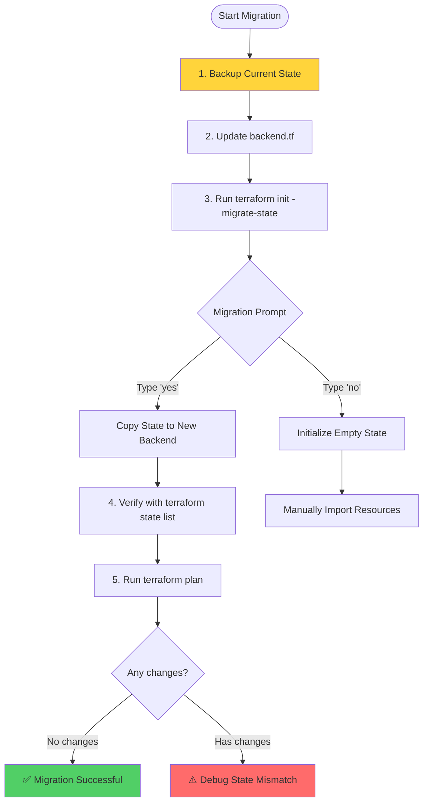
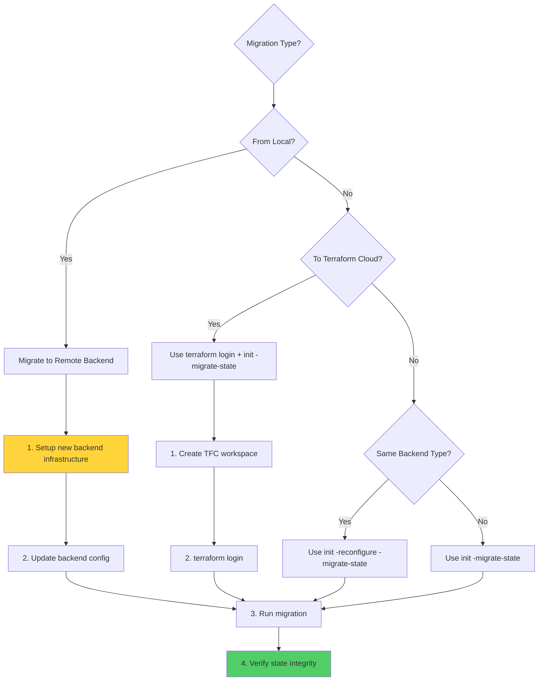
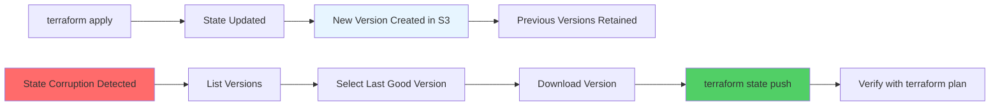
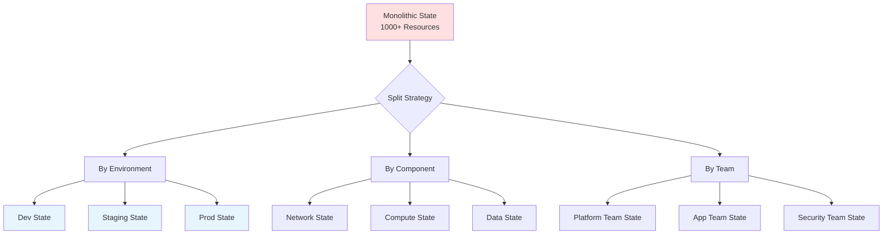

## Terraform State Migration & Versioning

Moving state between backends and managing state versions are critical skills for maintaining infrastructure reliability and enabling team collaboration.

## 🗺️ Migration Overview

State migration is the process of moving your Terraform state from one backend to another. Common scenarios include:
- Moving from local to remote state
- Changing cloud providers for state storage
- Migrating to Terraform Cloud
- Splitting monolithic state into multiple backends
- Consolidating multiple states

---

## 📋 Migration Process

### Basic Migration Steps

1. **Backup Current State**
   ```bash
   # Always backup before migration!
   terraform state pull > backup-$(date +%Y%m%d-%H%M%S).json
   ```

2. **Update Backend Configuration**
   ```hcl
   # Old configuration
   terraform {
     backend "local" {
       path = "terraform.tfstate"
     }
   }
   
   # New configuration
   terraform {
     backend "s3" {
       bucket = "my-terraform-state"
       key    = "prod/terraform.tfstate"
       region = "us-east-1"
       encrypt = true
     }
   }
   ```

3. **Initialize with Migration**
   ```bash
   terraform init -migrate-state
   ```

4. **Verify Migration**
   ```bash
   # List resources to confirm state is intact
   terraform state list
   
   # Run plan to ensure no changes
   terraform plan
   ```

5. **Clean Up Old State**
   ```bash
   # Archive old local state file
   mv terraform.tfstate terraform.tfstate.backup
   mv terraform.tfstate.backup terraform.tfstate.backup
   ```

---

## 🔄 Migration Flow Diagram



---

## 🔀 Common Migration Scenarios

### 1. Local to S3 Backend

**Before**:
```hcl
# No backend block (using local state)
```

**After**:
```hcl
terraform {
  backend "s3" {
    bucket         = "company-terraform-state"
    key            = "prod/infrastructure.tfstate"
    region         = "us-east-1"
    dynamodb_table = "terraform-locks"
    encrypt        = true
    kms_key_id     = "arn:aws:kms:us-east-1:123456789012:key/..."
  }
}
```

**Migration**:
```bash
terraform init -migrate-state
# Terraform will prompt: "Do you want to copy existing state to the new backend?"
# Type: yes
```

---

### 2. S3 to Terraform Cloud

**Before**:
```hcl
terraform {
  backend "s3" {
    bucket = "old-state-bucket"
    key    = "terraform.tfstate"
    region = "us-east-1"
  }
}
```

**After**:
```hcl
terraform {
  cloud {
    organization = "my-company"
    workspaces {
      name = "production-infrastructure"
    }
  }
}
```

**Migration**:
```bash
# Login to Terraform Cloud
terraform login

# Migrate state
terraform init -migrate-state
```

---

### 3. Backend Reconfiguration (Same Type)

When changing S3 bucket or key:

```bash
# Use -reconfigure to ignore existing backend
terraform init -reconfigure -migrate-state
```

---

## 📊 Migration Strategy Decision Tree



---

## 📦 State Versioning

### S3 Bucket Versioning

**Enable Versioning**:
```bash
aws s3api put-bucket-versioning \
  --bucket my-terraform-state \
  --versioning-configuration Status=Enabled
```

**Benefits**:
- **Rollback**: Recover from corrupted state
- **Audit Trail**: Complete history of infrastructure changes
- **Disaster Recovery**: Restore to any previous point in time
- **Accidental Deletion Protection**: Versions are retained even after deletion

### Listing State Versions

```bash
# List all versions of state file
aws s3api list-object-versions \
  --bucket my-terraform-state \
  --prefix terraform.tfstate

# Output shows:
# - VersionId
# - LastModified
# - Size
# - IsLatest
```

### Restoring a Previous Version

```bash
# Download specific version
aws s3api get-object \
  --bucket my-terraform-state \
  --key terraform.tfstate \
  --version-id "VERSION_ID_HERE" \
  restored-state.json

# Verify the restored state
cat restored-state.json | jq '.version'

# Upload as current state
terraform state push restored-state.json
```

---

## 🔄 Version Management Workflow



---

## 🛠️ Advanced Migration Techniques

### Partial State Migration

When splitting a monolithic state:

```bash
# In original workspace
terraform state rm 'module.database.*'

# In new workspace for database
# Create import blocks or use terraform import
terraform import module.database.aws_db_instance.main db-instance-id
```

### State Splitting Strategy



### Cross-Backend Migration

```bash
# 1. Pull state from old backend
terraform state pull > migration-state.json

# 2. Update backend configuration
# Edit backend.tf

# 3. Initialize new backend
terraform init

# 4. Push state to new backend
terraform state push migration-state.json

# 5. Verify
terraform plan
```

---

## 🏗️ Real-Life Scenarios

### Scenario 1: The Accidental Deletion Recovery
**Problem**: An administrator running a manual state command accidentally runs `terraform state rm` on the entire VPC module, removing 50+ resources from state.

**Impact**: 
- VPC, subnets, route tables, NAT gateways all removed from management
- Next `terraform plan` shows it wants to create everything from scratch
- Risk of duplicate resources and conflicts

**Discovery**: Engineer notices `terraform plan` wants to create existing resources.

**Solution**:
```bash
# 1. List all versions to find the last good state
aws s3api list-object-versions \
  --bucket prod-terraform-state \
  --prefix terraform.tfstate \
  --query 'Versions[*].[VersionId,LastModified]' \
  --output table

# 2. Download the version from before the mistake (5 minutes ago)
aws s3api get-object \
  --bucket prod-terraform-state \
  --key terraform.tfstate \
  --version-id "VERSION_ID_BEFORE_MISTAKE" \
  restored-state.json

# 3. Verify the restored state has the VPC resources
cat restored-state.json | jq '.resources[] | select(.module=="module.vpc") | .type'

# 4. Restore the state
terraform state push restored-state.json

# 5. Verify restoration
terraform state list | grep vpc
terraform plan  # Should show no changes
```

**Prevention**:
- Enable S3 versioning on all state buckets
- Set lifecycle policies to retain versions for 90+ days
- Implement state file backups before major operations
- Use `-lock=true` to prevent concurrent modifications

**Recovery Time**: 5 minutes

---

### Scenario 2: The Multi-Region Migration
**Problem**: Company needs to migrate from a single global state file to region-specific state files for better isolation and performance.

**Challenge**: 
- 500+ resources across 3 AWS regions
- Need to maintain resource management during migration
- Zero downtime requirement

**Solution**:
```bash
# Phase 1: Backup everything
terraform state pull > global-state-backup.json

# Phase 2: Create new regional backends
# us-east-1-backend.tf
terraform {
  backend "s3" {
    bucket = "terraform-state-us-east-1"
    key    = "regional/terraform.tfstate"
    region = "us-east-1"
  }
}

# Phase 3: Split state by region
# For each region, remove resources from global state
terraform state rm 'module.us_west_2.*'
terraform state rm 'module.eu_west_1.*'

# Phase 4: In new regional workspaces, import resources
cd ../us-west-2-workspace
terraform init
# Use declarative imports (Terraform 1.5+)
terraform plan -generate-config-out=imported.tf

# Phase 5: Verify each regional state
terraform plan  # Should show no changes in each workspace
```

**Benefits Achieved**:
- Reduced state file size (500+ → ~170 resources per region)
- Faster `terraform plan` operations (60s → 20s)
- Better isolation (regional failures don't affect other regions)
- Improved team collaboration (regional teams own their state)

---

### Scenario 3: The Terraform Cloud Migration
**Problem**: Team using S3 backend wants to migrate to Terraform Cloud for better collaboration, remote execution, and policy enforcement.

**Challenge**:
- 20 workspaces with different state files
- Need to maintain state history
- Team members need training on new workflow

**Solution**:
```bash
# 1. Create Terraform Cloud organization and workspaces
# (Done via UI or tfe provider)

# 2. For each workspace, update backend configuration
# old-backend.tf
terraform {
  backend "s3" {
    bucket = "company-terraform-state"
    key    = "prod/app.tfstate"
    region = "us-east-1"
  }
}

# new-backend.tf
terraform {
  cloud {
    organization = "company-name"
    
    workspaces {
      name = "prod-app"
    }
  }
}

# 3. Login to Terraform Cloud
terraform login

# 4. Migrate state
terraform init -migrate-state
# Prompt: "Do you want to copy existing state to the new backend?"
# Answer: yes

# 5. Verify migration
terraform state list
terraform plan  # Should show no changes

# 6. Archive old S3 state (after verification period)
aws s3 sync s3://company-terraform-state/ s3://archive-bucket/terraform-state-archive/
```

**Benefits**:
- Remote execution (no local credentials needed)
- Policy enforcement with Sentinel
- Better collaboration with workspace sharing
- Audit logs for all operations
- Cost estimation before apply

---

### Scenario 4: The Backend Corruption Recovery
**Problem**: S3 bucket hosting state files was accidentally deleted, taking all state files with it.

**Impact**:
- Complete loss of state for 10 workspaces
- 1,000+ resources no longer tracked
- Team unable to make infrastructure changes

**Discovery**: `terraform init` fails with "bucket does not exist" error.

**Solution**:
```bash
# 1. Check if versioning was enabled and bucket can be recovered
aws s3api list-buckets | grep terraform-state
# Bucket is gone

# 2. Restore from backup (if available)
# Option A: Restore from automated backups
aws s3 sync s3://backup-bucket/terraform-state-backups/latest/ s3://new-terraform-state/

# Option B: Restore from local backups
# Find latest local backup
ls -lt ~/terraform-backups/

# 3. Recreate S3 bucket with versioning
aws s3api create-bucket \
  --bucket new-terraform-state \
  --region us-east-1

aws s3api put-bucket-versioning \
  --bucket new-terraform-state \
  --versioning-configuration Status=Enabled

# 4. Upload restored state files
aws s3 cp ~/terraform-backups/latest/ s3://new-terraform-state/ --recursive

# 5. Update backend configuration in all workspaces
# Update bucket name in backend.tf

# 6. Reinitialize
terraform init -reconfigure

# 7. Verify
terraform state list
terraform plan
```

**Prevention**:
- Enable S3 bucket versioning
- Enable MFA Delete on state buckets
- Implement automated state backups to separate bucket
- Use S3 bucket replication to another region
- Set up CloudWatch alarms for bucket deletion
- Use AWS Organizations SCPs to prevent bucket deletion

---

### Scenario 5: The State Format Upgrade
**Problem**: After upgrading Terraform from 0.12 to 1.0, state file format needs to be upgraded.

**Challenge**:
- State format version mismatch
- Need to upgrade without breaking existing resources
- Multiple team members using different Terraform versions

**Solution**:
```bash
# 1. Backup current state
terraform state pull > state-backup-v0.12.json

# 2. Check current state version
cat state-backup-v0.12.json | jq '.version'
# Output: 4 (Terraform 0.12 format)

# 3. Upgrade Terraform binary
terraform version
# Terraform v1.0.0

# 4. Run terraform init to upgrade state format
terraform init -upgrade

# 5. Run plan to trigger state upgrade
terraform plan
# Terraform automatically upgrades state format to version 4

# 6. Verify state version
terraform state pull | jq '.version'
# Output: 4 (compatible with Terraform 1.0)

# 7. Communicate to team
# Send message: "State upgraded to Terraform 1.0 format. Please upgrade to Terraform 1.0+"

# 8. Update CI/CD pipelines
# Update Terraform version in pipeline configuration
```

**Prevention**:
- Use Terraform version constraints in `required_version`
- Implement gradual rollout of Terraform upgrades
- Test upgrades in non-production environments first
- Document Terraform version requirements in README

---

## ❓ Interview Questions

1. **What command is used to migrate state between backends?**
   - **Answer**: `terraform init -migrate-state`. This command initializes the new backend and prompts to copy the existing state. You can also use `terraform init` alone, which will detect the backend change and prompt for migration.

2. **What happens to the old state file after migration?**
   - **Answer**: Terraform leaves the old state file in its original location but no longer uses it. It's a best practice to archive or delete it to avoid confusion. For remote backends, the old backend's state remains until manually deleted.

3. **How do you rollback to a previous state version in S3?**
   - **Answer**: 
     1. List versions: `aws s3api list-object-versions --bucket BUCKET --prefix terraform.tfstate`
     2. Download desired version: `aws s3api get-object --version-id VERSION_ID`
     3. Push to current state: `terraform state push restored-state.json`
     4. Verify: `terraform plan`

4. **What is the difference between `-migrate-state` and `-reconfigure`?**
   - **Answer**:
     - `-migrate-state`: Copies existing state to the new backend (use when changing backends)
     - `-reconfigure`: Ignores existing backend configuration and initializes fresh (use when backend config is broken or you want to start over)

5. **Can you migrate state without downtime?**
   - **Answer**: Yes, if done correctly:
     1. Migration happens during `terraform init`, not during `apply`
     2. State is copied, not moved (old state remains until deleted)
     3. No infrastructure changes occur during migration
     4. Use state locking to prevent concurrent operations

6. **What are the risks of state migration?**
   - **Answer**:
     - State corruption if migration is interrupted
     - Loss of state if backup is not taken
     - State drift if resources are modified during migration
     - Team confusion if not all members are informed
     - Downtime if locking fails during migration

7. **How do you split a monolithic state file?**
   - **Answer**:
     1. Backup original state
     2. Create new workspaces/backends for each split
     3. Remove resources from original state: `terraform state rm 'module.name.*'`
     4. Import resources into new states: `terraform import` or declarative imports
     5. Verify each state independently: `terraform plan`

8. **What is state versioning and why is it important?**
   - **Answer**: State versioning (via S3 bucket versioning) creates a new version of the state file with each change. It's important because:
     - Enables rollback to previous states
     - Provides audit trail of infrastructure changes
     - Protects against accidental deletions
     - Allows recovery from corruption
     - Supports disaster recovery procedures

9. **How do you verify a successful state migration?**
   - **Answer**:
     1. Run `terraform state list` to confirm all resources are present
     2. Run `terraform plan` to ensure no unexpected changes
     3. Check resource count matches original state
     4. Verify backend configuration is correct
     5. Test a small change (like updating a tag) to confirm operations work

10. **What should you do before migrating state in production?**
    - **Answer**:
      - Take a backup: `terraform state pull > backup.json`
      - Test migration in non-production environment first
      - Communicate with team about migration window
      - Ensure no concurrent Terraform operations
      - Verify new backend infrastructure is ready
      - Have rollback plan documented
      - Schedule during low-traffic period

---

## 🧠 Quiz Questions (25 Total)

### Migration Basics (1-8)

1. **What command migrates state between backends?**
   - Answer: `terraform init -migrate-state`

2. **True/False: State migration requires destroying and recreating resources.**
   - Answer: False (migration only moves the state file, not resources)

3. **What happens if you type 'no' during a migration prompt?**
   - Answer: Terraform initializes an empty state in the new backend

4. **Which flag forces backend reconfiguration?**
   - Answer: `-reconfigure`

5. **True/False: You should always backup state before migration.**
   - Answer: True

6. **What command backs up the current state?**
   - Answer: `terraform state pull > backup.json`

7. **Can you migrate from local to S3 backend?**
   - Answer: Yes, using `terraform init -migrate-state`

8. **True/False: Old state files are automatically deleted after migration.**
   - Answer: False (they remain until manually deleted)

### Versioning (9-16)

9. **Which S3 feature enables state versioning?**
   - Answer: S3 Bucket Versioning

10. **What command lists all state file versions?**
    - Answer: `aws s3api list-object-versions`

11. **True/False: State versions are automatically deleted after 30 days.**
    - Answer: False (retained based on lifecycle policy or indefinitely)

12. **How do you restore a specific state version?**
    - Answer: Download with `aws s3api get-object --version-id`, then `terraform state push`

13. **What is the benefit of state versioning?**
    - Answer: Rollback capability and audit trail

14. **True/False: Terraform Cloud automatically versions state.**
    - Answer: True

15. **What protects against accidental version deletion?**
    - Answer: MFA Delete

16. **How many state versions should you retain?**
    - Answer: At least 30-90 days worth (or per compliance requirements)

### Advanced Migration (17-25)

17. **What is partial state migration?**
    - Answer: Moving only some resources to a new state file

18. **Which command removes resources from state?**
    - Answer: `terraform state rm`

19. **True/False: You can migrate between different cloud providers' backends.**
    - Answer: True (e.g., S3 to Azure Blob)

20. **What is the purpose of `-lock=false` during migration?**
    - Answer: Skip state locking (dangerous, use only if lock is stuck)

21. **How do you migrate to Terraform Cloud?**
    - Answer: Update backend to `cloud` block, run `terraform login`, then `terraform init -migrate-state`

22. **True/False: State migration can be automated in CI/CD.**
    - Answer: True (but requires careful planning)

23. **What should you verify after migration?**
    - Answer: `terraform state list` and `terraform plan` show expected results

24. **Can you migrate state while resources are being created?**
    - Answer: No, wait for operations to complete first

25. **What is the safest time to migrate state?**
    - Answer: During a maintenance window with no active operations

---

## 🎓 Best Practices

### ✅ DO:
- Always backup state before migration (`terraform state pull`)
- Test migration in non-production first
- Enable S3 versioning on state buckets
- Communicate migration plans to team
- Verify migration with `terraform plan`
- Document migration procedures
- Use `-migrate-state` flag explicitly
- Archive old state files after successful migration
- Set up automated state backups
- Use state locking during migration

### ❌ DON'T:
- Don't migrate during active deployments
- Don't skip backups "just this once"
- Don't forget to update team on backend changes
- Don't delete old state immediately after migration
- Don't migrate without testing first
- Don't ignore migration errors
- Don't use `-lock=false` unless absolutely necessary
- Don't migrate multiple workspaces simultaneously
- Don't forget to update CI/CD pipeline configurations
- Don't assume migration is reversible without backups

---

## 🔧 Troubleshooting Guide

### Common Issues

**Issue**: "Error acquiring the state lock"
```bash
# Solution: Wait for lock to release or force unlock (carefully)
terraform force-unlock LOCK_ID
```

**Issue**: "Backend configuration changed"
```bash
# Solution: Reinitialize with migration
terraform init -migrate-state
```

**Issue**: "State file is empty after migration"
```bash
# Solution: Restore from backup
terraform state push backup.json
```

**Issue**: "Version mismatch between state and Terraform"
```bash
# Solution: Upgrade Terraform or downgrade state
terraform init -upgrade
```

---

## 🔗 Related Topics
- [Remote State Backends](../03-Remote-State-Backends/Remote%20State%20Backends.md) - Backend configuration
- [State Operations](../05-State-Operations/State%20Operations.md) - State manipulation commands
- [State Security](../06-State-Security/State%20Security.md) - Protecting state during migration
