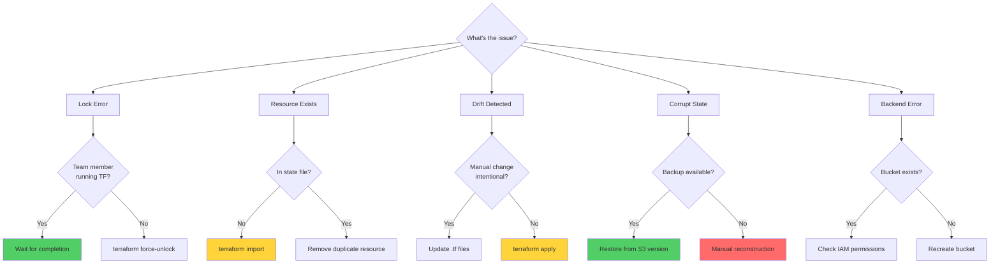
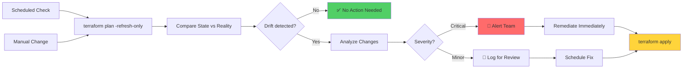

Handling common errors like corrupted state, lost locks, drift detection, and recovery operations is essential for maintaining reliable infrastructure.

## 🔍 Troubleshooting Overview
State issues can manifest in various ways:
- **Lock conflicts**: Multiple users or processes trying to modify state
- **Drift detection**: Real infrastructure differs from state
- **Corruption**: State file becomes invalid or unreadable
- **Missing resources**: State and reality are out of sync
- **Backend failures**: Cannot access or write to remote backend

---
## 🚨 Common State Errors

### 1. "Error acquiring state lock"
**Symptoms**:
```
Error: Error acquiring the state lock
Lock Info:
  ID:        a1b2c3d4-5678-90ab-cdef-1234567890ab
  Path:      s3://bucket/terraform.tfstate
  Operation: OperationTypeApply
  Who:       user@hostname
  Version:   1.5.0
  Created:   2025-12-30 14:30:00 UTC
```
**Causes**:
- Another user/process is running Terraform
- Previous process crashed without releasing lock
- Network interruption during operation
- CI/CD pipeline still running
**Diagnosis**:
```bash
# Check who holds the lock (info in error message)
# Verify with team if that person is actually running Terraform

# Check DynamoDB for lock (if using S3 backend)
aws dynamodb get-item \
  --table-name terraform-locks \
  --key '{"LockID": {"S": "bucket/terraform.tfstate-md5"}}'
```
**Solutions**:

**Option 1: Wait** (Safest)
```bash
# Wait for the operation to complete naturally
# Check with the lock holder
```
**Option 2: Force Unlock** (Use with caution)
```bash
# Only if you're CERTAIN no one is running Terraform
terraform force-unlock a1b2c3d4-5678-90ab-cdef-1234567890ab

# Confirm when prompted
```
**Prevention**:
- Communicate with team before running Terraform
- Use CI/CD pipelines to serialize operations
- Implement workspace-based isolation
- Set reasonable lock timeout values

---
### 2. "Resource already exists"
**Symptoms**:
```
Error: Error creating EC2 Instance: InvalidParameterValue: 
Resource with name 'web-server' already exists
```
**Causes**:
- Resource created manually in cloud console
- State file was deleted or lost
- Resource was imported incorrectly
- Partial apply failure left orphaned resources
**Diagnosis**:
```bash
# Check if resource exists in cloud
aws ec2 describe-instances --filters "Name=tag:Name,Values=web-server"

# Check if resource is in state
terraform state list | grep web-server
```
**Solutions**:
**Option 1: Import Existing Resource**
```bash
# Import the existing resource into state
terraform import aws_instance.web i-1234567890abcdef0

# Verify import
terraform state show aws_instance.web
terraform plan  # Should show no changes
```
**Option 2: Remove and Recreate** (Destructive)
```bash
# Manually delete the cloud resource
aws ec2 terminate-instances --instance-ids i-1234567890abcdef0

# Run Terraform to create it properly
terraform apply
```
**Prevention**:
- Always use Terraform for infrastructure changes
- Enable remote state with versioning
- Use import blocks (Terraform 1.5+) for existing resources
- Implement policy-as-code to prevent manual changes

---
### 3. Configuration Drift
**Symptoms**:
```
Terraform will perform the following actions:

  # aws_instance.web will be updated in-place
  ~ resource "aws_instance" "web" {
      ~ instance_type = "t2.small" -> "t2.micro"
        # (other attributes unchanged)
    }
```
**Causes**:
- Manual changes in cloud console
- Auto-scaling or auto-remediation systems
- Other automation tools modifying resources
- Emergency hotfixes applied directly
**Diagnosis**:
```bash
# Detect drift
terraform plan -refresh-only

# Detailed drift report
terraform plan -out=tfplan
terraform show -json tfplan | jq '.resource_changes[] | select(.change.actions != ["no-op"])'
```
**Solutions**:
**Option 1: Overwrite Manual Changes**
```bash
# Apply Terraform configuration to fix drift
terraform apply
```
**Option 2: Update Code to Match Reality**
```bash
# If manual change was intentional, update code
# Edit .tf files to match current state
# Then apply
terraform apply
```
**Option 3: Refresh State Only**
```bash
# Update state to match reality without making changes
terraform apply -refresh-only
```
**Prevention**:
- Implement IAM policies to prevent manual changes
- Use AWS Config rules to detect drift
- Set up CloudWatch alarms for manual modifications
- Regular drift detection in CI/CD
---
### 4. "State file is corrupt"
**Symptoms**:
```
Error: Failed to load state: state snapshot was created by Terraform v1.5.0, 
which is newer than current v1.4.0; upgrade to Terraform v1.5.0 or greater
```
Or:
```
Error: Failed to decode state: invalid character 'x' looking for beginning of value
```
**Causes**:
- State file manually edited incorrectly
- Terraform version mismatch
- Incomplete write operation
- File system corruption
**Diagnosis**:
```bash
# Check state file validity
terraform state pull > current-state.json
cat current-state.json | jq '.'

# Check Terraform version
terraform version
cat current-state.json | jq '.terraform_version'
```
**Solutions**:
**Option 1: Restore from Backup**
```bash
# List S3 versions
aws s3api list-object-versions \
  --bucket terraform-state \
  --prefix terraform.tfstate

# Download previous version
aws s3api get-object \
  --bucket terraform-state \
  --key terraform.tfstate \
  --version-id "VERSION_BEFORE_CORRUPTION" \
  restored-state.json

# Restore
terraform state push restored-state.json
```
**Option 2: Upgrade Terraform**
```bash
# If version mismatch, upgrade Terraform
tfenv install 1.5.0
tfenv use 1.5.0
terraform version
```
**Option 3: Manual State Reconstruction** (Last Resort)
```bash
# Create new empty state
terraform init

# Import all resources one by one
terraform import aws_instance.web i-1234567890abcdef0
terraform import aws_vpc.main vpc-1234567890abcdef0
# ... repeat for all resources
```
---
### 5. "Backend initialization failed"
**Symptoms**:
```
Error: Failed to get existing workspaces: S3 bucket does not exist
```
**Causes**:
- S3 bucket deleted or renamed
- Incorrect backend configuration
- IAM permissions insufficient
- Region mismatch
**Diagnosis**:
```bash
# Check if bucket exists
aws s3 ls s3://terraform-state-bucket

# Check IAM permissions
aws sts get-caller-identity
aws iam simulate-principal-policy \
  --policy-source-arn arn:aws:iam::123456789012:user/terraform \
  --action-names s3:GetObject s3:PutObject
```
**Solutions**:
**Option 1: Recreate Backend**
```bash
# Recreate S3 bucket
aws s3api create-bucket \
  --bucket terraform-state-bucket \
  --region us-east-1

# Enable versioning
aws s3api put-bucket-versioning \
  --bucket terraform-state-bucket \
  --versioning-configuration Status=Enabled

# Restore state from backup
aws s3 cp backup-state.json s3://terraform-state-bucket/terraform.tfstate
```
**Option 2: Reconfigure Backend**
```bash
# Update backend configuration in code
# Then reinitialize
terraform init -reconfigure
```
---

## 🔄 Troubleshooting Decision Tree

---
## 🛠️ Diagnostic Commands Reference

### State Inspection
```bash
# List all resources in state
terraform state list

# Show specific resource details
terraform state show aws_instance.web

# Pull entire state to stdout
terraform state pull

# Pull state to file
terraform state pull > backup.json
```
### Drift Detection
```bash
# Check for drift (read-only)
terraform plan -refresh-only

# Detailed plan output
terraform plan -out=tfplan
terraform show tfplan

# JSON format for parsing
terraform show -json tfplan | jq '.'
```
### Lock Management
```bash
# Force unlock (use with extreme caution)
terraform force-unlock LOCK_ID

# Check DynamoDB lock table
aws dynamodb scan --table-name terraform-locks
```
### State Validation
```bash
# Validate state file syntax
cat terraform.tfstate | jq '.'

# Check state version
terraform state pull | jq '.version, .terraform_version'

# Verify resource count
terraform state list | wc -l
```
### Debug Logging
```bash
# Enable debug logging
export TF_LOG=DEBUG
export TF_LOG_PATH=terraform-debug.log
terraform plan

# Trace level (most verbose)
export TF_LOG=TRACE
terraform apply
```
---
## 📊 Drift Detection Workflow


---
## 🔧 Recovery Operations

### State Pull/Push
**When to use**: Manual state editing as last resort
```bash
# Pull current state
terraform state pull > state-backup.json

# Edit carefully (JSON format)
vim state-backup.json

# Validate JSON
cat state-backup.json | jq '.'

# Push modified state
terraform state push state-backup.json

# Verify changes
terraform plan
```
**⚠️ Warning**: Manual state editing is dangerous. Only use when:
- You fully understand the state file structure
- You have backups
- Other recovery methods have failed
### Backend Reconfiguration
**When to use**: `.terraform` directory is corrupted
```bash
# Remove local Terraform directory
rm -rf .terraform

# Reinitialize
terraform init -reconfigure

# Verify
terraform state list
```
### State Replacement
**When to use**: Need to mark resource for recreation
```bash
# Mark resource as tainted (Terraform < 0.15.2)
terraform taint aws_instance.web

# Replace resource (Terraform >= 0.15.2)
terraform apply -replace="aws_instance.web"
```
---
## 🏗️ Real-Life Scenarios

### Scenario 1: The Ghost Lock
**Problem**: After an internet outage, Terraform shows "Lock ID 123-abc is held by UserX." UserX's computer is off and they're on vacation.

**Impact**:
- Entire team blocked from making infrastructure changes
- Production deployment delayed
- Lock has been held for 2 hours

**Discovery**: Team member tries to run `terraform apply` and gets lock error.

**Solution**:
```bash
# 1. Verify UserX is not running Terraform
# Check with team, confirm UserX is on vacation

# 2. Check lock details in error message
# Lock ID: 123-abc
# Who: userx@laptop
# Created: 2 hours ago

# 3. Verify in DynamoDB
aws dynamodb get-item \
  --table-name terraform-locks \
  --key '{"LockID": {"S": "prod-state/terraform.tfstate-md5"}}'

# 4. Force unlock
terraform force-unlock 123-abc
# Type: yes

# 5. Verify unlock successful
terraform plan  # Should work now
```
**Prevention**:
- Implement lock timeout (30 minutes)
- Set up monitoring for stuck locks
- Use CI/CD for production changes
- Document force-unlock procedures
**Resolution Time**: 10 minutes

---
### Scenario 2: The Drift Disaster
**Problem**: Production RDS instance was manually scaled up during a performance incident. Next day, Terraform wants to scale it back down.

**Impact**:
- `terraform plan` shows it will downgrade instance type
- Risk of performance degradation if applied
- Manual change not documented in code

**Discovery**: Daily drift detection job alerts team.

**Solution**:
```bash
# 1. Detect the drift
terraform plan -refresh-only
# Shows: instance_type: "db.r5.2xlarge" -> "db.r5.large"

# 2. Investigate why manual change was made
# Team confirms: emergency performance fix during incident

# 3. Update Terraform code to match reality
# Edit main.tf
resource "aws_db_instance" "main" {
  instance_class = "db.r5.2xlarge"  # Updated from db.r5.large
  # ... other config
}

# 4. Apply to sync state
terraform apply
# Shows: No changes needed (code now matches reality)

# 5. Document in change log
git commit -m "Update RDS instance size to match production (post-incident)"
```

**Prevention**:
- Implement change management process
- Use IAM policies to restrict manual changes
- Set up drift detection alerts
- Document emergency procedures

**Lesson**: Manual changes should always be followed by code updates.

---

### Scenario 3: The Corrupted State
**Problem**: State file became corrupted after a failed `terraform apply` during network interruption.

**Impact**:
- `terraform plan` fails with JSON parse error
- Cannot make any infrastructure changes
- 200+ resources at risk

**Discovery**: `terraform plan` returns error.

**Error**:
```
Error: Failed to decode state: invalid character '}' looking for beginning of value
```

**Solution**:
```bash
# 1. Attempt to pull state (fails)
terraform state pull
# Error: Failed to decode state

# 2. Check S3 for state file versions
aws s3api list-object-versions \
  --bucket prod-terraform-state \
  --prefix terraform.tfstate \
  --query 'Versions[*].[VersionId,LastModified,Size]' \
  --output table

# Output shows:
# Latest version: 1.2KB (corrupted, should be ~50KB)
# Previous version: 48KB (10 minutes ago)

# 3. Download previous good version
aws s3api get-object \
  --bucket prod-terraform-state \
  --key terraform.tfstate \
  --version-id "VERSION_ID_BEFORE_CORRUPTION" \
  restored-state.json

# 4. Validate restored state
cat restored-state.json | jq '.' > /dev/null
echo $?  # Should return 0 (valid JSON)

# 5. Push restored state
terraform state push restored-state.json

# 6. Verify restoration
terraform state list | wc -l  # Should show ~200 resources
terraform plan  # Should work now
```

**Prevention**:
- Enable S3 versioning (critical!)
- Set lifecycle policy to retain versions for 90 days
- Implement automated state backups
- Use state locking to prevent concurrent writes

**Recovery Time**: 15 minutes

---

### Scenario 4: The Import Marathon
**Problem**: Developer accidentally deleted local state file containing 150+ resources. No remote backend configured.

**Impact**:
- Complete loss of state
- Terraform wants to create all resources (which already exist)
- Risk of duplicate resources and conflicts

**Discovery**: `terraform plan` shows 150+ resources to create.

**Solution**:
```bash
# 1. Assess the damage
terraform plan | grep "will be created"
# Shows 150+ resources

# 2. Create import script
cat > import-all.sh << 'EOF'
#!/bin/bash
# Import VPC
terraform import aws_vpc.main vpc-1234567890abcdef0

# Import Subnets
terraform import 'aws_subnet.public[0]' subnet-111111111
terraform import 'aws_subnet.public[1]' subnet-222222222
terraform import 'aws_subnet.private[0]' subnet-333333333

# Import Security Groups
terraform import aws_security_group.web sg-aaaaaaaaa
terraform import aws_security_group.db sg-bbbbbbbbb

# Import EC2 Instances
terraform import 'aws_instance.web[0]' i-111111111
terraform import 'aws_instance.web[1]' i-222222222

# ... (148 more imports)
EOF

# 3. Get resource IDs from AWS
aws ec2 describe-vpcs --query 'Vpcs[*].[VpcId,Tags[?Key==`Name`].Value|[0]]'
aws ec2 describe-subnets --query 'Subnets[*].[SubnetId,Tags[?Key==`Name`].Value|[0]]'
# ... for all resource types

# 4. Run import script
chmod +x import-all.sh
./import-all.sh

# 5. Verify imports
terraform state list | wc -l  # Should show 150+
terraform plan  # Should show minimal/no changes
```

**Better Solution (Terraform 1.5+)**:
```bash
# Use declarative imports
terraform plan -generate-config-out=imported.tf
# Review imported.tf
terraform apply
```

**Prevention**:
- **Always use remote state backends**
- Enable S3 versioning
- Implement automated backups
- Use version control for state files (if local)

**Recovery Time**: 4-6 hours (manual imports) or 30 minutes (declarative imports)

---

### Scenario 5: The Backend Migration Failure
**Problem**: During migration from local to S3 backend, process was interrupted, leaving state in inconsistent state.

**Impact**:
- State partially migrated
- Some resources in S3, some in local file
- `terraform plan` shows unexpected changes

**Discovery**: After interrupted migration, `terraform plan` shows resources being recreated.

**Solution**:
```bash
# 1. Check local state
cat terraform.tfstate | jq '.resources | length'
# Shows: 80 resources

# 2. Check remote state
terraform state pull > remote-state.json
cat remote-state.json | jq '.resources | length'
# Shows: 70 resources

# 3. Identify missing resources
diff <(cat terraform.tfstate | jq -r '.resources[].type + "." + .resources[].name' | sort) \
     <(cat remote-state.json | jq -r '.resources[].type + "." + .resources[].name' | sort)

# 4. Restore from local backup
cp terraform.tfstate.backup complete-state.json

# 5. Push complete state to remote backend
terraform state push complete-state.json

# 6. Verify
terraform state list | wc -l  # Should show 80 resources
terraform plan  # Should show no changes

# 7. Remove local state
rm terraform.tfstate terraform.tfstate.backup
```

**Prevention**:
- Always backup before migration
- Test migration in non-production first
- Don't interrupt migration process
- Use `-migrate-state` flag explicitly

**Recovery Time**: 20 minutes

---

## ❓ Interview Questions

1. **What is "Infrastructure Drift"?**
   - **Answer**: Infrastructure drift occurs when the actual state of cloud resources differs from what's defined in your Terraform code. This typically happens due to manual changes in the cloud console, auto-scaling actions, or other automation tools modifying resources. Drift can lead to unexpected behavior when Terraform tries to reconcile the differences.

2. **How do you detect and fix drift?**
   - **Answer**: 
     - **Detect**: Run `terraform plan -refresh-only` to compare state with reality
     - **Fix Option 1**: Run `terraform apply` to overwrite manual changes and sync reality to code
     - **Fix Option 2**: Update Terraform code to match reality, then apply
     - **Fix Option 3**: Use `terraform apply -refresh-only` to update state without making changes

3. **When should you use `terraform force-unlock`?**
   - **Answer**: Only use `force-unlock` when:
     - You've confirmed no one else is running Terraform
     - A previous process crashed without releasing the lock
     - The lock holder's machine is offline
     - You've waited a reasonable time and verified with the team
     - **Never** use it if someone might actually be running Terraform, as it can cause state corruption

4. **How do you recover from a corrupted state file?**
   - **Answer**:
     1. Check S3 versions: `aws s3api list-object-versions`
     2. Download previous good version: `aws s3api get-object --version-id`
     3. Validate the restored state: `cat state.json | jq '.'`
     4. Push restored state: `terraform state push state.json`
     5. Verify: `terraform plan`
     - If no backups exist, you'll need to manually reconstruct state using `terraform import`

5. **What's the difference between `terraform plan` and `terraform plan -refresh-only`?**
   - **Answer**:
     - `terraform plan`: Refreshes state AND shows what changes would be applied to match code
     - `terraform plan -refresh-only`: Only refreshes state to match reality, doesn't propose infrastructure changes
     - Use `-refresh-only` for drift detection without risk of applying changes

6. **How do you troubleshoot "Resource already exists" errors?**
   - **Answer**:
     1. Verify resource exists in cloud: `aws ec2 describe-instances`
     2. Check if it's in state: `terraform state list`
     3. If not in state, import it: `terraform import resource.name resource-id`
     4. If in state, check for duplicate resource definitions in code
     5. Verify import with `terraform plan` (should show no changes)

7. **What environment variables help with Terraform debugging?**
   - **Answer**:
     - `TF_LOG=DEBUG`: Enable debug logging
     - `TF_LOG=TRACE`: Most verbose logging level
     - `TF_LOG_PATH=./terraform.log`: Write logs to file
     - `TF_LOG_CORE=TRACE`: Core Terraform logging
     - `TF_LOG_PROVIDER=TRACE`: Provider-specific logging

8. **How do you handle state file version mismatches?**
   - **Answer**:
     - Check versions: `terraform version` and `cat state.json | jq '.terraform_version'`
     - If state is newer: Upgrade Terraform to match or newer
     - If Terraform is newer: Usually compatible, but check release notes
     - Use `terraform init -upgrade` to upgrade provider versions
     - Always test version upgrades in non-production first

9. **What's the safest way to manually edit state?**
   - **Answer**:
     1. Backup first: `terraform state pull > backup.json`
     2. Use Terraform commands when possible: `terraform state rm`, `terraform state mv`
     3. If manual edit needed:
        - Pull state: `terraform state pull > state.json`
        - Edit carefully (valid JSON)
        - Validate: `cat state.json | jq '.'`
        - Push: `terraform state push state.json`
        - Verify: `terraform plan`
     4. **Avoid manual editing** unless absolutely necessary

10. **How do you prevent common state issues?**
    - **Answer**:
      - Use remote backends with versioning
      - Enable state locking (DynamoDB for S3)
      - Implement CI/CD for serialized operations
      - Regular drift detection
      - IAM policies to prevent manual changes
      - Automated state backups
      - Team communication protocols
      - Use workspaces for isolation
      - Document troubleshooting procedures

---

## 🧠 Quiz Questions (25 Total)

### Lock Issues (1-6)

1. **What command forces a state lock release?**
   - Answer: `terraform force-unlock LOCK_ID`

2. **True/False: You should always try force-unlock first.**
   - Answer: False (check with team first)

3. **Where are state locks stored for S3 backends?**
   - Answer: DynamoDB table

4. **What information is shown in a lock error message?**
   - Answer: Lock ID, who holds it, when created, operation type

5. **True/False: Locks are automatically released after 1 hour.**
   - Answer: False (depends on backend configuration)

6. **What happens if two people run terraform apply simultaneously?**
   - Answer: One gets the lock, the other gets a lock error

### Drift Detection (7-12)

7. **Which command detects drift without making changes?**
   - Answer: `terraform plan -refresh-only`

8. **What causes infrastructure drift?**
   - Answer: Manual changes in cloud console or other automation tools

9. **True/False: Drift is always bad and should be fixed immediately.**
   - Answer: False (sometimes manual changes are intentional)

10. **How do you update state to match reality without applying changes?**
    - Answer: `terraform apply -refresh-only`

11. **What tool can detect drift in AWS?**
    - Answer: AWS Config or terraform plan

12. **True/False: terraform refresh is deprecated.**
    - Answer: True (use terraform plan -refresh-only)

### State Corruption (13-18)

13. **What's the first step when state is corrupted?**
    - Answer: Restore from S3 version or backup

14. **How do you validate a state file's JSON syntax?**
    - Answer: `cat state.json | jq '.'`

15. **True/False: Manual state editing is recommended.**
    - Answer: False (last resort only)

16. **What command pulls state to stdout?**
    - Answer: `terraform state pull`

17. **How long should you retain state versions?**
    - Answer: At least 30-90 days (or per compliance requirements)

18. **True/False: State corruption is unrecoverable without backups.**
    - Answer: False (can manually reconstruct with imports, but very time-consuming)

### Recovery Operations (19-25)

19. **What does `terraform init -reconfigure` do?**
    - Answer: Reinitializes backend, ignoring existing configuration

20. **How do you mark a resource for recreation?**
    - Answer: `terraform apply -replace="resource.name"`

21. **True/False: The .terraform directory should be in version control.**
    - Answer: False (should be in .gitignore)

22. **What logging level provides the most detail?**
    - Answer: TRACE

23. **How do you import an existing resource?**
    - Answer: `terraform import resource.name resource-id`

24. **True/False: State push overwrites remote state.**
    - Answer: True (use with extreme caution)

25. **What's the safest time to perform state operations?**
    - Answer: During maintenance window with no active operations

---

## 🎓 Best Practices

### ✅ DO:
- Enable remote state with versioning
- Use state locking (DynamoDB for S3)
- Regular drift detection (daily/weekly)
- Backup before manual operations
- Communicate with team before force-unlock
- Use Terraform commands over manual editing
- Enable debug logging when troubleshooting
- Document incident response procedures
- Test recovery procedures regularly
- Implement monitoring and alerting

### ❌ DON'T:
- Don't use force-unlock without verification
- Don't manually edit state files unless necessary
- Don't ignore drift warnings
- Don't skip backups before risky operations
- Don't delete .terraform directory during operations
- Don't use `-lock=false` in production
- Don't make manual cloud changes without updating code
- Don't ignore error messages
- Don't assume state is always correct
- Don't troubleshoot in production first

---

## 🔗 Related Topics
- [State Locking](../04-State-Locking/State%20Locking.md) - Understanding lock mechanisms
- [State Operations](../05-State-Operations/State%20Operations.md) - Safe state manipulation
- [State Migration & Versioning](../07-State-Migration/State%20Migration%20&%20Versioning.md) - Version management and recovery
