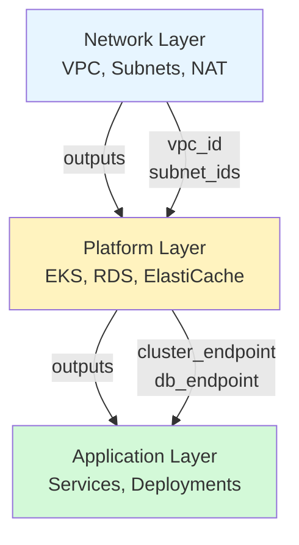
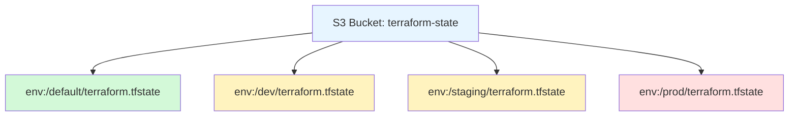
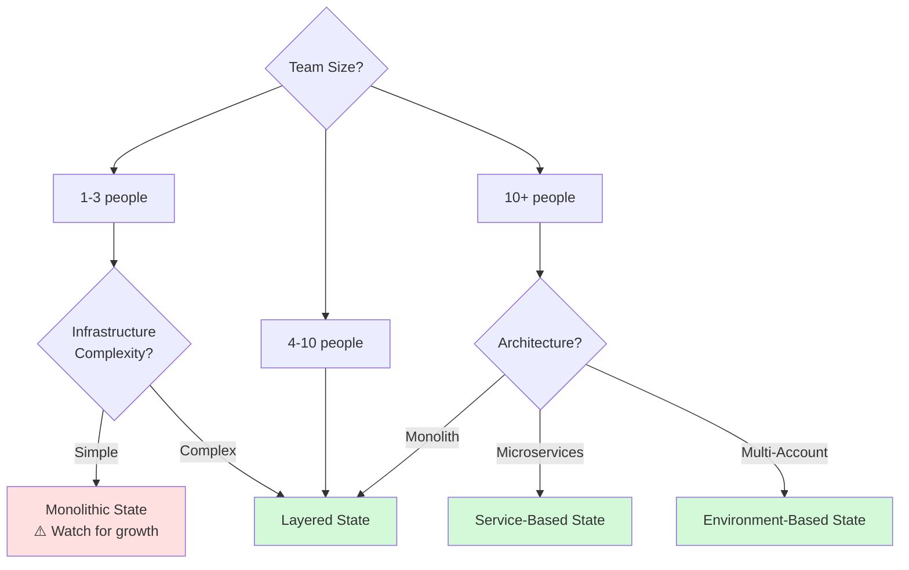

Handling complex multi-project dependencies, workspace-based workflows, and state organization strategies for enterprise-scale infrastructure.
## 🎯 Overview
Advanced state patterns enable:
- **Decoupled architectures**: Independent teams managing separate infrastructure
- **Multi-environment management**: Dev, staging, and production isolation
- **Cross-project dependencies**: Sharing outputs between Terraform projects
- **Reduced blast radius**: Limiting the impact of errors
- **Parallel development**: Multiple teams working simultaneously

---

## 1. Remote State Data Source

### Concept

The `terraform_remote_state` data source allows one Terraform project to read the outputs of another project's state file in a **read-only** manner.

### Use Cases

- **Cross-team dependencies**: App team needs VPC ID from networking team
- **Layered infrastructure**: Database layer provides connection strings to application layer
- **Shared services**: Central platform team provides shared resources to product teams
- **Multi-account setups**: Resources in one AWS account reference another account's outputs

### Basic Example

```hcl
# In the networking project (outputs.tf)
output "vpc_id" {
  value       = aws_vpc.main.id
  description = "VPC ID for application deployments"
}

output "public_subnet_ids" {
  value       = aws_subnet.public[*].id
  description = "Public subnet IDs"
}

output "database_security_group_id" {
  value       = aws_security_group.database.id
  description = "Security group for database access"
}
```

```hcl
# In the application project (main.tf)
data "terraform_remote_state" "network" {
  backend = "s3"
  config = {
    bucket = "company-terraform-state"
    key    = "network/terraform.tfstate"
    region = "us-east-1"
  }
}

resource "aws_instance" "app" {
  ami           = "ami-12345678"
  instance_type = "t3.micro"
  subnet_id     = data.terraform_remote_state.network.outputs.public_subnet_ids[0]
  
  vpc_security_group_ids = [
    aws_security_group.app.id,
    data.terraform_remote_state.network.outputs.database_security_group_id
  ]
  
  tags = {
    Name = "app-server"
    VPC  = data.terraform_remote_state.network.outputs.vpc_id
  }
}
```

### Advanced Pattern: Multi-Layer Architecture



### Best Practices for Remote State

```hcl
# Use locals to make outputs more readable
locals {
  network_vpc_id     = data.terraform_remote_state.network.outputs.vpc_id
  network_subnet_ids = data.terraform_remote_state.network.outputs.private_subnet_ids
  db_endpoint        = data.terraform_remote_state.database.outputs.endpoint
}

resource "aws_instance" "app" {
  subnet_id = local.network_subnet_ids[0]
  # More readable than data.terraform_remote_state.network.outputs.private_subnet_ids[0]
}
```

### Error Handling

```hcl
# Validate that required outputs exist
locals {
  vpc_id = try(
    data.terraform_remote_state.network.outputs.vpc_id,
    null
  )
}

# Fail fast if required output is missing
resource "null_resource" "validate_vpc" {
  count = local.vpc_id == null ? "ERROR: VPC ID not found in network state" : 0
}
```

---

## 2. Terraform Workspaces

### Concept

Workspaces allow you to maintain multiple instances of state for the same Terraform configuration. Each workspace has its own state file.

### When to Use Workspaces

✅ **Good Use Cases**:
- Testing feature branches
- Developer sandboxes
- Temporary environments
- Identical infrastructure with different data

❌ **Bad Use Cases**:
- Production vs staging (use separate directories instead)
- Different AWS accounts (use separate backends)
- Different configurations (use separate code)

### Basic Workspace Commands

```bash
# List workspaces
terraform workspace list

# Create new workspace
terraform workspace new dev-feature-x

# Switch workspace
terraform workspace select dev-feature-x

# Show current workspace
terraform workspace show

# Delete workspace
terraform workspace delete dev-feature-x
```

### Using Workspace Name in Configuration

```hcl
# Reference current workspace
resource "aws_instance" "app" {
  ami           = "ami-12345678"
  instance_type = terraform.workspace == "prod" ? "t3.large" : "t3.micro"
  
  tags = {
    Name        = "app-${terraform.workspace}"
    Environment = terraform.workspace
  }
}

# Workspace-specific variables
locals {
  environment_config = {
    dev = {
      instance_count = 1
      instance_type  = "t3.micro"
    }
    staging = {
      instance_count = 2
      instance_type  = "t3.small"
    }
    prod = {
      instance_count = 5
      instance_type  = "t3.large"
    }
  }
  
  config = local.environment_config[terraform.workspace]
}

resource "aws_instance" "app" {
  count         = local.config.instance_count
  instance_type = local.config.instance_type
  # ...
}
```

### Workspace State Storage



### Workspace Limitations

⚠️ **Important Limitations**:
- All workspaces share the same backend configuration
- All workspaces share the same code
- Easy to accidentally apply to wrong workspace
- Not suitable for strict environment isolation

---

## 3. State Organization Strategies

### Strategy 1: Monolithic State (Anti-Pattern)

❌ **Not Recommended**

```
terraform/
  ├── main.tf (all resources in one file)
  └── terraform.tfstate (1000+ resources)
```

**Problems**:
- Slow `terraform plan` (60+ seconds)
- High blast radius (one mistake affects everything)
- Difficult team collaboration
- Long locking times

### Strategy 2: Layered State (Recommended)

✅ **Recommended for Most Teams**

```
terraform/
  ├── 01-network/
  │   ├── main.tf
  │   └── outputs.tf (vpc_id, subnet_ids)
  ├── 02-platform/
  │   ├── main.tf
  │   ├── data.tf (reads network outputs)
  │   └── outputs.tf (cluster_endpoint, db_endpoint)
  └── 03-applications/
      ├── main.tf
      └── data.tf (reads platform outputs)
```

**Benefits**:
- Fast operations (each layer is small)
- Low blast radius (errors isolated to layer)
- Clear dependencies
- Parallel team development

### Strategy 3: Service-Based State

✅ **Recommended for Microservices**

```
terraform/
  ├── shared-infrastructure/
  │   └── (VPC, DNS, monitoring)
  ├── service-auth/
  │   └── (Auth service infrastructure)
  ├── service-payments/
  │   └── (Payment service infrastructure)
  └── service-notifications/
      └── (Notification service infrastructure)
```

### Strategy 4: Environment-Based State

✅ **Recommended for Strict Isolation**

```
terraform/
  ├── environments/
  │   ├── dev/
  │   │   ├── backend.tf (separate S3 bucket)
  │   │   └── main.tf
  │   ├── staging/
  │   │   ├── backend.tf (separate S3 bucket)
  │   │   └── main.tf
  │   └── prod/
  │       ├── backend.tf (separate S3 bucket, separate AWS account)
  │       └── main.tf
  └── modules/
      └── (shared modules)
```

---

## 📊 State Organization Decision Tree



---

## 🏗️ Real-Life Scenarios

### Scenario 1: The Decoupled Architecture
**Problem**: The "Database Team" wants to manage RDS independently, but the "App Team" needs the database endpoint to connect. Neither team wants to share a single giant Terraform project.

**Challenge**:
- Two teams with different deployment schedules
- App team needs real-time database endpoint
- Database team needs autonomy
- Can't share state file (security concerns)

**Solution**:
```hcl
# Database team's outputs.tf
output "primary_endpoint" {
  value       = aws_rds_cluster.main.endpoint
  description = "Primary database endpoint"
  sensitive   = false  # Endpoint is not sensitive
}

output "reader_endpoint" {
  value       = aws_rds_cluster.main.reader_endpoint
  description = "Reader endpoint for read replicas"
}

output "database_name" {
  value       = aws_rds_cluster.main.database_name
  description = "Database name"
}

# App team's data.tf
data "terraform_remote_state" "database" {
  backend = "s3"
  config = {
    bucket = "company-terraform-state"
    key    = "database/prod/terraform.tfstate"
    region = "us-east-1"
  }
}

# App team's main.tf
resource "aws_ecs_task_definition" "app" {
  family = "app"
  
  container_definitions = jsonencode([{
    name  = "app"
    image = "company/app:latest"
    environment = [
      {
        name  = "DB_HOST"
        value = data.terraform_remote_state.database.outputs.primary_endpoint
      },
      {
        name  = "DB_NAME"
        value = data.terraform_remote_state.database.outputs.database_name
      }
    ]
  }])
}
```

**Benefits Achieved**:
- Teams deploy independently
- No shared state file
- Automatic endpoint updates
- Clear ownership boundaries

---

### Scenario 2: The Workspace Disaster
**Problem**: Team used workspaces for dev/staging/prod. Developer accidentally ran `terraform destroy` in prod workspace.

**Impact**:
- Production infrastructure destroyed
- 30 minutes of downtime
- Customer impact
- Team lost confidence in Terraform

**Root Cause**:
```bash
# Developer thought they were in dev workspace
terraform workspace show
# Output: prod (OOPS!)

terraform destroy -auto-approve
# Destroyed production!
```

**Better Solution**:
```
# Separate directories with separate backends
terraform/
  ├── environments/
  │   ├── dev/
  │   │   ├── backend.tf
  │   │   │   backend "s3" {
  │   │   │     bucket = "dev-terraform-state"
  │   │   │   }
  │   │   └── main.tf
  │   ├── staging/
  │   │   ├── backend.tf
  │   │   │   backend "s3" {
  │   │   │     bucket = "staging-terraform-state"
  │   │   │   }
  │   │   └── main.tf
  │   └── prod/
  │       ├── backend.tf
  │       │   backend "s3" {
  │       │     bucket = "prod-terraform-state"
  │       │     # Different AWS account
  │       │     role_arn = "arn:aws:iam::PROD_ACCOUNT:role/terraform"
  │       │   }
  │       └── main.tf
```

**Additional Safeguards**:
```hcl
# In prod/main.tf
resource "null_resource" "prevent_destroy" {
  lifecycle {
    prevent_destroy = true
  }
}

# Require explicit confirmation
terraform {
  required_version = ">= 1.0"
  
  # Use Terraform Cloud for prod with manual approval
  cloud {
    organization = "company"
    workspaces {
      name = "production"
    }
  }
}
```

**Lesson**: Don't use workspaces for production environments. Use separate directories and backends.

---

### Scenario 3: The Cross-Account Reference
**Problem**: Company has separate AWS accounts for dev, staging, and prod. Shared services (like DNS) in a central account need to be referenced by all environments.

**Challenge**:
- 4 AWS accounts (shared, dev, staging, prod)
- Shared services state in central account
- Each environment needs to reference shared outputs
- Cross-account IAM permissions required

**Solution**:
```hcl
# In shared-services account (outputs.tf)
output "route53_zone_id" {
  value       = aws_route53_zone.main.zone_id
  description = "Route53 hosted zone ID"
}

output "acm_certificate_arn" {
  value       = aws_acm_certificate.wildcard.arn
  description = "Wildcard SSL certificate ARN"
}

# Grant cross-account access to state bucket
resource "aws_s3_bucket_policy" "state_cross_account" {
  bucket = aws_s3_bucket.terraform_state.id
  
  policy = jsonencode({
    Version = "2012-10-17"
    Statement = [
      {
        Sid    = "AllowDevAccountRead"
        Effect = "Allow"
        Principal = {
          AWS = "arn:aws:iam::DEV_ACCOUNT_ID:root"
        }
        Action = [
          "s3:GetObject",
          "s3:ListBucket"
        ]
        Resource = [
          aws_s3_bucket.terraform_state.arn,
          "${aws_s3_bucket.terraform_state.arn}/*"
        ]
      }
    ]
  })
}

# In dev account (data.tf)
data "terraform_remote_state" "shared_services" {
  backend = "s3"
  config = {
    bucket   = "shared-terraform-state"
    key      = "shared-services/terraform.tfstate"
    region   = "us-east-1"
    role_arn = "arn:aws:iam::SHARED_ACCOUNT_ID:role/TerraformReadOnly"
  }
}

# Use shared outputs
resource "aws_route53_record" "app" {
  zone_id = data.terraform_remote_state.shared_services.outputs.route53_zone_id
  name    = "app-dev.company.com"
  type    = "A"
  # ...
}
```

**Benefits**:
- Centralized shared services
- Secure cross-account access
- Consistent DNS and certificates
- Clear ownership model

---

### Scenario 4: The Blast Radius Reduction
**Problem**: Single Terraform project managing 1,500+ resources. A typo in a variable caused `terraform apply` to try recreating 200 EC2 instances.

**Impact**:
- 45-minute `terraform plan`
- Accidental mass recreation attempt
- Production outage risk
- Team paralyzed by fear

**Solution - Split by Layer**:
```
Before (Monolithic):
terraform/
  └── main.tf (1,500 resources, 45min plan time)

After (Layered):
terraform/
  ├── 01-network/          (50 resources, 5s plan)
  ├── 02-data/             (30 resources, 3s plan)
  ├── 03-compute/          (200 resources, 15s plan)
  ├── 04-applications/     (1,000 resources, 25s plan)
  └── 05-monitoring/       (220 resources, 10s plan)
```

**Results**:
- Plan time: 45min → 58s total (can run in parallel)
- Blast radius: 1,500 → max 1,000 resources
- Team confidence: restored
- Deployment frequency: 2x/week → 5x/day

**Migration Process**:
```bash
# Phase 1: Create new layer directories
mkdir -p 01-network 02-data 03-compute

# Phase 2: Move resources from monolithic state
cd 01-network
terraform init
terraform import aws_vpc.main vpc-xxx
# ... import all network resources

# Phase 3: Remove from old state
cd ../old-monolithic
terraform state rm aws_vpc.main
# ... remove all migrated resources

# Phase 4: Verify
terraform plan  # Should show no changes in both places
```

---

### Scenario 5: The Workspace Naming Convention
**Problem**: Team using workspaces for feature branches. After 6 months, had 47 workspaces with names like "test", "temp", "johns-test", "fix-bug-123". No one knew which were active.

**Impact**:
- 47 workspaces consuming resources
- $2,000/month in orphaned infrastructure
- Confusion about which workspaces are safe to delete
- State bucket cluttered

**Solution - Workspace Naming Convention**:
```bash
# Naming convention: <username>-<purpose>-<date>
terraform workspace new alice-feature-auth-20251230
terraform workspace new bob-bugfix-db-20251230
terraform workspace new charlie-experiment-20251230

# Automated cleanup script
#!/bin/bash
# cleanup-old-workspaces.sh

# List all workspaces older than 30 days
for workspace in $(terraform workspace list | grep -v default); do
  # Extract date from workspace name (format: username-purpose-YYYYMMDD)
  date_part=$(echo $workspace | grep -oE '[0-9]{8}$')
  
  if [ -n "$date_part" ]; then
    workspace_date=$(date -d "$date_part" +%s)
    current_date=$(date +%s)
    age_days=$(( ($current_date - $workspace_date) / 86400 ))
    
    if [ $age_days -gt 30 ]; then
      echo "Workspace $workspace is $age_days days old"
      echo "Run: terraform workspace select $workspace && terraform destroy && terraform workspace delete $workspace"
    fi
  fi
done
```

**Additional Safeguards**:
```hcl
# Add tags to all resources with workspace info
locals {
  common_tags = {
    Workspace   = terraform.workspace
    CreatedBy   = "terraform"
    CreatedDate = formatdate("YYYY-MM-DD", timestamp())
    AutoDelete  = terraform.workspace != "default" ? "true" : "false"
  }
}

resource "aws_instance" "app" {
  # ...
  tags = merge(local.common_tags, {
    Name = "app-${terraform.workspace}"
  })
}
```

**Results**:
- Clear workspace ownership
- Automated cleanup process
- Cost savings: $2,000/month → $200/month
- Team discipline improved

---

## ❓ Interview Questions

1. **What is a Remote State Data Source?**
   - **Answer**: The `terraform_remote_state` data source is a read-only way for one Terraform configuration to fetch outputs from another project's state file. It enables decoupled architectures where teams can manage infrastructure independently while sharing necessary information like VPC IDs, database endpoints, or cluster configurations.

2. **What is the "Blast Radius" of a Terraform project?**
   - **Answer**: The blast radius is the maximum amount of infrastructure that can be affected by a single mistake in a Terraform project. A smaller blast radius (achieved through state splitting) means errors are isolated to fewer resources. For example, a monolithic state with 1,000 resources has a blast radius of 1,000, while splitting into 5 projects of 200 resources each reduces the maximum blast radius to 200.

3. **When should you use workspaces vs separate directories?**
   - **Answer**:
     - **Use workspaces for**: Feature branches, developer sandboxes, temporary testing environments with identical configuration
     - **Use separate directories for**: Production vs staging, different AWS accounts, different configurations, strict environment isolation
     - **Reason**: Workspaces share the same code and backend, making it easy to accidentally affect the wrong environment. Separate directories provide stronger isolation.

4. **How do you handle circular dependencies between Terraform projects?**
   - **Answer**: Circular dependencies indicate a design problem. Solutions:
     - Refactor to create a third "shared" layer that both projects depend on
     - Merge the projects if they're truly interdependent
     - Use data sources to break the cycle (one project uses remote state, the other uses direct references)
     - Example: If App needs Database and Database needs App's security group, create a Network layer that both depend on

5. **What are the security implications of remote state data sources?**
   - **Answer**:
     - Anyone with read access to the state bucket can see all outputs
     - Sensitive outputs (passwords, keys) should never be exposed
     - Use IAM policies to restrict state bucket access
     - Consider using AWS Secrets Manager references instead of direct outputs
     - Implement least-privilege access (read-only roles for consumers)

6. **How do you migrate from a monolithic state to layered states?**
   - **Answer**:
     1. Create new layer directories with backend configurations
     2. Import resources into new layers: `terraform import`
     3. Remove resources from old state: `terraform state rm`
     4. Verify both states: `terraform plan` should show no changes
     5. Update references to use remote state data sources
     6. Test thoroughly before decommissioning old state

7. **What is the difference between `terraform.workspace` and environment variables?**
   - **Answer**:
     - `terraform.workspace`: Built-in variable containing current workspace name, stored in state
     - Environment variables: External configuration, not stored in state
     - Workspace is part of Terraform's state management, environment variables are runtime configuration
     - Workspaces affect state file location, environment variables don't

8. **How do you prevent accidental destruction in shared workspaces?**
   - **Answer**:
     - Use `lifecycle { prevent_destroy = true }` on critical resources
     - Implement Terraform Cloud with manual approval for production
     - Use separate AWS accounts with different credentials
     - Require `-auto-approve=false` in CI/CD for production
     - Implement policy-as-code (Sentinel/OPA) to block dangerous operations

9. **What are the performance implications of remote state data sources?**
   - **Answer**:
     - Each remote state data source requires an S3 read operation
     - Multiple data sources can slow down `terraform plan`
     - State files are cached locally during a run
     - Large state files (>10MB) can cause slow reads
     - Best practice: Minimize number of remote state dependencies, split large states

10. **How do you handle state dependencies in CI/CD pipelines?**
    - **Answer**:
      - Run dependent projects in order (network → platform → applications)
      - Use dependency graphs to determine execution order
      - Implement retry logic for remote state reads (eventual consistency)
      - Cache state files in CI/CD to reduce S3 reads
      - Use Terraform Cloud workspaces with run triggers for automatic dependency execution

---

## 🧠 Quiz Questions (25 Total)

### Remote State Data Sources (1-8)

1. **Can a remote state data source modify the state it's reading?**
   - Answer: No, it's read-only

2. **What information can you access from a remote state data source?**
   - Answer: Only the outputs defined in the remote project

3. **True/False: Remote state data sources require the same backend type.**
   - Answer: False (can read from different backend types)

4. **How do you reference an output from a remote state data source?**
   - Answer: `data.terraform_remote_state.name.outputs.output_name`

5. **What happens if a remote state output doesn't exist?**
   - Answer: Terraform returns an error

6. **True/False: You can use remote state from Terraform Cloud in OSS Terraform.**
   - Answer: True

7. **What's the best practice for sensitive outputs in remote state?**
   - Answer: Don't expose them; use Secrets Manager instead

8. **How many remote state data sources can a project have?**
   - Answer: Unlimited (but minimize for performance)

### Workspaces (9-16)

9. **Which command switches between workspaces?**
   - Answer: `terraform workspace select`

10. **What is the default workspace name?**
    - Answer: `default`

11. **True/False: Workspaces are the best way to separate dev and prod.**
    - Answer: False (separate directories are better)

12. **How do you access the current workspace name in HCL?**
    - Answer: `terraform.workspace`

13. **Can you delete the default workspace?**
    - Answer: No

14. **Where are workspace state files stored in S3?**
    - Answer: `env:/<workspace-name>/terraform.tfstate`

15. **True/False: All workspaces share the same backend configuration.**
    - Answer: True

16. **What command lists all workspaces?**
    - Answer: `terraform workspace list`

### State Organization (17-25)

17. **What is the benefit of splitting state files?**
    - Answer: Faster execution and lower blast radius

18. **What is a "layered state" architecture?**
    - Answer: Organizing state by infrastructure layers (network, platform, app)

19. **True/False: Monolithic state is recommended for large teams.**
    - Answer: False

20. **What is the blast radius of a project with 500 resources?**
    - Answer: 500 resources (maximum affected by one mistake)

21. **How do layered states communicate?**
    - Answer: Via remote state data sources

22. **True/False: Service-based state is good for microservices.**
    - Answer: True

23. **What's the recommended state organization for 10+ person teams?**
    - Answer: Layered or service-based state

24. **How do you reduce Terraform plan time?**
    - Answer: Split state into smaller projects

25. **True/False: Environment-based state uses separate backends.**
    - Answer: True

---

## 🎓 Best Practices

### ✅ DO:
- Use remote state data sources for cross-project dependencies
- Split large states into logical layers
- Use separate directories for prod/staging/dev
- Expose only necessary outputs
- Implement least-privilege IAM for state access
- Document state dependencies
- Use meaningful workspace names with dates
- Implement automated workspace cleanup
- Test state migrations in non-production first
- Monitor state file sizes

### ❌ DON'T:
- Don't use workspaces for production environments
- Don't expose sensitive data in outputs
- Don't create circular state dependencies
- Don't use monolithic state for large projects
- Don't share state files between teams
- Don't forget to clean up old workspaces
- Don't mix workspace and directory-based isolation
- Don't skip testing after state splits
- Don't ignore blast radius considerations
- Don't create deep dependency chains (max 2-3 levels)

---

## 🔗 Related Topics
- [Remote State Backends](../03-Remote-State-Backends/Remote%20State%20Backends.md) - Backend configuration
- [State Operations](../05-State-Operations/State%20Operations.md) - State manipulation
- [State Migration & Versioning](../07-State-Migration/State%20Migration%20&%20Versioning.md) - Migration strategies
