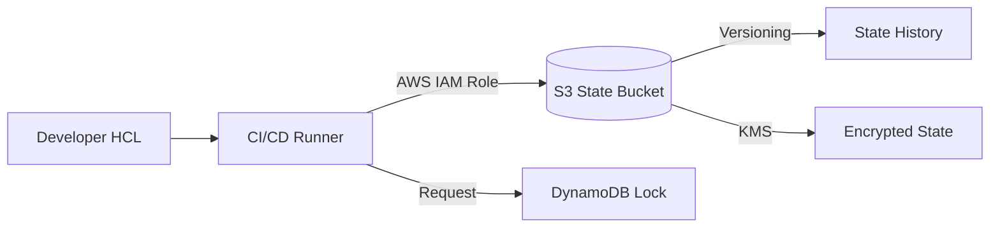

# State Best Practices

A checklist for maintaining a healthy and secure Terraform state.

## 🏁 The Golden Rules

1.  **Never commit state files to Git**: Add `*.tfstate` to your `.gitignore` immediately.
2.  **Use a Remote Backend**: Mandatory for team collaboration.
3.  **Enable State Locking**: Prevents race conditions and corruption.
4.  **Enable S3 Versioning**: Provides an "Undo" button and audit trail.
5.  **Encrypt Everything**: Use server-side encryption and restricted bucket policies.
6.  **Decompose State**: Avoid "Monolithic State." Split large projects into smaller components (Network, DB, App).
7.  **Limit Access**: Only CI/CD roles and SREs should have access to the Production state.

## Summary Diagram: Secure State Pipeline

---

## 🏗️ Real-Life Scenario: The Audit Trail
**Problem**: A rogue resource appeared in AWS. No one knows who created it or why.
**Outcome**: The team checks the S3 version history for the state file. They see a change exactly at 2 PM. They check the CI/CD logs for that time and find the specific Pull Request and the developer name. This level of traceability is only possible with a well-managed remote state.

---

## ❓ Interview Questions
1.  **Why should you avoid a "Monolithic" state file?**
    *   *Answer*: Monolithic states are slow (refreshes everything), carry high risk (a mistake can break unrelated resources), and create merge conflicts.
2.  **What is "Stateful" vs "Stateless" in DevOps?**
    *   *Answer*: Terraform is a "Stateful" tool because it remembers what it did. This is its greatest strength and its biggest security risk.

---

## 🧠 Quiz Snippet (5/20+)
1.  **What is the best storage class for old state versions?** (Standard IA or Glacier)
2.  **True/False: You should use a separate backend for every environment.** (Yes, for security and isolation)
3.  **What happens to your state if you don't enable versioning?** (The old state is overwritten and gone forever)
4.  **Should a developer have "Delete" permissions on the state bucket?** (Generally No)
5.  **What is the #1 rule of Terraform state?** (Don't commit to Git!)
