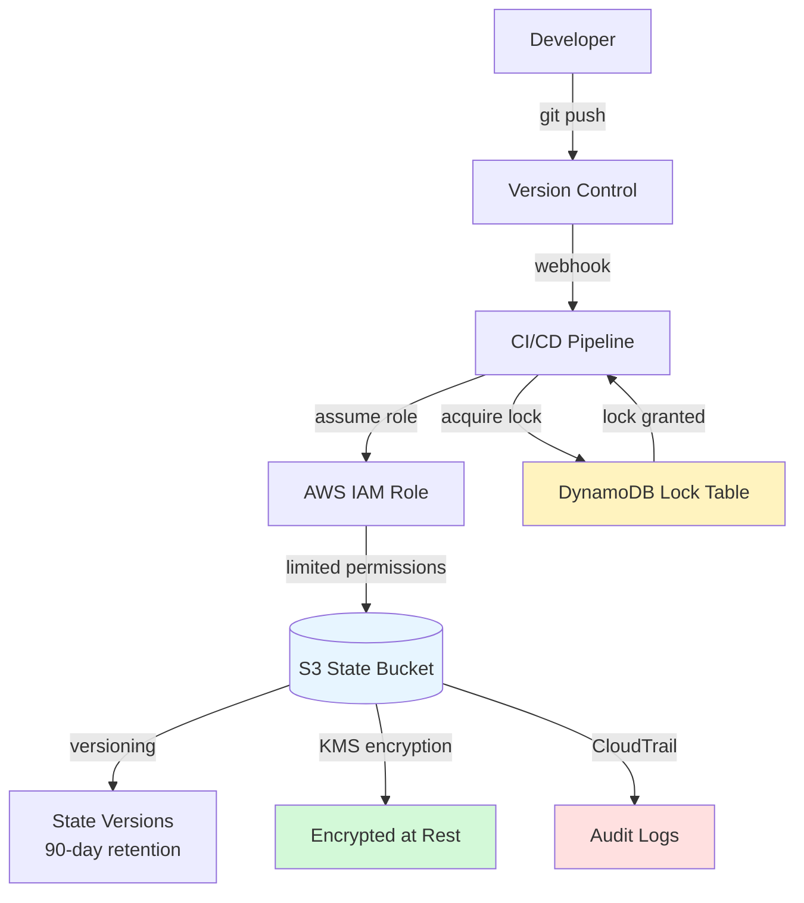
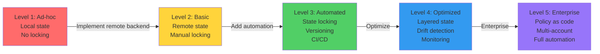

A comprehensive checklist and guide for maintaining healthy, secure, and performant Terraform state management across teams and environments.
## 🎯 Overview
State management best practices ensure:
- **Security**: Protecting sensitive infrastructure data
- **Reliability**: Preventing state corruption and loss
- **Performance**: Fast operations and minimal conflicts
- **Collaboration**: Enabling team workflows
- **Auditability**: Tracking all infrastructure changes

---
## 🏁 The Golden Rules

### 1. Never Commit State Files to Git
**Why**: State files contain sensitive data (passwords, private IPs, resource IDs) and are not meant for version control.
```bash
# Add to .gitignore immediately
echo "*.tfstate" >> .gitignore
echo "*.tfstate.*" >> .gitignore
echo ".terraform/" >> .gitignore
echo ".terraform.lock.hcl" >> .gitignore  # Optional, team preference

git add .gitignore
git commit -m "Add Terraform files to gitignore"
```
**What if you already committed state?**
```bash
# Remove from Git history (use with caution)
git filter-branch --force --index-filter \
  'git rm --cached --ignore-unmatch terraform.tfstate' \
  --prune-empty --tag-name-filter cat -- --all

# Or use BFG Repo-Cleaner (faster)
bfg --delete-files terraform.tfstate
git reflog expire --expire=now --all
git gc --prune=now --aggressive
```
---
### 2. Use a Remote Backend
**Why**: Enables team collaboration, provides locking, and centralizes state storage.
**Recommended Backends**:
- **S3 + DynamoDB**: AWS-native, highly available
- **Terraform Cloud**: Managed service, built-in features
- **Azure Blob Storage**: Azure-native
- **GCS**: Google Cloud-native
**Example Configuration**:
```hcl
terraform {
  backend "s3" {
    bucket         = "company-terraform-state"
    key            = "prod/infrastructure.tfstate"
    region         = "us-east-1"
    dynamodb_table = "terraform-locks"
    encrypt        = true
    kms_key_id     = "arn:aws:kms:us-east-1:123456789012:key/..."
  }
}
```
---
### 3. Enable State Locking
**Why**: Prevents race conditions, concurrent modifications, and state corruption
**Implementation**:
```hcl
# S3 backend with DynamoDB locking
terraform {
  backend "s3" {
    # ... other config
    dynamodb_table = "terraform-locks"
  }
}
```
**DynamoDB Table Setup**:
```bash
aws dynamodb create-table \
  --table-name terraform-locks \
  --attribute-definitions AttributeName=LockID,AttributeType=S \
  --key-schema AttributeName=LockID,KeyType=HASH \
  --billing-mode PAY_PER_REQUEST \
  --region us-east-1
```
---
### 4. Enable S3 Versioning
**Why**: Provides rollback capability, audit trail, and disaster recovery.
```bash
# Enable versioning on state bucket
aws s3api put-bucket-versioning \
  --bucket company-terraform-state \
  --versioning-configuration Status=Enabled

# Set lifecycle policy to manage old versions
aws s3api put-bucket-lifecycle-configuration \
  --bucket company-terraform-state \
  --lifecycle-configuration file://lifecycle.json
```
**Lifecycle Policy** (`lifecycle.json`):
```json
{
  "Rules": [
    {
      "Id": "DeleteOldVersions",
      "Status": "Enabled",
      "NoncurrentVersionExpiration": {
        "NoncurrentDays": 90
      }
    },
    {
      "Id": "TransitionOldVersions",
      "Status": "Enabled",
      "NoncurrentVersionTransitions": [
        {
          "NoncurrentDays": 30,
          "StorageClass": "STANDARD_IA"
        }
      ]
    }
  ]
}
```
---
### 5. Encrypt Everything
**Why**: Protects sensitive data at rest and in transit.
**Server-Side Encryption**:
```hcl
resource "aws_s3_bucket_server_side_encryption_configuration" "state" {
  bucket = aws_s3_bucket.terraform_state.id

  rule {
    apply_server_side_encryption_by_default {
      sse_algorithm     = "aws:kms"
      kms_master_key_id = aws_kms_key.terraform.arn
    }
  }
}
```
**Encryption in Transit**:
```hcl
resource "aws_s3_bucket_policy" "state" {
  bucket = aws_s3_bucket.terraform_state.id

  policy = jsonencode({
    Version = "2012-10-17"
    Statement = [
      {
        Sid    = "DenyUnencryptedTransport"
        Effect = "Deny"
        Principal = "*"
        Action = "s3:*"
        Resource = [
          "${aws_s3_bucket.terraform_state.arn}/*"
        ]
        Condition = {
          Bool = {
            "aws:SecureTransport" = "false"
          }
        }
      }
    ]
  })
}
```
---
### 6. Decompose State
**Why**: Reduces blast radius, improves performance, enables parallel development.
**Anti-Pattern** (Monolithic):
```
terraform/
  └── main.tf (1,500+ resources, 45min plan time)
```
**Best Practice** (Layered):
```
terraform/
  ├── 01-network/      (50 resources, 5s plan)
  ├── 02-data/         (30 resources, 3s plan)
  ├── 03-compute/      (200 resources, 15s plan)
  └── 04-applications/ (1,000 resources, 25s plan)
```
---
### 7. Limit Access
**Why**: Reduces security risk, prevents accidental changes, maintains audit trail.
**IAM Policy for Read-Only Access**:
```json
{
  "Version": "2012-10-17",
  "Statement": [
    {
      "Effect": "Allow",
      "Action": [
        "s3:GetObject",
        "s3:ListBucket"
      ],
      "Resource": [
        "arn:aws:s3:::terraform-state-bucket",
        "arn:aws:s3:::terraform-state-bucket/*"
      ]
    },
    {
      "Effect": "Allow",
      "Action": [
        "dynamodb:GetItem",
        "dynamodb:PutItem",
        "dynamodb:DeleteItem"
      ],
      "Resource": "arn:aws:dynamodb:*:*:table/terraform-locks"
    }
  ]
}
```

**Access Control Matrix**:

| Role      | Read State | Write State | Delete State | Force Unlock |
| --------- | ---------- | ----------- | ------------ | ------------ |
| Developer | ✅          | ❌           | ❌            | ❌            |
| CI/CD     | ✅          | ✅           | ❌            | ❌            |
| SRE       | ✅          | ✅           | ❌            | ✅            |
| Admin     | ✅          | ✅           | ✅            | ✅            |

---

## 📊 Secure State Pipeline Diagram


---
## ✅ Comprehensive Checklist

### Security (10 items)
- [ ] State files excluded from Git (`.gitignore`)
- [ ] Remote backend configured (S3, Terraform Cloud, etc.)
- [ ] Server-side encryption enabled (KMS)
- [ ] Encryption in transit enforced (HTTPS only)
- [ ] Bucket versioning enabled
- [ ] MFA Delete enabled on state bucket
- [ ] IAM policies follow least-privilege
- [ ] State bucket is private (no public access)
- [ ] CloudTrail logging enabled for state bucket
- [ ] Sensitive values use `sensitive = true`
### Reliability (8 items)
- [ ] State locking enabled (DynamoDB)
- [ ] Automated state backups configured
- [ ] State file size monitored (<10MB recommended)
- [ ] Lifecycle policies for old versions
- [ ] State validation in CI/CD
- [ ] Disaster recovery plan documented
- [ ] State restoration tested regularly
- [ ] Backend configuration in version control
### Performance (7 items)
- [ ] State decomposed into logical layers
- [ ] Each state file <500 resources
- [ ] `terraform plan` completes in <30 seconds
- [ ] Parallel state operations where possible
- [ ] Remote state data sources minimized
- [ ] State refresh optimized
- [ ] Workspace strategy defined
### Collaboration (8 items)
- [ ] Team has documented state management process
- [ ] State ownership clearly defined
- [ ] Communication protocol for state operations
- [ ] Shared understanding of state structure
- [ ] Code review process includes state changes
- [ ] Runbooks for common state issues
- [ ] Training provided on state management
- [ ] Incident response plan for state corruption
### Auditability (7 items)
- [ ] All state changes logged (CloudTrail)
- [ ] State modifications tied to Git commits
- [ ] CI/CD logs retained for compliance period
- [ ] State version history maintained
- [ ] Access logs reviewed regularly
- [ ] Compliance requirements documented
- [ ] Audit trail tested and verified

---

## 🚫 Anti-Patterns to Avoid
### 1. Committing State to Git

❌ **Don't**:
```bash
git add terraform.tfstate
git commit -m "Update state"
```

✅ **Do**:
```bash
# Add to .gitignore
echo "*.tfstate*" >> .gitignore
```
---
### 2. Sharing State Files via Email/Slack
❌ **Don't**:
- Email state files to team members
- Share state via Slack/Teams
- Store state in shared drives
✅ **Do**:
- Use remote backend
- Grant IAM access
- Use Terraform Cloud workspaces
---
### 3. Manual State Editing
❌ **Don't**:
```bash
# Editing state directly
vim terraform.tfstate
```
✅ **Do**:
```bash
# Use Terraform commands
terraform state rm aws_instance.old
terraform state mv aws_instance.old aws_instance.new
```
---
### 4. No State Locking
❌ **Don't**:
```hcl
terraform {
  backend "s3" {
    bucket = "state-bucket"
    key    = "terraform.tfstate"
    # No dynamodb_table = missing locking!
  }
}
```
✅ **Do**:
```hcl
terraform {
  backend "s3" {
    bucket         = "state-bucket"
    key            = "terraform.tfstate"
    dynamodb_table = "terraform-locks"  # Enable locking
  }
}
```
---
### 5. Monolithic State
❌ **Don't**:
- Single state file with 1,000+ resources
- All environments in one state
- All teams sharing one state
✅ **Do**:
- Split by layer (network, data, compute)
- Separate states per environment
- Team-owned state files
---
### 6. Ignoring State Drift
❌ **Don't**:
- Ignore `terraform plan` showing changes
- Make manual changes without updating code
- Skip drift detection
✅ **Do**:
```bash
# Regular drift detection
terraform plan -refresh-only

# Fix drift immediately
terraform apply  # or update code to match reality
```
---

## 🔄 State Management Maturity Model


---
## 🏗️ Real-Life Scenarios

### Scenario 1: The Audit Trail
**Problem**: A rogue EC2 instance appeared in AWS production account. No one knows who created it, when, or why. Security team demands answers.
**Challenge**:
- Unknown resource origin
- Potential security breach
- Need to identify responsible party
- Compliance investigation required
**Investigation**:
```bash
# 1. Check current state for the resource
terraform state list | grep i-0abcd1234

# 2. Check S3 version history
aws s3api list-object-versions \
  --bucket prod-terraform-state \
  --prefix terraform.tfstate \
  --query 'Versions[*].[VersionId,LastModified]' \
  --output table

# 3. Download state versions around the time resource appeared
aws s3api get-object \
  --bucket prod-terraform-state \
  --key terraform.tfstate \
  --version-id "VERSION_AT_2PM" \
  state-2pm.json

# 4. Compare states
diff <(cat state-1pm.json | jq '.resources[] | .type + "." + .name' | sort) \
     <(cat state-2pm.json | jq '.resources[] | .type + "." + .name' | sort)

# Output shows: aws_instance.mystery_server was added

# 5. Check CI/CD logs for 2 PM
# Found: PR #1234 by user@company.com
# Commit: "Add temporary test server"

# 6. Check CloudTrail for API calls
aws cloudtrail lookup-events \
  --lookup-attributes AttributeKey=EventName,AttributeValue=RunInstances \
  --start-time 2025-12-30T14:00:00 \
  --end-time 2025-12-30T14:05:00
```
**Outcome**:
- Resource traced to specific PR and developer
- Created at 2:03 PM via CI/CD pipeline
- Developer forgot to remove test resource
- Incident resolved in 30 minutes
**Lesson**: This level of traceability is only possible with:
- Remote state with versioning
- CloudTrail logging
- CI/CD integration
- Proper audit trail
---
### Scenario 2: The Encryption Mandate
**Problem**: Company security audit reveals Terraform state buckets are not encrypted. Compliance team gives 48 hours to fix or face production freeze.
**Challenge**:
- 15 state buckets across multiple accounts
- Cannot afford downtime
- Must maintain state integrity
- Need to prove compliance
**Solution**:
```bash
# 1. Create KMS key for encryption
aws kms create-key \
  --description "Terraform state encryption key" \
  --key-policy file://kms-policy.json

# 2. Enable default encryption on all buckets
for bucket in $(aws s3 ls | grep terraform-state | awk '{print $3}'); do
  echo "Encrypting bucket: $bucket"
  
  aws s3api put-bucket-encryption \
    --bucket $bucket \
    --server-side-encryption-configuration '{
      "Rules": [{
        "ApplyServerSideEncryptionByDefault": {
          "SSEAlgorithm": "aws:kms",
          "KMSMasterKeyID": "arn:aws:kms:us-east-1:123456789012:key/..."
        }
      }]
    }'
done

# 3. Update Terraform backend configurations
# In each project's backend.tf:
terraform {
  backend "s3" {
    # ... existing config
    encrypt    = true
    kms_key_id = "arn:aws:kms:us-east-1:123456789012:key/..."
  }
}

# 4. Verify encryption
for bucket in $(aws s3 ls | grep terraform-state | awk '{print $3}'); do
  aws s3api get-bucket-encryption --bucket $bucket
done

# 5. Document compliance
# Generate report showing all buckets encrypted
```
**Results**:
- All 15 buckets encrypted in 2 hours
- Zero downtime
- Compliance achieved
- Automated verification script created
**Prevention**:
- Terraform module for state bucket creation with encryption by default
- Policy-as-code to prevent unencrypted buckets
- Regular compliance scans
---
### Scenario 3: The State Decomposition
**Problem**: Single Terraform project managing entire company infrastructure. `terraform plan` takes 12 minutes. Team afraid to make changes.
**Impact**:
- 2,500+ resources in one state
- 12-minute plan times
- 45-minute apply times
- Deployment frequency: once per month
- Team paralyzed by fear
**Solution - Decomposition Strategy**:
```bash
# Phase 1: Analyze current state
terraform state list | wc -l
# Output: 2,547 resources

# Group resources by layer
terraform state list | grep aws_vpc
terraform state list | grep aws_db
terraform state list | grep aws_instance

# Phase 2: Create new layer structure
mkdir -p layers/{01-network,02-data,03-compute,04-applications,05-monitoring}

# Phase 3: Split state (example for network layer)
cd layers/01-network

# Create backend configuration
cat > backend.tf << 'EOF'
terraform {
  backend "s3" {
    bucket = "company-terraform-state"
    key    = "layers/network/terraform.tfstate"
    region = "us-east-1"
    dynamodb_table = "terraform-locks"
    encrypt = true
  }
}
EOF

# Import network resources
terraform import aws_vpc.main vpc-xxx
terraform import aws_subnet.public[0] subnet-xxx
# ... (repeat for all network resources)

# Phase 4: Remove from monolithic state
cd ../../old-monolithic
terraform state rm aws_vpc.main
terraform state rm aws_subnet.public[0]
# ... (repeat for all migrated resources)

# Phase 5: Verify
cd layers/01-network
terraform plan  # Should show no changes
# Plan time: 12 minutes → 8 seconds
```
**Results After Full Decomposition**:

| Layer        | Resources | Plan Time | Blast Radius  |
| ------------ | --------- | --------- | ------------- |
| Network      | 85        | 8s        | 85            |
| Data         | 120       | 12s       | 120           |
| Compute      | 450       | 35s       | 450           |
| Applications | 1,700     | 90s       | 1,700         |
| Monitoring   | 192       | 15s       | 192           |
| **Total**    | **2,547** | **160s**  | **1,700 max** |
**Improvements**:
- Plan time: 12min → 2.7min (can run in parallel)
- Deployment frequency: 1x/month → 10x/day
- Team confidence: restored
- Blast radius: 2,547 → 1,700 (33% reduction)
---
### Scenario 4: The Deleted State Bucket
**Problem**: Junior admin accidentally deleted production state S3 bucket. 1,000+ resources no longer tracked.
**Impact**:
- Complete loss of state
- Cannot make infrastructure changes
- Risk of duplicate resources
- Production frozen
**Discovery**:
```bash
terraform init
# Error: bucket does not exist
```
**Recovery**:
```bash
# 1. Check if bucket can be recovered (within deletion window)
aws s3 ls s3://prod-terraform-state
# Error: NoSuchBucket

# 2. Check AWS Backup or cross-region replication
aws s3 sync s3://prod-terraform-state-backup/ ./state-backup/

# 3. Recreate bucket
aws s3api create-bucket \
  --bucket prod-terraform-state \
  --region us-east-1

# 4. Enable versioning
aws s3api put-bucket-versioning \
  --bucket prod-terraform-state \
  --versioning-configuration Status=Enabled

# 5. Enable MFA Delete (prevent future accidents)
aws s3api put-bucket-versioning \
  --bucket prod-terraform-state \
  --versioning-configuration Status=Enabled,MFADelete=Enabled \
  --mfa "arn:aws:iam::123456789012:mfa/admin 123456"

# 6. Restore state from backup
aws s3 cp ./state-backup/terraform.tfstate s3://prod-terraform-state/

# 7. Verify restoration
terraform init
terraform state list | wc -l
# Should show 1,000+ resources

# 8. Verify no changes needed
terraform plan
# Should show: No changes
```
**Prevention Measures Implemented**:
```hcl
# 1. S3 bucket policy to prevent deletion
resource "aws_s3_bucket_policy" "prevent_delete" {
  bucket = aws_s3_bucket.terraform_state.id

  policy = jsonencode({
    Version = "2012-10-17"
    Statement = [
      {
        Sid    = "PreventBucketDeletion"
        Effect = "Deny"
        Principal = "*"
        Action = [
          "s3:DeleteBucket",
          "s3:DeleteBucketPolicy"
        ]
        Resource = aws_s3_bucket.terraform_state.arn
      }
    ]
  })
}

# 2. Enable MFA Delete
# (Must be done via AWS CLI with MFA)

# 3. Cross-region replication
resource "aws_s3_bucket_replication_configuration" "state" {
  bucket = aws_s3_bucket.terraform_state.id
  role   = aws_iam_role.replication.arn

  rule {
    id     = "ReplicateState"
    status = "Enabled"

    destination {
      bucket        = aws_s3_bucket.terraform_state_replica.arn
      storage_class = "STANDARD_IA"
    }
  }
}

# 4. AWS Backup plan
resource "aws_backup_plan" "state" {
  name = "terraform-state-backup"

  rule {
    rule_name         = "daily_backup"
    target_vault_name = aws_backup_vault.state.name
    schedule          = "cron(0 2 * * ? *)"
    
    lifecycle {
      delete_after = 90
    }
  }
}
```
**Recovery Time**: 2 hours (with backups)

---
### Scenario 5: The Access Control Violation
**Problem**: Security audit reveals 47 developers have write access to production state bucket. Compliance violation.
**Challenge**:
- Over-permissioned IAM policies
- No separation of duties
- Audit finding must be resolved
- Cannot disrupt development workflow
**Solution**:
```bash
# 1. Audit current access
aws iam get-policy-version \
  --policy-arn arn:aws:iam::123456789012:policy/TerraformAccess \
  --version-id v1 | jq '.PolicyVersion.Document'

# Shows: s3:* on state bucket (too permissive)

# 2. Create tiered access policies

# Developer policy (read-only)
cat > developer-policy.json << 'EOF'
{
  "Version": "2012-10-17",
  "Statement": [
    {
      "Effect": "Allow",
      "Action": [
        "s3:GetObject",
        "s3:ListBucket"
      ],
      "Resource": [
        "arn:aws:s3:::prod-terraform-state",
        "arn:aws:s3:::prod-terraform-state/*"
      ]
    }
  ]
}
EOF

# CI/CD policy (read-write, no delete)
cat > cicd-policy.json << 'EOF'
{
  "Version": "2012-10-17",
  "Statement": [
    {
      "Effect": "Allow",
      "Action": [
        "s3:GetObject",
        "s3:PutObject",
        "s3:ListBucket"
      ],
      "Resource": [
        "arn:aws:s3:::prod-terraform-state",
        "arn:aws:s3:::prod-terraform-state/*"
      ]
    },
    {
      "Effect": "Allow",
      "Action": [
        "dynamodb:GetItem",
        "dynamodb:PutItem",
        "dynamodb:DeleteItem"
      ],
      "Resource": "arn:aws:dynamodb:*:*:table/terraform-locks"
    }
  ]
}
EOF

# 3. Apply new policies
aws iam create-policy \
  --policy-name TerraformDeveloperReadOnly \
  --policy-document file://developer-policy.json

aws iam create-policy \
  --policy-name TerraformCICDAccess \
  --policy-document file://cicd-policy.json

# 4. Update user/role assignments
# Remove old policy from developers
# Attach new read-only policy

# 5. Verify access
aws iam simulate-principal-policy \
  --policy-source-arn arn:aws:iam::123456789012:user/developer \
  --action-names s3:PutObject \
  --resource-arns arn:aws:s3:::prod-terraform-state/terraform.tfstate

# Should return: denied
```

**Results**:
- 47 developers → read-only access
- 3 CI/CD roles → write access
- 2 SRE admins → full access
- Compliance violation resolved
- Audit trail improved

---

## ❓ Interview Questions

1. **Why should you avoid a "Monolithic" state file?**
   - **Answer**: Monolithic states have multiple problems:
     - **Performance**: Slow refreshes (must check all resources), long plan times (5-15+ minutes)
     - **Risk**: High blast radius (one mistake can affect all resources)
     - **Collaboration**: Merge conflicts, long lock times, team bottlenecks
     - **Maintenance**: Difficult to understand, hard to debug, complex dependencies
     - Better approach: Split into logical layers (network, data, compute) with 100-500 resources each

2. **What is "Stateful" vs "Stateless" in DevOps?**
   - **Answer**: 
     - **Stateful tools** (like Terraform) remember previous operations and maintain a record of managed resources. This enables drift detection, incremental updates, and dependency management.
     - **Stateless tools** (like Ansible in ad-hoc mode) execute commands without memory of previous runs.
     - Terraform's state is its greatest strength (enables declarative management) and biggest security risk (contains sensitive data).

3. **How do you implement least-privilege access for Terraform state?**
   - **Answer**:
     - **Developers**: Read-only access to state (can run `terraform plan` locally)
     - **CI/CD**: Read-write access, no delete permissions
     - **SREs**: Full access including force-unlock
     - **Admins**: Full access including bucket deletion (with MFA)
     - Use IAM policies to enforce, separate policies per role, audit access regularly

4. **What are the security implications of state file encryption?**
   - **Answer**:
     - **At rest**: Use KMS encryption to protect state files in S3
     - **In transit**: Enforce HTTPS-only access to state bucket
     - **Key management**: Rotate KMS keys regularly, use separate keys per environment
     - **Access control**: KMS key policies control who can decrypt state
     - **Compliance**: Many regulations require encryption (HIPAA, PCI-DSS, SOC 2)

5. **How do you handle state file versioning and retention?**
   - **Answer**:
     - Enable S3 versioning on state bucket
     - Set lifecycle policies: Keep 90 days of versions, transition to IA after 30 days
     - Enable MFA Delete to prevent accidental version deletion
     - Regular backups to separate bucket/account
     - Document retention policy for compliance
     - Test restoration procedures quarterly

6. **What is the recommended state file size and why?**
   - **Answer**:
     - **Recommended**: <10MB, <500 resources per state file
     - **Why**: 
       - Large states slow down all operations
       - Increased risk of corruption
       - Difficult to review changes
       - Long lock times affect team
     - **Solution**: Split large states into layers or services
     - **Monitoring**: Alert when state file exceeds thresholds

7. **How do you prevent state corruption?**
   - **Answer**:
     - Enable state locking (DynamoDB for S3)
     - Never manually edit state files
     - Use `terraform state` commands for modifications
     - Enable versioning for rollback capability
     - Implement CI/CD to serialize operations
     - Avoid `-lock=false` in production
     - Regular state validation in pipelines
     - Backup before risky operations

8. **What is the blast radius and how do you minimize it?**
   - **Answer**:
     - **Blast radius**: Maximum number of resources affected by a single mistake
     - **Minimize by**:
       - Splitting state into logical layers (network, data, compute)
       - Separate states per environment (dev, staging, prod)
       - Service-based state organization for microservices
       - Each state file <500 resources
       - Use `prevent_destroy` lifecycle on critical resources
     - **Example**: 1,500 resources in one state = 1,500 blast radius. Split into 5 states of 300 each = 300 max blast radius (80% reduction)

9. **How do you implement state disaster recovery?**
   - **Answer**:
     - **Prevention**:
       - S3 versioning enabled
       - Cross-region replication
       - Automated backups to separate account
       - MFA Delete enabled
     - **Recovery procedures**:
       - Document restoration steps
       - Test recovery quarterly
       - Maintain offline backups
       - Have rollback plan for each layer
     - **Validation**:
       - Verify restored state with `terraform plan`
       - Check resource count matches expected
       - Run smoke tests after restoration

10. **What are the key differences between Terraform Cloud and self-managed state?**
    - **Answer**:
      - **Terraform Cloud**:
        - Managed state storage (no S3 setup)
        - Built-in locking and versioning
        - Remote execution
        - Policy as code (Sentinel)
        - Cost estimation
        - Team management UI
        - Automatic backups
      - **Self-managed (S3)**:
        - Full control over infrastructure
        - Lower cost at scale
        - Custom backup strategies
        - Integration with existing AWS tooling
        - More setup and maintenance
        - Requires DynamoDB for locking

---

## 🧠 Quiz Questions (25 Total)

### Security (1-8)

1. **What is the #1 rule of Terraform state?**
   - Answer: Don't commit to Git!

2. **What encryption should be used for state at rest?**
   - Answer: KMS (AWS Key Management Service)

3. **True/False: Developers should have delete permissions on state bucket.**
   - Answer: False (generally no)

4. **What prevents accidental state bucket deletion?**
   - Answer: MFA Delete

5. **True/False: State files can contain passwords and API keys.**
   - Answer: True (which is why encryption is critical)

6. **What IAM permission is needed to read state?**
   - Answer: `s3:GetObject` and `s3:ListBucket`

7. **Should sensitive outputs be marked with `sensitive = true`?**
   - Answer: Yes

8. **What logs state bucket access?**
   - Answer: CloudTrail

### Reliability (9-16)

9. **What is the best storage class for old state versions?**
   - Answer: Standard-IA or Glacier

10. **True/False: You should use a separate backend for every environment.**
    - Answer: Yes (for security and isolation)

11. **What happens if you don't enable versioning?**
    - Answer: Old state is overwritten and gone forever

12. **What prevents concurrent state modifications?**
    - Answer: State locking (DynamoDB)

13. **How often should you test state restoration?**
    - Answer: Quarterly (every 3 months)

14. **True/False: State backups should be in the same AWS account.**
    - Answer: False (use separate account for disaster recovery)

15. **What is the recommended state file size?**
    - Answer: <10MB, <500 resources

16. **How long should state versions be retained?**
    - Answer: At least 90 days (or per compliance requirements)

### Performance (17-21)

17. **What is the maximum recommended resources per state file?**
    - Answer: 500 resources

18. **How do you reduce terraform plan time?**
    - Answer: Split state into smaller files/layers

19. **True/False: Monolithic state improves performance.**
    - Answer: False (degrades performance)

20. **What is the blast radius of a 1,000 resource state?**
    - Answer: 1,000 resources

21. **How can you parallelize Terraform operations?**
    - Answer: Split into independent state files

### Best Practices (22-25)

22. **Should you use workspaces for production environments?**
    - Answer: No (use separate directories/backends)

23. **True/False: Manual state editing is acceptable in emergencies.**
    - Answer: False (use terraform state commands)

24. **What command validates state integrity?**
    - Answer: `terraform plan` (should show no changes)

25. **How do you handle circular state dependencies?**
    - Answer: Refactor to create a shared layer or merge the states

---

## 🎓 Implementation Guide

### Phase 1: Foundation (Week 1)

**Goals**: Basic security and reliability

```bash
# Day 1-2: Remote backend setup
- [ ] Create S3 bucket for state
- [ ] Enable versioning
- [ ] Enable encryption (KMS)
- [ ] Create DynamoDB table for locking
- [ ] Configure backend in Terraform

# Day 3-4: Access control
- [ ] Create IAM policies (read-only, read-write, admin)
- [ ] Assign policies to users/roles
- [ ] Test access controls
- [ ] Document access matrix

# Day 5: Validation
- [ ] Verify encryption
- [ ] Test state locking
- [ ] Verify versioning
- [ ] Test rollback procedure
```

### Phase 2: Optimization (Week 2-3)

**Goals**: Performance and collaboration

```bash
# Week 2: State decomposition
- [ ] Analyze current state size
- [ ] Design layer structure
- [ ] Create migration plan
- [ ] Split state files
- [ ] Verify all states

# Week 3: Automation
- [ ] Implement CI/CD for Terraform
- [ ] Add state validation to pipeline
- [ ] Configure automated backups
- [ ] Set up monitoring/alerting
```

### Phase 3: Enterprise (Week 4+)

**Goals**: Compliance and governance

```bash
# Week 4: Compliance
- [ ] Enable CloudTrail logging
- [ ] Implement MFA Delete
- [ ] Set up cross-region replication
- [ ] Document compliance controls
- [ ] Audit access logs

# Week 5+: Governance
- [ ] Implement policy as code
- [ ] Create runbooks
- [ ] Train team on best practices
- [ ] Regular compliance reviews
- [ ] Continuous improvement
```

---

## 🔗 Related Topics
- [State Fundamentals](../01-State-Fundamentals/State%20Fundamentals.md) - Core concepts
- [State Security](../06-State-Security/State%20Security.md) - Security deep-dive
- [State Migration & Versioning](../07-State-Migration/State%20Migration%20&%20Versioning.md) - Migration strategies
