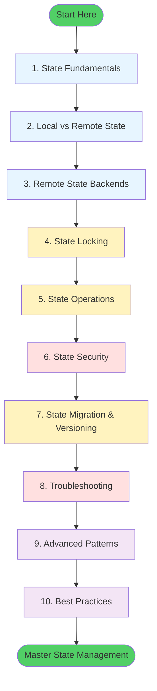

# Terraform State Management

Terraform State is the most critical component of your Infrastructure as Code lifecycle. It serves as the memory of your infrastructure, mapping your code to reality.

## 🗺️ Learning Path Visualization

---

## 📚 Learning Path

1. **[State Fundamentals](./01-State-Fundamentals/State%20Fundamentals.md)**: Understanding what state is, why we need it, the anatomy of the `.tfstate` file, and the code-state-cloud sync cycle.

2. **[Local vs. Remote State](./02-Local-vs-Remote-State/Local%20vs.%20Remote%20State.md)**: Choosing the right storage strategy for your team, backend configurations, and cross-stack references.

3. **[Remote State Backends](./03-Remote-State-Backends/Remote%20State%20Backends.md)**: Configuring S3 + DynamoDB, Azure Blob, GCS, and Terraform Cloud backends with encryption and locking.

4. **[State Locking](./04-State-Locking/State%20Locking.md)**: Protecting against concurrent modifications, understanding DynamoDB locking schema, and handling stuck locks.

5. **[State Operations](./05-State-Operations/State%20Operations.md)**: Mastering CLI commands - `list`, `show`, `mv`, `rm`, `import`, and declarative imports (Terraform 1.5+).

6. **[State Security](./06-State-Security/State%20Security.md)**: Protecting sensitive data with encryption (KMS), IAM policies, secrets management, and defending against attack vectors.

7. **[State Migration & Versioning](./07-State-Migration-Versioning/State%20Migration%20&%20Versioning.md)**: Moving between backends, state versioning, and recovering from backups.

8. **[Troubleshooting](./08-Troubleshooting/Troubleshooting%20State%20Issues.md)**: Handling drift detection, corrupted state, stuck locks, and state recovery procedures.

9. **[Advanced Patterns](Advanced%20State%20Patterns.md)**: Workspaces for multi-environment management and remote state data sources for cross-stack references.

10. **[Best Practices](./10-Best-Practices/README.md)**: The 7 golden rules for state management in production environments.

---

## 🏗️ Module Features

- **70+ Total Quiz Questions**: Comprehensive validation of state mechanics knowledge across all modules
- **Real-World Scenarios**: Practical "Stories from the Trenches" for every topic with actual solutions
- **Workflow Diagrams**: 15+ Mermaid diagrams visualizing locking, migration, security pipelines, and operations
- **Master CLI Guide**: Professional commands for day-to-day state management with examples
- **Security Deep-Dive**: Attack vectors, hacking tools (TruffleHog, Pacu, Nmap), and defense strategies
- **Hands-On Examples**: AWS CLI, Terraform HCL, and real configuration snippets

---

## 🎯 What You'll Learn

By completing this module, you will:
- ✅ Understand how Terraform tracks infrastructure state
- ✅ Configure secure remote backends with encryption and locking
- ✅ Perform safe state operations (import, move, remove)
- ✅ Implement state security best practices
- ✅ Troubleshoot and recover from state issues
- ✅ Use advanced patterns like workspaces and data sources
- ✅ Defend against state-based security threats

---

## 📺 YouTube Lessons

For visual reinforcement, check out the **[📺 YouTube Lessons](../Youtube_Lessons.md)** in the parent directory.
