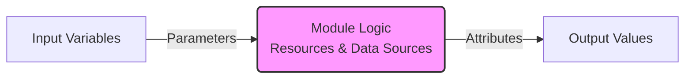
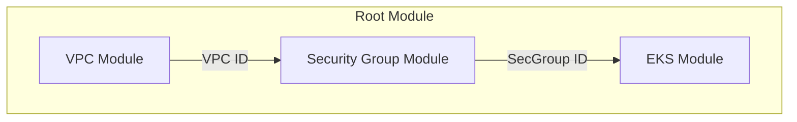

Modules are the primary way to package and reuse infrastructure configurations in Terraform. They allow you to apply the **DRY (Don't Repeat Yourself)** principle to your infrastructure code, transforming monolithic scripts into composable, manageable building blocks.

## 1. Core Concepts

### What is a Module?
A module is simply a directory containing `.tf` files.
- **Root Module**: The directory where you run `terraform apply`.
- **Child Module**: Any module called by another module.

### The "Black Box" Analogy
Think of a module like a function in programming or a physical black box:
1.  **Inputs (Variables)**: You feed in parameters (e.g., "Size=Large", "Name=Prod-DB").
2.  **Logic (Resources)**: The box does the work (creating EC2s, RDS, VPCs).
3.  **Outputs**: The box hands back results (e.g., "DB Connection Endpoint", "Instance ID").

### Key Pillars
1.  **Abstraction**: Hide complex resource configuration details behind a simple interface. A user only needs to know *what* to ask for (inputs), not *how* it's built.
2.  **Encapsulation**: Group related resources (e.g., VPC + Subnets + Route Tables + IGW) into one logical unit.
3.  **Reusability**: Write code once, use it everywhere (Dev, Staging, Prod) by just changing the inputs.
---
## 2. Types of Modules

| Type | Description | Example Source |
| :--- | :--- | :--- |
| **Root Module** | The main orchestration point. | `.` (Current Dir) |
| **Local Module** | A sub-directory in your project. | `./modules/vpc` |
| **Registry Module** | Verified community modules. | `terraform-aws-modules/vpc/aws` |
| **Git Module** | Private or public git repositories. | `git::https://github.com/org/repo.git` |

---

## 3. Real-Life Scenarios

### Scenario 1: The Copy-Paste Nightmare (DRY Principle)
**Problem**: An SRE team manages 50 microservices. Each service needs an S3 bucket with specific encryption and logging settings.
**Old Way**: They copy-paste the `aws_s3_bucket` resource block 50 times.
**The Crisis**: Security mandates a new tag `SecurityLevel = "High"` on all buckets. The team must manually edit 50 files. Miss one, and you fail the audit.
**The Module Solution**:
1.  Create a `standard_bucket` module.
2.  Define the tag in the module *once*.
3.  All 50 services use the module. Running `terraform apply` updates all of them instantly.

### Scenario 2: The "Works on My Machine" Drift (Standardization)
**Problem**: Developer A creates a VPC with a NAT Gateway. Developer B creates one without, using a cheap NAT instance. Developer C forgets the private subnet route table.
**Consequence**: Inconsistent environments leading to deployment failures in Production.
**The Module Solution**: Senior Architects build a "Golden VPC" module. Developers simply call `module "vpc" { source = ".../golden-vpc" }`. Everyone gets the exact same, valid network topology.

### Scenario 3: The Multi-Step Provisioning Headache (Composition)
**Problem**: Setting up an EKS cluster requires: VPC -> Security Groups -> IAM Roles -> EKS Control Plane -> Node Groups.
**Old Way**: A 1,000-line `main.tf` file that is impossible to read or debug.
**The Module Solution**:
- `module "network"`
- `module "security"`
- `module "compute"`
The root `main.tf` becomes a clean orchestration layer, barely 50 lines long, simply passing outputs from one module as inputs to the next.

---

## 4. ❓ Interview Questions

1.  **What is the difference between a Root Module and a Child Module?**
    *   **Answer**: The Root Module is the directory where `terraform init/apply` is run. A Child Module is any module called by the Root (or another Child) using a `module` block.

2.  **Why should you pin module versions in production?**
    *   **Answer**: To prevent breaking changes. If a module author updates the logic (e.g., v1.0 to v2.0), it might require new inputs or destroy resources. Pinning (e.g., `version = "1.2.0"`) ensures stability.

3.  **Can a module call another module?**
    *   **Answer**: Yes, this is called "Nested Modules". However, it's best practice to keep nesting shallow (1-2 levels deep) to avoid complexity and "dependency hell."

4.  **How do you access a resource attribute created inside a module from the root module?**
    *   **Answer**: You cannot access it directly. The module must declare an `output` for that attribute. You then reference it via `module.module_name.output_name`.

5.  **What happens to the state file when you start using a module for existing resources?**
    *   **Answer**: You must import the existing resources into the module's state path (e.g., `terraform move aws_instance.web module.web_server.aws_instance.this`) to avoid Terraform trying to destroy and recreate them.

6.  **Explain the difference between `source` and `version` arguments.**
    *   **Answer**: `source` tells Terraform *where* to find the code (local path, Git URL, Registry). `version` is used specifically for Registry modules to pick a specific release tag.

7.  **How do you handle provider configurations within modules?**
    *   **Answer**: You should generally **not** define `provider` blocks inside modules (except for aliases). Modules should inherit providers from the root module to allow maximum flexibility for the user.

8.  **What is the Modules Registry?**
    *   **Answer**: A public directory of community-maintained modules. It allows you to find pre-built, verified configurations for common infrastructure patterns (like AWS VPC, RDS).

9.  **What is the purpose of the `.terraform/modules` directory?**
    *   **Answer**: It is a hidden directory where Terraform caches the code of all referenced modules after running `terraform init`. It acts like a local "node_modules" folder.

10. **How do you make a variable optional in a module (Terraform 1.3+)?**
    *   **Answer**: By setting a `default` value (often `null`) or keeping the variable block empty (if using newer optional type constraints). If a default exists, the user doesn't strictly need to provide it.

---

## 5. 🧠 Knowledge Check (Quiz)

### Core Mechanics
1.  **What must you run after adding a new `module` block to your code?**
    *   [ ] `terraform plan`
    *   [x] `terraform init`
    *   [ ] `terraform apply`
    *   [ ] `terraform refresh`
    *   *Explanation*: `init` downloads the module source code to `.terraform/modules`.

2.  **Which file is mandatory for a directory to be considered a module?**
    *   [ ] `main.tf`
    *   [ ] `variables.tf`
    *   [ ] `outputs.tf`
    *   [x] None (Technically just one .tf file)
    *   *Explanation*: Any directory with at least one `.tf` file is a module. Standardization suggests `main.tf`, but it's not enforced by the binary.

3.  **Local module sources must always start with:**
    *   [ ] `/`
    *   [x] `./` or `../`
    *   [ ] `local://`
    *   [ ] `file://`

4.  **Where are module outputs stored after execution?**
    *   [ ] In the `outputs.tf` file
    *   [ ] In the module directory
    *   [x] In the Terraform State file
    *   [ ] They are discarded

5.  **If you change a module's source code locally, do you need to run `terraform init` again?**
    *   [ ] Yes, always.
    *   [x] No, not for local paths.
    *   [ ] Yes, but only with `-upgrade`.
    *   *Explanation*: Local paths are read directly. Remote modules are cached, so updates to remote sources need `init -upgrade`.

### Advanced Usage
6.  **How do you create multiple instances of a module?**
    *   [ ] Use `count` inside the module's resources.
    *   [x] Use `count` or `for_each` in the `module` block itself.
    *   [ ] Copy paste the module block.

7.  **What is the best way to pass secrets to a module?**
    *   [ ] Hardcode them in `variables.tf`.
    *   [x] Pass them as input variables marked as `sensitive = true`.
    *   [ ] Commit them to `terraform.tfvars`.

8.  **Can a module access variables from the Root module without them being passed?**
    *   [x] No, scopes are isolated.
    *   [ ] Yes, all variables are global.
    *   [ ] Yes, if they share the same name.

9.  ** What happens if a module requires a provider version that conflicts with the root?**
    *   [x] `terraform init` will fail with a version constraint error.
    *   [ ] It will use the newer version.
    *   [ ] It will use the older version.

10. **The `source` argument does NOT support which of the following?**
    *   [ ] GitHub Repositories
    *   [ ] HTTP URLs (zip files)
    *   [ ] Terraform Registry
    *   [x] Docker Images

### Scenarios
11. **You want to use a module from a private Git repo via SSH.**
    *   [ ] `source = "git::https://github.com..."`
    *   [x] `source = "git::ssh://git@github.com..."`
    *   [ ] `source = "ssh://github.com..."`

12. **To reference an output `db_endpoint` from a module named `database`.**
    *   [ ] `${module.database.db_endpoint}`
    *   [ ] `var.database.db_endpoint`
    *   [x] `module.database.db_endpoint`

13. **Why might you use `replace_triggered_by` with a module instance?**
    *   [ ] To delete the module.
    *   [x] To force re-creation of the module if a specific referenced item changes.
    *   [ ] To move the module to a new state file.

14. **True/False: You can use `depends_on` in a module block.**
    *   [x] True
    *   [ ] False

15. **True/False: `moved` blocks can be used to refactor monolithic code into modules.**
    *   [x] True
    *   [ ] False

### Troubleshooting
16. **"Source code not found" error during init usually means:**
    *   [x] The path in `source` is incorrect or the repo is inaccessible.
    *   [ ] Terraform is not installed.
    *   [ ] The module is empty.

17. **"Unsupported argument" error when calling a module means:**
    *   [ ] The variable doesn't exist in the module's `variables.tf`.
    *   [ ] You made a typo.
    *   [x] Both of the above.

18. **If `terraform get` is run, what does it do?**
    *   [ ] Applies changes.
    *   [x] Downloads/updates modules in `.terraform/modules`.
    *   [ ] Deletes modules.

19. **How to reference a specific branch `dev` in a Git source?**
    *   [x] `...git?ref=dev`
    *   [ ] `...git?branch=dev`
    *   [ ] `...git#dev`

20. **Is it possible to limit which providers are passed to a module?**
    *   [x] Yes, using `providers = { ... }` meta-argument.
    *   [ ] No, all are passed automatically.
