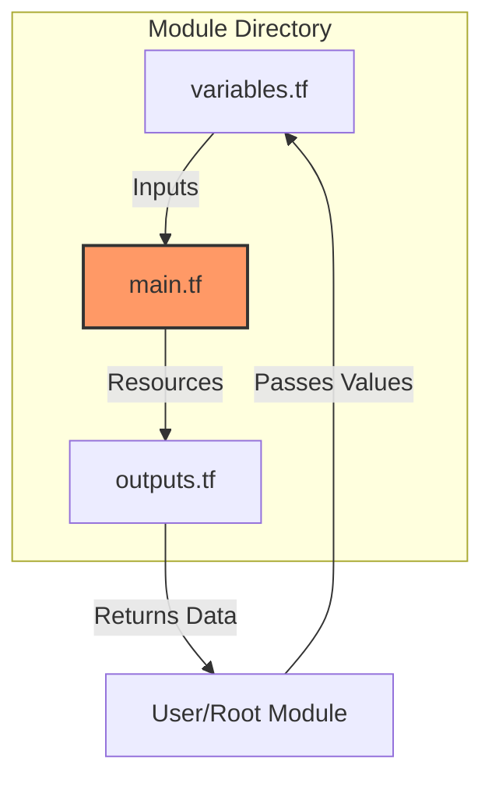

# Module Structure

A well-structured module is easy to read, maintain, and share. Consistent file organization turns a "script" into a professional infrastructure product.

## 1. Standard Module Layout
While Terraform doesn't enforce a specific structure, the industry standard (followed by the Terraform Registry and HashiCorp) is:

```text
module-name/
├── main.tf        # Primary resource definitions
├── variables.tf   # Input definitions (The "Arguments")
├── outputs.tf     # Return values (The "Attributes")
├── providers.tf   # Required provider blocks (usually empty of config)
├── versions.tf    # Terraform & Provider version constraints
├── README.md      # Human-readable documentation
└── examples/      # Sub-directories with "ready-to-run" usage code
    └── specific-use-case/
        ├── main.tf
        └── outputs.tf
```

### The "Big Three" Files
The separation of concerns is critical for readability:



### Detailed File Roles
- **main.tf**: The core logic. Contains `resource` and `data` blocks. Use locals here for internal calculations.
- **variables.tf**: The API definition.
    - **MUST**: Define types for all variables.
    - **MUST**: Include descriptions.
    - **SHOULD**: Use validation blocks for constraints.
- **outputs.tf**: The return values. What data does the user need? (e.g., Instance IP, Database Endpoint).
- **versions.tf**: "Safety Belts".
    - `terraform`: `required_version` (e.g., `>= 1.5.0`)
    - `required_providers`: Pinned provider versions (e.g., `aws = ">= 5.0"`).
- **providers.tf**:
    - **Do NOT** configure provider arguments (like region, profile) here in a reusable module. It prevents the module from being reused in different regions.
    - Only use this for `required_providers` if not in `versions.tf` (though `versions.tf` is preferred).

---

## 2. Real-Life Scenarios

### Scenario 1: The "Mystery Box" Module (Documentation)
**Problem**: A new DevOps engineer joins and finds an `app-infra` module. It's a single 2,000-line `main.tf` file. No separate variable file.
**Current State**: To find out what inputs are needed, they have to read 2,000 lines of code searching for `var.xxx`.
**The Fix**:
1.  Extract all `variable` blocks to `variables.tf`.
2.  Add `description` fields to every variable.
3.  Generate a `README.md` automatically using tools like `terraform-docs`.
**Result**: The engineer reads the README and deploys the app in 5 minutes without opening `main.tf`.

### Scenario 2: The "Circular Dependency" Trap (Architecture)
**Problem**: A team splits their code into `module "app"` and `module "db"`.
- App needs DB endpoint (Output from DB).
- DB needs App Security Group ID (Output from App) to allow traffic.
**The Crash**: Terraform fails with a "Cycle Error" because A waits for B, and B waits for A.
**The Fix**: Refactor structure. Creates a third module `module "security"` (or create SGs in Root) that creates the Security Groups first, then passes the IDs to both App and DB modules.

### Scenario 3: The "Monolith" Breakdown (Refactoring)
**Problem**: `main.tf` has grown to 5,000 lines. It contains VPCs, EC2s, IAM, and CloudWatch. Editing it is slow and error-prone.
**The Fix**: Split `main.tf` based on logical components, even within the same module:
- `network.tf` (VPC/Subnets)
- `compute.tf` (EC2/ASG)
- `iam.tf` (Roles/Policies)
- `monitoring.tf` (CloudWatch)
**Note**: Terraform treats all `.tf` files in a directory as one big file. This split is purely for human readability.

---

## 3. ❓ Interview Questions

1.  **What are the three most important files in a Terraform module and why?**
    *   **Answer**: `variables.tf` (inputs/API), `main.tf` (logic/resources), and `outputs.tf` (return values). This separation allows users to understand the interface without reading the implementation code.

2.  **Why should you include a `versions.tf` file in a reusable module?**
    *   **Answer**: To explicitly state which Terraform binary versions and Provider versions the module supports. This prevents users from trying to use a v1.0 module with an incompatible v0.12 binary or a v3.0 AWS provider.

3.  **Should you define a `provider "aws" { region = ... }` block inside a child module?**
    *   **Answer**: **No.** This is a "Hardcoded Provider". It prevents the user from using `providers` meta-argument to deploy the module to a different region or account. Providers should be inherited from the root.

4.  **What is the purpose of the `examples/` directory?**
    *   **Answer**: It serves as executable documentation. It provides complete, copy-pasteable root module configurations that show exactly how to call the module with valid inputs.

5.  **Does Terraform execute files in a specific order based on filenames (e.g., a.tf vs z.tf)?**
    *   **Answer**: No. Terraform loads all `.tf` files in the directory and builds a dependency graph based on resource references, not filenames.

6.  **What tool can verify that your module structure follows standard formatting?**
    *   **Answer**: `terraform fmt`. It canonicalizes the spacing and indentation but does not enforce file organization (that is a human convention).

7.  **How do you handle local values (`locals`) in a structured module?**
    *   **Answer**: Usage varies, but typically they are placed at the top of `main.tf` or in a dedicated `locals.tf` if the logic is complex, to keep calculations separate from resource definitions.

8.  **What is the "Root Module"?**
    *   **Answer**: The directory where you actually run the `terraform` commands. It is the entry point that calls other child modules.

9.  **Why strict file separation (variables/outputs) if Terraform doesn't enforce it?**
    *   **Answer**: For human "Cognitive Load". It matches the mental model of a function (Signature separate from Body). It allows tooling (IDEs, docs generators) to parse the module easily.

10. **What is the `terraform.lock.hcl` file?**
    *   **Answer**: It locks the specific versions of *providers* used in a configuration (Root module). It is generally NOT committed in a *reusable module* repo, but IS committed in a *root/deployment* repo.

---

## 4. 🧠 Knowledge Check (Quiz)

### File Roles
1.  **Which file should contain the `terraform { required_version = ... }` block?**
    *   [ ] `main.tf`
    *   [x] `versions.tf`
    *   [ ] `constraints.tf`
    *   [ ] `terraform.tf`

2.  **Where should you define the "Output Values" returned by your module?**
    *   [ ] `export.tf`
    *   [ ] `return.tf`
    *   [x] `outputs.tf`
    *   [ ] `variables.tf`

3.  **True/False: You can have multiple `main.tf` files (e.g., `main-ec2.tf`, `main-vpc.tf`) in one folder.**
    *   [x] True (Terraform merges all .tf files)
    *   [ ] False (Only one main file allowed)

4.  **What is the primary purpose of `variables.tf`?**
    *   [ ] storing state
    *   [x] defining the input interface
    *   [ ] defining local constants
    *   [ ] downloading plugins

5.  **If `README.md` is missing, will `terraform init` fail?**
    *   [ ] Yes
    *   [x] No
    *   [ ] Yes, but only in strict mode

### Best Practices
6.  **Why is `examples/` directory crucial for public modules?**
    *   [ ] Terraform requires it to run tests.
    *   [ ] It holds the state file.
    *   [x] It shows users exactly how to use the module.

7.  **Should `terraform.tfvars` be inside a reusable module?**
    *   [ ] Yes, to set defaults.
    *   [x] No, usually in the Root module (calling the child).
    *   [ ] Yes, but renamed to `module.tfvars`.
    *   *Explanation*: `tfvars` are for *assigning* values at runtime (Root level). Defaults belong in the `variable` block.

8.  **Where should you put complex validations for variables?**
    *   [ ] In `main.tf` using `null_resource`.
    *   [x] Inside the `variable` block using `validation { ... }`.
    *   [ ] In `outputs.tf`.

9.  **A `providers.tf` inside a module should typically contain:**
    *   [ ] `provider "aws" { region = "us-east-1" }`
    *   [x] `required_providers { ... }` blocks only.
    *   [ ] Access Keys and Secret Keys.

10. **What happens if you delete `main.tf` but keep `resources.tf`?**
    *   [x] Note: It works fine. `main.tf` is just a convention.
    *   [ ] Terraform crashes.
    *   [ ] Terraform warns you.

### Scenarios
11. **You have 100 lines of `locals` logic. Where should it go?**
    *   [ ] Hide it in `variables.tf`.
    *   [x] `locals.tf` (Best practice for complex logic).
    *   [ ] `outputs.tf`.

12. **You want to create a module that creates an S3 bucket and an IAM user. How should you structure it?**
    *   [ ] Two separate folders (modules).
    *   [x] One folder with `s3.tf` and `iam.tf` (if they are tightly coupled).
    *   [ ] Put everything in `variables.tf`.

13. **Why avoid "Hardcoded Providers" in modules?**
    *   [ ] It costs money.
    *   [x] It breaks the ability to use Terraform Aliases (deploying to multiple regions).
    *   [ ] It makes the module slower.

14. **User complains "I don't know what values to put for `var.cluster_size`".**
    *   [ ] Tell them to read the code.
    *   [x] Add a `description` to the variable in `variables.tf`.
    *   [ ] Rename the variable.

15. **What file is ignored by git (via .gitignore) but crucial for local development?**
    *   [ ] `main.tf`
    *   [x] `.terraform` directory and `.tfstate` files.
    *   [ ] `README.md`

### Troubleshooting
16. **"Cycle: module.a -> module.b -> module.a" error means:**
    *   [ ] You need more CPU.
    *   [x] Circular dependency in your structure.
    *   [ ] Network timeout.

17. **If you rename `main.tf` to `logic.tf`, will `terraform apply` still work?**
    *   [x] Yes.
    *   [ ] No.

18. **"Duplicate resource" error when you have multiple .tf files usually means:**
    *   [ ] You have too many files.
    *   [x] You copied a resource block into two different files in the same directory.
    *   [ ] Terraform is confused.

19. **Can a module contain other modules (nested)?**
    *   [x] Yes (e.g., `modules/` folder inside a module).
    *   [ ] No, strictly forbidden.

20. **Is `LICENSE` file recommended for open source modules?**
    *   [x] Yes.
    *   [ ] No.
