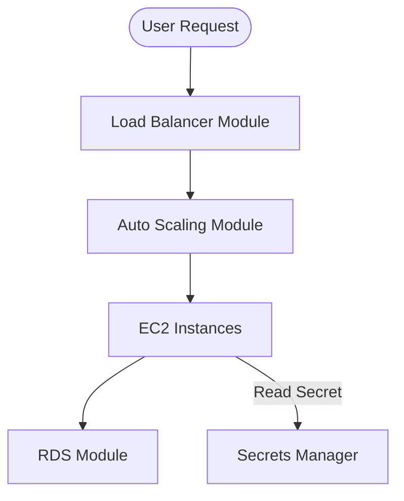

# Real-World Examples

Practical templates for the most common infrastructure patterns.

## 1. The 3-Tier Network (VPC)
A foundational module used in almost every project.
- **Resources**: VPC, Public Subnets (IGW), Private Subnets (NAT Gateway), Route Tables.
- **Key Output**: `vpc_id`, `private_subnet_ids`.

## 2. Secure Web App
A module that bundles a Load Balancer + Auto Scaling Group + RDS.
- **Abstraction**: User provides a `container_image`, and the module handles all the complex networking and scaling logic.

## 3. Kubernetes Cluster (EKS/GKE)
A highly complex module that handles:
- Control Plane.
- Node Groups (EC2/Fargate Scaling).
- OIDC Providers for IAM.
- Add-ons (CoreDNS, Metrics Server).

## 4. Database as a Service (DBaaS)
- Encrypted RDS instance.
- Automated backup window settings.
- Security Group rules that only allow the Web App's IP range.

## Mermaid Diagram: Standard Web App Module Flow



---

## 🏗️ Real-Life Scenario: The Microservice "Starter Kit"
**Problem**: Every team at a fintech startup needs to spin up a new service. They are all struggling with IAM roles and Load Balancer rules.
**Solution**: The Platform Team creates a `service-starter` module. A developer just fills in:
```hcl
module "my_service" {
  source = "./modules/service-starter"
  service_name = "payments"
  port         = 8080
}
```
**Outcome**: High-speed development with zero security risk, as the "Starter Kit" is already pre-approved by the Security team.

---

## 🧠 Final Module Quiz (5/20+)
1.  **Which module type is the absolute building block of AWS infra?** (VPC/Networking)
2.  **True/False: A real-world module should include monitoring by default.** (Recommended - Observability is a best practice)
3.  **What is the benefit of a "Starter Kit" module?** (Speed and Compliance)
4.  **How do you handle secrets in a real-world module?** (Pass a reference to Secrets Manager or Vault, not the secret text itself)
5.  **Why use a Load Balancer module instead of just an ALB resource?** (To automatically include listeners, target groups, and WAF rules)
