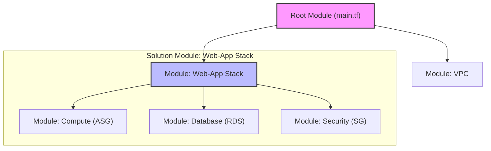

# Terraform Modules Guide

## Table of Contents
1. [Module Fundamentals](#module-fundamentals)
2. [Module Structure](#module-structure)
3. [Creating Modules](#creating-modules)
4. [Module Composition](#module-composition)
5. [Module Registry](#module-registry)
6. [Versioning Strategy](#versioning-strategy)
7. [Testing Modules](#testing-modules)
8. [Advanced Patterns](#advanced-patterns)
9. [Best Practices](#best-practices)
10. [Real-World Examples](#real-world-examples)

## Module Fundamentals

### What are Terraform Modules
```yaml
Terraform Modules:
  Definition: Reusable Terraform configurations
  Purpose:
    - Code reusability
    - Abstraction
    - Standardization
    - Maintainability
  
  Types:
    - Root Module: Main configuration
    - Child Module: Called by other modules
    - Published Module: Shared via registry
```

### Module Benefits
```hcl
# Without modules (repetitive)
resource "aws_vpc" "dev_vpc" {
  cidr_block = "10.0.0.0/16"
  tags = {
    Name = "dev-vpc"
    Environment = "dev"
  }
}

resource "aws_vpc" "prod_vpc" {
  cidr_block = "10.1.0.0/16"
  tags = {
    Name = "prod-vpc"
    Environment = "prod"
  }
}

# With modules (reusable)
module "dev_vpc" {
  source = "./modules/vpc"
  
  environment = "dev"
  vpc_cidr    = "10.0.0.0/16"
}

module "prod_vpc" {
  source = "./modules/vpc"
  
  environment = "prod"
  vpc_cidr    = "10.1.0.0/16"
}
```

## Module Structure

### Standard Module Layout
```
modules/
├── vpc/
│   ├── main.tf          # Primary resources
│   ├── variables.tf     # Input variables
│   ├── outputs.tf       # Output values
│   ├── versions.tf      # Provider requirements
│   ├── README.md        # Documentation
│   └── examples/        # Usage examples
│       └── basic/
│           ├── main.tf
│           └── variables.tf
├── compute/
│   ├── main.tf
│   ├── variables.tf
│   ├── outputs.tf
│   ├── versions.tf
│   └── README.md
└── database/
    ├── main.tf
    ├── variables.tf
    ├── outputs.tf
    ├── versions.tf
    └── README.md
```

### Module File Organization
```hcl
# modules/vpc/versions.tf
terraform {
  required_version = ">= 1.0"
  
  required_providers {
    aws = {
      source  = "hashicorp/aws"
      version = ">= 5.0"
    }
  }
}

# modules/vpc/variables.tf
variable "environment" {
  description = "Environment name"
  type        = string
  
  validation {
    condition     = contains(["dev", "staging", "prod"], var.environment)
    error_message = "Environment must be dev, staging, or prod."
  }
}

variable "vpc_cidr" {
  description = "CIDR block for VPC"
  type        = string
  default     = "10.0.0.0/16"
  
  validation {
    condition     = can(cidrhost(var.vpc_cidr, 0))
    error_message = "VPC CIDR must be a valid IPv4 CIDR block."
  }
}

variable "availability_zones" {
  description = "List of availability zones"
  type        = list(string)
  default     = []
}

variable "tags" {
  description = "Additional tags for resources"
  type        = map(string)
  default     = {}
}

# modules/vpc/main.tf
data "aws_availability_zones" "available" {
  state = "available"
}

locals {
  azs = length(var.availability_zones) > 0 ? var.availability_zones : slice(data.aws_availability_zones.available.names, 0, 3)
  
  common_tags = merge(
    {
      Environment = var.environment
      ManagedBy   = "Terraform"
    },
    var.tags
  )
}

resource "aws_vpc" "main" {
  cidr_block           = var.vpc_cidr
  enable_dns_hostnames = true
  enable_dns_support   = true
  
  tags = merge(local.common_tags, {
    Name = "${var.environment}-vpc"
  })
}

resource "aws_internet_gateway" "main" {
  vpc_id = aws_vpc.main.id
  
  tags = merge(local.common_tags, {
    Name = "${var.environment}-igw"
  })
}

resource "aws_subnet" "public" {
  count = length(local.azs)
  
  vpc_id                  = aws_vpc.main.id
  cidr_block              = cidrsubnet(var.vpc_cidr, 8, count.index + 1)
  availability_zone       = local.azs[count.index]
  map_public_ip_on_launch = true
  
  tags = merge(local.common_tags, {
    Name = "${var.environment}-public-${count.index + 1}"
    Type = "public"
  })
}

resource "aws_subnet" "private" {
  count = length(local.azs)
  
  vpc_id            = aws_vpc.main.id
  cidr_block        = cidrsubnet(var.vpc_cidr, 8, count.index + 10)
  availability_zone = local.azs[count.index]
  
  tags = merge(local.common_tags, {
    Name = "${var.environment}-private-${count.index + 1}"
    Type = "private"
  })
}

# modules/vpc/outputs.tf
output "vpc_id" {
  description = "ID of the VPC"
  value       = aws_vpc.main.id
}

output "vpc_cidr_block" {
  description = "CIDR block of the VPC"
  value       = aws_vpc.main.cidr_block
}

output "public_subnet_ids" {
  description = "IDs of the public subnets"
  value       = aws_subnet.public[*].id
}

output "private_subnet_ids" {
  description = "IDs of the private subnets"
  value       = aws_subnet.private[*].id
}

output "internet_gateway_id" {
  description = "ID of the Internet Gateway"
  value       = aws_internet_gateway.main.id
}
```

## Creating Modules

### Simple Module Example
```hcl
# modules/s3-bucket/main.tf
resource "aws_s3_bucket" "main" {
  bucket = var.bucket_name
  
  tags = var.tags
}

resource "aws_s3_bucket_versioning" "main" {
  bucket = aws_s3_bucket.main.id
  
  versioning_configuration {
    status = var.versioning_enabled ? "Enabled" : "Disabled"
  }
}

resource "aws_s3_bucket_server_side_encryption_configuration" "main" {
  bucket = aws_s3_bucket.main.id
  
  rule {
    apply_server_side_encryption_by_default {
      sse_algorithm = "AES256"
    }
  }
}

resource "aws_s3_bucket_public_access_block" "main" {
  bucket = aws_s3_bucket.main.id
  
  block_public_acls       = true
  block_public_policy     = true
  ignore_public_acls      = true
  restrict_public_buckets = true
}

# modules/s3-bucket/variables.tf
variable "bucket_name" {
  description = "Name of the S3 bucket"
  type        = string
}

variable "versioning_enabled" {
  description = "Enable versioning for the bucket"
  type        = bool
  default     = true
}

variable "tags" {
  description = "Tags to apply to the bucket"
  type        = map(string)
  default     = {}
}

# modules/s3-bucket/outputs.tf
output "bucket_id" {
  description = "ID of the S3 bucket"
  value       = aws_s3_bucket.main.id
}

output "bucket_arn" {
  description = "ARN of the S3 bucket"
  value       = aws_s3_bucket.main.arn
}

output "bucket_domain_name" {
  description = "Domain name of the S3 bucket"
  value       = aws_s3_bucket.main.bucket_domain_name
}
```

### Complex Module with Sub-modules
```hcl
# modules/web-application/main.tf
module "vpc" {
  source = "../vpc"
  
  environment        = var.environment
  vpc_cidr          = var.vpc_cidr
  availability_zones = var.availability_zones
  
  tags = var.tags
}

module "security_groups" {
  source = "../security-groups"
  
  environment = var.environment
  vpc_id      = module.vpc.vpc_id
  
  tags = var.tags
}

module "load_balancer" {
  source = "../load-balancer"
  
  environment = var.environment
  vpc_id      = module.vpc.vpc_id
  subnet_ids  = module.vpc.public_subnet_ids
  
  security_group_ids = [module.security_groups.alb_security_group_id]
  
  tags = var.tags
}

module "auto_scaling" {
  source = "../auto-scaling"
  
  environment = var.environment
  vpc_id      = module.vpc.vpc_id
  subnet_ids  = module.vpc.private_subnet_ids
  
  security_group_ids = [module.security_groups.web_security_group_id]
  target_group_arn   = module.load_balancer.target_group_arn
  
  instance_type = var.instance_type
  min_size      = var.min_size
  max_size      = var.max_size
  desired_size  = var.desired_size
  
  tags = var.tags
}

module "database" {
  source = "../rds"
  
  environment = var.environment
  vpc_id      = module.vpc.vpc_id
  subnet_ids  = module.vpc.private_subnet_ids
  
  security_group_ids = [module.security_groups.db_security_group_id]
  
  db_config = var.db_config
  
  tags = var.tags
}

# modules/web-application/variables.tf
variable "environment" {
  description = "Environment name"
  type        = string
}

variable "vpc_cidr" {
  description = "CIDR block for VPC"
  type        = string
  default     = "10.0.0.0/16"
}

variable "availability_zones" {
  description = "List of availability zones"
  type        = list(string)
  default     = []
}

variable "instance_type" {
  description = "EC2 instance type"
  type        = string
  default     = "t3.micro"
}

variable "min_size" {
  description = "Minimum number of instances"
  type        = number
  default     = 1
}

variable "max_size" {
  description = "Maximum number of instances"
  type        = number
  default     = 3
}

variable "desired_size" {
  description = "Desired number of instances"
  type        = number
  default     = 2
}

variable "db_config" {
  description = "Database configuration"
  type = object({
    engine         = string
    engine_version = string
    instance_class = string
    allocated_storage = number
  })
  
  default = {
    engine         = "mysql"
    engine_version = "8.0"
    instance_class = "db.t3.micro"
    allocated_storage = 20
  }
}

variable "tags" {
  description = "Tags to apply to resources"
  type        = map(string)
  default     = {}
}
```

## Module Composition

### Module Dependencies
```hcl
# Root module using composed modules
module "networking" {
  source = "./modules/networking"
  
  project_name = var.project_name
  environment  = var.environment
  vpc_cidr     = var.vpc_cidr
  
  tags = local.common_tags
}

module "security" {
  source = "./modules/security"
  
  project_name = var.project_name
  environment  = var.environment
  vpc_id       = module.networking.vpc_id
  
  tags = local.common_tags
  
  depends_on = [module.networking]
}

module "compute" {
  source = "./modules/compute"
  
  project_name = var.project_name
  environment  = var.environment
  
  vpc_id     = module.networking.vpc_id
  subnet_ids = module.networking.private_subnet_ids
  
  security_group_ids = module.security.instance_security_group_ids
  
  tags = local.common_tags
  
  depends_on = [module.networking, module.security]
}
```

### Module Data Flow
```hcl
# Data passing between modules
locals {
  # Centralized configuration
  app_config = {
    name         = var.app_name
    environment  = var.environment
    version      = var.app_version
  }
  
  # Network configuration
  network_config = {
    vpc_cidr             = var.vpc_cidr
    availability_zones   = var.availability_zones
    enable_nat_gateway   = var.enable_nat_gateway
    single_nat_gateway   = var.single_nat_gateway
  }
  
  # Security configuration
  security_config = {
    allowed_cidr_blocks = var.allowed_cidr_blocks
    enable_waf         = var.enable_waf
    ssl_certificate_arn = var.ssl_certificate_arn
  }
}

# Pass configuration objects to modules
module "infrastructure" {
  source = "./modules/infrastructure"
  
  app_config      = local.app_config
  network_config  = local.network_config
  security_config = local.security_config
  
  tags = local.common_tags
}
```

## Module Registry

### Publishing to Terraform Registry
```hcl
# terraform-aws-vpc/main.tf
terraform {
  required_version = ">= 1.0"
  
  required_providers {
    aws = {
      source  = "hashicorp/aws"
      version = ">= 5.0"
    }
  }
}

# Standard module structure for registry
resource "aws_vpc" "this" {
  cidr_block           = var.cidr
  enable_dns_hostnames = var.enable_dns_hostnames
  enable_dns_support   = var.enable_dns_support
  
  tags = merge(
    {
      Name = var.name
    },
    var.tags
  )
}

# terraform-aws-vpc/variables.tf
variable "name" {
  description = "Name to be used on all the resources as identifier"
  type        = string
  default     = ""
}

variable "cidr" {
  description = "The CIDR block for the VPC"
  type        = string
  default     = "10.0.0.0/16"
}

variable "enable_dns_hostnames" {
  description = "Should be true to enable DNS hostnames in the VPC"
  type        = bool
  default     = true
}

variable "enable_dns_support" {
  description = "Should be true to enable DNS support in the VPC"
  type        = bool
  default     = true
}

variable "tags" {
  description = "A map of tags to assign to the resource"
  type        = map(string)
  default     = {}
}

# terraform-aws-vpc/outputs.tf
output "vpc_id" {
  description = "The ID of the VPC"
  value       = aws_vpc.this.id
}

output "vpc_arn" {
  description = "The ARN of the VPC"
  value       = aws_vpc.this.arn
}

output "vpc_cidr_block" {
  description = "The CIDR block of the VPC"
  value       = aws_vpc.this.cidr_block
}
```

### Using Registry Modules
```hcl
# Using public registry module
module "vpc" {
  source  = "terraform-aws-modules/vpc/aws"
  version = "~> 5.0"
  
  name = "my-vpc"
  cidr = "10.0.0.0/16"
  
  azs             = ["us-west-2a", "us-west-2b", "us-west-2c"]
  private_subnets = ["10.0.1.0/24", "10.0.2.0/24", "10.0.3.0/24"]
  public_subnets  = ["10.0.101.0/24", "10.0.102.0/24", "10.0.103.0/24"]
  
  enable_nat_gateway = true
  enable_vpn_gateway = true
  
  tags = {
    Terraform   = "true"
    Environment = "dev"
  }
}

# Using private registry module
module "custom_vpc" {
  source  = "app.terraform.io/myorg/vpc/aws"
  version = "~> 1.0"
  
  name        = "custom-vpc"
  environment = "production"
  vpc_cidr    = "10.1.0.0/16"
}

# Using Git source
module "git_module" {
  source = "git::https://github.com/myorg/terraform-modules.git//vpc?ref=v1.2.0"
  
  name = "git-vpc"
  cidr = "10.2.0.0/16"
}
```

## Versioning Strategy

### Semantic Versioning
```yaml
Module Versioning:
  Format: MAJOR.MINOR.PATCH
  
  MAJOR: Breaking changes
    - Removed variables
    - Changed variable types
    - Removed outputs
    - Resource recreation
  
  MINOR: New features
    - Added variables (with defaults)
    - Added outputs
    - New optional resources
  
  PATCH: Bug fixes
    - Bug fixes
    - Documentation updates
    - Internal improvements
```

### Version Constraints
```hcl
# Exact version
module "vpc" {
  source  = "terraform-aws-modules/vpc/aws"
  version = "5.1.0"
}

# Pessimistic constraint
module "vpc" {
  source  = "terraform-aws-modules/vpc/aws"
  version = "~> 5.1"  # >= 5.1.0, < 5.2.0
}

# Range constraint
module "vpc" {
  source  = "terraform-aws-modules/vpc/aws"
  version = ">= 5.0, < 6.0"
}

# Latest in major version
module "vpc" {
  source  = "terraform-aws-modules/vpc/aws"
  version = "~> 5.0"
}
```

## Testing Modules

### Unit Testing with Terratest
```go
// test/vpc_test.go
package test

import (
    "testing"
    
    "github.com/gruntwork-io/terratest/modules/terraform"
    "github.com/stretchr/testify/assert"
)

func TestVPCModule(t *testing.T) {
    t.Parallel()
    
    terraformOptions := terraform.WithDefaultRetryableErrors(t, &terraform.Options{
        TerraformDir: "../examples/basic",
        
        Vars: map[string]interface{}{
            "environment": "test",
            "vpc_cidr":    "10.0.0.0/16",
        },
        
        EnvVars: map[string]string{
            "AWS_DEFAULT_REGION": "us-west-2",
        },
    })
    
    defer terraform.Destroy(t, terraformOptions)
    
    terraform.InitAndApply(t, terraformOptions)
    
    // Validate outputs
    vpcId := terraform.Output(t, terraformOptions, "vpc_id")
    assert.NotEmpty(t, vpcId)
    
    publicSubnetIds := terraform.OutputList(t, terraformOptions, "public_subnet_ids")
    assert.Len(t, publicSubnetIds, 3)
    
    privateSubnetIds := terraform.OutputList(t, terraformOptions, "private_subnet_ids")
    assert.Len(t, privateSubnetIds, 3)
}
```

### Integration Testing
```bash
#!/bin/bash
# test/integration-test.sh

set -e

echo "Running integration tests..."

# Test basic example
cd examples/basic
terraform init
terraform plan
terraform apply -auto-approve

# Validate infrastructure
VPC_ID=$(terraform output -raw vpc_id)
if [ -z "$VPC_ID" ]; then
    echo "ERROR: VPC ID is empty"
    exit 1
fi

# Test connectivity
PUBLIC_SUBNET_ID=$(terraform output -json public_subnet_ids | jq -r '.[0]')
aws ec2 describe-subnets --subnet-ids $PUBLIC_SUBNET_ID

# Cleanup
terraform destroy -auto-approve

echo "Integration tests passed!"
```

## Advanced Patterns

### Conditional Module Instantiation
```hcl
# Conditional module creation
module "monitoring" {
  count = var.enable_monitoring ? 1 : 0
  
  source = "./modules/monitoring"
  
  environment = var.environment
  vpc_id      = module.vpc.vpc_id
  
  tags = var.tags
}

# Conditional resources within module
resource "aws_cloudwatch_dashboard" "main" {
  count = var.create_dashboard ? 1 : 0
  
  dashboard_name = "${var.environment}-dashboard"
  
  dashboard_body = jsonencode({
    widgets = var.dashboard_widgets
  })
}

# Dynamic module configuration
module "environments" {
  for_each = var.environments
  
  source = "./modules/environment"
  
  name        = each.key
  config      = each.value
  vpc_id      = module.vpc.vpc_id
  subnet_ids  = module.vpc.private_subnet_ids
  
  tags = merge(var.common_tags, {
    Environment = each.key
  })
}
```

### Module Factories
```hcl
# modules/application-factory/main.tf
locals {
  # Default configuration
  default_config = {
    instance_type = "t3.micro"
    min_size      = 1
    max_size      = 3
    desired_size  = 2
    
    database = {
      engine         = "mysql"
      engine_version = "8.0"
      instance_class = "db.t3.micro"
    }
    
    monitoring = {
      enabled = true
      retention_days = 7
    }
  }
  
  # Merge with user config
  config = merge(local.default_config, var.config)
}

# Create application stack
module "vpc" {
  source = "../vpc"
  
  environment = var.environment
  vpc_cidr    = var.vpc_cidr
}

module "compute" {
  source = "../compute"
  
  environment   = var.environment
  vpc_id        = module.vpc.vpc_id
  subnet_ids    = module.vpc.private_subnet_ids
  
  instance_type = local.config.instance_type
  min_size      = local.config.min_size
  max_size      = local.config.max_size
  desired_size  = local.config.desired_size
}

module "database" {
  count = var.create_database ? 1 : 0
  
  source = "../database"
  
  environment = var.environment
  vpc_id      = module.vpc.vpc_id
  subnet_ids  = module.vpc.private_subnet_ids
  
  config = local.config.database
}

module "monitoring" {
  count = local.config.monitoring.enabled ? 1 : 0
  
  source = "../monitoring"
  
  environment = var.environment
  
  retention_days = local.config.monitoring.retention_days
}
```

## Best Practices

### Module Design Principles
```hcl
# 1. Single Responsibility
# Good: VPC module only handles networking
module "vpc" {
  source = "./modules/vpc"
  # VPC-specific configuration only
}

# Bad: Mixed responsibilities
module "infrastructure" {
  source = "./modules/everything"
  # VPC, compute, database, monitoring all mixed
}

# 2. Composition over Inheritance
# Good: Compose multiple focused modules
module "web_app" {
  source = "./modules/web-application"
  
  vpc_module      = module.vpc
  security_module = module.security
  compute_module  = module.compute
}

# 3. Explicit Dependencies
module "database" {
  source = "./modules/database"
  
  vpc_id     = module.vpc.vpc_id
  subnet_ids = module.vpc.private_subnet_ids
  
  depends_on = [module.vpc]
}

# 4. Sensible Defaults
variable "instance_type" {
  description = "EC2 instance type"
  type        = string
  default     = "t3.micro"
}

variable "backup_retention_period" {
  description = "Backup retention period in days"
  type        = number
  default     = 7
  
  validation {
    condition     = var.backup_retention_period >= 0 && var.backup_retention_period <= 35
    error_message = "Backup retention period must be between 0 and 35 days."
  }
}
```

### Documentation Standards
```markdown
# VPC Module

This module creates a VPC with public and private subnets across multiple availability zones.

## Usage

```hcl
module "vpc" {
  source = "./modules/vpc"
  
  environment        = "production"
  vpc_cidr          = "10.0.0.0/16"
  availability_zones = ["us-west-2a", "us-west-2b", "us-west-2c"]
  
  tags = {
    Project = "web-app"
    Owner   = "platform-team"
  }
}
```

## Requirements

| Name | Version |
|------|---------|
| terraform | >= 1.0 |
| aws | >= 5.0 |

## Providers

| Name | Version |
|------|---------|
| aws | >= 5.0 |

## Inputs

| Name | Description | Type | Default | Required |
|------|-------------|------|---------|:--------:|
| environment | Environment name | `string` | n/a | yes |
| vpc_cidr | CIDR block for VPC | `string` | `"10.0.0.0/16"` | no |
| availability_zones | List of availability zones | `list(string)` | `[]` | no |

## Outputs

| Name | Description |
|------|-------------|
| vpc_id | ID of the VPC |
| public_subnet_ids | IDs of the public subnets |
| private_subnet_ids | IDs of the private subnets |
```

## 🏗️ Module Composition Architecture

Modules are building blocks. A well-architected project uses "Resource Modules" (fine-grained) composed into "Solution Modules" (higher-level).



---

## ❓ Interview Preparation

### Top 5 Modules Interview Questions
1. **What are the three required files for a standard Terraform module?** (`main.tf`, `variables.tf`, and `outputs.tf`).
2. **What is the difference between a Root Module and a Child Module?** (The Root module is the directory where you run `terraform apply`; any module called from the root or another module is a Child module).
3. **Why should you use version constraints when calling a module from the Terraform Registry?** (To prevent breaking changes in the module from automatically being applied to your infrastructure when running `init`).
4. **How do you make a variable in a module "Required"?** (By defining the variable without a `default` value).
5. **How can you access a resource's attribute that is defined inside a child module from your root module?** (The child module must explicitly export it as an `output`, and the root module accesses it via `module.<MODULE_NAME>.<OUTPUT_NAME>`).

---

## 📝 Practice Quiz

1. **What is the local directory where Terraform downloads modules during `init`?**
   - [ ] `.modules`
   - [ ] `terraform/modules`
   - [x] `.terraform/modules`
   - [ ] `vendor/modules`

2. **Which `source` argument is valid for loading a module from a local directory?**
   - [ ] `source = "vpc"`
   - [x] `source = "./modules/vpc"`
   - [ ] `source = "/home/user/vpc"`
   - [ ] `source = "local://vpc"`

3. **True or False: A module can call another module.**
   - [x] True (This is called module nesting or composition)
   - [ ] False

---

## 🏢 Real-Life Scenario: The Reusable Microservice Stack

**Requirement**: Your company is moving to a microservices architecture. Every new microservice needs its own S3 bucket, a SQS queue, and an IAM role with specific permissions.

**Solution**:
1. **Create the Module**: Build a "microservice-base" module containing the S3, SQS, and IAM resources.
2. **Parameterize**: Use variables for the microservice name and environment.
3. **Standardize**: Add a variable for `tags` to ensure every service is properly labeled for cost tracking.
4. **Deploy**: Every time a new team needs a microservice, they simply add a 10-line `module` block to their repo, pointing to your "microservice-base" module.
5. **Impact**: You reduced infrastructure setup time from 4 hours to 5 minutes and ensured 100% compliance with company security standards.

---

This comprehensive modules guide provides patterns for creating reusable, maintainable, and well-tested Terraform modules.