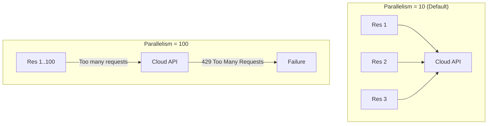

# Performance Optimization

As your infrastructure grows, `terraform plan` can slow down from seconds to minutes (or hours). Optimizing performance is crucial for developer velocity.

## 1. Parallelism

By default, Terraform runs **10** concurrent operations. You can tune this.

*   **Flag**: `terraform apply -parallelism=N`
*   **High Value (e.g., 50)**: Faster for resources like S3, IAM. *Risk: API Rate Limiting (Throttling).*
*   **Low Value (e.g., 1-5)**: Slower, but safer for strict APIs (or legacy on-prem systems).

### Visual: Parallelism Curve

---

## 2. State Segmentation

The #1 cause of slow Terraform is a **Monolithic State File**.

*   **Problem**: If you have 1,000 resources in one state file, Terraform must check the status of *every single one* (Refresh) during a `plan`.
*   **Solution**: Split state by Component (Network, App, Database).
    *   *Result*: Planning the "App" only checks 50 resources, not 1,000.

| Scale | Resources | Plan Time (approx) | Strategy |
| :--- | :--- | :--- | :--- |
| Small | < 100 | ~10s | Single State |
| Medium | 100 - 500 | ~1m | Split by Env |
| Large | 500+ | 5m+ | Split by Component |

---

## 3. Targeted Apply (The "Nuclear Option")

You can tell Terraform to ignore everything except specific resources.

*   **Command**: `terraform plan -target=aws_instance.my_server`
*   **Pros**: Ultra-fast (milliseconds). Useful for fixing one broken resource.
*   **Cons**:
    *   Ignores dependencies that might need updates.
    *   Can leave state inconsistent if abused.
    *   **Rule**: *Never use `-target` in CI/CD pipelines.* Use it only for local debugging.

---

## 4. Refresh Behavior

*   **Standard**: `terraform plan` (Refreshes state against real world).
*   **Optimization**: `terraform plan -refresh=false`
    *   **Use Case**: You know nobody touched the cloud console manualy, and you just want to see code changes.
    *   **Speed**: Instant (no API calls).
    *   **Risk**: If someone *did* change a Security Group manually, Terraform won't see it and won't fix it.

---

## 5. Real-Life Scenarios

### Scenario 1: "The 45-Minute Plan"
**Problem**: An Enterprise had a single folder for "Production" containing 4,000 resources (VPCs, 500 EC2s, RDS, etc.).
**Impact**: Developers waited 45 minutes for CI to report "No Changes."
**Fix**: Refactored the monolith into 20 smaller workspaces ( `prod-vpc`, `prod-team-a`, `prod-team-b`). Plan times dropped to < 2 minutes.

### Scenario 2: "API Rate Limited"
**Problem**: A clear-down script ran `terraform destroy -parallelism=200` to speed up deleting a test environments.
**Event**: AWS WAF blocked the CI/CD IP address due to "DDOS-like activity" (API throttling).
**Lesson**: More parallelism isn't always better. Stick to 20-50 for most clouds.

### Scenario 3: "The Forgotten Refresh"
**Problem**: A developer used `-refresh=false` to speed up their workflow.
**Event**: Meanwhile, an on-call engineer manually added a firewall rule to fix an outage. The developer applied their code, and because they didn't refresh, the state file was not updated with the manual rule. The manual rule persisted (good?) but state was desynced (bad).
**Lesson**: Only use `-refresh=false` for dry-runs, never for final applies.

---

## 6. ❓ Interview Questions

1.  **What is the default parallelism in Terraform?**
    *   **Answer**: 10 concurrent operations.

2.  **Why does `terraform plan` take a long time even if I changed nothing?**
    *   **Answer**: Because Terraform is "Refreshing State"—querying the cloud provider for the current status of every resource in the state file to detect drift.

3.  **How can you speed up a plan provided you have strict state locking?**
    *   **Answer**: Use `-refresh=false` (assuming you are confident no out-of-band changes occurred).

4.  **What is the downside of using `-target`?**
    *   **Answer**: It can lead to incomplete updates. If Resource A depends on Resource B, and you only target A, changes needed in B might be skipped, causing failure.

5.  **How does separating environments (Dev/Prod) affect performance?**
    *   **Answer**: It improves it significantly. Plans for Dev don't have to check Prod resources.

6.  **Does `terraform validate` make API calls?**
    *   **Answer**: No. It only checks syntax and internal consistency. It is very fast.

7.  **What is "Plugin Caching"?**
    *   **Answer**: Configuring `plugin_cache_dir` in `.terraformrc` so Terraform doesn't re-download the huge AWS Provider (300MB+) for every single project `init`.

8.  **Can using `count` instead of `for_each` affect performance?**
    *   **Answer**: Marginally, but `for_each` is generally preferred for safety. Performance differences are negligible compared to network I/O.

9.  **Why is `local-exec` usually slow?**
    *   **Answer**: It forces Terraform to wait for the local shell script to complete before marking the resource as done.

10. **Explain how "Data Sources" can slow down a plan.**
    *   **Answer**: Data sources are read during the refresh phase. If you have extensive data lookups (e.g., querying 100 AMIs), it adds API latency.

---

## 7. 🧠 Knowledge Check (Quiz)

### Speed Tuning
1.  **To increase concurrency, use:**
    *   [x] `-parallelism=N`
    *   [ ] `-speed=N`

2.  **The fastest way to debug a single resource:**
    *   [ ] `terraform apply`
    *   [x] `terraform apply -target=resource`

3.  **If you hit "429 Too Many Requests":**
    *   [x] Decrease parallelism.
    *   [ ] Increase parallelism.

4.  **Plugin Caching saves:**
    *   [x] Bandwidth and Init time.
    *   [ ] Plan time.

### State & Refresh
5.  **A massive state file causes:**
    *   [x] Slow Refresh / Plan times.
    *   [ ] Fast deployments.

6.  **`-refresh=false` skips:**
    *   [x] API calls to check current status.
    *   [ ] Syntax checking.

7.  **Is `-target` recommended for Production CD?**
    *   [ ] Yes.
    *   [x] No.

8.  **Splitting a Monolith into Micro-stacks:**
    *   [x] Improves performance and reduces blast radius.
    *   [ ] Is bad practice.

### Scenarios
9.  **If a plan takes 1 hour:**
    *   [ ] Buy a faster computer.
    *   [x] Segment the state file.

10. **Data Sources are read during:**
    *   [x] Plan / Refresh.
    *   [ ] Apply only.

### General
11. **`terraform fmt` affects performance:**
    *   [ ] Significantly.
    *   [x] Not at all (it's cosmetic).

12. **The default parallelism is:**
    *   [x] 10.
    *   [ ] 100.

13. **Can you run multiple plans for different directories safely?**
    *   [x] Yes, if they have different state files.
    *   [ ] No.

14. **To verify syntax quickly without checking cloud status:**
    *   [x] `terraform validate`
    *   [ ] `terraform plan`

15. **What uses more API calls?**
    *   [x] Creating 100 resources.
    *   [ ] Creating 1 resource.

16. **Is `terraform graph` a performance tool?**
    *   [ ] Yes.
    *   [x] No, it's a visualization tool (though it helps debug dependency chains).

17. **Which backend is generally faster?**
    *   [x] S3 (Standard Cloud Storage).
    *   [ ] Local (Technically fastest but unsafe).
    *   [ ] Consuls (Can be fast but complex).

18. **If you use `depends_on` everywhere:**
    *   [x] Parallelism is reduced (Terraform must wait).
    *   [ ] Parallelism is increased.

19. **Changing `instance_type` requires:**
    *   [x] An API call (ModifyInstance).
    *   [ ] No API call.

20. **Does bandwidth affect Terraform?**
    *   [x] Yes, uploading large Modules/Plugins takes time on slow connections.
