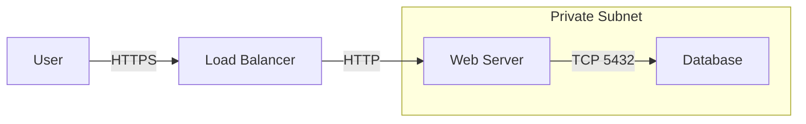

# Documentation Standards

Infrastructure as Code without documentation is just "Code that only one person understands." Good documentation turns your Terraform module into a self-service product.

## 1. Automated Documentation (`terraform-docs`)

Do not manually write tables of inputs and outputs. You will forget to update them.

**Tool**: `terraform-docs` (Open Source).
**Usage**: `terraform-docs markdown table . > README.md`

**Enhanced Workflow**:
Include a comment in your `README.md` and instruct `terraform-docs` to inject content there.
```markdown
<!-- BEGIN_TF_DOCS -->
<!-- END_TF_DOCS -->
```
This ensures your written "Why" content (Architecture, usage) isn't overwritten by the "What" content (Inputs/Outputs).

---

## 2. The Gold Standard README

Every module should have a `README.md` with these sections:

| Section | Content |
| :--- | :--- |
| **Title** | Name of the module. |
| **Description** | 1-2 sentences on what it creates. |
| **Usage** | A copy-pasteable example block. |
| **Architecture** | A generic diagram of what is built. |
| **Assumptions** | e.g., "Requires an existing VPC". |
| **Inputs/Outputs** | Auto-generated table. |
| **Authors** | Who maintains this? |

### Example Usage Block
```hcl
module "vpc" {
  source = "git::https://github.com/acme/vpc.git?ref=v1.0.0"

  env     = "prod"
  regions = ["us-east-1"]
}
```

---

## 3. Visualizing Infrastructure

Text is hard to parse. Diagrams are instant.

### Mermaid.js
Use Mermaid (like in this document) for generic flows. It renders natively in GitHub/GitLab.

**Example Architecture Flow:**


### Generated Graphs
*   **`terraform graph`**: Native command. Generates DOT files. Hard to read for large stacks.
*   **Inframap / Blast Radius**: Tools that visualize the state file or graph to show what connects to what.

---

## 4. Code Comments: The "Why" vs "What"

*   **Bad (The What)**:
    ```hcl
    # Create an S3 bucket
    resource "aws_s3_bucket" "this" { ... }
    ```
    *Why it's bad*: The code already says it creates a bucket.

*   **Good (The Why)**:
    ```hcl
    # We use a randomized suffix because the bucket name must be globally unique
    # and we want to support multiple deployments in the same account.
    resource "aws_s3_bucket" "this" { ... }
    ```

---

## 5. Real-Life Scenarios

### Scenario 1: "The Mystery Module"
**Problem**: A developer found a module named `utils`. It had 50 variables but no README.
**Consequence**: They spent 4 hours reading the source code to understand how to use it. They missed a required variable `enable_logging` which defaulted to `false`, causing a compliance violation later.
**Fix**: Added `description` to all variables and ran `terraform-docs`.

### Scenario 2: "The Stale Diagram"
**Problem**: The `README.md` had a PNG image of the architecture from 2019. The infrastructure had changed significantly since then.
**Consequence**: A new hire implemented a firewall change based on the diagram, blocking traffic to a service that didn't exist safely in the diagram but did in reality.
**Fix**: Switched to Mermaid.js code diagrams committed to Git, making updates part of the PR process.

### Scenario 3: "Bus Factor 1"
**Problem**: Only one Senior Engineer knew how the `eks-complex` module worked.
**Event**: That engineer left the company.
**Consequence**: The team had to rewrite the module from scratch because they were afraid to touch the undocumented logic.
**Fix**: Enforced "Documentation as Code" reviews. No PR merging without updated docs.

---

## 6. ❓ Interview Questions

1.  **Why is `terraform-docs` preferred over manual documentation?**
    *   **Answer**: It prevents "Drift" between the code (Source of Truth) and the documentation. Manual docs always get outdated.

2.  **What is the most important part of a Variable definition for documentation?**
    *   **Answer**: The `description` field. It allows tools to auto-generate context for the user.

3.  **How can you diagram Terraform relationships automatically?**
    *   **Answer**: `terraform graph | dot -Tpng > graph.png`, or use tools like `Inframap` or `Rover`.

4.  **What belongs in the `examples/` folder?**
    *   **Answer**: Complete, working root modules that demonstrate how to call the main module. These serve as executabale documentation.

5.  **Why avoid committing binary images (PNG/JPG) for diagrams?**
    *   **Answer**: They are hard to diff in Git, inflate repo size, and require external tools to edit. Code-based diagrams (Mermaid, PlantUML) are superior.

6.  **Should `LICENSE` files be included in private modules?**
    *   **Answer**: Yes, generally standard practice to clarify ownership, although critical for public/open-source modules.

7.  **What is "Literate Programming" in the context of IaC?**
    *   **Answer**: Writing code and documentation together, where documentation is a first-class citizen.

8.  **How do you document a "workaround" or "hack" in Terraform code?**
    *   **Answer**: Use comment blocks explaining the *reason* (e.g., "Link to GitHub Issue #123") so future maintainers know why the weird code exists.

9.  **Who is the primary audience for Module Documentation?**
    *   **Answer**: Other developers (consumers) of the module, not just the author.

10. **Does `terraform registry` require specific documentation format?**
    *   **Answer**: Yes, it parses the `README.md` and relies on standard Markdown structure to display information nicely on the Registry UI.

---

## 7. 🧠 Knowledge Check (Quiz)

### Tools & Formats
1.  **`terraform-docs` generates output from:**
    *   [ ] The state file.
    *   [x] `variables.tf`, `outputs.tf`, and `main.tf` comments.

2.  **Mermaid.js is used for:**
    *   [x] Diagrams as Code.
    *   [ ] Data visualization.

3.  **The `description` field in a variable is:**
    *   [ ] Optional but highly recommended.
    *   [x] Mandatory (by best practice standards).

4.  **`terraform graph` outputs format:**
    *   [x] DOT (Graphviz).
    *   [ ] PNG.

5.  **Markdown files end in:**
    *   [ ] `.txt`
    *   [x] `.md`

### Concepts
6.  **"Docs as Code" means:**
    *   [x] Storing docs in Version Control with the code.
    *   [ ] Scanning paper docs.

7.  **If documentation contradicts the code:**
    *   [x] The code is the source of truth (and the docs are a bug).
    *   [ ] The docs are right.

8.  **Automated docs help avoid:**
    *   [x] Stale/Outdated information.
    *   [ ] Syntax errors.

9.  **An `examples` directory is:**
    *   [x] A form of documentation.
    *   [ ] A scratchpad.

10. **Diagrams should show:**
    *   [x] Logical flow and relationships.
    *   [ ] exact IP addresses (usually).

### Scenarios
11. **Updating a `README.md` manually is:**
    *   [ ] Good practice.
    *   [x] To be avoided for Input/Output tables.

12. **A module without an "Example" usage block:**
    *   [x] Is hard to adopt.
    *   [ ] Is fine.

13. **Commenting "This is a variable" above a variable block is:**
    *   [x] Useless noise.
    *   [ ] Helpful.

14. **Linking to a Jira ticket in code comments:**
    *   [x] Good for context on weird logic.
    *   [ ] Bad practice.

15. **If a module is private, does it need docs?**
    *   [x] Yes, for your team members (and future you).
    *   [ ] No.

### General
16. **`README.md` is rendered by:**
    *   [x] Git Hosting (GitHub/GitLab) and IDEs.
    *   [ ] Chrome only.

17. **Inputs are defined in:**
    *   [x] `variables.tf`
    *   [ ] `inputs.tf`

18. **Outputs are defined in:**
    *   [x] `outputs.tf`
    *   [ ] `main.tf`

19. **Can `terraform-docs` inject into an existing file?**
    *   [x] Yes (using delimeters).
    *   [ ] No, it only overwrites.

20. **The "Bus Factor" refers to:**
    *   [x] Risk of knowledge loss if team members leave.
    *   [ ] Transport protocols.
