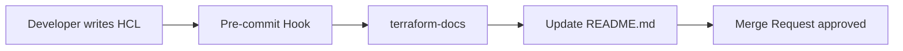

# Documentation Standards

"Code as Documentation" is a myth. Good infrastructure requires clear human-readable explanations.

## 📝 Required Documents

### 1. The Root README
Every project must have a top-level `README.md` covering:
- **What**: Purpose of the infrastructure.
- **How**: How to deploy it (Step-by-step commands).
- **Prerequisites**: Version requirements (Terraform, AWS CLI).

### 2. Module Documentation
Use `terraform-docs` to automatically generate tables for:
- Required Inputs.
- Optional Inputs (with defaults).
- Outputs.

### 3. Architecture Diagrams
A picture is worth 1,000 lines of HCL.
- **Tools**: Lucide.app, Mermaid.js, or Draw.io.
- **Store**: Keep the editable file in the `docs/` folder.

## Mermaid Diagram: Documentation Workflow

---

## 🏗️ Real-Life Scenario: The "Unknown Tag" Crisis
**Problem**: An auditor asks why 500 instances are tagged with `cost-center: 90210`. The person who wrote the code left 3 years ago. There is no documentation.
**Outcome**: The team spends 2 weeks interviewing old employees to find out which department owns those instances.
**Fix**: Implement a "Tagging Guide" in the Documentation Standards. Every allowed tag must be listed in the README with its business meaning.

---

## ❓ Interview Questions
1.  **What is `terraform-docs` and why is it essential for modules?**
    *   *Answer*: It is an automated tool that extracts variable and output definitions from your code and formats them into a beautiful markdown table. It ensures your documentation is always in sync with your code.
2.  **should you document every single resource in a project?**
    *   *Answer*: No, but you should document the *purpose* of each module and any non-obvious logic or workarounds used in the HCL.

---

## 🧠 Quiz Snippet (5/20+)
1.  **Which tool auto-generates variable tables?** (`terraform-docs`)
2.  **True/False: You should keep your architecture diagrams in a separate wiki.** (False - keep it near the code in a `docs/` folder)
3.  **What is the most important part of a project README?** (The "Getting Started" or "How to Deploy" section)
4.  **Can you put Mermaid diagrams in Markdown?** (Yes, most modern platforms support them)
5.  **What is the benefit of "Standardized Documentation"?** (Easier onboarding for new team members and consistent audits)
