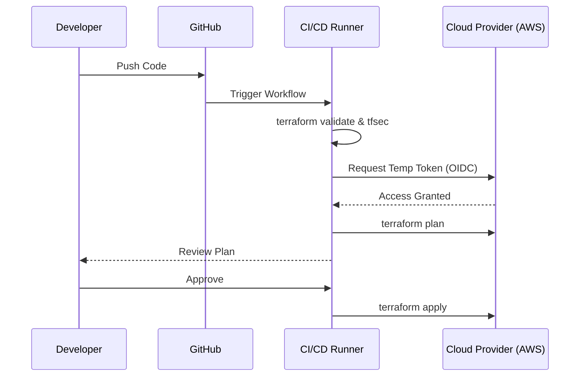

# CI/CD Integration

Automating your deployments ensures consistency, visibility, and safety.

## 🚀 The Terraform Pipeline
A standard pipeline follows these steps:
1.  **Style Check**: `terraform fmt -check`.
2.  **Lint/Security**: `tflint` and `tfsec`.
3.  **Initialize**: `terraform init`.
4.  **Plan**: `terraform plan -out=tfplan`.
5.  **Approval**: A human (or automated test) reviews the plan.
6.  **Apply**: `terraform apply tfplan`.

## OIDC vs. Static Keys
**Don't** store AWS `secret_access_key` in GitHub Actions.
**Do** use **OIDC (OpenID Connect)**. It allows your CI/CD runner to request a temporary, short-lived token from the cloud provider, making it impossible to "steal" a password.

## Mermaid Diagram: CI/CD Pipeline

---

## 🏗️ Real-Life Scenario: The "Secret" Gatekeeper
**Problem**: An organization has 50 developers. They all have "Admin" access to AWS to run Terraform.
**Crisis**: Someone manually deletes a database "just to test something." No one knows who did it.
**Solution**: Remove manual access. The *only* thing allowed to change infrastructure is the **CI/CD Pipeline**. 
**Outcome**: Every change is now linked to a Pull Request, a developer name, and an approved plan.

---

## ❓ Interview Questions
1.  **What is the benefit of the `-out=tfplan` flag in a CI/CD pipeline?**
    *   *Answer*: It saves the exact plan that was reviewed. This ensures that the code that is "Applied" is exactly the same code that was "Planned," even if someone else makes a change in between steps.
2.  **How do you handle "Manual Approval" in a CI/CD pipeline?**
    *   *Answer*: Most tools (GitHub Actions, GitLab, Jenkins) allow you to insert a "Wait" stage that requires a button click from an authorized user before moving from `plan` to `apply`.

---

## 🧠 Quiz Snippet (5/20+)
1.  **Which command generates the execution plan in CI?** (`terraform plan`)
2.  **True/False: It is okay to use `auto-approve` in Production pipelines.** (False - generally requires a human eye)
3.  **What is OIDC?** (OpenID Connect - used for secure, keyless authentication)
4.  **Where should your CI/CD runner execute?** (In a secure, private environment or a trusted runner)
5.  **What is the purpose of the `validate` step?** (Early failure - catch syntax errors before reaching the cloud)
