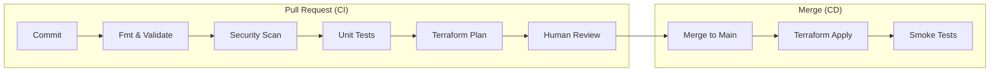

# CI/CD Integration

Friends don't let friends run `terraform apply` from their laptops. Automating Terraform is the key to stability, auditability, and collaboration.

## 1. The Ideal Pipeline Flow

A robust Infrastructure Pipeline has two distinct phases: **Continuous Integration (PR Check)** and **Continuous Deployment (Merge)**.



---

## 2. Pipeline Stages

1.  **Format**: `terraform fmt -check -recursive` (Fail if ugly).
2.  **Validate**: `terraform validate` (Fail if invalid syntax).
3.  **Security**: `checkov -d .` (Fail if insecure).
4.  **Plan**: `terraform plan -out=tfplan`. **Crucial**: Post the plan output as a comment on the PR.
5.  **Apply**: `terraform apply tfplan`. Only runs on the `main` branch.

---

## 3. GitHub Actions Example

A simplified workflow for a Pull Request:

```yaml
name: Terraform Plan
on: [pull_request]

jobs:
  plan:
    runs-on: ubuntu-latest
    steps:
      - uses: actions/checkout@v3
      - uses: hashicorp/setup-terraform@v2
      
      - name: Terraform Init
        run: terraform init
        env:
          AWS_ACCESS_KEY_ID: ${{ secrets.AWS_ACCESS_KEY_ID }}
          AWS_SECRET_ACCESS_KEY: ${{ secrets.AWS_SECRET_ACCESS_KEY }}

      - name: Terraform Plan
        id: plan
        run: terraform plan -no-color
        
      - name: Update Pull Request
        uses: actions/github-script@v6
        if: github.event_name == 'pull_request'
        with:
          script: |
            const output = `#### Terraform Plan 📖\`${{ steps.plan.outcome }}\`
            \`\`\`\n${{ steps.plan.outputs.stdout }}\n\`\`\``;
            github.rest.issues.createComment({
              issue_number: context.issue.number,
              owner: context.repo.owner,
              repo: context.repo.repo,
              body: output
            })
```

---

## 4. PR Automation Tools

Generic CI is great, but specialized tools are better.

*   **Atlantis**: Run `terraform plan` via PR comments (`atlantis plan`). Supports locking!
*   **Terraform Cloud / Spacelift / Scalr**: Managed platforms that handle state, locking, and policy enforcement (Sentinel).

---

## 5. Drift Detection

Infrastructure often changes *outside* of Terraform (someone uses the AWS Console).

*   **Strategy**: Run `terraform plan -detailed-exitcode` on a schedule (e.g., nightly).
*   **Result**: If it detects changes (Exit Code 2), send a Slack alert: "Drift Detected!".
*   **Goal**: Zero Surprise.

---

## 6. Real-Life Scenarios

### Scenario 1: "The Blind Application"
**Problem**: A team merged PRs without seeing the Plan.
**Event**: Developing a new feature, a rename caused a `destroy` of the production database. The pipeline dutifully ran `apply` on merge.
**Fix**: Enforce "Plan Review". The pipeline must fail if `plan` fails, and the plan output must be visible to the reviewer.

### Scenario 2: "The CI/CD Race Condition"
**Problem**: Two developers merged PRs 1 minute apart.
**Event**: Pipeline A started Apply. Pipeline B started Apply.
**Result**: State Lock conflict. Pipeline B failed.
**Fix**: Use a queueing system (like Atlantis or Terraform Cloud) which queues applies sequentially.

### Scenario 3: "Shadow IT"
**Problem**: A developer manually opened port 22 to the world on a security group for "testing" and forgot to close it.
**Discovery**: 3 weeks later during an audit.
**Fix**: Implemented **Nightly Drift Detection**. The next morning, the team got an alert that the state (closed) didn't match reality (open). Run `apply` to automatically revert the manual change.

---

## 7. ❓ Interview Questions

1.  **Why save the plan file (`-out=tfplan`) in CI/CD?**
    *   **Answer**: To ensure that exactly what was reviewed in the Plan phase is what gets Applied. If you re-run `plan` during the Apply phase, the infrastructure might have changed in between.

2.  **How do you handle secrets in GitHub Actions?**
    *   **Answer**: Use GitHub Secrets (`${{ secrets.MY_KEY }}`). Never print them to the log. Pass them as environment variables.

3.  **What is the "Detailed Exit Code" in Terraform?**
    *   **Answer**: `-detailed-exitcode` returns `0` for no changes, `1` for error, and `2` for non-empty diff (changes present). Essential for Drift Detection scripts.

4.  **Why use OIDC instead of AWS Keys in CI?**
    *   **Answer**: Keys are long-lived and risky if leaked. OIDC allows the CI runner to exchange a temporary JWT token for short-lived AWS credentials.

5.  **How do you prevent concurrent builds from corrupting state?**
    *   **Answer**: State Locking (DynamoDB). The second build will fail to acquire the lock and wait or error out.

6.  **Should `terraform apply` run automatically on merge?**
    *   **Answer**: Yes, for Continuous Deployment. The review gate happens *before* merge (during the PR/Plan phase).

7.  **What is "Matrix Testing" in CI?**
    *   **Answer**: Running the same test suite across multiple combinations (e.g., Terraform 1.3, 1.4, 1.5) to ensure module compatibility.

8.  **How do you handle a failed `apply` in CD?**
    *   **Answer**: Rollback is manual (revert commit). Terraform may leave the state "partially applied". You must fix the code and apply again.

9.  **What is the benefit of Slack notifications in CI/CD?**
    *   **Answer**: Visibility. The whole team knows when a deployment starts, succeeds, or fails.

10. **Explain how Atlantis differs from Jenkins.**
    *   **Answer**: Atlantis is specific to Terraform. It locks the directory while a PR is open, preventing others from modifying the same state until the PR is merged. Jenkins is a generic runner.

---

## 8. 🧠 Knowledge Check (Quiz)

### Pipeline Stages
1.  **`terraform fmt` should run:**
    *   [x] First (Fastest).
    *   [ ] Last.

2.  **`terraform plan` in CI should output to:**
    *   [x] A file (artifact) and a PR comment.
    *   [ ] `/dev/null`.

3.  **Security scanning (SAST) happens:**
    *   [x] Before Apply.
    *   [ ] After Apply.

4.  **Smoke Tests check:**
    *   [x] That the application is actually running after deploy.
    *   [ ] Syntax.

### Tools & Automation
5.  **GitHub Actions uses:**
    *   [x] YAML workflows.
    *   [ ] XML.

6.  **OIDC stands for:**
    *   [x] OpenID Connect.
    *   [ ] Only ID Connect.

7.  **Atlantis listens to:**
    *   [x] Webhooks from your VCS (GitHub/GitLab).
    *   [ ] Twitter.

8.  **Drift Detection is usually runs:**
    *   [x] On a Schedule (Cron).
    *   [ ] On Commit.

### Scenarios
9.  **If a pipeline fails "State Lock":**
    *   [x] Another process is running. Wait or kill it.
    *   [ ] Delete the state file.

10. **Applying without a Plan is:**
    *   [x] Dangerous "Cowboy Engineering".
    *   [ ] Efficient.

11. **If Drift is detected, the automated response implies:**
    *   [ ] The code is wrong.
    *   [x] The reality has diverged (Manual change or Code change).

12. **Saving `tfplan` as an artifact ensures:**
    *   [x] Consistency between CI and CD.
    *   [ ] GitHub doesn't crash.

13. **"Governance" in pipelines usually refers to:**
    *   [x] Policy checks (Cost, Security) that block deployment.
    *   [ ] Naming branches.

### General
14. **Does `terraform init` need credentials?**
    *   [x] Yes, to access the Backend (S3) and potentially private modules.
    *   [ ] No.

15. **To silence CLI headers in logs:**
    *   [x] `-no-color` or `-compact-warnings`.
    *   [ ] Delete logs.

16. **A "Runner" is:**
    *   [x] The server/container executing the pipeline jobs.
    *   [ ] The developer.

17. **Can you deploy to multiple environments (Dev/Prod) in one pipeline?**
    *   [x] Yes, usually sequentially (Deploy Dev -> Test -> Approval -> Deploy Prod).
    *   [ ] No.

18. **Why are "Long-lived branches" bad for Terraform CD?**
    *   [x] State drift makes merging painful.
    *   [ ] They use too much disk space.

19. **If a secret is masked in the log (`***`), is it safe?**
    *   [x] Generally yes, but verify it wasn't printed effectively elsewhere.
    *   [ ] No.

20. **Is "Manual Approval" a valid CD step?**
    *   [x] Yes, especially for Production promotion.
    *   [ ] No, everything must be fully automated.
