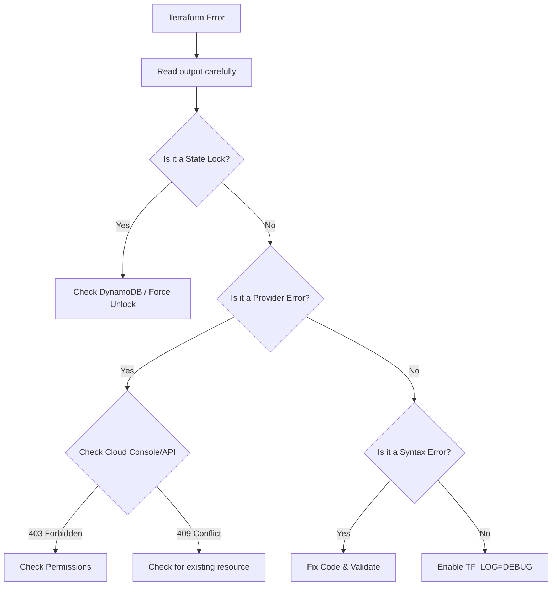

# Troubleshooting Guidelines

When Terraform shows red, don't panic. Terraform errors are usually descriptive, but the fix often lies in the state or the cloud, not just the code.

## 1. The Troubleshooting Flowchart



---

## 2. Debugging Tools

### Verbose Logging
Terraform hides complex API calls by default. Turn on debug logs to see exactly what HTTP requests are failing.

```bash
export TF_LOG=DEBUG
export TF_LOG_PATH=terraform.log
terraform apply
```
*   **Tip**: Search the log for `4xx` or `5xx` errors.

### State Surgery
Sometimes you need to manually fix the state file.

*   **`terraform state list`**: Show all resources.
*   **`terraform state show <address>`**: Inspect attributes of a resource.
*   **`terraform state rm <address>`**: Stop tracking a resource (keep it in cloud, remove from Terraform).
*   **`terraform state mv <source> <dest>`**: Rename a resource without destroying it.

---

## 3. Common Errors & Fixes

| Error Type | Message | Likely Cause | Fix |
| :--- | :--- | :--- | :--- |
| **Locking** | `Error acquiring the state lock` | Previous run crashed or is still running. | Wait 10m, or `terraform force-unlock <ID>` (Confirm no process running!). |
| **Permissions** | `403 Forbidden` / `AccessDenied` | Your AWS User/Role lacks permission. | Update IAM Policies. Check CloudTrail for `AccessDenied`. |
| **Conflict** | `409 Conflict` / `AlreadyExists` | Resource exists in cloud but not in State. | `terraform import` the existing resource or delete it manually. |
| **Plugin** | `Plugin initialization failed` | Network issue downloading provider. | Run `terraform init -upgrade`. Check network/proxies. |

---

## 4. Dependency Hell

**Circular Dependency**: Resource A refers to B, and B refers to A.
*   **Fix**: Break the cycle. Use `count` or split resources into layers.

**Provider Version Conflict**: Module A needs AWS `>4.0`, Module B needs AWS `<3.0`.
*   **Fix**: You cannot use incompatible provider versions in the same binary. Upgrade Module B or split them into separate directories/states.

---

## 5. Real-Life Scenarios

### Scenario 1: "The Zombie Resource"
**Problem**: Terraform says `creating aws_s3_bucket...` then errors with `BucketAlreadyExists`.
**Verification**: You assume Terraform made it. You check the console, the bucket exists.
**Root Cause**: It likely failed *after* creation but *before* saving to state (state write failure), or someone created it manually.
**Fix**: `terraform import aws_s3_bucket.my_bucket bucket-name`.

### Scenario 2: "The Dependency Cycle"
**Problem**: A Security Group Rule depends on the SG, but the SG depends on the Rule (via inline rules).
**Error**: `Cycle: aws_security_group.sg, aws_security_group_rule.rule`
**Fix**: Remove inline `ingress/egress` blocks from the SG resource and use exclusively `aws_security_group_rule` resources.

### Scenario 3: "The Stuck Lock"
**Problem**: CI/CD pipeline was killed (`SIGKILL`) during an apply.
**Consequence**: All future builds fail with "Error acquiring state lock".
**Fix**:
1.  Verify the CI job is definitely dead.
2.  Grab the `ID` from the error message.
3.  Run `terraform force-unlock <ID>`.

---

## 6. ❓ Interview Questions

1.  **What environment variable enables debug logging?**
    *   **Answer**: `TF_LOG` (set to `DEBUG` or `TRACE`).

2.  **When should you use `terraform refresh`?**
    *   **Answer**: Rarely in modern versions (it's part of Plan). Use it if you suspect the state file is out of sync with widely changed cloud resources and you want to update the state file without applying changes.

3.  **How do you handle a "Provider Error" that says "400 Bad Request"?**
    *   **Answer**: Enable debug logs to see the JSON request body. Often it's a validation error from the API that Terraform didn't catch (e.g., invalid characters in a name).

4.  **What is "Taint"?**
    *   **Answer**: Marking a resource as degraded. `terraform taint <res>` forces it to be destroyed and recreated on the next apply. (Deprecated in favor of `apply -replace`).

5.  **Can you edit the `terraform.tfstate` JSON file manually?**
    *   **Answer**: Technically yes, but **High Risk**. A unified typo corrupts the state. Always use `terraform state` commands (`mv`, `rm`) instead.

6.  **Why does Terraform sometimes fail to delete a VPC?**
    *   **Answer**: Dependency Violation. A VPC cannot be deleted if it contains ENIs, SGs, or Subnets. Terraform tries to delete in order, but sometimes cloud-side delays cause timeouts.

7.  **What does `ERRO` in the logs mean?**
    *   **Answer**: An Error level log entry.

8.  **If a `terraform apply` times out, what happens to the state?**
    *   **Answer**: Terraform attempts to save the state of what *did* complete. Resources currently creating might be lost (Zombie resources).

9.  **How do you debugging interpolation strings?**
    *   **Answer**: Use `terraform console` to interactively test expressions like `"${var.name}-${local.suffix}"`.

10. **What is the "Crash.log"?**
    *   **Answer**: If Terraform panics (Go crash), it writes a `crash.log`. This indicates a bug in the Provider or Core code, not your configuration.

---

## 7. 🧠 Knowledge Check (Quiz)

### Tools & Commands
1.  **To move a resource in state:**
    *   [x] `terraform state mv`
    *   [ ] Cut and paste in JSON.

2.  **To debug API calls:**
    *   [x] `TF_LOG=DEBUG`
    *   [ ] `terraform debug`

3.  **`terraform import` is used when:**
    *   [x] Resource exists in Cloud, but not in State.
    *   [ ] Resource exists in State, but not in Cloud.

4.  **`terraform console` allows you to:**
    *   [x] Test interpolation and variables.
    *   [ ] Apply code.

### Errors
5.  **403 Forbidden usually means:**
    *   [x] IAM Permission issues.
    *   [ ] Networking issues.

6.  **"Error acquiring state lock":**
    *   [x] Another apply is running (or crashed).
    *   [ ] Database is full.

7.  **Circular dependencies are fixed by:**
    *   [x] Refactoring logic/splitting resources.
    *   [ ] Increasing timeout.

8.  **If `terraform plan` is stuck:**
    *   [x] It might be waiting on a strict API block or large resource refresh.
    *   [ ] It's broken.

9.  **Zombie resources are:**
    *   [x] In the cloud, but not in state.
    *   [ ] In state, but not in cloud.

10. **A "Tainted" resource will be:**
    *   [x] Replaced on next apply.
    *   [ ] Ignored.

### Scenarios
11. **If you lose the state file entirely:**
    *   [x] You must import everything again (Painful).
    *   [ ] Just run apply.

12. **Modifying state manually is:**
    *   [x] Dangerous.
    *   [ ] Recommended.

13. **If a provider crashes:**
    *   [x] Report a bug to the provider repo (GitHub).
    *   [ ] Retry loop.

14. **`terraform force-unlock` should be used:**
    *   [x] Only after confirming no active process.
    *   [ ] Whenever you see a lock error.

15. **To see all resources in state:**
    *   [x] `terraform state list`
    *   [ ] `terraform list`

### General
16. **Does `terraform validate` catch cloud interaction errors?**
    *   [ ] Yes.
    *   [x] No, only syntax/config errors.

17. **Can you undo a `terraform state rm`?**
    *   [x] No (unless you have state versioning/backups).
    *   [ ] Yes, `terraform undo`.

18. **Is `TF_LOG=TRACE` more verbose than `DEBUG`?**
    *   [x] Yes.
    *   [ ] No.

19. **If you rename a resource in code without `moved` block:**
    *   [x] Terraform sees a Destroy + Create.
    *   [ ] Terraform renames it automatically.

20. **409 Conflict typically requires:**
    *   [x] Importing or Deleting the conflict.
    *   [ ] Restarting the computer.
