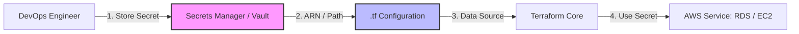

# Terraform Best Practices Guide

## Table of Contents
1. [Code Organization](#code-organization)
2. [Naming Conventions](#naming-conventions)
3. [Security Best Practices](#security-best-practices)
4. [Performance Optimization](#performance-optimization)
5. [Testing Strategies](#testing-strategies)
6. [Documentation Standards](#documentation-standards)
7. [Version Control](#version-control)
8. [CI/CD Integration](#cicd-integration)
9. [Monitoring and Observability](#monitoring-and-observability)
10. [Troubleshooting Guidelines](#troubleshooting-guidelines)

## Code Organization

### Project Structure Best Practices
```
terraform-project/
├── environments/
│   ├── dev/
│   │   ├── main.tf
│   │   ├── variables.tf
│   │   ├── outputs.tf
│   │   ├── terraform.tfvars
│   │   └── backend.tf
│   ├── staging/
│   └── prod/
├── modules/
│   ├── networking/
│   │   ├── main.tf
│   │   ├── variables.tf
│   │   ├── outputs.tf
│   │   ├── versions.tf
│   │   └── README.md
│   ├── compute/
│   └── database/
├── shared/
│   ├── data-sources.tf
│   ├── locals.tf
│   └── providers.tf
├── scripts/
│   ├── deploy.sh
│   ├── validate.sh
│   └── cleanup.sh
├── docs/
├── tests/
├── .gitignore
├── .pre-commit-config.yaml
├── Makefile
└── README.md
```

### File Organization Patterns
```hcl
# main.tf - Primary resource definitions
terraform {
  required_version = ">= 1.0"
  
  required_providers {
    aws = {
      source  = "hashicorp/aws"
      version = "~> 5.0"
    }
  }
}

# Call modules in logical order
module "networking" {
  source = "../modules/networking"
  # ... configuration
}

module "security" {
  source = "../modules/security"
  # ... configuration
  depends_on = [module.networking]
}

module "compute" {
  source = "../modules/compute"
  # ... configuration
  depends_on = [module.networking, module.security]
}

# variables.tf - Input variable definitions
variable "environment" {
  description = "Environment name (dev, staging, prod)"
  type        = string
  
  validation {
    condition     = contains(["dev", "staging", "prod"], var.environment)
    error_message = "Environment must be dev, staging, or prod."
  }
}

variable "project_name" {
  description = "Name of the project"
  type        = string
  
  validation {
    condition     = can(regex("^[a-z0-9-]+$", var.project_name))
    error_message = "Project name must contain only lowercase letters, numbers, and hyphens."
  }
}

# outputs.tf - Output value definitions
output "vpc_id" {
  description = "ID of the VPC"
  value       = module.networking.vpc_id
}

output "load_balancer_dns" {
  description = "DNS name of the load balancer"
  value       = module.compute.load_balancer_dns
  sensitive   = false
}

# locals.tf - Local value definitions
locals {
  # Common naming convention
  name_prefix = "${var.project_name}-${var.environment}"
  
  # Common tags applied to all resources
  common_tags = {
    Environment = var.environment
    Project     = var.project_name
    ManagedBy   = "Terraform"
    CreatedAt   = formatdate("YYYY-MM-DD", timestamp())
  }
  
  # Environment-specific configuration
  config = {
    dev = {
      instance_type = "t3.micro"
      min_size      = 1
      max_size      = 2
    }
    staging = {
      instance_type = "t3.small"
      min_size      = 2
      max_size      = 4
    }
    prod = {
      instance_type = "t3.medium"
      min_size      = 3
      max_size      = 10
    }
  }
}
```

### DRY (Don't Repeat Yourself) Principles
```hcl
# Bad: Repetitive code
resource "aws_subnet" "public_1" {
  vpc_id                  = aws_vpc.main.id
  cidr_block              = "10.0.1.0/24"
  availability_zone       = "us-west-2a"
  map_public_ip_on_launch = true
  
  tags = {
    Name        = "public-subnet-1"
    Environment = "prod"
    Type        = "public"
  }
}

resource "aws_subnet" "public_2" {
  vpc_id                  = aws_vpc.main.id
  cidr_block              = "10.0.2.0/24"
  availability_zone       = "us-west-2b"
  map_public_ip_on_launch = true
  
  tags = {
    Name        = "public-subnet-2"
    Environment = "prod"
    Type        = "public"
  }
}

# Good: Using loops and locals
locals {
  public_subnets = {
    "us-west-2a" = "10.0.1.0/24"
    "us-west-2b" = "10.0.2.0/24"
    "us-west-2c" = "10.0.3.0/24"
  }
}

resource "aws_subnet" "public" {
  for_each = local.public_subnets
  
  vpc_id                  = aws_vpc.main.id
  cidr_block              = each.value
  availability_zone       = each.key
  map_public_ip_on_launch = true
  
  tags = merge(local.common_tags, {
    Name = "${local.name_prefix}-public-${substr(each.key, -1, 1)}"
    Type = "public"
  })
}
```

## Naming Conventions

### Resource Naming Standards
```hcl
# Consistent naming convention
locals {
  # Standard naming pattern: {project}-{environment}-{resource-type}-{identifier}
  name_prefix = "${var.project_name}-${var.environment}"
  
  # Resource-specific naming
  vpc_name     = "${local.name_prefix}-vpc"
  subnet_names = {
    public  = "${local.name_prefix}-public"
    private = "${local.name_prefix}-private"
    db      = "${local.name_prefix}-db"
  }
  
  # Security group naming
  sg_names = {
    web = "${local.name_prefix}-web-sg"
    app = "${local.name_prefix}-app-sg"
    db  = "${local.name_prefix}-db-sg"
  }
}

# Apply naming convention consistently
resource "aws_vpc" "main" {
  cidr_block = var.vpc_cidr
  
  tags = merge(local.common_tags, {
    Name = local.vpc_name
  })
}

resource "aws_security_group" "web" {
  name_prefix = "${local.sg_names.web}-"
  vpc_id      = aws_vpc.main.id
  
  tags = merge(local.common_tags, {
    Name = local.sg_names.web
    Type = "web"
  })
}
```

### Variable and Output Naming
```hcl
# Variable naming conventions
variable "vpc_cidr_block" {          # Descriptive, snake_case
  description = "CIDR block for VPC"
  type        = string
  default     = "10.0.0.0/16"
}

variable "enable_nat_gateway" {      # Boolean prefix with enable/disable
  description = "Enable NAT Gateway for private subnets"
  type        = bool
  default     = true
}

variable "instance_types" {          # Plural for lists/maps
  description = "Map of instance types by environment"
  type        = map(string)
  default = {
    dev  = "t3.micro"
    prod = "t3.large"
  }
}

# Output naming conventions
output "vpc_id" {                    # Resource type + attribute
  description = "ID of the VPC"
  value       = aws_vpc.main.id
}

output "public_subnet_ids" {         # Plural for lists
  description = "List of public subnet IDs"
  value       = values(aws_subnet.public)[*].id
}

output "database_endpoint" {         # Descriptive and specific
  description = "RDS instance endpoint"
  value       = aws_db_instance.main.endpoint
  sensitive   = true
}
```

## Security Best Practices

### Secrets Management
```hcl
# Bad: Hardcoded secrets
resource "aws_db_instance" "main" {
  username = "admin"
  password = "hardcoded-password"  # Never do this!
}

# Good: Use AWS Secrets Manager
resource "aws_secretsmanager_secret" "db_password" {
  name        = "${local.name_prefix}-db-password"
  description = "Database password for ${var.environment}"
  
  generate_secret_string {
    length  = 32
    special = true
  }
}

resource "aws_db_instance" "main" {
  username               = "admin"
  manage_master_user_password = true
  master_user_secret_kms_key_id = aws_kms_key.db.arn
  
  # Or reference from Secrets Manager
  # password = jsondecode(aws_secretsmanager_secret_version.db_password.secret_string)["password"]
}

# Use data sources for existing secrets
data "aws_secretsmanager_secret_version" "api_key" {
  secret_id = "prod/api/external-service"
}

locals {
  api_key = jsondecode(data.aws_secretsmanager_secret_version.api_key.secret_string)["api_key"]
}
```

### IAM Best Practices
```hcl
# Principle of least privilege
resource "aws_iam_role" "ec2_role" {
  name = "${local.name_prefix}-ec2-role"
  
  assume_role_policy = jsonencode({
    Version = "2012-10-17"
    Statement = [
      {
        Action = "sts:AssumeRole"
        Effect = "Allow"
        Principal = {
          Service = "ec2.amazonaws.com"
        }
      }
    ]
  })
}

# Specific permissions, not wildcard
resource "aws_iam_role_policy" "ec2_s3_access" {
  name = "${local.name_prefix}-ec2-s3-policy"
  role = aws_iam_role.ec2_role.id
  
  policy = jsonencode({
    Version = "2012-10-17"
    Statement = [
      {
        Effect = "Allow"
        Action = [
          "s3:GetObject",
          "s3:PutObject"
        ]
        Resource = [
          "${aws_s3_bucket.app_data.arn}/*"
        ]
      }
    ]
  })
}

# Use conditions for additional security
resource "aws_iam_role_policy" "restricted_access" {
  name = "${local.name_prefix}-restricted-policy"
  role = aws_iam_role.ec2_role.id
  
  policy = jsonencode({
    Version = "2012-10-17"
    Statement = [
      {
        Effect = "Allow"
        Action = [
          "s3:GetObject"
        ]
        Resource = [
          "${aws_s3_bucket.app_data.arn}/*"
        ]
        Condition = {
          StringEquals = {
            "s3:ExistingObjectTag/Environment" = var.environment
          }
        }
      }
    ]
  })
}
```

### Network Security
```hcl
# Security groups with specific rules
resource "aws_security_group" "web" {
  name_prefix = "${local.name_prefix}-web-"
  vpc_id      = aws_vpc.main.id
  
  # Ingress rules - be specific
  ingress {
    description = "HTTP from ALB"
    from_port   = 80
    to_port     = 80
    protocol    = "tcp"
    security_groups = [aws_security_group.alb.id]
  }
  
  ingress {
    description = "HTTPS from ALB"
    from_port   = 443
    to_port     = 443
    protocol    = "tcp"
    security_groups = [aws_security_group.alb.id]
  }
  
  # Egress rules - restrict outbound traffic
  egress {
    description = "HTTPS to internet"
    from_port   = 443
    to_port     = 443
    protocol    = "tcp"
    cidr_blocks = ["0.0.0.0/0"]
  }
  
  egress {
    description = "Database access"
    from_port   = 3306
    to_port     = 3306
    protocol    = "tcp"
    security_groups = [aws_security_group.database.id]
  }
  
  tags = merge(local.common_tags, {
    Name = "${local.name_prefix}-web-sg"
  })
}

# Use separate security groups for different tiers
resource "aws_security_group" "database" {
  name_prefix = "${local.name_prefix}-db-"
  vpc_id      = aws_vpc.main.id
  
  ingress {
    description = "MySQL from web tier"
    from_port   = 3306
    to_port     = 3306
    protocol    = "tcp"
    security_groups = [aws_security_group.web.id]
  }
  
  tags = merge(local.common_tags, {
    Name = "${local.name_prefix}-db-sg"
  })
}
```

### Encryption Best Practices
```hcl
# KMS key for encryption
resource "aws_kms_key" "main" {
  description             = "KMS key for ${var.project_name} ${var.environment}"
  deletion_window_in_days = 7
  
  tags = merge(local.common_tags, {
    Name = "${local.name_prefix}-kms-key"
  })
}

resource "aws_kms_alias" "main" {
  name          = "alias/${local.name_prefix}-key"
  target_key_id = aws_kms_key.main.key_id
}

# S3 bucket with encryption
resource "aws_s3_bucket" "app_data" {
  bucket = "${local.name_prefix}-app-data-${random_string.suffix.result}"
}

resource "aws_s3_bucket_server_side_encryption_configuration" "app_data" {
  bucket = aws_s3_bucket.app_data.id
  
  rule {
    apply_server_side_encryption_by_default {
      kms_master_key_id = aws_kms_key.main.arn
      sse_algorithm     = "aws:kms"
    }
  }
}

# RDS with encryption
resource "aws_db_instance" "main" {
  identifier = "${local.name_prefix}-db"
  
  engine         = "mysql"
  engine_version = "8.0"
  instance_class = "db.t3.micro"
  
  allocated_storage     = 20
  max_allocated_storage = 100
  storage_encrypted     = true
  kms_key_id           = aws_kms_key.main.arn
  
  tags = local.common_tags
}
```

## Performance Optimization

### Resource Optimization
```hcl
# Use data sources to avoid unnecessary API calls
data "aws_availability_zones" "available" {
  state = "available"
}

data "aws_ami" "amazon_linux" {
  most_recent = true
  owners      = ["amazon"]
  
  filter {
    name   = "name"
    values = ["amzn2-ami-hvm-*-x86_64-gp2"]
  }
}

# Cache expensive operations in locals
locals {
  # Calculate once, use multiple times
  availability_zones = slice(data.aws_availability_zones.available.names, 0, var.az_count)
  
  # Pre-calculate subnet CIDRs
  public_subnet_cidrs = [
    for i in range(length(local.availability_zones)) :
    cidrsubnet(var.vpc_cidr, 8, i + 1)
  ]
  
  private_subnet_cidrs = [
    for i in range(length(local.availability_zones)) :
    cidrsubnet(var.vpc_cidr, 8, i + 10)
  ]
}

# Use for_each instead of count for better resource tracking
resource "aws_subnet" "public" {
  for_each = {
    for i, az in local.availability_zones :
    az => {
      cidr_block        = local.public_subnet_cidrs[i]
      availability_zone = az
    }
  }
  
  vpc_id                  = aws_vpc.main.id
  cidr_block              = each.value.cidr_block
  availability_zone       = each.value.availability_zone
  map_public_ip_on_launch = true
  
  tags = merge(local.common_tags, {
    Name = "${local.name_prefix}-public-${substr(each.key, -1, 1)}"
  })
}
```

### State Management Optimization
```hcl
# Use partial configuration for backends
terraform {
  backend "s3" {
    # Configuration provided via backend config file or CLI
  }
}

# Separate state files by lifecycle
# foundation/main.tf - Long-lived infrastructure
module "vpc" {
  source = "../modules/vpc"
  # VPC configuration
}

# applications/main.tf - Application-specific resources
data "terraform_remote_state" "foundation" {
  backend = "s3"
  config = {
    bucket = var.state_bucket
    key    = "foundation/terraform.tfstate"
    region = var.aws_region
  }
}

module "application" {
  source = "../modules/application"
  
  vpc_id     = data.terraform_remote_state.foundation.outputs.vpc_id
  subnet_ids = data.terraform_remote_state.foundation.outputs.subnet_ids
}
```

## Testing Strategies

### Validation and Linting
```hcl
# Input validation
variable "environment" {
  description = "Environment name"
  type        = string
  
  validation {
    condition     = contains(["dev", "staging", "prod"], var.environment)
    error_message = "Environment must be one of: dev, staging, prod."
  }
}

variable "vpc_cidr" {
  description = "VPC CIDR block"
  type        = string
  
  validation {
    condition     = can(cidrhost(var.vpc_cidr, 0))
    error_message = "VPC CIDR must be a valid IPv4 CIDR block."
  }
}

variable "instance_count" {
  description = "Number of instances"
  type        = number
  
  validation {
    condition     = var.instance_count >= 1 && var.instance_count <= 10
    error_message = "Instance count must be between 1 and 10."
  }
}

# Output validation
output "vpc_id" {
  description = "VPC ID"
  value       = aws_vpc.main.id
  
  # Ensure output is not empty
  precondition {
    condition     = aws_vpc.main.id != ""
    error_message = "VPC ID cannot be empty."
  }
}
```

### Pre-commit Hooks
```yaml
# .pre-commit-config.yaml
repos:
  - repo: https://github.com/antonbabenko/pre-commit-terraform
    rev: v1.83.5
    hooks:
      - id: terraform_fmt
      - id: terraform_validate
      - id: terraform_docs
      - id: terraform_tflint
      - id: terraform_tfsec
      - id: checkov
        args: [--framework, terraform]

  - repo: https://github.com/pre-commit/pre-commit-hooks
    rev: v4.4.0
    hooks:
      - id: trailing-whitespace
      - id: end-of-file-fixer
      - id: check-yaml
      - id: check-added-large-files
```

### Unit Testing with Terratest
```go
// test/terraform_test.go
package test

import (
    "testing"
    
    "github.com/gruntwork-io/terratest/modules/terraform"
    "github.com/stretchr/testify/assert"
)

func TestTerraformVPC(t *testing.T) {
    t.Parallel()
    
    terraformOptions := terraform.WithDefaultRetryableErrors(t, &terraform.Options{
        TerraformDir: "../examples/vpc",
        
        Vars: map[string]interface{}{
            "environment": "test",
            "vpc_cidr":    "10.0.0.0/16",
        },
    })
    
    defer terraform.Destroy(t, terraformOptions)
    
    terraform.InitAndApply(t, terraformOptions)
    
    // Validate outputs
    vpcId := terraform.Output(t, terraformOptions, "vpc_id")
    assert.NotEmpty(t, vpcId)
    
    publicSubnetIds := terraform.OutputList(t, terraformOptions, "public_subnet_ids")
    assert.Len(t, publicSubnetIds, 3)
}
```

## Documentation Standards

### README Template
```markdown
# Project Name

Brief description of the infrastructure project.

## Architecture


## Prerequisites

- Terraform >= 1.0
- AWS CLI configured
- Required permissions (see [IAM Policy](docs/iam-policy.json))

## Usage

### Quick Start

```bash
# Clone repository
git clone <repository-url>
cd terraform-project

# Initialize Terraform
terraform init

# Plan deployment
terraform plan -var-file="environments/dev/terraform.tfvars"

# Apply changes
terraform apply -var-file="environments/dev/terraform.tfvars"
```

### Environment Deployment

```bash
# Development
cd environments/dev
terraform init
terraform apply

# Production
cd environments/prod
terraform init
terraform apply
```

## Configuration

### Required Variables

| Name | Description | Type | Default | Required |
|------|-------------|------|---------|:--------:|
| environment | Environment name | `string` | n/a | yes |
| vpc_cidr | VPC CIDR block | `string` | `"10.0.0.0/16"` | no |

### Outputs

| Name | Description |
|------|-------------|
| vpc_id | ID of the VPC |
| public_subnet_ids | List of public subnet IDs |

## Examples

See the [examples](examples/) directory for usage examples.

## Contributing

1. Fork the repository
2. Create a feature branch
3. Make changes
4. Run tests: `make test`
5. Submit a pull request

## License

MIT License - see [LICENSE](LICENSE) file.
```

### Inline Documentation
```hcl
# modules/vpc/main.tf

/**
 * VPC Module
 * 
 * Creates a VPC with public and private subnets across multiple AZs.
 * Includes Internet Gateway, NAT Gateways, and route tables.
 */

# Data source to get available AZs
data "aws_availability_zones" "available" {
  state = "available"
}

# Main VPC resource
resource "aws_vpc" "main" {
  cidr_block           = var.vpc_cidr
  enable_dns_hostnames = true
  enable_dns_support   = true
  
  tags = merge(var.tags, {
    Name = "${var.name_prefix}-vpc"
  })
}

# Internet Gateway for public subnet internet access
resource "aws_internet_gateway" "main" {
  vpc_id = aws_vpc.main.id
  
  tags = merge(var.tags, {
    Name = "${var.name_prefix}-igw"
  })
}

# Public subnets - one per AZ for high availability
resource "aws_subnet" "public" {
  count = var.public_subnet_count
  
  vpc_id                  = aws_vpc.main.id
  cidr_block              = cidrsubnet(var.vpc_cidr, 8, count.index + 1)
  availability_zone       = data.aws_availability_zones.available.names[count.index]
  map_public_ip_on_launch = true
  
  tags = merge(var.tags, {
    Name = "${var.name_prefix}-public-${count.index + 1}"
    Type = "public"
  })
}
```

## Version Control

### .gitignore Best Practices
```gitignore
# .gitignore

# Local .terraform directories
**/.terraform/*

# .tfstate files
*.tfstate
*.tfstate.*

# Crash log files
crash.log
crash.*.log

# Exclude all .tfvars files, which are likely to contain sensitive data
*.tfvars
*.tfvars.json

# Ignore override files
override.tf
override.tf.json
*_override.tf
*_override.tf.json

# Include override files you do wish to add to version control
# !example_override.tf

# Include tfplan files to ignore the plan output
*tfplan*

# Ignore CLI configuration files
.terraformrc
terraform.rc

# Ignore Mac .DS_Store files
.DS_Store

# Ignore editor files
*.swp
*.swo
*~

# Ignore environment files
.env
.env.local
.env.*.local

# Ignore test files
test_*.tf
*_test.go

# Ignore temporary files
*.tmp
*.temp
```

### Branch Strategy
```yaml
Git Workflow:
  Main Branches:
    - main: Production-ready code
    - develop: Integration branch
  
  Feature Branches:
    - feature/vpc-module
    - feature/monitoring-setup
    - bugfix/security-group-rules
  
  Environment Branches:
    - env/dev: Development environment
    - env/staging: Staging environment
    - env/prod: Production environment
  
  Release Process:
    1. Create feature branch from develop
    2. Implement changes
    3. Create pull request to develop
    4. Run automated tests
    5. Code review and approval
    6. Merge to develop
    7. Deploy to staging
    8. Create release branch
    9. Deploy to production
    10. Merge to main
```

## CI/CD Integration

### GitHub Actions Workflow
```yaml
# .github/workflows/terraform.yml
name: Terraform CI/CD

on:
  push:
    branches: [main, develop]
  pull_request:
    branches: [main, develop]

env:
  TF_VERSION: 1.6.0
  AWS_REGION: us-west-2

jobs:
  validate:
    name: Validate
    runs-on: ubuntu-latest
    
    steps:
      - name: Checkout
        uses: actions/checkout@v3
      
      - name: Setup Terraform
        uses: hashicorp/setup-terraform@v2
        with:
          terraform_version: ${{ env.TF_VERSION }}
      
      - name: Terraform Format Check
        run: terraform fmt -check -recursive
      
      - name: Terraform Init
        run: terraform init -backend=false
      
      - name: Terraform Validate
        run: terraform validate
      
      - name: Run TFLint
        uses: terraform-linters/setup-tflint@v3
        with:
          tflint_version: latest
      
      - name: Run TFLint
        run: tflint --recursive
      
      - name: Run Checkov
        uses: bridgecrewio/checkov-action@master
        with:
          directory: .
          framework: terraform

  plan:
    name: Plan
    runs-on: ubuntu-latest
    needs: validate
    if: github.event_name == 'pull_request'
    
    strategy:
      matrix:
        environment: [dev, staging]
    
    steps:
      - name: Checkout
        uses: actions/checkout@v3
      
      - name: Setup Terraform
        uses: hashicorp/setup-terraform@v2
        with:
          terraform_version: ${{ env.TF_VERSION }}
      
      - name: Configure AWS Credentials
        uses: aws-actions/configure-aws-credentials@v2
        with:
          aws-access-key-id: ${{ secrets.AWS_ACCESS_KEY_ID }}
          aws-secret-access-key: ${{ secrets.AWS_SECRET_ACCESS_KEY }}
          aws-region: ${{ env.AWS_REGION }}
      
      - name: Terraform Init
        working-directory: environments/${{ matrix.environment }}
        run: terraform init
      
      - name: Terraform Plan
        working-directory: environments/${{ matrix.environment }}
        run: terraform plan -no-color
        continue-on-error: true

  deploy:
    name: Deploy
    runs-on: ubuntu-latest
    needs: validate
    if: github.ref == 'refs/heads/main'
    
    strategy:
      matrix:
        environment: [dev, staging, prod]
    
    environment: ${{ matrix.environment }}
    
    steps:
      - name: Checkout
        uses: actions/checkout@v3
      
      - name: Setup Terraform
        uses: hashicorp/setup-terraform@v2
        with:
          terraform_version: ${{ env.TF_VERSION }}
      
      - name: Configure AWS Credentials
        uses: aws-actions/configure-aws-credentials@v2
        with:
          aws-access-key-id: ${{ secrets.AWS_ACCESS_KEY_ID }}
          aws-secret-access-key: ${{ secrets.AWS_SECRET_ACCESS_KEY }}
          aws-region: ${{ env.AWS_REGION }}
      
      - name: Terraform Init
        working-directory: environments/${{ matrix.environment }}
        run: terraform init
      
      - name: Terraform Apply
        working-directory: environments/${{ matrix.environment }}
        run: terraform apply -auto-approve
```

## 🏗️ Secure Secrets Workflow

Managing secrets securely is the #1 priority in production DevOps. Avoid plain-text state and hardcoding at all costs.



---

## ❓ Interview Preparation

### Top 5 Best Practices Interview Questions
1. **How do you handle secrets that are generated by Terraform itself (like an RDS password)?** (Store them in AWS Secrets Manager or Vault; mark the HCL outputs as `sensitive = true` to hide them from console logs).
2. **What is "Configuration Drift" and how do you detect it?** (Drift is when resources are changed manually via the console outside of Terraform; detected by running `terraform plan` which compares the actual cloud state with the state file).
3. **When should you use a `terraform_remote_state` data source?** (When you need to access information from a completely separate Terraform project, such as getting the VPC ID from a Networking project to use in an Application project).
4. **Why is it better to use `for_each` instead of `count` for most resource loops?** (`count` is based on index; if you delete `count.index[0]`, all subsequent resources might be recreated as their index shifts. `for_each` uses keys, so deleting one item doesn't affect others).
5. **What is a "Golden Image" strategy in IaC?** (Using Terraform only to provision an instance from a pre-baked AMI (created with Packer) that already contains the app and dependencies, rather than installing them via `user_data`).

---

## 📝 Practice Quiz

1. **What is the standard tool used to automatically format your Terraform code?**
   - [ ] `terraform validate`
   - [ ] `terraform check`
   - [x] `terraform fmt`
   - [ ] `terraform lint`

2. **Which file should DEFINITELY be in your `.gitignore`?**
   - [ ] `main.tf`
   - [ ] `variables.tf`
   - [x] `terraform.tfstate`
   - [ ] `README.md`

3. **What is the Principle of Least Privilege in IaC?**
   - [ ] Giving every developer full admin access
   - [x] Granting only the minimum permissions required for a script to function
   - [ ] Using the same IAM role for every resource
   - [ ] Ignoring IAM and using root keys

---

## 🏢 Real-Life Scenario: The Leaked Credentials

**Requirement**: A junior engineer accidentally committed a `terraform.tfvars` file containing a database admin password to a public GitHub repository.

**Solution**:
1. **Immediate Revocation**: Change the password in the database immediately via the console or CLI.
2. **Secret Rotation**: Update the secret in AWS Secrets Manager to the new value.
3. **Clean Git History**: Use a tool like BFG Repo-Cleaner or `git filter-repo` to scrub the history of the repository (or delete the repo if necessary).
4. **Implementation of Best Practice**: Set up a **pre-commit hook** using the `pre-commit-terraform` framework that runs `detect-secrets` or `gitleaks` to block any future commits containing sensitive data.
5. **Update HCL**: Refactor the code to use the `aws_secretsmanager_secret_version` data source so the password is never in a `.tfvars` file again.

---

This comprehensive best practices guide provides the foundation for maintainable, secure, and scalable Terraform projects.